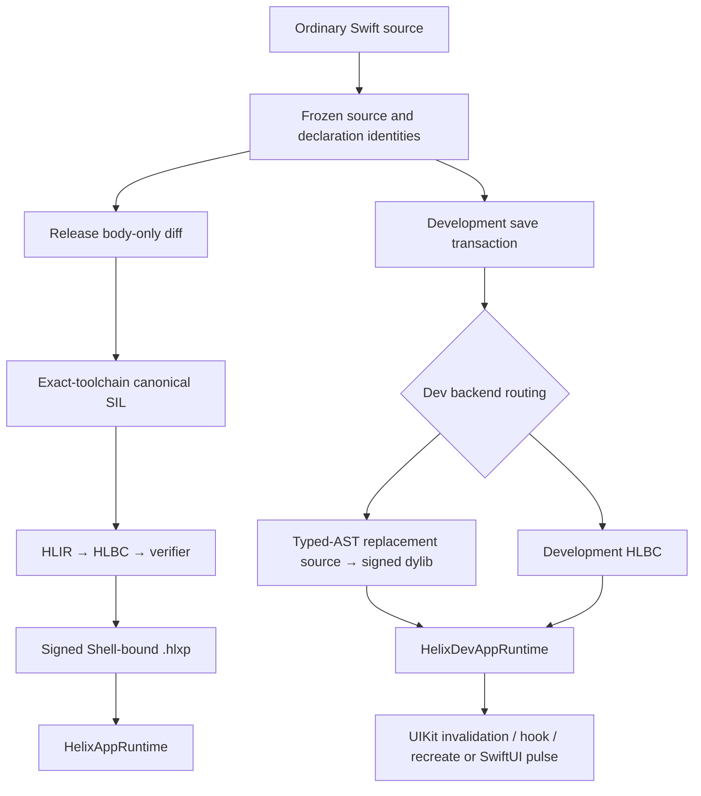

# Helix Architecture

[简体中文](Architecture.zh-CN.md)

Helix has one source-level idea and two deliberately separate execution paths:
an engineer edits ordinary Swift, but production hot patches and development
Live Reload use different artifacts, trust boundaries, and lifetimes. They
share compiler facts and identity contracts; they do not share a delivery
channel.

This document describes the implementation available in the repository as of
August 10, 2026. It does not turn unfinished qualification work into a product
claim.

## The two workflows

| Workflow | Artifact | Execution | Lifetime | Intended use |
| --- | --- | --- | --- | --- |
| Production hot patch | Signed `.hlxp` containing HLBC | Preinstalled verifier and HLVM | Persisted, rollback-capable generations | A controlled response to a defect in a released Shell |
| Development Live Reload | Session-bound native dylib or HLBC live artifact | Swift Dynamic Replacement or the development HLVM path | Current Debug process only | Save a function body and update the running page |

The production path never downloads Swift source or native machine code. The
development path may load a newly compiled, signed dylib, but only into a Dev
Shell through an authenticated session. This distinction is structural, not a
runtime configuration toggle.

## Shared contracts

Both workflows depend on stable, build-specific identities:

- `FunctionKey` identifies a Swift callable together with the ABI and effect
  facts that matter to Helix.
- `EntryIndex` is the compact Shell route used by the production bridge.
- `TypeID` and `NativeImportID` name predeclared type operations and callable
  native capabilities without embedding process pointers in a patch.
- Interface and transitive implementation fingerprints distinguish a body
  edit from an ABI, layout, source-membership, or dependency change.
- Toolchain, SDK, target triple, compiler arguments, module source set, and
  binary identity bind every artifact to the Shell for which it was built.
- An immutable `Runtime.Generation` makes all routes in one activation visible
  atomically. A call chain pins one generation so it cannot observe a mixture
  during concurrent activation or rollback.

These identities are intentionally build-specific. Helix does not try to make
private Swift ABI compatible across unrelated App versions.

## Release architecture

A Helix-enabled Release build produces an App Shell plus a finalized interface
archive. Generated Derived Sources establish permanent dynamic entry points and
typed native bridges without modifying handwritten Swift files. The finalized
archive records the exact compiler environment, source identities, patchable
roots, signatures, capabilities, and final executable identity.

When a defect is fixed, the patch builder type-checks the complete module in
the archived environment, confirms that only eligible implementations changed,
lowers the supported canonical SIL subset into HLBC, runs an independent
verifier, and signs the package. The App validates the package again before it
can enter the immutable store or become an active generation.

The runtime already installed in the App contains the bytecode decoder,
verifier, HLVM, bridge catalog, package trust chain, activation journal, crash
guard, and rollback logic. A production patch cannot add a new native ability
that was absent from that Shell.

See [Production Hot Patching](Production-Hot-Patching.md) for the full flow.

## Development architecture

The Xcode integration captures the frontend, link, SDK, module, source, and
signing facts from a real Debug build. A source monitor turns editor writes and
atomic renames into a stable, monotonically numbered snapshot. The development
compiler rechecks the transaction in the original module context and routes all
changed roots to one safe backend.

On the validated Simulator-native route, Helix extracts only existing
replacement roots, uses typed-AST declaration identities to preserve normal
recursion, emits `@_dynamicReplacement` sources, compiles and signs a unique
dylib, then transfers its bytes to the App. It creates a new image per accepted
generation; it does not keep appending files to one mutable dylib.

The Debug App activates code first and refreshes UI second. `ReloadIndex`
metadata maps changed roots to live UIKit or SwiftUI boundaries. If no safe
refresh policy exists, Helix reports that code is active but manual refresh is
required; it does not guess by replaying arbitrary lifecycle methods.

See [Development Live Reload](Development-Live-Reload.md) for the save-to-screen
sequence and replacement semantics.

## Build and runtime isolation

Apps link one aggregate product:

| App configuration | Product | Contains development loader and transport? |
| --- | --- | --- |
| Release / Production | `HelixAppRuntime` | No |
| Debug / Dev Shell | `HelixDevAppRuntime` | Yes |

Release auditing scans the built bundle rather than trusting target names. The
production runtime rejects development artifacts, and the development protocol
does not accept a production campaign as a shortcut. Build-side compiler,
release, daemon, and CLI modules must never be linked into the Release App.

## Current qualification boundary

The repository contains a functioning production client chain for restricted
HLBC patches and a functioning Simulator-native Live Reload chain. The latter
has been demonstrated across two edits and a baseline-restoring third
generation in one App process. The production Hot Patch demo can stage a signed
package as a mock download and exercise normal verification, installation,
activation, and rollback.

This evidence does not yet qualify App Store delivery, arbitrary Swift syntax,
real-iPhone native loading, a 100-generation native soak, a large application
corpus, or the external Registry/HSM/approval control plane. Those boundaries
are summarized in [Capabilities and Limits](Capabilities-and-Limits.md).
