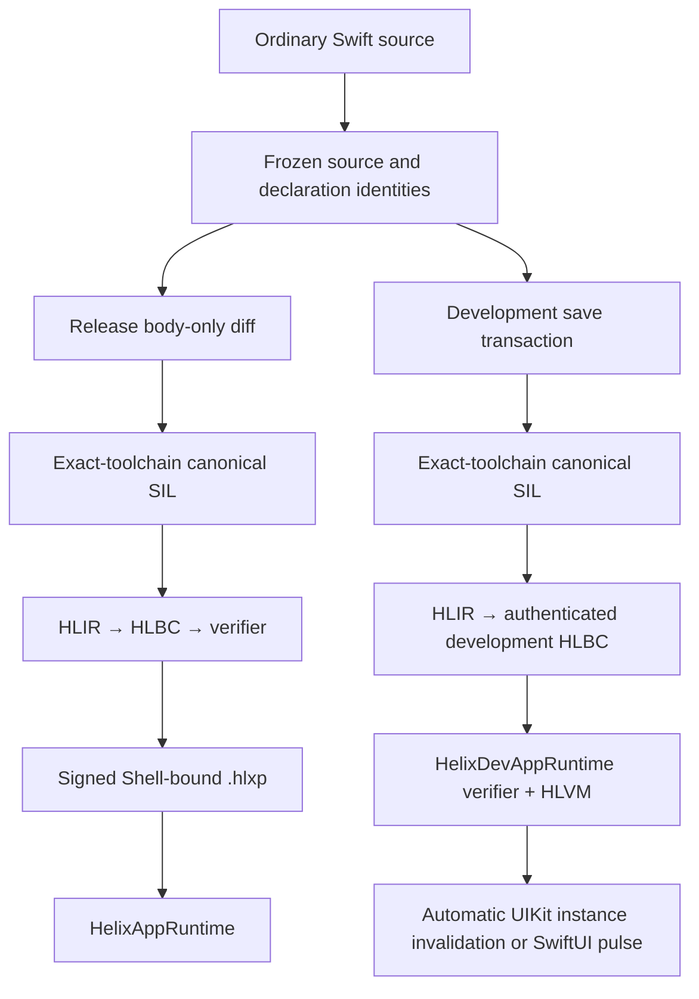

# Helix Architecture

[简体中文](Architecture.zh-CN.md)

Helix has one source-level idea and two deliberately separate execution paths:
an engineer edits ordinary Swift, but production hot patches and development
Live Reload use different artifacts, trust boundaries, and lifetimes. They
share compiler facts and identity contracts; they do not share a delivery
channel.

This document describes the implementation available in the repository as of
August 16, 2026. It does not turn unfinished qualification work into a product
claim.

## The two workflows

| Workflow | Artifact | Execution | Lifetime | Intended use |
| --- | --- | --- | --- | --- |
| Production hot patch | Signed `.hlxp` containing HLBC | Preinstalled verifier and HLVM | Persisted, rollback-capable generations | A controlled response to a defect in a released Shell |
| Development Live Reload | Session-bound authenticated HLBC live artifact | The development verifier and HLVM path | Current Debug process only | Save a supported function body and update the running page |

Neither product path downloads Swift source or native machine code into the
App. Production accepts a persistable, policy-bound signed package; development
accepts an ephemeral artifact bound to one authenticated Dev Session. This
distinction is structural, not a runtime configuration toggle.

## Shared contracts

Both workflows depend on stable, build-specific identities:

- `FunctionKey` identifies a Swift callable together with the ABI and effect
  facts that matter to Helix.
- `EntryIndex` is the compact Shell route used by the production bridge.
- `TypeID` and `NativeImportID` name predeclared type operations and callable
  native capabilities without embedding process pointers in a patch.
- Interface and transitive implementation fingerprints distinguish a body
  edit from an ABI, layout, source-membership, or dependency change.
- Toolchain, SDK, target triple, compiler arguments, module source set, and
  binary identity bind every artifact to the Shell for which it was built.
- Verified debug metadata maps HLBC function/block/instruction coordinates to
  logical Swift file, line, and column. Production artifacts redact build-host
  absolute paths; traps add the exact VM program counter and pinned generation.
- An immutable `Runtime.Generation` makes all routes in one activation visible
  atomically. A call chain pins one generation so it cannot observe a mixture
  during concurrent activation or rollback.
- Mutable closure captures and collection transforms use verifier-private
  storage values rather than Swift runtime layout: managed cells may be shared
  only by same-image closures, while Array builders are linear and must be
  finished or destroyed on every control-flow path. Neither form can enter a
  Shell/Native boundary, local value layout, stack slot, or function result.
- Array, Dictionary, and Set are typed VM values rather than projections of
  private Swift runtime layouts. One bounded recursive value-semantics model
  supplies VM-defined Equatable and Hashable behavior for supported scalars and
  containers; strict ordering is a separate scalar-only capability. Set uses
  immutable COW storage with stable in-value iteration, while Dictionary/Set
  equality and hashing are order-independent. Verification, boundary
  validation, comparison-work charging, and pre-allocation resource charging
  enforce the same model end to end.
- Common Array-backed standard-library views are normalized at the compiler/VM
  boundary instead of importing their private storage layouts. Reversed,
  enumerated, repeated, sliced, zipped, and joined sequences become verified
  typed Array operations with operation-specific result shapes and bounded
  pre-allocation accounting. Only element-sequence semantics are normalized;
  an ArraySlice's non-zero-based index identity is not erased into an Array
  index, so unsupported slice-index APIs still fail closed.
- Array-producing closure traversals use one invocation-local linear builder.
  Scalar appends and bounded whole-Array appends share the same verifier-owned
  element type and precharge copied storage before allocation; this supports
  Sequence-returning `flatMap` without an intermediate nested Array.
- A closure signature carries an ownership convention for every invocation
  parameter. The compiler preserves concrete Swift `@in_guaranteed` inputs as
  borrowed VM values, materializes copies only at owned boundaries, and the
  Verifier requires the signature to match the closure-body prefix exactly.
  This rule is type-directed and also covers linear imported SDK values; it is
  not a list of API- or framework-specific exceptions.
- Frame-local and heap-promoted storage share one field-sensitive aggregate
  shape. The compiler promotes multi-block lifetimes, classifies
  initialize/assign/replace and conditional cleanup, and the Verifier computes
  definitely-versus-possibly initialized leaves at CFG joins. Reads remain
  definite-only; runtime shape allocation and partial storage are charged to
  the invocation budget.
- Activation materializes inherited routes into a self-contained snapshot. The
  registry normally retains only the active snapshot and its direct rollback
  predecessor; older snapshots remain alive only while a lease pins them. A
  process-wide generation-ID high-water mark survives compaction. Ordinary
  activation cannot reuse an old ID; verified durable recovery may rehydrate
  the exact historical package/ID without lowering that high-water mark.

These identities are intentionally build-specific. Helix does not try to make
private Swift ABI compatible across unrelated App versions.

## Release architecture

A Helix-enabled Release build produces an App Shell plus a finalized interface
archive. Generated Derived Sources establish permanent dynamic entry points and
typed native bridges without modifying handwritten Swift files. The finalized
archive records the exact compiler environment, source identities, patchable
roots, signatures, capabilities, and final executable identity.

When a defect is fixed, the patch builder type-checks the complete module in
the archived environment, confirms that only eligible implementations changed,
lowers the supported canonical SIL subset into HLBC, runs an independent
verifier, and signs the package. The App validates the package again before it
can enter the immutable store or become an active generation.

The runtime already installed in the App contains the bytecode decoder,
verifier, HLVM, bridge catalog, package trust chain, activation journal, crash
guard, and rollback logic. A production patch cannot add a new native ability
that was absent from that Shell.

See [Production Hot Patching](Production-Hot-Patching.md) for the full flow.

## Development architecture

The Xcode project contains only the original Feature sources and stable App
runtime imports. A Build pre-action materializes the Shell under DerivedData;
an App phase reconstructs the captured Feature invocation and compiles all
generated Bridge sources into one validated relocatable object. App linking
retains its stable C provider symbol, so `ApplicationSession` discovers the
generated contract without a Bridge framework, generated source target, or
generated Swift import.

The Xcode integration captures the frontend, link, SDK, module, source, and
target facts from a real Debug build. A source monitor turns editor writes and
atomic renames into a stable, monotonically numbered snapshot. The development
compiler rechecks the transaction in the original module context, lowers the
same supported canonical SIL used by the release compiler, and emits one
immutable HLBC generation. The authenticated daemon transports those bytes;
the Debug App verifies them before atomically activating an ephemeral runtime
generation.

There is no mutable dynamic library to which source files are appended. Native
Dynamic Replacement remains available only through an explicit internal
backend selection for compiler experiments and differential validation. The
automatic and default route never falls back to it.

The Debug App activates code first and refreshes UI second. `ReloadIndex`
metadata maps changed roots to stable nominal type IDs. UIKit reconstructs those
IDs from the displayed controller/view classes, including superclass chains,
and applies inferred invalidation without an application registry. SwiftUI uses
explicit pulse boundaries. If no safe refresh policy or live target exists,
Helix reports that code is active but manual refresh is required; it does not
guess by replaying arbitrary lifecycle methods.

See [Development Live Reload](Development-Live-Reload.md) for the save-to-screen
sequence and replacement semantics.

## Build and runtime isolation

Apps link one aggregate product:

| App configuration | Product | Contains development loader and transport? |
| --- | --- | --- |
| Release / Production | `HelixAppRuntime` | No |
| Debug / Dev Shell | `HelixDevAppRuntime` | Yes |

Release auditing scans the built bundle rather than trusting target names. The
production runtime rejects development artifacts, and the development protocol
does not accept a production campaign as a shortcut. Build-side compiler,
release, daemon, and CLI modules must never be linked into the Release App.

## Current qualification boundary

The repository contains a functioning production client chain for restricted
HLBC patches and a functioning Simulator HLBC Live Reload chain. The latter has
been demonstrated with a changed implementation and a baseline-restoring
second generation in one App process. The production Hot Patch demo can stage a signed
package as a mock download and exercise normal verification, installation,
activation, and rollback.

The repository also contains a four-file application-shaped business corpus and
a deterministic 128-generation in-process soak covering failed saves,
activation, rollback, invocation, snapshot compaction, and generation-ID
monotonicity. This evidence still does not qualify App Store delivery,
arbitrary Swift syntax, physical-iPhone execution, an external top-200
application corpus, long-duration device memory/background cycling, or the
external Registry/HSM/approval control plane. Those boundaries are summarized
in [Capabilities and Limits](Capabilities-and-Limits.md).
