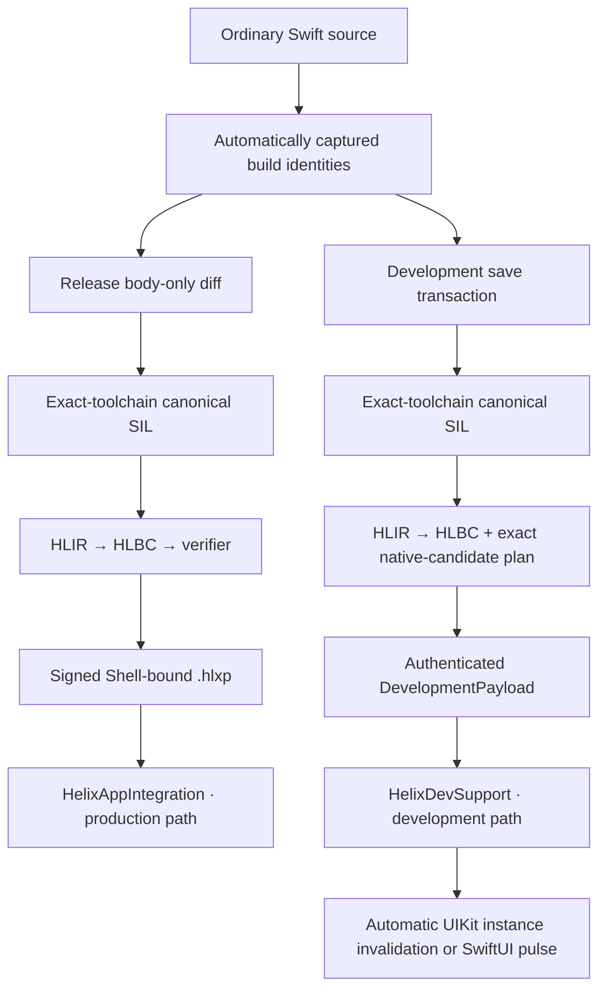

# Helix Architecture

[简体中文](Architecture.zh-CN.md)

Helix has one source-level idea and two deliberately separate execution paths:
an engineer edits ordinary Swift, but production hot patches and development
Live Reload use different artifacts, trust boundaries, and lifetimes. They
share compiler facts and identity contracts; they do not share a delivery
channel.

This document describes the implementation available in the repository as of
August 27, 2026. It does not turn unfinished qualification work into a product
claim.

## The two workflows

| Workflow | Artifact | Execution | Lifetime | Intended use |
| --- | --- | --- | --- | --- |
| Production hot patch | Signed `.hlxp` containing HLBC | Preinstalled verifier and HLVM | Persisted, rollback-capable generations | A controlled response to a defect in a released Shell |
| Development Live Reload | Authenticated version-1 `DevelopmentPayload` containing HLBC and optional exact Adapter images | Development verifier/HLVM plus the bounded development-image loader | Current Debug process only | Save a supported function body and update the running page |

Neither product path downloads Swift source, a compiler, a linker, or JIT
input into the App. Production accepts a persistable, policy-bound signed HLBC
package and has no development image-loading path. Development accepts an
ephemeral artifact bound to one authenticated Dev Session; on qualified
Simulator/macOS targets it may contain an exact, signed on-demand Swift Adapter
image. Physical iOS rejects that image path. This distinction is structural,
not a runtime configuration toggle.

Xcode-side `prepare`, `bridge`, `finalize`, and `patch` operations emit a local
schema-1 `BuildPerformance.<operation>.json` under the active profile's
DerivedData output. The report uses a monotonic clock and aggregates named
stages, privacy-safe frontend subprocess facts, counters, and artifact sizes.
It is diagnostic evidence only: it is excluded from HLBC, HLXI, signed patch
inputs, Shell identity, Release baseline identity, and the App bundle. Nested
stages are not additive. The measured baseline and interpretation rules are
recorded in [Build performance observability and baseline](Build-Performance-Baseline.md).
The cache identities, validation rules, workflow-specific fast paths, and
content-aware publication behavior are specified in
[Incremental build facts and publication](Incremental-Build-Facts.md).

## Shared contracts

Both workflows depend on stable, build-specific identities:

- `FunctionKey` identifies a Swift callable together with the ABI and effect
  facts that matter to Helix.
- `EntryIndex` is the compact Shell route used by the production bridge.
- `TypeID` names a captured type operation. `NativeCallKey` is the stable,
  project-independent identity of a canonical native call descriptor;
  `NativeImportID` is only the compact per-Shell/per-image dispatch slot. A
  patch carries both rather than embedding a process pointer or treating the
  compact slot as authority. See [Native call identity and catalog](Native-Calls.md).
- A schema-1 `NativeCapability.Manifest` is the single production authority.
  Release Prepare projects every compiler-qualified candidate in the imported-
  native-type boundary proved by that build, generated Bridge code embeds the
  same table, release audit pins its hash, and every signed patch target repeats
  that hash. Runtime requires exact Manifest/Shell/Registry equality before
  install and rechecks Objective-C or C device evidence without allowing the
  immutable production Registry to grow.
- A managed-development Build Receipt keeps baseline-used native bindings separate
  from dormant, data-only Catalog candidates. An authenticated first use assigns
  a deterministic session-local compact ID after the linked prefix without
  changing the Shell interface hash. Every generation and escaping callback
  pins one immutable capability snapshot; later saves cannot expand it in
  place.
- Supported Objective-C imports share one descriptor-driven Runtime invoker
  instead of one generated Swift function per selector. Compiler evidence fixes
  the declaration class, a separate class/initializer dispatch class where
  applicable, exact selector/property accessor identity, physical ABI, Block
  lifetime, method family, and error convention. The Objective-C shim rechecks
  class ancestry, the actual method encoding, and storage kinds before
  `NSInvocation`; unsupported Swift
  overlays and ABI shapes retain the exact generated-adapter route. This is a
  reusable execution mechanism, not wildcard selector authority.
- Compiler-proven C functions within the finite scalar/Apple-geometry ABI
  matrix share one AOT Runtime invoker. A permanent Bridge binding supplies the
  address of the exact imported declaration. Development first use may resolve
  only the Catalog Descriptor's fixed entry point from the already linked
  process; downloaded code cannot choose a symbol or pointer. Remaining Swift
  declarations use generated type erasure: baseline-used entries are grouped
  by native module into deterministic Adapter Packs, while a dormant
  development entry compiles only its actually imported body. Both paths have
  separately cached source and validated Mach-O objects and never expose
  Swift's private generic ABI.
- Interface and transitive implementation fingerprints distinguish a body
  edit from an ABI, layout, source-membership, or dependency change.
- Eligible existing Shell structs and enums use a captured logical-value
  contract, not their private Swift ABI layout. The archive records exact
  source-qualified identity, stored fields or enum cases, labels and order,
  recursive Bridge types, copyability, supported conformance facts, and a
  deterministic layout fingerprint that also participates in the device hash.
  The build emits same-source private construction hooks so private
  storage can be reconstructed legally; generated Bridge code streams fields
  and cases through the ordinary bounded value codec. Release and patch
  compilation both derive the source shape independently, and the Verifier
  requires an exact match before an ordinary, `borrowing`, `consuming`, or
  `mutating` value receiver can become a root. A synchronous entry may expose
  exactly one logical `inout` region, including mutable `self`. Generated
  Bridge code snapshots that value, gives HLVM only an invocation-scoped
  address, validates one exact typed writeback, and commits it on the normal or
  declared-error continuation. A VM trap commits no writeback; the Original
  route follows the same result contract. Multiple or async `inout` regions
  remain fail-closed because the generated boundary cannot prove alias
  identity. No reflection, raw-memory projection, runtime metadata, VM address,
  or Swift layout assumption crosses the boundary.
- Toolchain, SDK, target triple, compiler arguments, module source set, and
  binary identity bind every artifact to the Shell for which it was built.
- Version 1 Shells advertise pure-VM String and Collection capabilities even
  when an eligible entry's captured native signature does not mention those
  types, so a later body-only patch can use represented local text and
  collections. Native types and imports remain limited to the exact generated
  Shell surface. Exact native type names are authoritative; a derived
  module-relative shorthand is installed only when it resolves to one unique
  captured identity, so sibling nested types cannot overwrite each other.
- Canonical SIL parsing inventories the captured frontend's protocol witness
  tables as bounded, deterministic compiler-only evidence. It retains the
  conforming type pattern, protocol identity, conditional generic clause,
  associated-type and inherited-protocol evidence, requirement ABI, and exact
  witness symbol and table order. Duplicate conformance identities or malformed
  records fail during inventory. Multiple witness rows with the same printed
  requirement and ABI remain distinct because textual SIL can erase source
  argument labels; a later consumer must reject a lookup it cannot uniquely
  resolve. Imported witness-table declarations without target bodies are not
  dispatch evidence and are ignored. Unfamiliar members make only that
  conformance unavailable, so an unrelated advanced declaration cannot block a
  reachable ordinary function. The inventory does not expose Swift witness
  tables or metadata to HLBC and, by itself, does not make protocol dispatch
  executable. The closed concrete-specialization consumer below, and any later
  existential consumer, may use only an exact, complete record from this
  inventory.
- Verified debug metadata maps HLBC function/block/instruction coordinates to
  logical Swift file, line, and column. Production artifacts redact build-host
  absolute paths; traps add the exact VM program counter and pinned generation.
- An immutable `Runtime.Generation` makes all routes in one activation visible
  atomically. A call chain pins one generation so it cannot observe a mixture
  during concurrent activation or rollback.
- The Verifier and HLVM now have a sequential-async execution foundation. A
  dedicated async driver retains VM-owned frames across direct image calls,
  exact Shell entries, and exact async NativeImports without blocking a
  thread. Suspension checks the signed frame budget and rejects live address
  accesses, address values, or address-borrowing storage. MainActor and
  nonisolated segments resume through Swift actor isolation rather than thread
  guesses. Runtime keeps the generation lease and root budget in task-local
  context across executor migration; cancellation is cooperative at VM and
  native checkpoints. An async NativeImport retains its own continuous
  deadline while its awaited host time is excluded from the root active-time
  budget. Async closure values, dynamic existential async dispatch, tasks,
  continuations, async `inout`, and parallel execution remain fail-closed.
  Compiler lowering now recognizes the pinned optimizer's exact direct
  `@async` `apply`/`try_apply` shape, removes only proven nonisolated or
  MainActor resume scaffolding, and links fully concrete patch-local async
  helpers into the image. Multiple sequential awaits, handled or propagated
  async errors, and nonisolated/MainActor image transitions therefore execute
  through the verified async driver. App-facing async Shell entries use an
  exact hashed source-body installation rather than Swift async dynamic-
  replacement chaining. A synchronous prepare step either selects the lexical
  original before suspension or pins one generation and encoded argument set;
  the awaited dispatch is then one-shot, and safe post-suspension fallback goes
  through the async OriginalCatalog and its source-local, statically dispatched
  exact-original thunk. Exact generated
  async NativeImports use a separate suspending catalog. Exact project-source
  discovery generates direct nonisolated/MainActor functions, methods, and
  getters; an explicit async catalog factory may additionally expose a
  predeclared initializer. Their continuous native deadline stays distinct
  from the VM active-time budget.
  Closure-bearing async imports and completion-handler-to-async inference stay
  fail-closed.
- One `make_closure` instruction carries a typed static target: an image
  function, an indexed Shell `EntryIndex`, or a declared `NativeImportID`.
  Unchanged Swift callables therefore do not copy archived bodies. Imported
  free/global functions, bound instance methods, and initializers also use this
  route: an ordinary capture suffix binds a native receiver, while a
  compiler-only initializer metatype is validated and erased. None requires an
  image thunk merely to become a Swift value. This route requires a complete,
  representation-preserving callable ABI; call-site default-argument
  projections and direct-call-only adapters cannot masquerade as function
  values. Invocation parameters are the target ABI prefix and `partial_apply`
  captures are its suffix. The Verifier
  checks exact ownership, result, effects, boundary-error type, import policy,
  and creator authority before constructing the capability. Runtime-native
  callable handles returned by an import remain a separate target kind. Shell
  and escaping NativeImport-callback invocation retain pinned-generation
  routing.
- Closure captures and collection transforms use verifier-private storage
  values rather than Swift runtime layout. Mutable captures share managed cells;
  `weak` and checked `unowned` captures share non-retaining handles whose
  referent is a patch-local class or captured native reference identity. Weak
  loads produce Optional and zero after deallocation. Unowned loads use the
  same safe zeroing primitive internally but turn a dead referent into a
  controlled VM trap instead of a process-level Swift abort. Array builders and
  Dictionary accumulators remain linear and must be finished or destroyed on
  every control-flow path. These internal storage values cannot enter a stack
  slot, Shell/Native boundary, local value layout, or function result.
  Immutable closure contexts may also copy a represented linear capture when
  its captured TypeOps are copyable. `make_closure` charges the context copy;
  every invocation reuses a borrowed capture or materializes a fresh,
  resource-charged copy for an owned target parameter. This keeps multi-shot
  closures reusable even for imported value types. For an on-stack
  `partial_apply`, a frontend-emitted explicit capture retain stays in the
  path-sensitive retain flow until its matching release after scope teardown;
  an invocation closure instead transfers that retain at construction. Inout
  captures remain verifier errors. A lexical `make_closure` is a
  distinct lifetime class: it owns a dynamic scope that must close on every CFG
  exit. For a nonescaping capture of caller-owned `inout`, `borrow_mutable_cell`
  presents the already-active modify address through the same capture ABI
  without copying it. Provenance verification prevents that cell from entering
  an invocation-lifetime closure, and requires the lexical closure to end before
  the address scope; the runtime address token independently invalidates stale
  access. Closure-scope provenance also follows branch arguments and every
  closure-bearing managed aggregate. As defense in depth, creation of an
  escaping native callback performs a budgeted, cycle-safe traversal of the
  complete capture graph, including collections, mutable cells, local object
  storage, and live local weak/unowned referents; nesting cannot hide a lexical
  scope from the boundary.
- Native callable boundary crossings use explicit contracts rather than making
  closure values part of the ordinary boundary codec. Each callback-bearing
  NativeImport identity records its parameter index and `nonescaping` or
  `escaping` lifetime. A nonescaping handle shares the importing invocation's
  budget and is invalidated when that call returns. An escaping handle retains
  the immutable generation lease and closure context, reuses an enclosing
  pinned context when one still exists, and otherwise creates a fresh bounded
  callback invocation against the original image. Same-thread recursion is
  allowed, but the Runtime Engine serializes callback execution globally and
  rejects overlapping cross-thread callbacks, even through different handles.
  While a NativeImport is active, a callback also cannot hop away from the
  importing thread. A detached escaping callback may run later on another
  thread only after entering that same serialized domain. This mechanism does
  not claim general Swift `Sendable` semantics.
  Dynamic lexical scopes cannot enter an escaping handle, even when nested in
  another closure's aggregate or reference-backed capture graph;
  callback arguments are re-encoded and shape-checked at every invocation.
  One controlled higher-order edge is part of the same profile: an SDK may
  supply a direct or Optional synchronous, nonthrowing callable as an outer
  callback argument when the generated Swift call proves that nested callable
  is escaping. The adapter represents it as an identity-bearing native closure
  target, and ordinary `closure_apply` dispatches back to Swift with exact
  ownership, result, MainActor, deadline, and resource checks. Only this one
  callable layer is admitted; it cannot be hidden in `Any` or another
  aggregate, and its own parameters and result cannot contain closures.
  Same-thread re-entry is allowed, while overlapping invocation of the same
  non-Sendable native callable fails closed.
  An exact NativeImport may also return a direct or Optional native-origin
  callable. That handle is escaping by construction, must be created by the
  generated Bridge rather than substituted with an image-local closure, and is
  encoded before the synchronous import context closes. Creation and every
  later invocation retain the exact signature, generation identity, MainActor
  requirement, deadline, resource limits, and non-Sendable overlap protection. The
  same one-layer and closure-free-component restrictions apply, so this is one
  typed callable boundary model rather than a special case for each SDK API.
  A Swift `Error` callback argument is reduced to a bounded textual dynamic-type
  name and reified as an opaque proxy; native payload graphs, type metadata, and
  semantic error identity do not enter HLBC. `Error` remains invalid in Shell
  entry signatures and ordinary NativeImport parameters or results.
  Because a nonthrowing native closure has no error channel, the automatic
  profile accepts only synchronous, nonthrowing callbacks whose result is
  either `Void` or a recursively bridgeable value with a deterministic failure
  value. Scalars, text, `Any`, Optional, empty collections, and recursively
  defaultable tuples qualify. A direct native value does not, while an Optional
  native value can use `nil`. On failure the generated wrapper first returns
  that deterministic value to satisfy the native ABI. An active importer then
  traps after the native frame returns; a detached escaping failure is instead
  reported through pinned Runtime telemetry.
  Discovery derives the callback's source spelling from typed AST, its
  `@noescape`/escaping authority from canonical SIL, and its global-actor
  requirement from both the applied expression and the closure body's SIL
  isolation metadata. Actor provenance survives frontend function-conversion
  and Optional-injection wrappers and propagates through immutable, inferred
  local closure aliases. A source-written function type remains authoritative,
  so an explicit actor erasure is never silently undone. A property setter is
  the lifetime-specific form:
  assigning a closure stores it and is therefore always `escaping`, even
  though Swift cannot spell `@escaping` in the property's function type. The
  assigned expression still supplies actor isolation. Generated adapters
  therefore cover methods, initializers, callback-property setters, Swift
  closures, and Objective-C blocks without framework-specific callback code;
  block storage, copy, and noescape reabstraction thunks remain compiler-only
  ownership plumbing, while the original logical VM closure type is preserved.
  Native calls across UIKit, Dispatch, Foundation, and OperationQueue—including
  result-producing `NSPredicate` and `FileManager` enumeration callbacks—use
  this same path. Scheduling an escaping callback does not imply support for
  Swift `async` closure ABIs.
  If source syntax omits SDK defaults, HLXI records a checked physical-to-logical
  parameter projection: lowering proves each erased SIL value came from that
  declaration's default generator or an exact typed `Optional.none`, and the
  generated Swift call supplies the default normally. A closure value records
  only its exact Swift callable ABI: parameter shape and ownership, result,
  throwing behavior, global actor, and async behavior. Allocation and external
  side-effect authority remain properties of the concrete closure body;
  verification permits `make_closure` only when the creator already has that
  authority. Possession of the resulting static-target capability then permits
  higher-order invocation without adding execution authority to the closure
  type. Parameters, results, captures, represented aggregate wrappers, and
  NativeImport callback positions and callable-result positions preserve the
  canonical closure ABI. The sole callable-effect variance is an explicit,
  representation-preserving restriction from an otherwise identical
  unrestricted closure to `@MainActor`; `convert_closure` records that logical
  contract without changing its body or captures. The Verifier rejects actor
  erasure, ABI changes, and lexical-scope escape through the converted value,
  while the VM enforces the restricted signature when the callback executes.
  A canonical-SIL `Optional.some` used exclusively as the operand of
  `destroy_not_escaped_closure` is a compiler scope carrier rather than a
  source Optional; lowering preserves its closure provenance and rejects any
  additional semantic use.
  Canonical SIL may erase the nested actor result of a compiler-generated
  bound-method factory; the compiler restores it only when every returned
  closure is proven to target a MainActor-isolated body. It never rewrites an
  ordinary source factory. Shell entry signatures and every other native value
  slot remain closure-free. These are v1 contract fields and do not introduce
  a compatibility version split.
- Foreign ABI normalization preserves the captured logical Swift type while
  accepting proven compiler representations: Foundation value overlays may
  use their Objective-C bridge classes inside block thunks, Objective-C
  protocol existentials erase to the existing `AnyObject` identity only at a
  foreign boundary, and Swift `Any` boxing uses one exact generated
  `Any -> AnyObject` NativeImport. An Objective-C overlay alias is admitted
  only when the mangled type is that exact top-level nominal; a nested Swift
  type such as `Timer.TimerPublisher` cannot collapse into its enclosing
  Objective-C class identity. The foreign protocol spelling is retained only
  by the generated invoker and must be proven by the exact `So..._p` mangling;
  plain `Any` and `AnyObject` cannot acquire it. For a MainActor operation,
  decoding and the native call occur within the same actor-isolated closure so
  a non-Sendable existential is never transferred across that boundary.
  Compiler-proven Swift/SIL spellings for one imported nominal are persisted as
  server-side aliases of its captured native identity. Ambiguous aliases are not
  resolved, and aliases never enter the device interface projection. Imported
  trivial values remain borrowed in physical SIL even though their HLBC native
  handles are managed owners; the compiler materializes and retires those
  owners at generic value/address lifetime edges rather than by SDK-type
  special cases.
- Array, Dictionary, and Set are typed VM values rather than projections of
  private Swift runtime layouts. One bounded recursive value-semantics model
  supplies VM-defined Equatable and Hashable behavior for supported scalars and
  containers; strict ordering is a separate scalar-only capability. Set uses
  immutable COW storage with stable in-value iteration, while Dictionary/Set
  equality and hashing are order-independent. Verification, boundary
  validation, comparison-work charging, and pre-allocation resource charging
  enforce the same model end to end.
- Runtime `nil` intentionally carries no invented wrapped type. Boundary
  validation remains a deep, charged shape check; internal collection states
  recover a payload-free Optional's type from verified bytecode context with a
  depth-bounded runtime-type check. Generic indirect call results and ordinary
  stores likewise share one compiler-address sink, including pending whole
  Array-literal elements and tuple components.
- Native text rendering uses a fixed representation adapter rather than
  exposing Swift's generic ABI. The compiler recognizes
  `String(describing:)` and `String(reflecting:)`, proves that the recursive
  dynamic type can be reconstructed by the Shell codec, preserves that type in
  VM-owned `Any`, and then calls an exact `Any -> String` NativeImport.
  `debugPrint` reuses the exact `[Any], String, String -> Void` shape already
  used by variadic `print`. Concrete metadata and witness tables never cross
  the boundary. If canonical SIL initializes one existential Array-literal
  element on mutually exclusive paths, the erased values travel through typed
  hidden block parameters and are committed only where the literal is
  finalized. The adapter admits the scalar/text/Optional/Array/Dictionary/Set
  codec family, rejects ArraySlice, tuple, local nominal, native-object, and
  closure payloads, and enforces the shared 64 KiB rendering bound. This adds
  no opcode, schema, or version beyond the current v1 contracts.
- Array structural mutation is represented by immutable, typed value
  transforms. Concatenation, insertion, removal, and `replaceSubrange` share
  one half-open range-replacement instruction; `swapAt` uses one swap
  instruction. The Verifier proves matching copyable element types, the VM
  validates every bound before mutation, precharges output work/storage, and
  compiler-only assignment releases the replaced linear owner in the shared
  storage sink.
- Dictionary insertion, replacement, and removal lower to one immutable typed
  transform whose Optional update selects set versus erase and whose two
  results carry the previous value and updated Dictionary. `keys` and `values`
  use one projection operation parameterized by the selected element type.
  The Verifier proves the complete result/operand relationship, while the VM
  finds a key once and precharges traversal, output storage, and every copy
  before constructing either result.
- Dictionary's defaulted subscript is compiler control flow over that same
  typed lookup/update surface. The getter switches on `dictionary_get` and
  invokes its autoclosure only on the missing edge. Array element mutation and
  Dictionary default-value mutation share one `_modify` loan: a frame slot and
  scoped address hold the element, then `end_apply` or `abort_apply` performs
  typed value-semantic writeback. Nested and throwing inout calls therefore do
  not require a collection-API opcode, and copyable imported reference values
  follow the same ownership path as managed values.
- Dictionary accumulation uses one verifier-private linear state rather than an
  opcode or NativeImport for each standard-library API. The state can start
  empty or from a copied Dictionary, supports typed lookup and replacement in
  ordinary verified control flow, preserves the first equivalent key and its
  insertion position, then moves its storage into one finished Dictionary.
  Array-valued accumulation also has one fused typed append operation, so
  grouping grows each bucket linearly without materializing and replacing an
  immutable Array after every element. Merge, uniquing, and grouping callbacks
  remain ordinary closure CFG edges: combining is lazy on duplicate keys,
  errors destroy nonmutating partial results, and mutating `merge` writes back
  the successfully accumulated prefix on its error continuation as Swift does.
  The Verifier proves VM-defined key hashing and copyable key/value types; the
  VM charges lookup work, copied values, and new entry storage before mutation.
  This lets compiler lowering share one bounded mechanism without repeatedly
  copying the whole Dictionary or depending on Swift's private generic ABI.
- Mandatory SIL can erase `load [take]` and express ownership through separate
  retain/release traffic. A type-driven normalization recovers an unqualified
  forwarding load only when it is the last operation on the exact temporary
  before deallocation. Retained owners are then consumed at aggregate, store,
  call, and return edges; a borrowed or subsequently reused linear source gets
  a distinct VM owner. Native operations that must materialize an owned VM
  value for a SIL `+0` view register that value as a borrowed temporary: retain
  promotion, an owned boundary, or the final borrowed use closes it exactly
  once, and representation-preserving reference aliases share that lifetime.
  This applies equally to imported references, Arrays, Optionals, tuples, and
  other represented linear values. When canonical SIL retains a tuple and then
  releases or transfers its fields independently, lowering destructures that
  explicit owner and distributes ownership to the projected values; an
  aggregate assembled solely for erased debug metadata is not materialized as
  a VM owner.
- Compiler-only tuple storage uses semantic field paths rather than projection
  order. It recursively transitions between one aggregate owner and disjoint
  field owners, so early projections, nested tuples, whole-value assignment,
  destruction, and mutable capture all share the same initialization and
  ownership rules. Aggregate `@out` results use the same field paths over one
  typed frame slot, allowing independent tuple-component initialization while
  the verifier still observes one complete value at the return boundary.
- Represented managed Collections use one verified Sequence specialization
  instead of importing Swift's private generic Collection ABI. Array, Set, and
  Dictionary drive the same typed cursor, with Dictionary exposing its native
  `(Key, Value)` element tuple and Set/Dictionary retaining deterministic VM
  iteration. Frontend-specific generic-substitution shapes for concrete and
  protocol-extension entry points resolve to this same specialization before
  lowering. Represented Array, Dictionary, and Set therefore share
  `count`/`isEmpty`/`first` and exact Collection `underestimatedCount`; Array
  additionally supplies its represented bidirectional `last`, and normalized
  Array-backed views use the same Array query semantics. The concrete
  `Zip2Sequence` getter retains its distinct Sequence-witness rule: a represented
  enumerated or flattened/joined source contributes zero rather than the exact
  length of the already materialized tuple Array. Empty Dictionary/Set creation
  and `minimumCapacity` creation share one typed constructor plan; capacity is
  otherwise unobservable through the represented storage, but Swift's
  nonnegative precondition is retained. Element-only consumers such as
  equality membership, natural extrema, and cross-container Sequence relations
  stream that cursor directly,
  preserving short-circuiting and first-element ties without allocating an
  intermediate Array. Operations whose result inherently needs complete
  storage or random access—such as `sorted`, `Set(sequence)`, `enumerated`,
  `Array(sequence)`, and heterogeneous `zip`—reuse one typed Array
  materialization path and the existing bounded Array algorithms. Reversed,
  repeated, sliced, and joined views remain Array-backed where their index or
  nested-sequence semantics need that stronger representation. Array-backed
  storage keeps physical elements separate from a logical integer index base.
  The compiler classifies each concrete source as zero-based, preserved-base,
  or opaque; `ArraySlice` and recursively Array-backed `Slice` values therefore
  retain their public bounds across calls, aggregates, Optional storage,
  derived views, search, split, ordering, and mutation. The explicit
  `Slice(base:bounds:)` constructor and concrete Slice index/subscript ABI
  shapes normalize at the frontend into those same range and mutation
  semantics. Array, ArraySlice, recursively Array-backed Slice, and Repeated
  also share nonmutating movement and the mutating `formIndex` family; generic
  associated-index results use their actual indirect SIL ABI rather than an
  Array-only call shape. Two generic HLBC primitives read or replace that base;
  replacement consumes an owned temporary and transfers its storage metadata
  without copying the elements again. Collection APIs still lower to shared
  cursor, range, builder, and mutation semantics rather than per-API opcodes.
  Private index identities such as `String.Index` and
  `ReversedCollection.Index` remain fail-closed.
- Swift text has a logical contract separate from its compact HLBC storage.
  String and Character both occupy the verifier's String value type, but every
  Character producer and Shell codec proves exactly one extended grapheme
  cluster. Substring occupies `Array<String>` whose elements carry that
  Character invariant; private slice storage and String indices never enter an
  artifact. Two representation primitives form the boundary:
  `string_characters` segments a String into the normalized Character Array,
  while `string_join.character` revalidates and reconstructs text and
  `string_join.string` joins logical String elements with an optional separator.
  String's direct `count`/`isEmpty` remain allocation-free; element-oriented
  finite Sequence operations materialize once and then reuse the same cursor,
  builder, split, subsequence, relation, and closure control flow as other
  represented Collections. A separate represented
  `RangeReplaceableCollection` plan resolves frontend method/operator shapes to
  one logical destination plus either an Element or a finite Sequence source.
  It covers `append`, `append(contentsOf:)`, `+=`, edge and counted-edge
  removal, `popLast`, clearing, and capacity hints across String, Substring,
  Array, and normalized Array-backed views. A String destination concatenates a
  direct Character/String suffix without segmenting its existing contents and
  joins other represented Character sequences once; Array-backed destinations
  use the same typed scalar append or half-open range replacement as ArraySlice.
  Source Sequence storage may be a matching represented managed Collection or
  supported finite progression. Canonical source-level Element identity
  (including tuple labels and distinctions erased by HLBC), concrete operator
  metatypes, physical Element shape, and ownership are validated before the
  edit; no generic Swift NativeImport or source-API opcode is introduced. UTF
  views, `String.Index`, and index-sensitive mutation remain outside this
  representation and fail closed.
- Finite integer `Range`/`ClosedRange` and supported numeric `StrideTo`/
  `StrideThrough` values form a second, compiler-only concrete Sequence
  specialization. They retain typed bounds and stride registers rather than a
  Swift runtime object. Forward higher-order operations, equality membership,
  natural extrema, and Sequence relations stream them directly. Integer
  `Range`/`ClosedRange` queries compute `count`, `underestimatedCount`,
  `isEmpty`, `first`, and `last`
  directly from their bounds; full-width cardinality uses an unsigned order key
  and traps if the exact value cannot fit `Int`, without walking the range.
  StrideTo/StrideThrough retain their exact Sequence-witness
  `underestimatedCount` by streaming the same fuel-bounded cursor with constant
  auxiliary storage. Count-based drop/prefix/suffix operations on half-open
  fixed-width-integer Range values move one typed bound in constant time,
  clamp at the opposite bound without narrowing the whole cardinality to Int,
  and keep the result as a compiler-only progression.
  Comparable represented `Range` bounds also support `isEmpty`, `overlaps`,
  `clamped(to:)`, and direct lower/upper-bound projection without gaining
  iteration semantics. These operations reuse typed compare/select control
  flow, including Swift's empty-range overlap rule and equality-preserving
  floating-point selection, rather than importing the generic Range ABI.
  Natural and comparator sorting, Set construction/algebra, and other APIs
  whose result
  requires complete storage materialize through the same typed Array builder.
- Nonthrowing value mutation is expressed through the shared compiler-address
  sink rather than API-shaped bytecode. `Bool.toggle()` is one typed Boolean
  transform, while global `swap` reads both nonoverlapping represented values
  before assigning either destination; compiler storage, tuple/local-struct
  projections, frame addresses, and mutable closure cells therefore share the
  same ownership and alias checks.
- Canonical SIL may spell tuple-label erasure through generic Array and
  Dictionary cast helpers. The compiler removes such a helper only when the
  original types differ only by tuple labels and their recursively normalized
  source and destination are the exact same VM type;
  it then preserves the ordinary owned-result edge without a cast opcode or
  NativeImport. Any real element, key, value, or reference-type conversion
  remains a distinct unsupported operation rather than being mistaken for an
  identity cast.
- Textual declaration summaries are collected before captured Shell type aliases
  are available. Local factory tables therefore resolve in two phases: an
  initial pass admits already-complete local graphs, then native-type injection
  removes captured declarations and rebuilds the tables strictly. Imported field
  types are never guessed to be patch-local merely because Swift emitted their
  storage attributes in the declaration summary.
- Enum declaration parsing treats comma-separated cases as independent
  declarations, preserves nested associated-value commas, and models Swift's
  labeled single associated value as its canonical one-element payload tuple.
  Duplicate, empty, and malformed cases fail closed before local-type metadata
  is built.
- Array algorithms expose one invocation-local linear state type whose verifier
  kind distinguishes builder, random-access mutation, stable-sort, and split
  machines. This keeps the
  noncopyable boundary rules and recursive element typing in one abstraction
  while preventing one algorithm's instructions from consuming another's
  state. Element-producing traversals and typed collection finalization use
  its builder kind.
  Scalar appends and bounded whole-Array appends share the same verifier-owned
  element type and precharge copied storage before allocation; this supports
  Sequence-returning `flatMap` without an intermediate nested Array.
- The mutation kind owns one copied Array snapshot and exposes only typed
  indexed reads, in-place swaps, and a consuming finalizer. Reads and swaps are
  fuel charged, the state cannot be copied or cross a function/runtime
  boundary, and every exit must finish or destroy it. Compiler-expanded
  algorithms can therefore retain ordinary closure CFG and Swift ownership
  semantics without either repeatedly rebuilding an immutable Array or adding
  one opcode/NativeImport per standard-library API.
- Comparator sorting uses the stable-sort kind: a bounded
  stable merge-state machine that owns copied elements and index buffers while
  each comparison remains an ordinary closure call in verified control flow.
  The Verifier requires the state to be created, finished, or destroyed on
  every path and forbids it in parameters, results, stack slots, local layouts,
  and Shell/Native boundaries. Natural scalar sorting drives the same machine
  inside one fuel- and deadline-charged VM operation. Mutating sort propagates
  its completed Array through the normal continuation with an explicit
  assignment writeback; a throwing comparator destroys transient state and
  leaves the original inout storage untouched. Array `partition(by:)` instead
  drives the mutation kind with Swift's bidirectional low/high scan, while
  `removeAll(where:)` drives the same state with Swift's half-stable partition
  followed by one suffix removal. Both preserve predicate order and write back
  swaps completed before a thrown predicate, matching the source operation's
  observable partial-mutation semantics.
  Separator- and predicate-driven splitting use the split kind, which owns one
  copied source and records segment ranges until completion. Predicate calls
  remain ordinary closure CFG edges; reaching `maxSplits` stops evaluation and
  appends the untouched suffix, while a throwing edge destroys the state.
- Concrete Sequence traversal uses one compiler cursor abstraction rather than
  one lowering path per source API. Its managed-Collection arm drives the
  type-checked collection cursor: forward cursors hold the next element offset,
  Dictionary produces its `(Key, Value)` element tuple, and Set produces its
  element directly. Array additionally supports a reverse cursor whose value is
  an exclusive upper bound. The String specialization first enters this arm
  through its verified Character Array. The finite-progression arm drives the
  existing Optional-valued progression cursor from typed start/end/stride registers.
  Reverse consumers of finite integer Range Collections use the same bounded
  Array materialization adapter as other stored/random-access consumers, while
  predicate index searches return the matched `Range<Int>` element as its exact
  index; `ClosedRange.Index` remains opaque. Both arms therefore feed the same
  closure CFG without importing a Swift
  iterator or witness-table ABI. The Verifier rejects unsupported reverse or
  unordered traversal, and the VM rejects corrupt cursor state instead of
  treating it as exhaustion.
  Non-closure consumers compose the same cursor with ordinary compare and
  branch instructions: `contains` and Sequence relations short-circuit, while
  natural extrema carry one owned candidate and retain the first tied element.
  Comparator-driven `min(by:)`/`max(by:)` reuse the same traversal but carry
  one owned candidate through the CFG. Their two borrowed inputs are ordered
  exactly as Swift specifies, ties retain the earliest element, and both the
  candidate and challenger are closed on a throwing edge.
- Common fully concrete Sequence transformations compose that source-neutral
  cursor with the ordinary closure ABI instead of importing Swift generic
  collection methods. Represented String/Array/Dictionary/Set and finite
  progression sources therefore share the same map/filter/reduction/predicate/comparator
  control flow, short-circuiting, throwing edges, and ownership cleanup.
  `count(where:)` is another source-neutral cursor consumer: its predicate is
  an ordinary closure CFG edge and its `Int` accumulator uses checked
  arithmetic, with no result builder or API-specific opcode.
  One linear element buffer serves Array-producing transforms as well as
  container-preserving Array/Dictionary/Set `filter` and Dictionary value
  transforms; the result type selects the verified finalizer. Dictionary's
  generic callback receives the represented `(Key, Value)` tuple, while its
  specialized filter and value-transform ABIs project key/value fields before
  re-entering the same closure CFG. Consuming standard-library overloads take
  the frontend's explicit retained source owner, and every normal, empty, and
  throwing exit closes the source, cursor, fields, and builder exactly once.
- Mutating higher-order callbacks use the same address model as ordinary
  calls. `reduce(into:_:)` keeps an arbitrary represented accumulator in one
  frame-owned slot, opens a narrow modify scope for each callback, and closes
  that scope on both normal and throwing edges before returning or destroying
  the accumulator. No accumulator type receives a special lowering path.
  Indirect `$Never` destinations retained by nonthrowing typed-rethrows SIL
  remain compiler-only control-flow metadata; they never become VM slots or
  addresses when the surrounding function also needs runtime `inout` storage.
- A closure signature carries an ownership convention for every invocation
  parameter, including an address type paired with `inout`. The compiler
  preserves concrete Swift `@in_guaranteed` inputs as borrowed VM values,
  materializes copies only at owned boundaries, and the Verifier requires the
  signature to match the closure-body prefix exactly. The callable ABI also
  carries its exact error-result type. A concrete `throws(Failure)` therefore
  moves the raw Error-conforming patch-local value across direct, closure,
  generic-forwarding, stored-closure, and concretely specialized
  higher-order standard-library continuations; conversion to
  `throws(any Error)` is admitted only through the compiler's concrete
  reabstraction thunk. The Verifier requires the function, closure signature,
  thrown payload, and error block parameter to name the same type, while the VM
  never boxes that internal typed channel into a message. An indirect typed
  error result uses one real, branch-sensitive frame slot: each throwing path
  initializes the slot, and terminal `throw_addr` consumes the value selected
  by runtime control flow rather than a compiler-time cache. `throws(Never)` and
  the impossible normal result of a `Never` call remain unrepresented control
  flow rather than VM registers. Dynamic calls may carry
  a live inout scope across normal/error continuations, but every continuation
  must close the same scope and overlapping arguments remain invalid.
  This rule is type-directed and also covers linear imported SDK values; it is
  not a list of API- or framework-specific exceptions. Synchronous closures are
  recursively valid value shapes: higher-order signatures and Optional, tuple,
  Array, Dictionary, or patch-local nominal storage use the same signature and
  ownership verifier. Capture-list and local-variable `weak`/`unowned` storage
  is normalized with mutable capture boxes into one managed-capture ABI; direct
  and specialized closure bodies therefore share the same storage identity.
  One structural SIL function-type parser identifies the outer result arrow even
  when parameters or results are themselves functions. Concrete metatype
  parameters retain their physical indices and nominal/value identity as
  compiler facts; direct calls and `partial_apply` validate and remove those
  values before projecting the logical callable ABI. This admits ordinary
  first-class enum cases, concrete standard-library case constructors,
  patch-local struct initializers, and patch-local static factories without
  runtime metadata or type-specific constructor rules.
  Compiler and VM ownership transfer follows the verified static type graph, so
  replacing Optional, Array, Dictionary, Set, enum, tuple, or struct storage
  releases obsolete class owners without scanning aggregate contents at
  runtime. `Any` and `Error` conservatively use managed transfers because their
  concrete payload is dynamic. `unowned(unsafe)` remains fail-closed because a
  raw dangling reference cannot be made safe at a downloaded-code boundary.
  Synthetic local identities that embed canonical represented types use a
  separate recursive value-type grammar instead of being reparsed as Swift
  source syntax; closure, ownership, effect, container, native, and local-type
  shapes therefore round-trip without type-specific exceptions.
  `withExtendedLifetime` is a synchronous closure-scope intrinsic rather than
  a generic Swift ABI call. Lowering copies its type-generic anchor, invokes the
  no-argument closure through the ordinary nonthrowing or typed-throwing path,
  and releases the anchor on both continuations. `withoutActuallyEscaping`
  creates a separate
  dynamically scoped view; CFG verification covers split normal/error exits, while a
  budgeted, cycle-safe VM graph scan plus candidate-only CFG liveness rejects
  explicit-storage and semantically live aggregate escape without treating dead
  SSA aliases as roots. Direct-only closure and `defer` helpers retain
  their physical address ABI as concrete specializations; only a body actually
  used by `partial_apply` receives the managed closure-capture ABI. If one
  recursive local helper is both directly applied and used by `partial_apply`,
  discovery assigns one closure-body role; direct application remains valid and
  its capture storage is normalized exactly once.
  Semantic SIL generic helpers reached through concrete `apply`, `try_apply`,
  or `partial_apply` sites enter the same image-function graph. The compiler
  parses every successive outer generic clause and proves concrete conformance,
  same-type, superclass/`AnyObject`, and dependent associated-type requirements
  before token substitution. Exact complete frontend records are authoritative.
  For standard value families already represented by Helix, closed
  toolchain-checked evidence supplies only conformances and associated-type
  identities whose execution semantics the value model proves. Besides the
  `Sequence`/`Collection` hierarchy, this covers common scalar and recursive
  `Equatable`/`Hashable` constraints, scalar `Comparable`, numeric and literal
  hierarchies, `Strideable`, `CustomStringConvertible`, and
  `LosslessStringConvertible`. Exact standard witness references lower to
  verifier-visible operations for comparison, arithmetic, mutation, magnitude,
  integer division/remainder/bitwise/shift, fixed-width bounds, bit properties,
  wrapping/reporting-overflow arithmetic and full-width multiplication,
  floating division/remainder, distance/advance, literal construction,
  description, and lossless parsing.
  Compiler-only literal payloads are validated and eliminated before HLBC.
  Direct `Hasher` execution is not synthesized, and imported native conformers
  still require a separately captured concrete NativeImport operation. Similar
  storage never creates a custom or imported conformance. A conditional
  conformance is usable only when its instantiated requirements recursively
  prove in the same closed environment. Each argument list receives
  a deterministic specialization identity bound to the original Swift symbol,
  so multiple instantiations, constrained extension methods, and recursive calls
  remain distinct statically typed targets without optimizer-private symbols.
  File/module-scope generic struct, enum, and final-class declarations are kept
  as templates and materialized only for reachable concrete argument lists;
  their fields, cases, superclass projection, and methods use the same solved
  substitutions. Concrete opaque results are similarly replaced from the exact
  frontend entry result buffers, including outer-generic and ordered multiple
  opaque results, before ordinary specialization. No opaque identity, generic
  metadata, or witness table enters HLBC. Once a body is concrete, closed
  protocol dispatch matches the exact conforming nominal, full requirement ABI,
  and one complete witness record, then rewrites `apply`, `try_apply`, and
  `partial_apply` to the concrete frontend-emitted thunk. Getter/setter, static,
  mutating, throwing, inherited, and default-implementation chains therefore
  remain ordinary image calls. Unresolved archetypes, packs, unproven or
  recursive conditional evidence, unavailable targets, ambiguous requirements,
  and generic-context nested nominals fail before lowering. Mixed direct/
  indirect physical multi-results and throwing calls with several indirect
  normal results also remain fail-closed rather than inventing a Swift ABI.
  Immutable protocol existentials use the same inventory through a separate
  closed-world plan. The compiler retains the source `any P` identity—including
  compositions, inherited requirements, and `AnyObject` constraints—while HLBC
  stores only a VM-owned `Any` payload plus a bounded exact-dynamic-type to
  concrete-function table. Every case must be a complete, nonconditional
  current-module conformance with a concrete image witness thunk. The Verifier
  checks unique represented types, the common nonreceiver ABI, receiver
  ownership, effects, and concrete-specialization targets; each table or cast
  set is capped at 4,096 cases. HLVM performs exact matching and charges the
  complete lookup size to invocation fuel. This supports immutable erasure and
  opening, protocol composition narrowing/widening, class-bound values, bound
  methods, synchronous throwing requirements, and checked/forced protocol
  casts without Swift metadata or runtime witness tables. Protocol existential
  identities are image-local compiler facts, so the Indexer and lowerer reject
  Swift protocol values at Shell and ordinary NativeImport boundaries. A
  separately proven Objective-C `!foreign` protocol erasure still crosses as
  its captured native `AnyObject` reference, not as this existential value.
  Mutable existential opening and writeback remain fail-closed until the
  storage model can preserve mutation.
- Frame-local and heap-promoted storage share one field-sensitive aggregate
  shape. The compiler promotes multi-block lifetimes, classifies
  initialize/assign/replace and conditional cleanup, and the Verifier computes
  definitely-versus-possibly initialized leaves at CFG joins. Reads remain
  definite-only. Optional case evidence uses the same root-plus-field-path
  identity and remains block-local; writes, takes, and destruction invalidate
  every overlapping fact. A frame-local projected take or destroy deinitializes
  only its exact leaves and preserves sibling ownership, while caller-owned and
  object storage are rejected without a writeback contract. Compiler-only tuple
  and patch-local struct build regions use that same path identity. A field
  write invalidates overlapping aggregate snapshots, and reconstruction emits a
  complete aggregate only when every recursively required leaf has a value;
  partially initialized storage remains unreadable and is cleaned up field by
  field. Runtime shape
  allocation and partial storage are charged to the invocation budget;
  projected decomposition precharges its shape-bounded linear work before any
  storage mutation.
- Address effects at calls come from the specialized physical SIL function
  type rather than an API allowlist: `@in` consumes initialized storage,
  `@inout`/`@inout_aliasable` requires and preserves initialization, and
  indirect results initialize only on their declared continuation. Likewise,
  an `unchecked_take_enum_data_addr` projection is classified by its actual
  consumers. Read-only loads retain the parent Optional, consuming uses take
  it, and mutation rebuilds the changed tuple/local-struct spine before writing
  the Optional back. A nonthrowing compiler-only `inout` argument is
  materialized into verified temporary address storage and routed through that
  same writeback path after the call; overlapping projections are rejected.
  Compiler-proven static accesses to frame-local aggregates are narrowed to
  their eventual operation or field projection, so disjoint sibling `inout`
  arguments retain independent VM exclusivity scopes.
  Mixed destructive and modifying lifetimes fail closed, as does a throwing
  compiler-only `inout` call until writeback on both continuations is modeled.
- Activation materializes inherited routes into a self-contained snapshot. The
  registry normally retains only the active snapshot and its direct rollback
  predecessor; older snapshots remain alive only while a lease pins them. A
  process-wide generation-ID high-water mark survives compaction. Ordinary
  activation cannot reuse an old ID; verified durable recovery may rehydrate
  the exact historical package/ID without lowering that high-water mark.

These identities are intentionally build-specific. Helix does not try to make
private Swift ABI compatible across unrelated App versions.

## Release architecture

A Helix-enabled Release build produces an App Shell plus a finalized interface
archive. Generated Derived Sources establish permanent entry points and typed
native bridges without modifying handwritten Swift files. The finalized
archive records the exact compiler environment, source identities, patchable
roots, signatures, capabilities, and final executable identity.

The typed frontend represents replacement syntax as a declaration group keyed
by the declaration USR, with one executable member per function body or
accessor. Source transformation therefore inserts `dynamic` once per Swift
declaration even when several function keys share it. Release Bridge and the
explicit Native differential backend consume the same closed declaration
shape; generator code never reconstructs property/subscript grouping from
names or offsets. Required but unchanged getter/setter companions chain to the
previous implementation. Ordinary functions are the one-member case of this
model. Stored-property observers share the declaration/member identity model,
but use an exact hashed body replacement in the derived original source: the
permanent wrapper dispatches to HLBC and keeps its lexical body as baseline
fallback. This avoids observer-only dynamic replacement and preserves storage
and source access semantics; observer roots therefore have neither a Native
replacement nor a source-callable OriginalEntry.

Async function roots use the same exact-range source-body infrastructure for a
different reason: Swift async previous-dynamic-replacement thunks can recurse.
The derived body retains the exact original statements inside an immediately
invoked async closure, preserving lexical `self`, `super`, magic literals, and
single-expression returns. Its permanent wrapper prepares routing before the
first suspension and dispatches only the resulting opaque one-shot plan. Async
OriginalCatalog entries call a uniquely named thunk emitted in the same source
file. The thunk copies the exact body, preserves private lookup and `super`,
records outer `#function` identity, retains logical line/byte-column mapping,
and is statically dispatched even for a subclass receiver. It needs no scoped
bypass, so legitimate recursion inside the original remains routable; fallback
after suspension also never jumps back into a stale lexical frame.
Existing async computed accessors are not Shell roots in this profile; an exact
async getter may still be captured as a NativeImport when its boundary is fully
representable.

When a defect is fixed, the patch builder type-checks the complete module in
the archived environment, confirms that only eligible implementations changed,
lowers the supported canonical SIL subset into HLBC, runs an independent
verifier, and signs the package. The App validates the package again before it
can enter the immutable store or become an active generation.

The runtime already installed in the App contains the bytecode decoder,
verifier, HLVM, bridge catalog, package trust chain, activation journal, crash
guard, and rollback logic. A production patch cannot add a new native ability
that was absent from that Shell's signed-hash-bound Native Capability Manifest.
Patch Compiler rejects such a first use with a normal-App-release diagnostic;
the device never attempts a dynamic fallback.

See [Production Hot Patching](Production-Hot-Patching.md) for the full flow.

## Development architecture

Hub defaults to the existing App target as both the application and source
module; an existing framework can be selected without becoming a prerequisite.
Target discovery checks only whether Xcode can schedule source compilation; it
does not inventory `.swift` files or enumerate filesystem-synchronized groups.
The successful Swift frontend invocation remains authoritative for membership.
It reuses or installs the Swift package, links `HelixAppIntegration`, makes
dynamic `HelixDevSupport` available to the development configuration, and
creates or updates the shared scheme. Application source contains no stable
runtime import or startup call.

The Live Reload phase declares the processed App plist as its build input and
idempotently augments that product after Xcode's normal generation and
processing, before signing. Bundle-finalization phases are appended after the
App target's existing link, resource, Embed Frameworks, extension, and other
copy phases. This preserves Xcode's product dependency order: a processed plist
may itself wait for embedded content, so placing its consumer before an embed
phase would create a target cycle. Helix neither copies nor overrides the
source plist, so the project's plist settings remain authoritative on every
build. Helix's configuration wrapper disables Xcode user-script sandboxing
only for the selected configuration because compiler captures, generated
artifacts, and the processed product cannot be represented by a static input
set; removing the integration restores the original build setting
automatically.

The integration is reconciled, not locked. Each Apply first restores every
unselected original PBX configuration reference, removes obsolete owned
phases, triggers, products, Patch targets, and scheme actions, and then emits
the desired graph. Existing scheme build configurations and unrelated actions
are never rewritten. The same ownership model supports transactional removal
without deleting application source, recipes, or signing material. A canonical
generated-file manifest removes obsolete owned files while preserving unknown
files in the integration directory; the registry's last-applied plan is used
only to recover removal when generated files are missing.

For a same-target integration, a Hub-owned empty Swift trigger ensures that the
normal Sources phase invokes a transparent configuration-scoped compiler proxy.
After the real compile succeeds, the proxy validates that exact invocation,
materializes the current Shell, compiles the generated Bridge and runtime
bootstrap into validated relocatable objects under DerivedData, and publishes
them before linking. Existing separate-module projects use the equivalent
captured-source phase. Hub reuses an existing App-to-source target dependency
or adds a deterministic removable one, so Xcode cannot race source preparation
against App Bridge compilation. App linking retains the stable C provider and the
profile-selected bootstrap symbol; no Bridge framework, generated source
target, generated Swift import, or application session owner is required.

Xcode remains the sole owner of business source membership. Adding, deleting,
moving, or generating a Swift source needs one ordinary build so the compiler
can publish the new membership, but no Helix list or reconfiguration. Large
generated descriptor and invoker collections are emitted as deterministic,
explicitly typed bounded chunks; this preserves ordering and the single-object
contract while bounding Swift constraint-solver memory during hidden
compilation.

Bridge compilation also separates stable and session-specific work. The large
application Bridge and each native-module Adapter Pack have exact
content-addressed object identities. A fresh Live Reload invitation generates
and compiles only a small Hub-contract source, then relocatably links that
object with the validated stable objects. The stricter final Bridge identity
still includes the current invitation, so object reuse cannot accidentally
carry pairing authority from an earlier build.

Managed-Debug candidates that the baseline does not call are not expanded into
Bridge machine code. They remain exact Descriptor/Key records in the
authenticated receipt. If a later HLBC generation first references one, the
compiler assigns its deterministic session ID; Objective-C and supported C use
their generic invokers, while only a missing pure-Swift body enters the
on-demand Adapter compiler and cache.

The Xcode integration captures the frontend, link, SDK, module, source, and
target facts from a real Debug build. A source monitor turns editor writes and
atomic renames into a stable, monotonically numbered snapshot. The development
compiler rechecks the transaction in the original module context. Automatic
routing prefers a fresh native Swift Dynamic Replacement image on a qualified
iOS Simulator and otherwise lowers the supported canonical SIL used by the
release compiler into immutable HLBC, computes the exact native-capability
delta, and packages any required Adapter image in one canonical
`DevelopmentPayload`. The authenticated daemon transports the selected bounded
artifact; the Debug App validates its compiler/SDK/Shell identity, imports,
Mach-O images, and bytecode before atomically publishing one generation and its
capability snapshot.

There is no mutable dynamic library to which source files are appended: every
native generation is a separate signed image and already loaded images remain
immutable. Native loading is a Debug/Simulator capability with process-lifetime
count and byte budgets shared by Dynamic Replacement and development Adapter
images. Physical devices retain HLBC with their already linked capability set
by default; an unlinked Swift Adapter requires a normal rebuild. Production Hot
Patch has no development image-loading path.

The Debug App activates code first and refreshes UI second. `ReloadIndex`
metadata maps changed roots to stable nominal type IDs. UIKit reconstructs those
IDs from the displayed controller/view classes, including superclass chains,
and applies inferred invalidation without an application registry. SwiftUI uses
explicit pulse boundaries. If no safe refresh policy or live target exists,
Helix reports that code is active but manual refresh is required; it does not
guess by replaying arbitrary lifecycle methods.

See [Development Live Reload](Development-Live-Reload.md) for the save-to-screen
sequence and replacement semantics.

## Build and runtime isolation

Apps link one production-safe product. Development support is a separate
dynamic framework selected only by the generated Live Reload configuration:

| Build role | Product | Contains development loader and transport? |
| --- | --- | --- |
| Every configured App target | `HelixAppIntegration` | No |
| Live Reload configuration | `HelixDevSupport` | Yes; linked and embedded only for that configuration |

Release auditing scans the built bundle rather than trusting target names. The
production runtime rejects development artifacts, and the development protocol
does not accept a production campaign as a shortcut. Build-side compiler,
release, daemon, and CLI modules must never be linked into the Release App.

## Current qualification boundary

The repository contains a functioning production client chain for restricted
HLBC patches and a functioning Simulator HLBC Live Reload chain. The latter has
been demonstrated with a changed implementation and a baseline-restoring
second generation in one App process. The production Hot Patch demo can stage a signed
package as a mock download and exercise normal verification, installation,
activation, and rollback.

The repository also contains a four-file application-shaped business corpus and
a deterministic 128-generation in-process soak covering failed saves,
activation, rollback, invocation, snapshot compaction, and generation-ID
monotonicity. This evidence still does not qualify App Store delivery,
arbitrary Swift syntax, physical-iPhone execution, an external top-200
application corpus, long-duration device memory/background cycling, or the
external Registry/HSM/approval control plane. Those boundaries are summarized
in [Capabilities and Limits](Capabilities-and-Limits.md).
