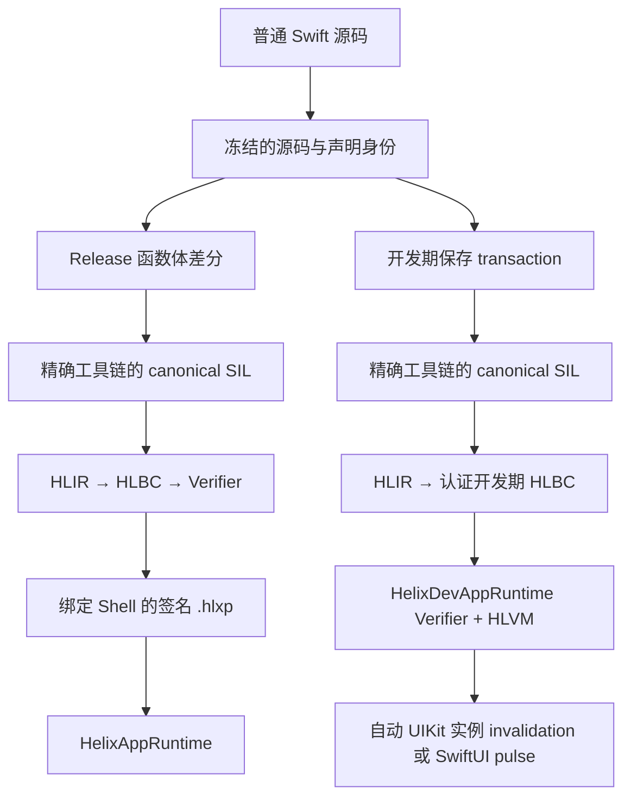

# Helix 总体架构

[English](Architecture.md)

Helix 的核心思路只有一套：工程师修改普通 Swift 源码；但生产热补丁与开发期热重载必须使用不同的产物、信任边界和生命周期。它们共享编译器事实与身份合同，不共享下发通道。

本文描述截至 2026 年 8 月 23 日仓库中已经存在的实现，不把尚未完成的资格验证写成产品承诺。

## 两条工作流

| 工作流 | 产物 | 执行方式 | 生命周期 | 用途 |
| --- | --- | --- | --- | --- |
| 生产热补丁 | 内含 HLBC 的签名 `.hlxp` | App 内预装的 Verifier 与 HLVM | 可持久化、可回滚的 generation | 处理已发布 Shell 中的线上缺陷 |
| 开发期热重载 | 会话绑定、经过认证的 HLBC live artifact | 开发期 Verifier 与 HLVM | 仅当前 Debug 进程 | 保存受支持的函数体后刷新正在运行的页面 |

两条产品路径都不会把 Swift 源码或原生机器码下载进 App。生产路径接受可持久化、绑定策略的签名包；开发路径接受仅绑定一次认证 Dev Session 的临时 artifact。这一隔离是架构边界，不是一个可随意切换的运行时开关。

## 共享合同

两条路径都依赖稳定且绑定具体构建的身份：

- NativeImport callback 的 method/initializer 生命周期以 canonical SIL 为权威；属性 setter 则属于存储语义，即使属性函数类型不能书写 `@escaping`，赋入的 closure 也始终冻结为 escaping，并保留赋值表达式的 actor isolation。method、initializer、completion 参数与 callback 属性 setter 共用同一生成式 adapter，不按 framework 分叉。
- Objective-C overlay alias 只在 mangled type 本身就是精确的顶层 Objective-C nominal 时成立；`Timer.TimerPublisher` 这类嵌套 Swift 类型不会被错误折叠成外层 Objective-C class identity。
- `FunctionKey` 标识 Swift callable，并纳入 Helix 关心的 ABI 与 effect 信息。
- `EntryIndex` 是生产 Bridge 使用的紧凑 Shell 路由。
- `TypeID` 与 `NativeImportID` 标识预先声明的类型操作和原生调用能力，补丁中不保存进程地址。
- interface fingerprint 与传递 implementation fingerprint 用于区分函数体修改和 ABI、布局、源文件成员关系或依赖变化。
- Eligible 的 Shell 已有 struct/enum 使用冻结的逻辑值合同，而不是 Swift 私有 ABI layout。Archive 会记录精确的源码限定 identity、stored field 或 enum case、label 与顺序、递归 Bridge type、copyability、受支持的 conformance 事实，以及同时纳入 device hash 的确定性 layout fingerprint。构建阶段会在声明同一源码作用域生成 private 构造 hook，使 private storage 也能按 Swift 访问控制合法重建；生成的 Bridge 则经普通、有界的 value codec 流式编解码 field 与 case。Release 和 Patch 编译会分别从源码独立推导 shape，Verifier 只有在定义完全一致时，才允许 ordinary、`borrowing`、`consuming` 或 `mutating` value receiver 成为 root。同步 Entry 可以暴露恰好一个逻辑 `inout` 区域，包括可变 `self`。生成的 Bridge 会先快照该值，只在 HLVM invocation 内建立 address，再校验唯一且类型精确的 writeback；normal 与已声明 error continuation 提交写回，VM trap 不提交任何写回，Original route 使用同一结果合同。多个或 async `inout` 会因生成边界无法证明 alias identity 而 fail closed。反射、裸内存投影、运行时 metadata、VM address 与 Swift layout 假设都不会跨边界。
- 工具链、SDK、target triple、编译参数、module 源文件集合与二进制身份把每个产物绑定到对应 Shell。
- 版本 1 Shell 会预先声明纯 VM 的 String 与 Collection capability，即使 eligible 入口冻结的原生签名没有出现这些类型，后续 body-only patch 仍可使用可表示的局部文本与集合；Native type 与 import 仍严格受生成的 Shell 表面约束。精确原生类型名始终是权威 identity；从它派生的 module-relative 简写只有在唯一指向一个冻结 identity 时才会安装，兄弟嵌套类型不会彼此覆盖。
- canonical SIL 解析会把捕获 frontend 的 protocol witness table 收集为有界、确定且仅属于 Compiler 的证据，保留 conforming type pattern、protocol identity、条件 generic clause、associated type、继承 protocol、requirement ABI、精确 witness symbol 与 table 顺序。重复 conformance identity 或畸形 record 会在 inventory 阶段失败。由于 textual SIL 可能抹去源码参数标签，打印出的 requirement 与 ABI 都相同的多条 witness 仍会分别保留；后续 consumer 无法唯一解析时必须拒绝。只有声明、没有 target body 的 imported witness table 不构成 dispatch 证据，因此不会进入 inventory。无法识别的成员只会令对应 conformance 不可消费，不会让无关高级声明阻塞普通可达函数。这份 inventory 不把 Swift witness table 或 metadata 暴露给 HLBC，本身不直接执行 protocol dispatch；下述 closed concrete-specialization consumer 及后续 existential consumer 都只能使用其中精确且完整的记录。
- 由具体 `apply`、`try_apply` 或 `partial_apply` 可达的语义 SIL 泛型 helper 会进入同一 image-function 图。Compiler 解析连续的外层 generic clause，并在替换完整 type token 前求解具体 conformance、same-type、superclass/`AnyObject` 与 dependent associated-type requirement；精确且完整的 frontend record 是权威证据，条件 conformance 只有在实例化后的 requirement 也能于同一闭合环境中递归证明时才可消费。每组参数都获得绑定原 Swift symbol 的确定 specialization identity，因此多种实例、受约束 extension method 与递归调用保持独立的静态 target。文件/module scope 的泛型 struct、enum 与 final class 只作为模板保存，并仅为可达的具体参数实例化字段、case、superclass projection 和 method。具体 opaque result 则依据 frontend entry 的精确结果 buffer，在普通单态化前消除 identity；它覆盖依赖外层泛型的 opaque 与保持顺序的多个 opaque 结果。HLBC 不携带 opaque identity、泛型 metadata 或 witness table。body 完全具体化后，closed protocol dispatch 再匹配精确 nominal、完整 requirement ABI 与唯一完整 witness record，把 `apply`、`try_apply`、`partial_apply` 归一为 frontend thunk；getter/setter、static、mutating、throwing、继承与默认实现链仍是普通 image call。未解析 archetype、pack、无法证明或递归的条件证据、缺失 target、歧义 requirement、隐式携带外层 archetype 的嵌套 nominal，以及 direct/indirect 混合的物理多结果或带多个间接 normal result 的 throwing call 会 fail closed。
- 不可变的 protocol existential 通过同一份 inventory 建立独立的闭世界计划。Compiler 保留源码级 `any P` identity，包括 protocol composition、继承 requirement 与 `AnyObject` 约束；HLBC 只保存 VM-owned `Any` payload，以及“精确动态类型 → 具体 image function”的有界表。每个 case 都必须来自当前 module 内完整、非条件式的 conformance，并指向具体 witness thunk。Verifier 会校验表示类型唯一性、非 receiver ABI 一致性、receiver ownership、effect 与 concrete-specialization target；每个分发表或 cast 类型集合最多 4,096 项。HLVM 只做精确匹配，并按完整查找规模扣减 invocation fuel。由此可在不携带 Swift metadata 或运行时 witness table 的前提下支持不可变擦除与 opening、composition narrowing/widening、class-bound value、绑定 method、同步 throwing requirement，以及 checked/forced protocol cast。protocol existential identity 只是 image-local 的 Compiler 事实，因此 Indexer 与 lowerer 会拒绝 Swift protocol value 穿过 Shell 或普通 NativeImport。另行证明的 Objective-C `!foreign` protocol 擦除仍以冻结的原生 `AnyObject` reference 越界，不属于这里的 existential value。mutable existential opening 与 writeback 在 storage 模型能够保持 mutation 前继续 fail closed。
- 经过验证的 debug metadata 把 HLBC 的 function/block/instruction 坐标映射到逻辑 Swift 文件、行、列。生产 artifact 会移除构建机绝对路径；trap 会补充精确 VM program counter 和固定的 generation。
- 不可变的 `Runtime.Generation` 保证一次激活涉及的所有路由原子可见；一次调用链会固定同一个 generation，避免在并发激活或回滚时看到混合状态。
- 一条统一的 `make_closure` 指令携带强类型静态目标：image function、冻结的 Shell `EntryIndex` 或已声明的 `NativeImportID`。未改动 callable 不会复制 archive 中的旧函数体；导入的全局/自由函数、绑定实例方法与 initializer 也复用这条路径。native receiver 是普通 capture suffix，compiler-only initializer metatype 会先校验再擦除，它们都不必仅为形成 Swift 值而生成 image thunk。该路径只接受完整且表示保持的 callable ABI；调用点默认参数投影与仅适用于直接调用的 adapter 不能伪装成函数值。调用参数是目标 ABI 前缀，`partial_apply` 捕获是其后缀；Verifier 在构造能力前统一校验所有权、结果、effect、边界错误类型、import policy 与创建者权限。NativeImport 返回的运行时原生 callable handle 仍是另一类目标，Shell 与 escaping NativeImport callback 继续固定原 generation 路由。
- closure 捕获与集合转换不依赖 Swift runtime layout，而是使用 Verifier 私有的 storage value。可变捕获共享 managed cell；`weak` 与 checked `unowned` 捕获共享不持有对象的 handle，其 referent 可以是补丁内 class 或已经冻结 identity 的 native reference。weak load 产生 Optional，并在对象释放后归零；unowned load 内部复用相同的安全归零原语，但会把已释放 referent 转换为受控 VM trap，而不是触发 Swift 进程级 abort。Array builder 与 Dictionary accumulator 仍是线性值，每条控制流路径都必须完成或销毁。这些内部 storage value 都不能进入 stack slot、Shell/Native 边界、局部值布局或函数结果。不可变 closure context 可以复制冻结 TypeOps 声明为 copyable 的可表示线性捕获；`make_closure` 对 context 副本计费，每次调用会复用 borrowed 捕获，或为 owned 目标参数重新生成一份受资源预算约束的副本，因此包含 imported value 的多次调用 closure 也不会消耗 context 中唯一的值。on-stack `partial_apply` 的 frontend 显式 capture retain 会留在分支敏感的 retain flow 中，直到 scope teardown 之后对应的 release；invocation closure 则在构造时转移这份 retain。inout 捕获仍会被 Verifier 拒绝。lexical `make_closure` 是独立生命周期类别，所有 CFG 出口都必须关闭其动态 scope；作用域 provenance 会穿过 Optional、aggregate 与外层 closure 捕获传播，不能借嵌套包装进入 escaping callback。nonescaping closure 捕获调用者 `inout` 时，`borrow_mutable_cell` 会把已经打开的 modify address 通过同一 capture ABI 暴露出来而不复制 storage；provenance 验证禁止该 cell 进入 invocation-lifetime closure，并要求 lexical closure 先于 address scope 结束，运行时 address token 还会独立使过期访问失效。作用域 provenance 还会跨 basic-block 参数与所有含 closure 的受管 aggregate 传播；作为纵深防御，escaping native callback 在创建时会对完整 capture graph 做受 budget 限制且 cycle-safe 的扫描，包括集合、mutable cell、补丁内对象 storage 与仍存活的本地 weak/unowned referent，嵌套包装无法隐藏 lexical scope。
- 原生 callable 的边界穿越使用显式合同，不会把 closure 并入普通边界 codec；callback 参数仍使用稀疏参数合同。每个带 callback 的 NativeImport identity 都会冻结参数位置及 `nonescaping`/`escaping` 生命周期。nonescaping handle 复用当前 import 的预算，并在原生调用返回时失效；escaping handle 会保留不可变 generation lease 与 closure context，若仍处于同一条固定调用链就复用其上下文，否则以新预算回到创建它的原始 image。同线程递归调用是允许的；Runtime Engine 会对所有 handle 共用一个 callback 执行域，并拒绝不同线程上的重叠执行。NativeImport 尚未返回时，callback 也不能离开发起 import 的线程；之后独立触发的 escaping callback 可以从另一线程进入，但仍必须串行。因此这套运行时机制不等同于支持 Swift 的通用 `Sendable` 语义。动态 lexical scope 即使嵌套在另一个 closure 的 aggregate 或引用型 capture graph 中，也不能进入 escaping handle；每次 callback 调用都会重新编码并校验参数 shape。同一 profile 还开放了一条受控高阶边：如果生成的 Swift 调用能够证明嵌套 callable 是 escaping，SDK 可以把一个直接或 Optional 的同步、nonthrowing callable 作为外层 callback 参数交给 VM。adapter 会把它表示为具有独立 identity 的 native closure target，普通 `closure_apply` 再按精确 ownership、结果、MainActor、deadline 与资源合同回调 Swift。这里只允许一层 callable；它不能藏进 `Any` 或其他聚合，其参数和结果也不能再包含 closure。同线程重入允许，同一个非 Sendable native callable 的重叠调用会 fail closed。精确 NativeImport 本身也可以返回直接或 Optional 的原生 callable；该 handle 天然 escaping，只能由生成 Bridge 创建，不能用 image-local closure 替代，并且必须在同步 import context 关闭前按其精确 deadline 与资源上限完成编码。创建及后续调用都会保留相同的 signature、generation identity、MainActor 要求与非 Sendable 重叠门禁；仍只开放一层 callable，参数和结果不能再含 closure。Swift `Error` callback 参数会缩减为有界的动态类型文本名，并在 Swift 侧重建成 opaque proxy；原生 payload graph、类型 metadata 与语义错误 identity 不会进入 HLBC，Shell entry、普通 NativeImport 参数/结果以及 callback 结果仍禁止 `Error`。由于 nonthrowing 原生 closure 没有错误返回通道，自动 profile 只接受同步、nonthrowing 且结果为 `Void` 或具有确定性失败值的递归 bridge value 的 callback。标量、文本、`Any`、Optional、空集合以及元素都可默认构造的 Tuple 可以使用；直接 native value 不可以，而 Optional native value 可回退为 `nil`。失败时生成 wrapper 会先返回该确定值以满足原生 ABI；仍处于活动状态的 importer 会在 native frame 返回后 trap，已经脱离原调用的 escaping 失败则通过固定 Runtime telemetry 上报。发现阶段从 typed AST 恢复 callback 的源码类型，从 canonical SIL 的 `@noescape` 恢复生命周期，并结合调用表达式与 closure body 的 SIL isolation metadata 固定 global actor；frontend 的 function conversion、Optional 注入包装和不可变的推断型局部别名都不会丢掉该证据，而源码显式书写的 function type 始终优先，因此显式 actor 擦除不会被悄悄恢复。因此 Swift closure 与 Objective-C block 参数共用同一套生成 adapter，不需要按 framework 编写 callback 特例；block storage、copy 与 noescape reabstraction thunk 只作为 compiler-only ownership plumbing，原始 VM 逻辑 closure 类型不会被它们弱化。UIKit、Dispatch、Foundation 与 OperationQueue（包括返回结果的 `NSPredicate` 与 `FileManager` enumeration callback）都走这条路径；安排 escaping callback 并不代表已经支持 Swift `async` closure ABI。源码省略 SDK 默认参数时，HLXI 会记录经过校验的物理到逻辑参数投影：lowering 必须证明被擦除的 SIL 值来自该声明自己的 default generator，或是类型完全匹配的 `Optional.none`，生成的 Swift 调用再按语言规则提供默认值。closure value 记录 canonical Swift callable ABI：参数 shape 与 ownership、结果、throwing、global actor 和 async 行为；allocation 与外部副作用权限仍属于具体 closure body。Verifier 只有在创建者本身具备这些权限时才允许 `make_closure`，随后持有这个静态目标 capability 即可进行高阶调用，不会把执行权限混入 closure 类型。唯一允许的 callable-effect 型变，是把其余 ABI 完全一致的非隔离 closure 通过显式 `convert_closure` 收紧为 `@MainActor`；该转换不改变 body 或 capture。Verifier 会拒绝 actor 擦除、ABI 改写，以及 converted value 绕过 lexical scope 进入 escaping NativeImport；VM 在真正执行 callback 时按收紧后的逻辑 signature 检查。仅作为 `destroy_not_escaped_closure` 操作数的 canonical-SIL `Optional.some` 是编译器作用域载体，而不是源码 Optional；lowering 会保留其 closure provenance，若它还有其他语义用途则 fail closed。canonical SIL 若擦除了编译器生成的 bound-method factory 的嵌套 actor 结果，Compiler 只会在所有返回 closure 都能证明指向 MainActor body 时恢复它，绝不会推断或改写普通源码 factory。Shell entry 签名和其余普通原生值位置仍禁止 closure。以上都属于统一的 v1 合同，不产生兼容版本分叉。
- 外部 ABI 归一化会保留冻结的逻辑 Swift 类型，同时只接受已证明的编译器表示：Foundation value overlay 可在 block thunk 内使用其 Objective-C bridge class；Objective-C protocol existential 只在外部边界擦除为已有的 `AnyObject` identity；Swift `Any` boxing 通过一条精确生成的 `Any -> AnyObject` NativeImport 完成。imported trivial value 在物理 SIL 中仍是 borrowed，但其 HLBC native handle 是 managed owner；Compiler 会在通用 value/address 生命周期边界物化并回收 owner，而不是按 SDK 类型写特例。
- Array、Dictionary 与 Set 是有明确类型的 VM value，不投影 Swift runtime 的私有布局。一套有深度上限的递归值语义模型为受支持标量与容器统一提供 VM-defined Equatable/Hashable；严格排序是独立且仅限标量的能力。Set 使用不可变 COW storage，在同一值内保持稳定迭代；Dictionary/Set 的相等与哈希不依赖顺序。Verifier、边界校验、比较工作量计费和分配前资源计费会端到端执行同一模型。
- 运行时 `nil` 不会伪造 wrapped type。边界校验仍是深度、可计费的 shape 验证；VM 内部 collection state 则从已验证的 bytecode 上下文，以有深度上限的 runtime-type 检查恢复无 payload Optional 的类型。泛型间接调用结果与普通 store 也共用同一个 compiler-address sink，包括尚未完成的 Array 字面量整个 element 与 Tuple component。
- 原生文本渲染使用固定的表示适配层，而不是暴露 Swift 泛型 ABI。Compiler 会识别 `String(describing:)` 与 `String(reflecting:)`，证明递归动态类型能够由 Shell codec 精确重建，把该身份保存在 VM-owned `Any` 中，再调用精确的 `Any -> String` NativeImport。`debugPrint` 复用 variadic `print` 已有的 `[Any], String, String -> Void` 形状；具体 metadata 与 witness table 都不会跨边界。若 canonical SIL 在互斥路径上初始化同一个 existential Array 字面量 element，擦除后的值会通过强类型隐藏 block parameter 合流，只在字面量 finalize 的位置提交。该适配层只接纳标量、文本、Optional、Array、Dictionary、Set codec 家族，拒绝 ArraySlice、Tuple、补丁内 nominal、native object 与 closure payload，并统一执行 64 KiB 渲染上限；当前 v1 合同不增加 opcode、schema 或版本。
- Array 结构变更表示为不可变、强类型的值转换。拼接、插入、删除与 `replaceSubrange` 复用同一个半开区间替换指令，`swapAt` 使用一个 swap 指令。Verifier 证明 element 类型一致且可复制；VM 在任何修改前验证全部边界并预扣输出工作量与存储；compiler-only assignment 则在共享存储出口释放被替换的线性所有者。
- Dictionary 的插入、替换与删除会降低为同一个不可变强类型转换：Optional update 决定设置或擦除，两个结果分别携带旧值与更新后的 Dictionary。`keys` 和 `values` 则共用一个按所选 element 类型参数化的投影操作。Verifier 会证明完整的操作数/结果关系；VM 只查找一次 key，并在构造任一结果前预扣遍历、输出存储和所有复制成本。
- Dictionary 默认下标是建立在同一套强类型查找/更新表面上的编译器控制流：getter 对 `dictionary_get` 分支，只在缺键边调用 autoclosure。Array element 修改与 Dictionary 默认值修改共用一种 `_modify` 借出模型：frame slot 与 scoped address 暂存 element，`end_apply` 和 `abort_apply` 再执行强类型值语义回写。因此嵌套或可抛错的 inout 调用无需新增某个集合 API 的 opcode，可复制的 imported reference value 也复用同一 ownership 路径。
- Dictionary 累积使用一个 Verifier 私有的线性状态，而不是为每个标准库 API 增加 opcode 或 NativeImport。该状态可从空值或一份已复制的 Dictionary 开始，在普通受验证 CFG 中执行强类型查询与替换，保留首个等价 key 及其插入位置，最后把内部 storage 移交给唯一的完成结果。Array-valued 累积另有一个融合后的强类型 append，因此 grouping 可以线性增长每个 bucket，不会为每个 element 都物化并替换一份不可变 Array。merge、uniquing 与 grouping callback 仍是普通 closure CFG edge：combine 只在重复 key 上惰性调用；抛错时非可变 API 销毁部分结果，而可变 `merge` 会像 Swift 一样在 error continuation 回写已经成功累积的前缀。Verifier 会证明 key 具备 VM-defined Hashable 语义且 key/value 可复制；VM 则在修改前预扣查询工作量、值复制和新增 entry storage。这样 compiler lowering 可以复用同一个有界机制，既不会在每次更新时复制整张 Dictionary，也不依赖 Swift 私有的泛型 ABI。
- Mandatory SIL 可能擦除 `load [take]`，并把 ownership 拆成独立 retain/release traffic。类型驱动的归一化只会在普通 load 是某个精确临时存储在 `dealloc_stack` 前的最后一次操作时恢复 forwarding take；随后 retained owner 会在 aggregate、store、call 与 return 等消费边被使用，借用或后续仍会使用的线性来源会得到独立 VM owner。原生操作若必须先产生 owned VM value 来承载 SIL 的 `+0` view，会把它登记为 borrowed temporary；retain promotion、owned 边界或最后一次 borrowed use 只会关闭它一次，保持表示不变的引用别名共享这段生命周期。这套规则同样覆盖 imported reference、Array、Optional、Tuple 与其他可表示线性值。若 canonical SIL 先 retain Tuple、再分别释放或转移字段，lowering 会拆开这个显式 owner，并把 ownership 分配给各字段；仅供已擦除 debug metadata 使用的死 aggregate 不会被物化成 VM owner。
- Compiler-only Tuple storage 以语义字段路径而不是 projection 的出现顺序为准，并在一个 aggregate owner 与互不重叠的 field owner 之间递归转换。因此提前建立 projection、嵌套 Tuple、整体覆盖、销毁和可变捕获都复用同一套初始化与 ownership 规则。aggregate `@out` 结果也会在一个强类型 frame slot 上使用相同字段路径，各 Tuple component 可以独立初始化，而 Verifier 在 return 边界仍只接收一个完整值。
- 可表示的 managed Collection 共用一个经过验证的 Sequence specialization，而不是导入 Swift 私有的泛型 Collection ABI：Array、Set 与 Dictionary 驱动同一种强类型 cursor，其中 Dictionary 暴露原生 `(Key, Value)` element Tuple，Set/Dictionary 保持确定的 VM 迭代顺序。frontend 对具体类型与协议 extension 入口生成的不同泛型替换形状，会在 lowering 前归一到这一个 specialization；Array、Dictionary、Set 因而共用 `count`/`isEmpty`/`first` 与精确的 Collection `underestimatedCount`，Array 另提供具有已表示双向存储语义的 `last`，已经归一的 Array-backed view 使用同一套 Array 查询语义。`Zip2Sequence` 的具体 getter 则保留独立的 Sequence-witness 规则：可表示的 enumerated 或 flattened/joined 来源贡献 `0`，不能用已经物化的 Tuple Array 精确长度替代。Dictionary/Set 的空构造与 `minimumCapacity` 构造共用一个强类型计划；容量在当前表示层不可观察，但 Swift 的非负 precondition 会保留。等值 membership、自然极值与跨容器 Sequence 关系等只消费 element 的操作直接流式遍历，保留短路与首个 tie，不分配中间 Array。`sorted`、`Set(sequence)`、`enumerated`、`Array(sequence)` 与异构 `zip` 等结果本身需要完整存储或随机访问的操作，才会复用统一的强类型 Array 物化路径与已有的有界 Array 算法。reversed、repeated、slice 与 joined 在涉及更强的 index 或嵌套 Sequence 语义时仍保持 Array-backed 约束。Array-backed storage 把物理元素与逻辑整数索引基址分开保存；Compiler 将具体来源分类为零基、保留基址或不透明三类，因此 `ArraySlice` 与递归 Array-backed 的 `Slice` 会在调用、聚合、Optional、派生 view、搜索、split、排序和变异之间保留公开 bounds。显式 `Slice(base:bounds:)` 构造器以及 Slice 自身的 index/subscript ABI 形态会在 frontend 归一到相同的 range 与 mutation 语义。Array、ArraySlice、递归 Array-backed Slice 与 Repeated 还会共用非变异索引移动和变异式 `formIndex` 家族；泛型 associated-index 结果严格按真实的间接 SIL ABI 写入，不套用 Array 的直接返回形态。HLBC 只增加读取/替换基址的两条通用原语；替换基址会消费 owned temporary 并只迁移 storage metadata，不会再次复制元素。其余 API 继续复用 cursor、range、builder 与 mutation 语义；`String.Index`、`ReversedCollection.Index` 等私有 index identity 仍会 fail closed。
- Swift 文本的逻辑合同与紧凑 HLBC storage 分离。String 与 Character 都占用 Verifier 的 String value type，但每个 Character producer 与 Shell codec 都会证明其恰好包含一个扩展字素簇；Substring 使用 `Array<String>`，其中每个 element 都携带这一 Character invariant，私有 slice storage 与 String index 不会进入 artifact。两条表示原语构成边界：`string_characters` 把 String 按扩展字素簇切分为归一 Character Array；`string_join.character` 重新验证后重建文本，`string_join.string` 则用可选 separator 拼接逻辑 String element。String 的直接 `count`/`isEmpty` 不分配；需要 element 的有限 Sequence 操作只物化一次，随后复用现有 cursor、builder、split、subsequence、关系与 closure CFG。另一个可表示 `RangeReplaceableCollection` 计划把 frontend 的 method/operator 形态统一解析成一个逻辑 destination 加 Element 或有限 Sequence source，在 String、Substring、Array 与已归一的 Array-backed view 之间共同覆盖 `append`、`append(contentsOf:)`、`+=`、首尾/计数删除、`popLast`、清空与容量提示。String destination 对直接 Character/String suffix 使用拼接，不拆分已有内容；其他可表示 Character Sequence 只 join 一次。Array-backed destination 与 ArraySlice 共用强类型单元素 append 或半开区间替换，source 可以来自 element 匹配的可表示 managed Collection 或受支持有限 progression。编辑前会同时校验规范化的源码级 Element 身份（包括 Tuple label 与被 HLBC 擦除的类型差异）、operator 的具体 metatype、物理 Element shape 与 ownership，不引入 Swift 泛型 NativeImport 或按 source API 增加 opcode。UTF view、`String.Index` 与 index-sensitive 修改不在该表示内，会 fail closed。
- 有限整数 `Range`/`ClosedRange` 与受支持数值 `StrideTo`/`StrideThrough` 构成另一类仅存在于 Compiler 的具体 Sequence specialization。它们保留强类型 bounds 与 stride register，而不产生 Swift Runtime 对象。正向高阶操作、等值 membership、自然极值与 Sequence 关系直接流式遍历。整数 `Range`/`ClosedRange` 的 `count`、`underestimatedCount`、`isEmpty`、`first`、`last` 直接由 bounds 计算；完整 64 位基数使用无符号 order key，不遍历区间，并在精确结果无法放入 `Int` 时 trap。StrideTo/StrideThrough 的 Sequence-witness `underestimatedCount` 则通过同一个受 fuel 限制的 cursor 精确流式计数，只使用常数额外空间。半开定宽整数 Range 的计数式 drop/prefix/suffix 会在常数时间内移动一个强类型 bound，在另一端 clamp 且不把完整基数收窄为 Int，结果继续保留为 Compiler-only progression。具有可表示 Comparable bounds 的 `Range` 还支持 `isEmpty`、`overlaps`、`clamped(to:)` 及上下界直接投影，但不会因此获得迭代语义；这些操作复用强类型 compare/select 控制流，保留 Swift 的空区间 overlap 规则与浮点相等时的原始 bit selection，不导入泛型 Range ABI。自然/comparator 排序、Set 构造/代数以及其他结果需要完整存储的 API 才会通过同一强类型 Array builder 物化元素。
- 非 throwing 值修改通过共享 compiler-address sink 表达，不增加 API 形状的字节码。`Bool.toggle()` 是一条强类型布尔变换；全局 `swap` 会先读取两个不重叠的可表示值，再写任一 destination，因此 compiler storage、Tuple/局部 struct projection、frame address 与可变 closure cell 共用相同的 ownership 与 alias 校验。
- canonical SIL 可能用泛型 Array/Dictionary cast helper 表达 Tuple label 擦除。Compiler 只有在原始类型仅有 Tuple label 差异、且递归归一后的来源与目标也是完全相同的 VM 类型时才消除该 helper，并保留普通 owned-result ownership edge，不新增 cast opcode 或 NativeImport。仅仅底层表示相同并不充分，例如 `CGFloat` 与 `Double` 容器仍会被区分；真正改变 element、key、value 或 reference type 的转换不会被误判成恒等转换。
- 声明摘要中的逗号分隔 enum case 会被解析为独立 case，关联值内部的嵌套逗号不会被误分割；Swift 的单个 labeled associated value 会按 canonical SIL 的单元素 payload Tuple 建模。重复、空或畸形 case 会在构建局部类型 metadata 前 fail closed。
- textual declaration summary 的采集早于冻结 Shell type alias 的注入，因此 local factory table 分两阶段解析：首轮只接纳已经完整可解析的 local graph；注入 native type 后先移除冻结声明，再严格重建 factory table。Swift 在声明摘要里输出 stored-property 属性，不会导致 imported field type 被猜成 patch-local 类型。
- 具体 Sequence 遍历在 Compiler 内共用一个 cursor 抽象，不会按来源 API 各走一套 lowering。managed Collection 分支驱动按类型验证的 collection cursor：正向 cursor 保存下一个元素 offset，Dictionary 产出 `(Key, Value)` 元组，Set 直接产出元素，Array 另支持以排他上界表示的反向 cursor；String specialization 会先通过经过验证的 Character Array 进入同一分支。有限 progression 分支则用强类型 start/end/stride register 驱动现有 Optional progression cursor。两条分支因此都进入同一 closure CFG，不导入 Swift iterator 或 witness-table ABI；Verifier 会拒绝未表示的反向或无序遍历，VM 也不会把损坏 cursor 伪装成遍历结束。非 closure consumer 会把同一 cursor 与普通 compare/branch 组合：`contains` 和 Sequence 关系短路，自然极值只携带一个 owned candidate 并保留首个 tie。Comparator 驱动的 `min(by:)`/`max(by:)` 同样在 CFG 中携带一个 owned candidate，严格保留 Swift 参数顺序、首元素 tie 与 throwing cleanup。
- 常见完全具体的 Sequence 变换会把这套与来源无关的 cursor 和普通 closure ABI 组合起来，不导入 Swift 的泛型集合方法。可表示 String/Array/Dictionary/Set 与有限 progression 因而共用 map/filter/reduction/predicate/comparator 控制流、短路、抛错边与 ownership cleanup。`count(where:)` 也是同一种来源无关的 cursor consumer：predicate 仍是普通 closure CFG edge，`Int` accumulator 使用 checked arithmetic，不创建结果 builder 或 API 专属 opcode。一份线性元素缓冲同时服务于产生 Array 的变换、保留逻辑 String 或 Array/Dictionary/Set 容器类型的 `filter` 与 Dictionary value 变换，再由结果类型选择经过验证的收尾操作。Dictionary 的泛型 callback 接收表示层 `(Key, Value)` 元组；专用 filter/value-transform ABI 则先投影 key/value 字段，再回到同一套 closure CFG。消费型标准库 overload 会接管 frontend 显式 retain 的源 owner；normal、empty 与 throwing 出口都会且只会关闭一次 source、cursor、字段与 builder。
- Array 算法共用一种 invocation-local 线性状态类型，Verifier 用 kind 区分 element builder、随机访问 mutation、稳定排序与 split 状态机，避免不同算法错误地互相消费。mutation kind 只提供强类型的按 index 读取、原地交换和消费型完成操作；它只复制一次源 Array，读写按 fuel 计费，不能复制或跨函数/Runtime 边界，并且每条出口都必须完成或销毁。这样 compiler 展开的算法可以继续使用普通 closure CFG 与 Swift ownership，而不必在循环中反复重建不可变 Array，也不需要为每个标准库 API 增加 opcode 或 NativeImport。
- Comparator 排序使用稳定排序 kind：有界归并状态机负责持有已复制 element 与 index buffer，每一次比较仍是已验证 CFG 中的普通 closure 调用。自然标量排序在一个同样受 fuel/deadline 计费的 VM 操作内驱动相同状态机。可变排序只在 normal continuation 上用显式 assign 模式写回完成后的 Array；comparator 抛错会销毁临时状态，并保持原 inout storage 不变。Array `partition(by:)` 则以 mutation kind 执行 Swift 的 low/high 双向扫描，`removeAll(where:)` 以同一状态执行半稳定分区并在成功后一次性移除后缀；两者都会保留 predicate 调用顺序，并在 predicate 抛错时写回抛错前已经完成的交换，以匹配源操作可观察的部分修改语义。
- 可变高阶 callback 复用普通调用的地址模型。`reduce(into:_:)` 会把任意可表示 accumulator 放在一个 frame-owned slot 中，每次 callback 只打开一个窄 modify scope，并在 normal/throwing 两条边都先关闭 scope，再返回或销毁 accumulator；这里没有 accumulator 类型特例。nonthrowing typed-rethrows SIL 保留的间接 `$Never` destination 只是编译期控制流 metadata；即使同一函数还需要运行时 `inout` storage，它也不会被物化为 VM slot 或 address。
- closure signature 会为每个调用参数携带 ownership convention，也允许 address type 与 `inout` 成对出现。Compiler 会把具体 Swift `@in_guaranteed` 输入保留为 VM borrowed value，只在 owned 边界物化 copy；Verifier 则要求 signature 与 closure body 的参数前缀完全一致。callable ABI 还会携带精确的错误结果类型：具体 `throws(Failure)` 会在直接调用、closure、泛型转发和 stored closure continuation 之间传递原始的、符合 `Error` 的补丁内局部值；只有编译器已经具体化的 reabstraction thunk 才能把它转换为 `throws(any Error)`。Verifier 要求函数、closure signature、throw payload 与 error block 参数使用完全相同的类型，VM 不会把这条内部 typed channel 退化为消息。`throws(Never)` 与 `Never` 调用不可能到达的 normal result 都只保留为无运行时值的控制流，不会占用寄存器。动态调用可以让 live inout scope 跨 normal/error continuation，但每条 continuation 必须关闭同一个 scope，重叠参数仍会被拒绝。这条规则由类型驱动，也覆盖线性的 imported SDK value，并不是针对某个 API 或 framework 的例外表。同步 closure 是递归合法的值 shape：高阶签名及 Optional、Tuple、Array、Dictionary、补丁内 nominal storage 都复用同一 signature/ownership 验证。capture list 与局部变量的 `weak`/`unowned` storage 会与可变 capture box 一起归一到同一个 managed-capture ABI，因此直接调用与 specialization closure body 共享同一 storage identity。Compiler 与 VM 按已经验证的静态类型图转移 ownership；替换 Optional、Array、Dictionary、Set、enum、Tuple 或 struct storage 时会释放已淘汰的 class owner，而不会在运行时扫描 aggregate 内容。`Any` 与 `Error` 的具体 payload 是动态的，因此会保守地采用 managed transfer。`unowned(unsafe)` 会 fail closed，因为下载代码边界无法为原始悬空引用提供安全语义。`withoutActuallyEscaping` 会创建独立的动态 scope view；CFG 验证覆盖分叉的 normal/error 出口，受 budget 限制且 cycle-safe 的 VM value graph 扫描与 candidate-only CFG liveness 会在 token 失效前拒绝显式 storage 或仍具语义活性的 aggregate escape，同时忽略已经无后续用途的 SSA 物理别名。仅直接调用的 closure 与 `defer` helper 会以 concrete specialization 保留物理 address ABI；只有真正用于 `partial_apply` 的 body 才采用 managed closure-capture ABI。语义 SIL 中由具体 `apply`、`try_apply` 或 `partial_apply` 到达的泛型 helper 也进入同一 image-function 图：Compiler 解析声明最外层泛型子句，只替换完整类型 token，为每个参数列表生成确定性 specialization identity，并把具体 image body 绑定回原 Swift symbol 与精确参数列表。多个具体实例与递归调用因此保持为彼此独立、静态类型化的 target，不依赖优化器私有 symbol。仍含 archetype、pack、不稳定声明参数、运行时 metadata 或 witness dispatch 的 body 会在 lowering 前明确失败。
- 间接 typed-error 结果使用一个真实且分支敏感的 frame slot：每条 throw 路径分别初始化该 slot，终止的 `throw_addr` 按运行时控制流消费最终值，不再依赖编译期单值缓存；`$Never` 仍只是零大小的 ABI/CFG metadata，不分配运行时 storage。嵌入可表示类型的 synthetic local identity 使用独立的递归 canonical value-type grammar，不会重新送进 Swift 源码类型解析器，因此 closure ownership/effect、容器、native 与 local shape 都可无类型特例地往返。`withExtendedLifetime` 则作为同步 closure-scope intrinsic 降低：类型通用的 anchor 副本会跨普通或 typed-throwing 的无参 closure 调用存活，并在两条 continuation 上释放；它不是 Swift 泛型 ABI 的 NativeImport。
- 同一个递归局部 helper 如果既直接调用又用于 `partial_apply`，image-function 发现阶段只赋予一个 closure-body role；direct apply 仍然有效，capture storage 也只归一化一次。仅直接调用的 closure/`defer` helper 则继续保留 concrete-specialization 的物理 capture ABI。
- 一套结构化的 SIL function-type parser 会在参数或结果本身也是函数时，仍准确找到最外层结果箭头。具体 metatype 参数以物理位置和 nominal/value identity 保留为编译期事实；direct call 与 `partial_apply` 会先验证并擦除它们，再投影逻辑 callable ABI。普通 enum case、具体标准库 case 构造器、补丁内 struct initializer 与补丁内 static factory 因而不需要运行时 metadata 或逐类型构造器规则。compiler-only Tuple 与补丁内 struct build region 同样复用“根地址 + 字段路径”identity：字段写入会使重叠 aggregate snapshot 失效，只有递归所需的全部叶节点都有值时才重建完整 aggregate；部分初始化的 storage 仍不可读，并按字段清理。
- Swift frontend 已携带具体错误 substitution 的标准库高阶专门化也复用这条精确 typed channel；未携带该证据的旧式 `rethrows` 调用只能通过具体 reabstraction thunk 进入 `any Error` 通道。
- frame-local storage 与 heap-promoted storage 共享同一套字段敏感的 aggregate shape。Compiler 会提升跨 basic block 的生命周期，区分 initialize、assign、replace 与条件清理；Verifier 在 CFG 合流处分别计算“确定初始化”和“可能初始化”的叶节点。读取仍只允许确定初始化。Optional case 证据使用相同的“根地址 + 字段路径”identity，并且只在当前 basic block 生效；写入、take 与销毁会使所有重叠路径的事实失效。frame-local projected take/destroy 只反初始化对应叶节点并保留兄弟字段 ownership；caller-owned 与 object storage 在没有 writeback 合同时会被拒绝。runtime shape 与部分存储都计入 invocation budget；projected decomposition 会在修改 storage 之前，先按 shape 上界预扣线性工作量。
- 调用的地址效果来自特化后的物理 SIL function type，而不是 API allowlist：`@in` 消费已初始化 storage，`@inout`/`@inout_aliasable` 要求并保持初始化，indirect result 只在其声明的 continuation 上完成初始化。同样，`unchecked_take_enum_data_addr` 不会因指令名被机械地视为立即消费，而是按实际消费者分类：只读 load 保留父 Optional，消费型使用会 take，修改则重建发生变化的 Tuple/补丁内 struct 路径后写回 Optional。非 throwing 的 compiler-only `inout` 会物化为经过验证的临时 address storage，调用完成后再走同一写回路径；重叠 projection 会被拒绝。Compiler 已证明的 frame-local aggregate static access 会收窄到最终操作或字段 projection，因此互不重叠的兄弟字段 `inout` 仍使用独立的 VM exclusivity scope。破坏性消费与修改生命周期混用会 fail closed；在 normal/error 两条 continuation 都具备写回模型之前，throwing compiler-only `inout` 也会 fail closed。
- 激活时会把继承路由物化成自包含 snapshot。Registry 默认只强保留当前 snapshot 与其直接回滚前代；更旧 snapshot 只会在仍有 lease 固定时存活。全进程 generation ID 高水位不会因压缩而回退。普通激活不能复用旧 ID；经过验证的持久化恢复可以重新挂载完全相同的历史 package/ID，但不会降低高水位。

- 具体泛型约束的证据边界分为两类：用户 conformance 以精确完整的 frontend record 为准；Helix 已表示的标准值族只使用经过当前 toolchain 校验、且值模型已有执行语义的闭合证据。除 `Sequence`/`Collection` 层级外，它覆盖常用标量与递归值的 `Equatable`/`Hashable` 约束、标量 `Comparable`、数值与字面量协议层级、`Strideable`、`CustomStringConvertible` 和 `LosslessStringConvertible`。精确 standard witness 会降低为 Verifier 可见的比较、算术、原地修改、magnitude、整数除法/余数/位运算/移位、定宽整数边界与位属性、multiple/quotient 查询、wrapping/reporting-overflow 算术与 full-width 乘法、浮点除法/余数、distance/advance、字面量构造、description 与无损解析操作；compiler-only 字面量 payload 会先校验并在进入 HLBC 前消除。Compiler 不会伪造直接 `Hasher` 执行，imported native conformer 仍必须使用另行冻结的具体 NativeImport 操作，也绝不会因 storage 形状相似而推断自定义或 imported conformance。

这些身份有意绑定具体 build。Helix 不试图让不同 App 版本之间的私有 Swift ABI 自动兼容。

## Release 架构

接入 Helix 的 Release 构建会产出 App Shell 和 finalized interface archive。生成的 Derived Sources 建立永久动态入口与强类型原生 Bridge，不修改手写 Swift 文件。最终归档记录精确编译环境、源码身份、可补丁 root、签名、能力以及最终可执行文件身份。

typed frontend 会把替换语法表示成以 declaration USR 为键的声明组；普通函数 body 或每个 accessor 分别对应一个可执行成员。因此多个 function key 共用属性或下标声明时，源码变换也只会插入一次 `dynamic`。Release Bridge 与显式 Native 差分后端消费同一个闭合声明形状，不会再从名字或 offset 猜测属性/下标的分组。语法要求存在但本次未变化的 getter/setter companion 会显式串到 previous implementation，而可独立替换的 observer 成员可以省略；普通函数只是这个模型的单成员情形。

发生缺陷时，补丁构建器在归档环境中重新类型检查完整 module，确认只有 eligible implementation 发生变化，把当前支持的 canonical SIL 子集降成 HLBC，执行独立验证，再对补丁包签名。App 在产物进入不可变存储或激活为 generation 前会重新完成设备侧验证。

随 App 安装的 Runtime 已包含字节码解码器、Verifier、HLVM、Bridge Catalog、包信任链、激活日志、Crash Guard 与回滚逻辑。生产补丁无法凭空新增 Shell 发布时不存在的原生能力。

完整流程见[生产热补丁](Production-Hot-Patching.zh-CN.md)。

## 开发期架构

Xcode 工程只包含原始 Feature 源码和稳定 App Runtime import。Build pre-action 在 DerivedData 中 materialize Shell；App phase 根据捕获的 Feature 调用重建编译参数，把全部生成 Bridge 源码私下编译成一个经过校验的 relocatable object。App 链接时保留稳定 C provider 符号，`ApplicationSession` 因此无需 Bridge framework、生成源码 target 或生成 Swift import 就能取得合同。

Xcode 集成会从一次真实 Debug Build 中捕获 frontend、link、SDK、module、源码和 target 事实。源码监控器把编辑器写入与原子 rename 整理成稳定、单调递增编号的快照。开发编译器在原 module 上下文中重新检查整个 transaction，使用与 Release 编译器相同的受支持 canonical SIL 子集，生成一个不可变 HLBC generation。认证 daemon 传输字节，Debug App 再次验证后原子激活临时 Runtime generation。

Helix 不会维护一个可变动态库并不断追加 Swift 文件。Native Dynamic Replacement 只保留为必须显式选择的内部编译器实验和差分验证后端；自动与默认路由绝不会回退到它。

Debug App 先激活代码，再刷新 UI。`ReloadIndex` 把变化 root 映射为稳定 nominal type ID。UIKit 会从已展示 controller/view class（包括 superclass 链）还原这些 ID，无需业务注册表即可执行推导出的 invalidation；SwiftUI 使用显式 pulse boundary。没有安全刷新策略或存活目标时，Helix 会明确报告“代码已激活，但需要手动刷新”，不会猜测并重放任意生命周期方法。

从保存到页面变化的完整过程见[开发期热重载](Development-Live-Reload.zh-CN.md)。

## 构建与运行时隔离

App 只能链接一个聚合产品：

| App 配置 | 产品 | 是否包含开发加载器和传输能力 |
| --- | --- | --- |
| Release / Production | `HelixAppRuntime` | 否 |
| Debug / Dev Shell | `HelixDevAppRuntime` | 是 |

Release 审计会扫描最终 bundle，而不是信任 target 名称。生产 Runtime 拒绝开发 artifact，开发协议也不会把生产 campaign 当成旁路。构建侧 Compiler、Release、Daemon 与 CLI 模块不得进入 Release App。

## 当前资格边界

仓库目前包含可运行的受限 HLBC 生产客户端链，以及可运行的 Simulator HLBC Live Reload 链。后者已经在同一个 App 进程中验证修改后的实现和第二代 baseline 恢复。Hot Patch Demo 还能把签名补丁模拟为一次本地下载，并走正常验签、安装、激活与回滚路径。

仓库还包含四个接近业务代码的 corpus 文件，以及确定性的 128 代进程内 soak；后者覆盖失败保存、激活、回滚、调用、snapshot 压缩和 generation ID 单调性。这些证据仍不代表 App Store 下发已经合规，也不代表任意 Swift 语法、真实 iPhone 执行、外部 top-200 应用 corpus、真机长时间内存压力/前后台循环或外部 Registry/HSM/审批控制面已经完成。具体边界见[能力与限制](Capabilities-and-Limits.zh-CN.md)。
