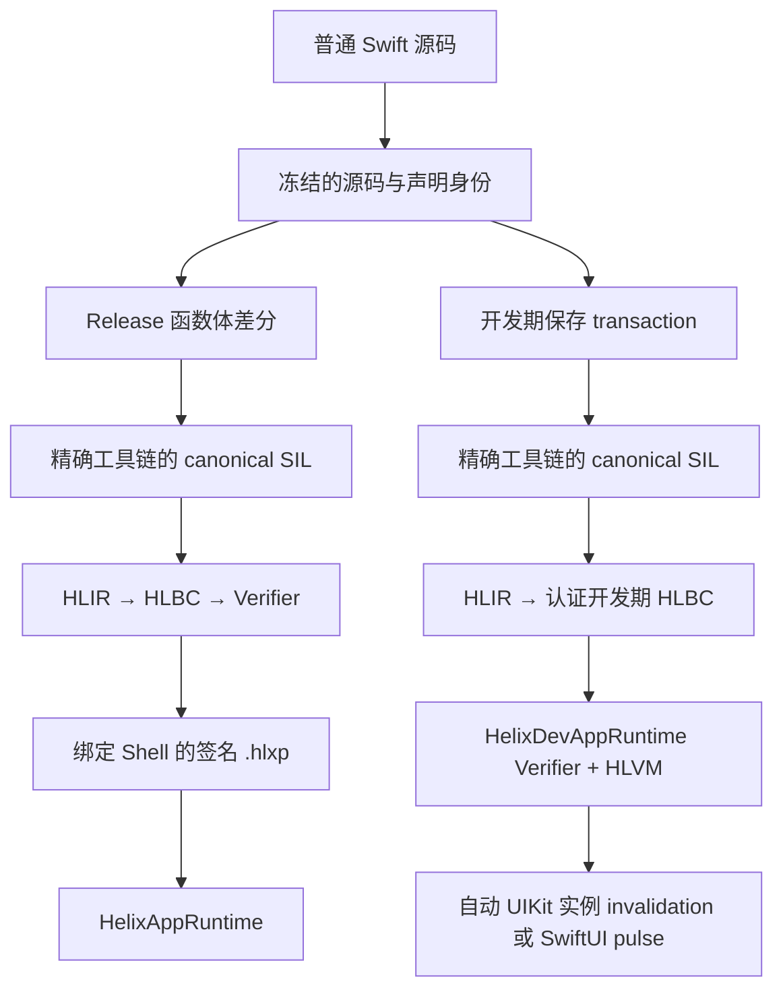

# Helix 总体架构

[English](Architecture.md)

Helix 的核心思路只有一套：工程师修改普通 Swift 源码；但生产热补丁与开发期热重载必须使用不同的产物、信任边界和生命周期。它们共享编译器事实与身份合同，不共享下发通道。

本文描述截至 2026 年 8 月 20 日仓库中已经存在的实现，不把尚未完成的资格验证写成产品承诺。

## 两条工作流

| 工作流 | 产物 | 执行方式 | 生命周期 | 用途 |
| --- | --- | --- | --- | --- |
| 生产热补丁 | 内含 HLBC 的签名 `.hlxp` | App 内预装的 Verifier 与 HLVM | 可持久化、可回滚的 generation | 处理已发布 Shell 中的线上缺陷 |
| 开发期热重载 | 会话绑定、经过认证的 HLBC live artifact | 开发期 Verifier 与 HLVM | 仅当前 Debug 进程 | 保存受支持的函数体后刷新正在运行的页面 |

两条产品路径都不会把 Swift 源码或原生机器码下载进 App。生产路径接受可持久化、绑定策略的签名包；开发路径接受仅绑定一次认证 Dev Session 的临时 artifact。这一隔离是架构边界，不是一个可随意切换的运行时开关。

## 共享合同

两条路径都依赖稳定且绑定具体构建的身份：

- `FunctionKey` 标识 Swift callable，并纳入 Helix 关心的 ABI 与 effect 信息。
- `EntryIndex` 是生产 Bridge 使用的紧凑 Shell 路由。
- `TypeID` 与 `NativeImportID` 标识预先声明的类型操作和原生调用能力，补丁中不保存进程地址。
- interface fingerprint 与传递 implementation fingerprint 用于区分函数体修改和 ABI、布局、源文件成员关系或依赖变化。
- 工具链、SDK、target triple、编译参数、module 源文件集合与二进制身份把每个产物绑定到对应 Shell。
- 经过验证的 debug metadata 把 HLBC 的 function/block/instruction 坐标映射到逻辑 Swift 文件、行、列。生产 artifact 会移除构建机绝对路径；trap 会补充精确 VM program counter 和固定的 generation。
- 不可变的 `Runtime.Generation` 保证一次激活涉及的所有路由原子可见；一次调用链会固定同一个 generation，避免在并发激活或回滚时看到混合状态。
- 可变 closure 捕获与集合转换不依赖 Swift runtime layout，而是使用 Verifier 私有的 storage value：managed cell 只能由同 image closure 共享；Array builder 是线性值，每条控制流路径都必须完成或销毁。两者都不能进入 Shell/Native 边界、局部值布局、stack slot 或函数返回值。
- Array、Dictionary 与 Set 是有明确类型的 VM value，不投影 Swift runtime 的私有布局。一套有深度上限的递归值语义模型为受支持标量与容器统一提供 VM-defined Equatable/Hashable；严格排序是独立且仅限标量的能力。Set 使用不可变 COW storage，在同一值内保持稳定迭代；Dictionary/Set 的相等与哈希不依赖顺序。Verifier、边界校验、比较工作量计费和分配前资源计费会端到端执行同一模型。
- Array 结构变更表示为不可变、强类型的值转换。拼接、插入、删除与 `replaceSubrange` 复用同一个半开区间替换指令，`swapAt` 使用一个 swap 指令。Verifier 证明 element 类型一致且可复制；VM 在任何修改前验证全部边界并预扣输出工作量与存储；compiler-only assignment 则在共享存储出口释放被替换的线性所有者。
- Dictionary 的插入、替换与删除会降低为同一个不可变强类型转换：Optional update 决定设置或擦除，两个结果分别携带旧值与更新后的 Dictionary。`keys` 和 `values` 则共用一个按所选 element 类型参数化的投影操作。Verifier 会证明完整的操作数/结果关系；VM 只查找一次 key，并在构造任一结果前预扣遍历、输出存储和所有复制成本。
- Mandatory SIL 可能擦除 `load [take]`，并把 ownership 拆成独立 retain/release traffic。类型驱动的归一化只会在普通 load 是某个精确临时存储在 `dealloc_stack` 前的最后一次操作时恢复 forwarding take；随后 retained owner 会在 aggregate、store、call 与 return 等消费边被使用，借用或后续仍会使用的线性来源会得到独立 VM owner。原生操作若必须先产生 owned VM value 来承载 SIL 的 `+0` view，会把它登记为 borrowed temporary；retain promotion、owned 边界或最后一次 borrowed use 只会关闭它一次，保持表示不变的引用别名共享这段生命周期。这套规则同样覆盖 imported reference、Array、Optional、Tuple 与其他可表示线性值。
- Compiler-only Tuple storage 以语义字段路径而不是 projection 的出现顺序为准，并在一个 aggregate owner 与互不重叠的 field owner 之间递归转换。因此提前建立 projection、嵌套 Tuple、整体覆盖、销毁和可变捕获都复用同一套初始化与 ownership 规则。
- 常见且底层为 Array 的标准库 view 会在 Compiler/VM 边界归一化，而不是导入其私有 storage layout。reversed、enumerated、repeated、`Slice<Base>`、zip 与 joined sequence 会成为经过 Verifier 按操作检查结果类型并在分配前计费的强类型 Array 操作。归一化只覆盖元素序列语义；ArraySlice 的非零起始 index identity 不会被静默当成 Array index，尚未建模的 slice-index API 仍会 fail closed。
- textual declaration summary 的采集早于冻结 Shell type alias 的注入，因此 local factory table 分两阶段解析：首轮只接纳已经完整可解析的 local graph；注入 native type 后先移除冻结声明，再严格重建 factory table。Swift 在声明摘要里输出 stored-property 属性，不会导致 imported field type 被猜成 patch-local 类型。
- VM-managed Array、Dictionary 与 Set 共用一个按类型验证的 cursor 操作，不再为每种容器定义一套遍历指令。正向 cursor 保存下一个元素 offset；Dictionary 产出 `(Key, Value)` 元组，Set 直接产出元素。Array 额外支持以剩余区间排他上界表示的反向 cursor，因此无需导入 collection iterator ABI 就能保留双向 predicate 调用顺序；Verifier 会拒绝无序容器的反向遍历。Comparator 驱动的 `min(by:)`/`max(by:)` 复用同一遍历，在 CFG 中携带一个 owned candidate；两个 borrowed 输入严格按 Swift 的顺序传入，tie 保留最早元素，throwing edge 会同时关闭 candidate 与 challenger。VM 只接受闭区间 `0...count` 内的 cursor；损坏的越界状态会直接拒绝，不会被伪装成遍历结束。
- Comparator 排序使用另一种 invocation-local 线性值：有界且稳定的归并状态机负责持有已复制 element 与 index buffer，每一次比较仍是已验证 CFG 中的普通 closure 调用。Verifier 要求它在每条路径上完成或销毁，并禁止进入参数、返回值、stack slot、局部类型布局及 Shell/Native 边界。自然标量排序在一个同样受 fuel/deadline 计费的 VM 操作内驱动相同状态机。可变排序和双 builder 的稳定 partition 只在 normal continuation 上用显式 assign 模式写回完成后的 Array；throwing edge 会销毁临时状态，并保持原 inout storage 不变。
- 可变高阶 callback 复用普通调用的地址模型。`reduce(into:_:)` 会把任意可表示 accumulator 放在一个 frame-owned slot 中，每次 callback 只打开一个窄 modify scope，并在 normal/throwing 两条边都先关闭 scope，再返回或销毁 accumulator；这里没有 accumulator 类型特例。
- closure signature 会为每个调用参数携带 ownership convention，也允许 address type 与 `inout` 成对出现。Compiler 会把具体 Swift `@in_guaranteed` 输入保留为 VM borrowed value，只在 owned 边界物化 copy；Verifier 则要求 signature 与 closure body 的参数前缀完全一致。动态调用可以让 live inout scope 跨 normal/error continuation，但每条 continuation 必须关闭同一个 scope，重叠参数仍会被拒绝。这条规则由类型驱动，也覆盖线性的 imported SDK value，并不是针对某个 API 或 framework 的例外表。
- frame-local storage 与 heap-promoted storage 共享同一套字段敏感的 aggregate shape。Compiler 会提升跨 basic block 的生命周期，区分 initialize、assign、replace 与条件清理；Verifier 在 CFG 合流处分别计算“确定初始化”和“可能初始化”的叶节点。读取仍只允许确定初始化。Optional case 证据使用相同的“根地址 + 字段路径”identity，并且只在当前 basic block 生效；写入、take 与销毁会使所有重叠路径的事实失效。frame-local projected take/destroy 只反初始化对应叶节点并保留兄弟字段 ownership；caller-owned 与 object storage 在没有 writeback 合同时会被拒绝。runtime shape 与部分存储都计入 invocation budget；projected decomposition 会在修改 storage 之前，先按 shape 上界预扣线性工作量。
- 调用的地址效果来自特化后的物理 SIL function type，而不是 API allowlist：`@in` 消费已初始化 storage，`@inout`/`@inout_aliasable` 要求并保持初始化，indirect result 只在其声明的 continuation 上完成初始化。同样，`unchecked_take_enum_data_addr` 不会因指令名被机械地视为立即消费，而是按实际消费者分类：只读 load 保留父 Optional，消费型使用会 take，修改则重建发生变化的 Tuple/补丁内 struct 路径后写回 Optional。非 throwing 的 compiler-only `inout` 会物化为经过验证的临时 address storage，调用完成后再走同一写回路径；重叠 projection 会被拒绝。Compiler 已证明的 frame-local aggregate static access 会收窄到最终操作或字段 projection，因此互不重叠的兄弟字段 `inout` 仍使用独立的 VM exclusivity scope。破坏性消费与修改生命周期混用会 fail closed；在 normal/error 两条 continuation 都具备写回模型之前，throwing compiler-only `inout` 也会 fail closed。
- 激活时会把继承路由物化成自包含 snapshot。Registry 默认只强保留当前 snapshot 与其直接回滚前代；更旧 snapshot 只会在仍有 lease 固定时存活。全进程 generation ID 高水位不会因压缩而回退。普通激活不能复用旧 ID；经过验证的持久化恢复可以重新挂载完全相同的历史 package/ID，但不会降低高水位。

这些身份有意绑定具体 build。Helix 不试图让不同 App 版本之间的私有 Swift ABI 自动兼容。

## Release 架构

接入 Helix 的 Release 构建会产出 App Shell 和 finalized interface archive。生成的 Derived Sources 建立永久动态入口与强类型原生 Bridge，不修改手写 Swift 文件。最终归档记录精确编译环境、源码身份、可补丁 root、签名、能力以及最终可执行文件身份。

发生缺陷时，补丁构建器在归档环境中重新类型检查完整 module，确认只有 eligible implementation 发生变化，把当前支持的 canonical SIL 子集降成 HLBC，执行独立验证，再对补丁包签名。App 在产物进入不可变存储或激活为 generation 前会重新完成设备侧验证。

随 App 安装的 Runtime 已包含字节码解码器、Verifier、HLVM、Bridge Catalog、包信任链、激活日志、Crash Guard 与回滚逻辑。生产补丁无法凭空新增 Shell 发布时不存在的原生能力。

完整流程见[生产热补丁](Production-Hot-Patching.zh-CN.md)。

## 开发期架构

Xcode 工程只包含原始 Feature 源码和稳定 App Runtime import。Build pre-action 在 DerivedData 中 materialize Shell；App phase 根据捕获的 Feature 调用重建编译参数，把全部生成 Bridge 源码私下编译成一个经过校验的 relocatable object。App 链接时保留稳定 C provider 符号，`ApplicationSession` 因此无需 Bridge framework、生成源码 target 或生成 Swift import 就能取得合同。

Xcode 集成会从一次真实 Debug Build 中捕获 frontend、link、SDK、module、源码和 target 事实。源码监控器把编辑器写入与原子 rename 整理成稳定、单调递增编号的快照。开发编译器在原 module 上下文中重新检查整个 transaction，使用与 Release 编译器相同的受支持 canonical SIL 子集，生成一个不可变 HLBC generation。认证 daemon 传输字节，Debug App 再次验证后原子激活临时 Runtime generation。

Helix 不会维护一个可变动态库并不断追加 Swift 文件。Native Dynamic Replacement 只保留为必须显式选择的内部编译器实验和差分验证后端；自动与默认路由绝不会回退到它。

Debug App 先激活代码，再刷新 UI。`ReloadIndex` 把变化 root 映射为稳定 nominal type ID。UIKit 会从已展示 controller/view class（包括 superclass 链）还原这些 ID，无需业务注册表即可执行推导出的 invalidation；SwiftUI 使用显式 pulse boundary。没有安全刷新策略或存活目标时，Helix 会明确报告“代码已激活，但需要手动刷新”，不会猜测并重放任意生命周期方法。

从保存到页面变化的完整过程见[开发期热重载](Development-Live-Reload.zh-CN.md)。

## 构建与运行时隔离

App 只能链接一个聚合产品：

| App 配置 | 产品 | 是否包含开发加载器和传输能力 |
| --- | --- | --- |
| Release / Production | `HelixAppRuntime` | 否 |
| Debug / Dev Shell | `HelixDevAppRuntime` | 是 |

Release 审计会扫描最终 bundle，而不是信任 target 名称。生产 Runtime 拒绝开发 artifact，开发协议也不会把生产 campaign 当成旁路。构建侧 Compiler、Release、Daemon 与 CLI 模块不得进入 Release App。

## 当前资格边界

仓库目前包含可运行的受限 HLBC 生产客户端链，以及可运行的 Simulator HLBC Live Reload 链。后者已经在同一个 App 进程中验证修改后的实现和第二代 baseline 恢复。Hot Patch Demo 还能把签名补丁模拟为一次本地下载，并走正常验签、安装、激活与回滚路径。

仓库还包含四个接近业务代码的 corpus 文件，以及确定性的 128 代进程内 soak；后者覆盖失败保存、激活、回滚、调用、snapshot 压缩和 generation ID 单调性。这些证据仍不代表 App Store 下发已经合规，也不代表任意 Swift 语法、真实 iPhone 执行、外部 top-200 应用 corpus、真机长时间内存压力/前后台循环或外部 Registry/HSM/审批控制面已经完成。具体边界见[能力与限制](Capabilities-and-Limits.zh-CN.md)。
