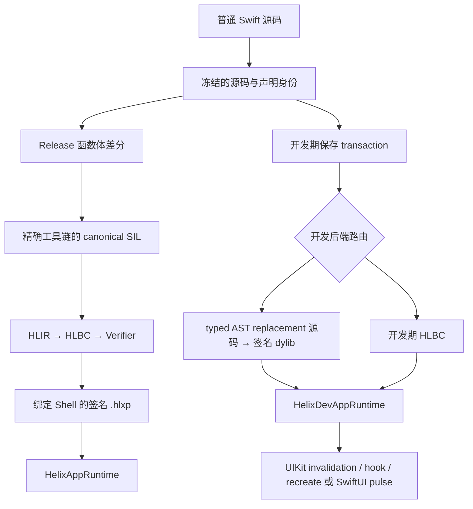

# Helix 总体架构

[English](Architecture.md)

Helix 的核心思路只有一套：工程师修改普通 Swift 源码；但生产热补丁与开发期热重载必须使用不同的产物、信任边界和生命周期。它们共享编译器事实与身份合同，不共享下发通道。

本文描述截至 2026 年 8 月 10 日仓库中已经存在的实现，不把尚未完成的资格验证写成产品承诺。

## 两条工作流

| 工作流 | 产物 | 执行方式 | 生命周期 | 用途 |
| --- | --- | --- | --- | --- |
| 生产热补丁 | 内含 HLBC 的签名 `.hlxp` | App 内预装的 Verifier 与 HLVM | 可持久化、可回滚的 generation | 处理已发布 Shell 中的线上缺陷 |
| 开发期热重载 | 会话绑定的原生 dylib 或 HLBC live artifact | Swift Dynamic Replacement 或开发期 HLVM 路径 | 仅当前 Debug 进程 | 保存函数体后刷新正在运行的页面 |

生产路径不会下载 Swift 源码或原生机器码。开发路径可以加载刚编译并签名的 dylib，但只能通过认证 Dev Session 进入 Dev Shell。这一隔离是架构边界，不是一个可随意切换的运行时开关。

## 共享合同

两条路径都依赖稳定且绑定具体构建的身份：

- `FunctionKey` 标识 Swift callable，并纳入 Helix 关心的 ABI 与 effect 信息。
- `EntryIndex` 是生产 Bridge 使用的紧凑 Shell 路由。
- `TypeID` 与 `NativeImportID` 标识预先声明的类型操作和原生调用能力，补丁中不保存进程地址。
- interface fingerprint 与传递 implementation fingerprint 用于区分函数体修改和 ABI、布局、源文件成员关系或依赖变化。
- 工具链、SDK、target triple、编译参数、module 源文件集合与二进制身份把每个产物绑定到对应 Shell。
- 不可变的 `Runtime.Generation` 保证一次激活涉及的所有路由原子可见；一次调用链会固定同一个 generation，避免在并发激活或回滚时看到混合状态。

这些身份有意绑定具体 build。Helix 不试图让不同 App 版本之间的私有 Swift ABI 自动兼容。

## Release 架构

接入 Helix 的 Release 构建会产出 App Shell 和 finalized interface archive。生成的 Derived Sources 建立永久动态入口与强类型原生 Bridge，不修改手写 Swift 文件。最终归档记录精确编译环境、源码身份、可补丁 root、签名、能力以及最终可执行文件身份。

发生缺陷时，补丁构建器在归档环境中重新类型检查完整 module，确认只有 eligible implementation 发生变化，把当前支持的 canonical SIL 子集降成 HLBC，执行独立验证，再对补丁包签名。App 在产物进入不可变存储或激活为 generation 前会重新完成设备侧验证。

随 App 安装的 Runtime 已包含字节码解码器、Verifier、HLVM、Bridge Catalog、包信任链、激活日志、Crash Guard 与回滚逻辑。生产补丁无法凭空新增 Shell 发布时不存在的原生能力。

完整流程见[生产热补丁](Production-Hot-Patching.zh-CN.md)。

## 开发期架构

Xcode 集成会从一次真实 Debug Build 中捕获 frontend、link、SDK、module、源码和签名事实。源码监控器把编辑器写入与原子 rename 整理成稳定、单调递增编号的快照。开发编译器在原 module 上下文中重新检查整个 transaction，并把所有变化 root 路由到同一个安全后端。

在已经验证的 Simulator Native 路径上，Helix 只提取已有 replacement root，使用 typed AST 的声明身份保持普通递归语义，生成 `@_dynamicReplacement` 源码，编译并签名一个唯一 dylib，然后把其字节传给 App。每个成功 generation 都是一个新 image，并不是持续向同一个动态库追加 Swift 文件。

Debug App 先激活代码，再刷新 UI。`ReloadIndex` 把变化 root 映射到存活的 UIKit 或 SwiftUI 边界。没有安全刷新策略时，Helix 会明确报告“代码已激活，但需要手动刷新”，不会猜测并重放任意生命周期方法。

从保存到页面变化的完整过程见[开发期热重载](Development-Live-Reload.zh-CN.md)。

## 构建与运行时隔离

App 只能链接一个聚合产品：

| App 配置 | 产品 | 是否包含开发加载器和传输能力 |
| --- | --- | --- |
| Release / Production | `HelixAppRuntime` | 否 |
| Debug / Dev Shell | `HelixDevAppRuntime` | 是 |

Release 审计会扫描最终 bundle，而不是信任 target 名称。生产 Runtime 拒绝开发 artifact，开发协议也不会把生产 campaign 当成旁路。构建侧 Compiler、Release、Daemon 与 CLI 模块不得进入 Release App。

## 当前资格边界

仓库目前包含可运行的受限 HLBC 生产客户端链，以及可运行的 Simulator Native Live Reload 链。后者已经在同一个 App 进程中验证两次修改和第三次恢复 baseline。Hot Patch Demo 还能把签名补丁模拟为一次本地下载，并走正常验签、安装、激活与回滚路径。

这些证据仍不代表 App Store 下发已经合规，不代表任意 Swift 语法、真实 iPhone Native 加载、连续 100 代 soak、大型业务 corpus 或外部 Registry/HSM/审批控制面已经完成。具体边界见[能力与限制](Capabilities-and-Limits.zh-CN.md)。
