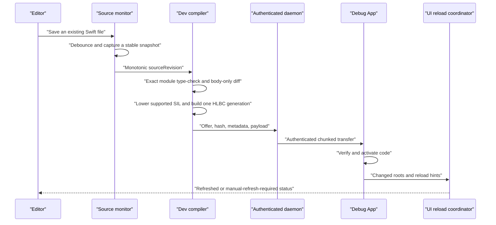

# Development Live Reload

[简体中文](Development-Live-Reload.zh-CN.md)

Helix Live Reload shortens the edit–run loop for an already running Debug App.
After the one-time Xcode integration and Dev Shell build, saving the body of an
eligible Swift declaration can compile a new generation, transfer it to a
Simulator or development device, activate it in the same process, and refresh
the affected UI.

This is a development feature. It is isolated from production packages, keys,
storage, and lifecycle.

The App does not compile or import generated Swift. The Feature target keeps
its original sources; an App build phase compiles Helix's generated Bridge into
a validated object under DerivedData and links it into the executable. A stable
C provider symbol lets `DevRuntime.ApplicationSession` discover the Build
Contract, Shell interface, Runtime factory, and Bridge installer automatically.

## Unified Helix service and launch modes

Live Reload no longer creates a daemon per Xcode Run and does not use a custom
LLDB init, LLDB Python, launch environment, injected secret, or direct host
setting. The macOS Helix application owns one `_helix._tcp` service. It can also
adopt an already running `helix hub run` process through the same owner-only
control interface; the GUI never terminates a service it does not own.

The Xcode lifecycle carries identity instead of credentials:

1. The Scheme Build pre-action asks the service to reserve a one-time
   invitation for this profile.
2. The hidden Bridge object embeds that invitation plus the public pin of the
   persistent Helix Host Identity. No session secret is written to the project
   or App environment.
3. After the App is linked, the Scheme Run pre-action registers the exact
   executable UUID and complete Build Context, then binds the reservation to
   that final Shell.
4. Xcode launches the App with the normal Apple debugger. At process startup,
   `DevRuntime.LaunchMode.current()` uses Darwin `sysctl` and `P_TRACED` once.
   A traced launch enters `automaticXcode`; failure to inspect the process
   fails closed into `manual`.
5. Automatic mode browses the single service, verifies the compiled Host pin,
   proves the exact App/Shell identity, and redeems the invitation over pinned
   TLS. The authenticated channel then carries source diagnostics, HLBC
   generations, activation results, and reconnect leases.

The decision is locked for the process lifetime. If the developer stops Xcode
and later opens the same installed build from the Home Screen, the new process
is manual: it does no Bonjour browsing and requests no local-network access
until the developer enters the four-character code shown by Helix and confirms.
Attaching a debugger later cannot turn that process into automatic mode.

Codes are case-insensitive, contain four characters from
`ABCDEFGHJKMNPQRSTUVWXYZ23456789`, expire after two minutes by default, and are
single-use. Five failed attempts trigger the configured rate limit. A short
code is only a user-presence signal: the connection still requires the pinned
P-256 Host Identity, exact registered Build Context, TLS transcript, and App
process identity. A code cannot select a vaguely matching bundle ID.

Apps may present `DevRuntime.PairingView(session:)` from an existing debug menu
or call `ApplicationSession.connect(pairingCode:)` directly. Keep the
`ApplicationSession` strongly owned for the App process lifetime. A successful
manual pairing is intentionally not persisted across launches.

## Save-to-screen sequence



The monitor watches only source files frozen into the Dev Build Manifest.
Editor safe-save renames and in-place writes are debounced, and the snapshotter
requires two matching inode, size, modification-time, and content-hash reads.
Every transaction has a monotonically increasing `sourceRevision`; a slower old
compile or transfer cannot overwrite a newer accepted save.

Compilation failure, artifact verification failure, activation failure, or UI refresh failure
does not discard the last successful code generation. Code activation and UI
refresh are reported separately.

## How the HLBC generation is compiled

The first Debug build captures the real Swift frontend job, SDK, target,
module/source set, compiler arguments, and link context. `helix dev prepare`
replays compiler probes in isolated outputs and verifies that the captured job
can produce the canonical SIL facts required by the bytecode compiler. It does
not approximate the project's build settings.

For an accepted save transaction, Helix:

1. Captures one stable revision of every source in the frozen module context.
2. Re-type-checks that complete module and rejects interface, stored-layout,
   source-membership, dependency, or build-setting changes.
3. Uses declaration identities and implementation fingerprints to determine
   the changed eligible roots, then asks the captured Swift compiler for SIL.
4. Builds a closed call table. Patch-local functions take precedence, followed
   by eligible Shell `EntryIndex` routes and exact `NativeImportID` capabilities
   that the Dev Shell emitted at build time.
5. Lowers only the supported canonical SIL into typed HLIR and HLBC, then runs
   the independent structural and semantic verifier on the Mac.
6. Sends one immutable, session-bound live artifact. The App rechecks session,
   revision, target, Shell identity, hash, size, capabilities, and bytecode
   validity before atomically activating it.

No Swift compiler, linker, JIT, dylib, or source file is sent to or executed on
the iOS process. Release and development reuse the compiler/verifier/HLVM core,
but development artifacts are ephemeral and authenticated by a one-run Dev
Session rather than by the production package trust chain.

## Native calls, instance `self`, and recursion

HLBC cannot call an arbitrary Swift symbol merely because it exists in the
process. A call is accepted only when it resolves to a function in the same
bytecode image, an eligible Shell entry, or an exact NativeImport generated into
that Shell. Entry routes are preferred, so ordinary calls between patchable App
functions remain generation-aware; NativeImport is for a bounded API whose
native implementation must run outside HLVM.

This is also the execution split for standard-library APIs. Managed collection
algorithms use generic, verifier-visible HLBC semantic plans and callbacks; they
are not reimplemented as one opcode per source API. A concrete framework member
whose state belongs to the native runtime uses its exact measured NativeImport,
while a patch-local Swift implementation remains an ordinary same-image call.
Representation conversion, ownership, effects, re-entrancy, and resource
budgeting are therefore checked at one of those explicit boundaries rather than
hidden behind a name-based native dispatch.

A Swift generic collection method is not a safe NativeImport shortcut. Its
physical ABI may carry concrete-type metadata, protocol witness tables,
specialization-dependent ownership, indirect results, and private reabstraction
details; its closure and collection values also do not share HLVM's runtime
representation. Those details are toolchain contracts rather than stable Shell
capabilities. NativeImport is therefore reserved for an exact generated bridge
or a stable native C/Objective-C-shaped operation, while supported Swift
Sequence APIs are recognized at the frontend and lowered onto a small set of
typed cursors, builders, mutations, and ordinary closure calls.

Scalar/text conversion uses the same boundary. The frontend's concrete and
generic ABI entry points for `Bool`, every represented signed or unsigned
fixed-width integer, `Float`, and `Double` parsing converge on one
type-directed `scalar_from_string` operation; integer radix formatting
converges on `integer_to_string`. StringProtocol inputs are accepted only when
their concrete representation is String or Substring. The verifier checks the
Optional target and every operand type, and the VM validates radix `2...36`,
charges input work, and reserves the maximum formatted output before calling
Swift's native parser or formatter as a private implementation leaf. This
reuses native standard-library behavior without exposing its generic ABI as a
NativeImport or multiplying operations by API, scalar type, or bit width.

Swift failure helpers are normalized at that boundary as well. The current
frontend forms behind `precondition`, `fatalError`, active assertions, and
`try!` become verified terminal control flow rather than calls to private Swift
runtime symbols. Static diagnostics use an ordinary trap; dynamic String or
represented Error details use one `source_failure` terminator. Direct
`assertionFailure` evaluates its autoclosure on the failing path, while
`Optional.unsafelyUnwrapped` reuses the generic Optional projection and nil
trap. Logical source-map coordinates supply the file and line without
serializing build-machine paths into the instruction.

Text follows that same split rather than receiving an API-shaped import table.
The compiler keeps String and the one-grapheme Character contract logically
distinct even though both use the compact HLBC String value, and normalizes
Substring to a Character Array. `string_characters` and the two verified
`string_join` modes are the only representation boundaries; count, traversal,
transforms, split, subsequences, relations, and joining then reuse existing
finite-Sequence plans. Character and Substring Shell codecs revalidate the
erased invariants. Element append, finite-Sequence `append(contentsOf:)`/`+=`,
edge/count removal, `popLast`, clearing, and capacity hints reuse one represented
`RangeReplaceableCollection` plan across String, Substring, Array, and normalized
Array-backed views. The plan validates concrete destination identity and
Sequence.Element, materializes only sources that need it, and preserves String
grapheme and collection ownership semantics; no Swift generic NativeImport or
API-specific opcode is introduced. `String.Index`, UTF views, and Foundation
text behavior stay fail-closed until their own semantics are represented
explicitly.

Payload-free `nil` values recover their wrapped type from verified bytecode
context, so the same Array/Dictionary builders, mutation/sort/split states, and
VM equality path work for every represented `Optional<T>` without a
type-specific adapter. Generic indirect results also use one compiler-address
sink, including whole elements and tuple fields inside an in-progress Array
literal.

A save may introduce a reachable ordinary top-level helper, private class
instance method, or computed accessor in an existing source file. It may also
introduce non-exported file/module-scope struct, enum, and pure class types used
by that graph. The compiler follows the direct same-module call graph, assigns
image-local function and qualified nominal IDs, verifies every signature,
ownership convention, and value shape, and ships the closed graph with the
changed Shell root. A pure class's reference identity and field storage belong
to HLVM; they are not dynamically registered Swift metadata.

A fully static, read-only `KeyPath` literal used as a function value is a
compile-time descriptor, not a new HLBC runtime value. Helix validates the
compiler-generated `swift_getAtKeyPath` thunk and its ownership skeleton, proves
the exact stored-property/getter chain, and replaces it with a typed,
zero-capture projection function. This covers composed patch-local struct/class
fields and concrete computed or SDK getters already available through the
normal same-image/NativeImport call table. The same projection CFG represents
static Optional chaining, force, and final wrapping, preserving both payload
ownership and nil traps. Dynamic KeyPath parameters, captured components such
as subscript indices, otherwise unproven components, and
writable/reference-writable mutation remain fail-closed; no KeyPath metadata
object enters the artifact.
For an imported Objective-C property descriptor, the generated concrete
accessor remains in the image while its physical framework call resolves to the
exact frozen NativeImport. Physical `NSString`/`Optional<NSString>` results are
accepted as `String` only when that Swift-typed boundary proves and performs the
bridge.

Local-class field initialization uses field-sensitive definite/possible-state
dataflow across aliases and control-flow joins. It does not treat
`end_init_ref` as a timestamp: a first write initializes empty storage, a
default-initialized field is assigned, and mutually exclusive initializer
branches are each classified from their incoming state.

When a new `final` class inherits an HLXI-frozen, `NSObject`-compatible project
or system type, Helix can register an Objective-C host under the closed hosted
profile and pass the object to UIKit as that superclass. The initial profile is
limited to inherited no-argument initialization, no new stored properties, and
no-argument/Bool `Void` overrides; native code cannot identify the patch's
concrete Swift type. This is a verified selector/ABI surface, not arbitrary IMP
or native-ABI injection.

Every new Dev Shell automatically includes the exact NativeImport for
`Swift.print(_:separator:terminator:)`, so adding
`print("value: \(value)", value)` to a supported body needs no App catalog setup. The
compiler lowers the variadic arguments into a VM-owned `Array<Any>` and links
the omitted separator/terminator as ordinary default-argument generators in
the same image. Fully concrete defaults on other functions use the same
mechanism; an ineligible affected caller or remaining generic metadata fails
the save transaction with a full-build diagnostic. Cross-module public/package
default changes also require a normal build because one module receipt cannot
prove that every precompiled caller was replaced.

A managed Debug Shell also audits public members for every module that
contributes an already-frozen imported native type. Helix reads the symbol graph
from the captured Swift toolchain and exact SDK, filters declarations against
the Shell minimum OS and declaration isolation, then sends generated probes
through the same typed AST and canonical SIL pipeline used for project source.
Only uniquely measured, Bridge-compatible initializers, synchronous instance or
static methods, and readable or writable properties become exact NativeImports.
This covers Swift and Objective-C APIs through one path, including
`UIColor.black`, `UIColor.init(white:alpha:)`, `UIView.isHidden`,
`UIView.alpha`, `UIView.setNeedsLayout()`,
`UIView.setAnimationsEnabled(_:)`, `URLCache.shared`, `Bundle.main`, and
`Bundle.path(forResource:ofType:)` when every boundary type is already frozen.
The logical Swift `throws` contract is also preserved for the canonical
Clang-importer `NSError **` bridge proven by the captured SIL, such as
`FileManager.removeItem(atPath:)`; an unfamiliar pointer, sentinel, cleanup, or
error-conversion shape fails closed. Swift-overlay names such as `Bundle` and
physical aliases such as `CGFloat` are resolved from compiler identity and
source evidence instead of guessed from Objective-C runtime spelling. This
bounded convenience surface is not added to production Shells, does not
introduce a new boundary type by itself, and never performs runtime selector or
symbol lookup.

For a supported source `class` instance method, the hidden Bridge carries
`self` as a frozen reference `TypeID`. Generated `NativeTypeOperations` retain,
identify, and validate the object without exposing a process pointer in HLBC.
This establishes the receiver path for class methods; individual property and
method operations still need a supported Shell entry or exact NativeImport.
The measured member path above supplies those exact imports for its proven
shapes. Async, generic or closure-bearing SDK members, subscripts, actor
executor hops, and any parameter/result shape outside the frozen Bridge surface
are not silently approximated and currently require a normal build.

Swift commonly spells a class receiver as `@guaranteed self` in SIL, while an
Entry/NativeImport Bridge owns each value that crosses the device boundary.
Helix preserves the physical SIL convention for call validation, then inserts a
typed VM copy only for that borrowed-to-owned boundary. Local same-image calls
still require an exact ownership ABI. This prevents a harmless borrow
convention from rejecting private instance helpers without weakening type,
effect, address, or capability checks.

The frontend may encode an Objective-C `super` dispatch with both an upcast for
the call ABI and a same-type `unchecked_ref_cast` as its lookup token. Helix
treats that second spelling as an alias only when both sides are the same frozen
reference `TypeID`; a cast between different frozen types remains rejected.

Imported Optional properties also produce address-form SIL when source code
compares or copies them. Helix tests such storage without consuming it, carries
the `.some` proof through an exact `copy_addr` in that case block, and unwraps
only the proven address. Sibling control-flow state stays independent, and an
unchecked payload take without a dominating `.some` edge fails closed.

Direct recursion resolves to the function in the same immutable HLBC image, so
an ordinary recursive Swift body remains ordinary recursion. A call chain pins
one runtime generation, preventing a concurrent save from mixing generations
halfway through the call. `LiveReload.previous` belongs to the explicit Native
Dynamic Replacement experiment and is not accepted by the default HLBC path;
restoring older behavior is done by another save or an explicit generation
rollback/tombstone, not by a hidden source-level call convention.

## Generations, transfer, and lifetime

Each successful transaction is one immutable bytecode generation. Helix does
not maintain a mutable dylib or append Swift files to an image. The daemon sends
an offer manifest and bounded HLBC bytes over the authenticated Dev Session;
the App verifies the complete artifact before activation. A baseline restore
may legitimately carry no bytecode and only remove inherited routes.

The default live HLBC payload limit is 16 MiB. Activation flattens inherited
routes into one immutable snapshot, so a lookup does not depend on keeping an
unbounded ancestry chain. By default the registry strongly retains the active
snapshot and its direct rollback predecessor. An older snapshot remains alive
only while an already-running call or an explicit diagnostic lease pins it; the
lease carries the resolved routes and verified images needed to finish safely.

Count and unique-artifact byte ceilings include these in-flight snapshots. If
all eviction candidates are pinned, activation fails transactionally and the
previous generation remains active; it does not evict a running call. Once the
lease is released, the next registry operation compacts that snapshot. A
separate process-wide high-water mark prevents a compacted generation ID from
being reused. Development generations are never installed in production patch
storage, and restarting the App returns to the Dev Shell baseline.

The checked-in soak activates 128 real verified HLBC generations, exercises a
failed save without changing the active generation, validates rollback and
invocation, and proves that only the active/direct-predecessor snapshots remain
strongly retained after compaction. This is deterministic in-process evidence;
long-duration real-device memory pressure and foreground/background cycling are
still qualification gates.

## Backend policy

`.automatic` and the public default select HLBC on both Simulator and device.
The router does not silently fall back to Native when bytecode lowering rejects
a transaction: it reports the exact unsupported construct and requires either a
supported edit or a normal build. This keeps behavior and source coverage
consistent across targets.

Native Dynamic Replacement remains an explicit internal experiment for Swift
compiler investigation and differential tests. It may still build and load a
dylib on a qualified environment, but it is never selected automatically and is
not the product Live Reload contract. The checked-in HLBC Simulator E2E is
passing; physical-iPhone qualification remains an outstanding evidence gate.

## Why code activation does not automatically redraw a page

Replacing a function changes future calls. It does not make UIKit call
`viewDidLoad`, `loadView`, or a previously completed initializer again. Helix
therefore treats UI update as a second, explicit phase.

`ReloadIndex` records changed source/type identities and hints. UIKit target
discovery is automatic; application code does not maintain a `typeRegistry`.
For each action, the coordinator reconstructs the compiler's stable nominal ID
from `String(reflecting:)`/Objective-C runtime class names, walks the concrete
class's superclass chain, and compares those IDs with the changed type IDs.

The instance search starts from foreground-active or foreground-inactive
`UIWindowScene` windows. It traverses root, presented, navigation, tab, split,
and child controller graphs, filters to visible loaded controllers by default,
and de-duplicates object identities. It matches controllers first. Only types
still unmatched cause a scan of the loaded UIView trees, which avoids paying a
full view-walk cost for the common controller case. A base-class edit therefore
refreshes a displayed subclass instance without registration.

Actions for all matching levels of one inheritance chain are merged once per
instance. Conflicting recreation factories fail explicitly instead of applying
an arbitrary rule. The unified coordinator also distinguishes “no displayed
UIKit instance” from an active matching SwiftUI boundary and emits one useful
warning rather than duplicate UIKit/SwiftUI warnings.

The four policies are:

- `observeOnly`: activate code without forcing UI work;
- `invalidate`: request constraints, layout, display, or explicitly permitted
  data-source invalidation;
- `invokeHook`: call an idempotent `LiveReload.Reloadable` hook implemented by
  the page or view;
- `recreate`: build a replacement controller through a registered factory and
  restore explicitly captured route and UI state.

Layout and drawing callbacks normally infer `invalidate`, so changing a
displayed UIViewController or UIView requires neither registration nor an App
hook. Constraint, layout, and display invalidation operate on the same object,
preserving navigation position and in-memory state. Immediate layout is skipped
while a controller transition is active. Broad `UITableView`/
`UICollectionView.reloadData()` remains disabled by default; a page should use
an explicit hook when data ownership or side effects require application logic.
Initialization callbacks may infer `invokeHook` or `recreate` because Helix
never directly replays arbitrary lifecycle methods. Factory registration is
therefore an advanced reconstruction mechanism, not normal setup.

For SwiftUI, wrap an injection boundary:

```swift
struct ProfileScreen: View {
    var body: some View {
        content
            .liveReloadBoundary(mode: .invalidateBody)
    }
}
```

`LiveReload.Pulse.shared` advances after activation. `invalidateBody` preserves
the existing identity tree where possible; `recreateSubtree` changes the
boundary identity and intentionally resets local `@State`. Boundaries can be
filtered by `NominalTypeID` so an unrelated edit does not refresh every SwiftUI
screen.

## Supported edits

The default workflow is designed for supported bodies of declarations already
in the Dev Shell. Original Swift access control is preserved, but lexical
visibility alone does not create a VM capability: every native operation must
also resolve through an eligible Entry or exact NativeImport. Supported local
closures and already indexed same-image helpers may use synchronous `@escaping`
parameters, internal closure returns, nested closure captures, and synchronous
throwing paths. Copyable linear captures such as frozen imported references are
accepted when their closure-body capture convention is borrowed; fully concrete
reabstraction thunks are linked into the image rather than treated as
NativeImports. Mutable captures use the same VM-managed cell for scalar,
collection, tuple, and patch-local struct storage, including Swift escape
boxes. Fully concrete Array, Dictionary, and Set values share verified closure
traversal for common `map`/`flatMap`/`compactMap`, reduction, visit, predicate,
`count(where:)`, and comparator-selection operations. Container-preserving
`filter` uses the same traversal for all three; Dictionary `mapValues` and `compactMapValues`
project their specialized value callback from each represented `(Key, Value)`
element, while `reduce(into:_:)` uses scoped inout accumulation. Represented
managed Collections and finite concrete progressions share one typed Sequence
strategy. Managed Array, Dictionary, and Set share direct `count`, `isEmpty`,
and `first` queries, while represented Array storage additionally supplies
`last`; normalized Array-backed views use the same query semantics. Equality
`contains(_:)`, natural extrema, and cross-source relations
drive its cursor directly, so short-circuiting and first-tie semantics do not
require an intermediate Array. `enumerated`, `Array(sequence)`, heterogeneous
`zip`, natural/comparator `sorted`, and `Set(sequence)` use the same typed
builder only when their result needs complete storage. Stable comparator
`sorted(by:)` accepts Array, Set, Dictionary, and supported finite-progression
elements through the same verified sort CFG. String and Array-backed sources
share short-circuiting Collection prefix/drop predicates and reverse `last`
searches; direct Sequence prefix also accepts supported finite progressions.
Mutating `sort(by:)` remains Array-only.
Finite integer ranges and supported numeric strides enter that same forward
closure traversal for Array-producing transforms, reductions, visits,
short-circuit predicates, and comparator selection. Equality membership,
natural extrema, and mixed-source Sequence relations also stream those
compiler-only typed bounds/stride values. Integer Range/ClosedRange `count`,
`isEmpty`, `first`, and `last` are constant-time bound operations with exact
full-width cardinality and checked `Int` overflow; represented Comparable Range
bounds also support `isEmpty`. Sorting, Set construction/algebra,
`Array(sequence)`, `enumerated`, `reversed`, and `zip` reuse the typed Array
builder when a complete stored or random-access representation is required.
Unbounded partial ranges, progression index results, other index-sensitive
Collection operations, and reverse predicate traversal fail closed rather than
acquiring guessed semantics.
Array `partition(by:)` and `removeAll(where:)` share a typed linear mutable
snapshot while their predicate calls remain ordinary verified CFG edges;
partition preserves Swift's low/high scan, removal preserves forward visits,
and both write back completed swaps if the predicate throws. Producing variants
use one linear element buffer
and a typed Array/Dictionary/Set finalizer, while
separator- and predicate-driven Array-backed `split` use one kind-checked
linear range state with exact `maxSplits`, empty-segment, and throwing-edge
semantics. Split subsequences are normalized by element sequence and therefore
do not preserve a source view's public index identity. Meanwhile,
supported Optional and Result payload transforms use the same selected-case
plan. Common Array structural edits—including nonmutating concatenation,
contents insertion, range replacement/removal, reversal, and swapping—are
supported for matching Array-backed sources and represented copyable elements.
Element append, `append(contentsOf:)`, `+=`, edge/count removal, `popLast`,
clearing, and capacity hints use the broader represented
`RangeReplaceableCollection` plan shared by String, Substring, Array, and
normalized Array-backed views. Contents append accepts any supported finite
represented Sequence whose canonical source-level Element identity and physical
shape match,
including Array-backed views, managed Set/Dictionary storage, String/Substring
Character sequences, and concrete progressions where the Swift constraint is
valid. Both paths are type-driven rather than special-cased for a framework
class. Reading physical
`Array.capacity` and requesting `randomElement()` remain rejected because those
storage and randomness policies are not represented. Dictionary default lookup
invokes its autoclosure only for a missing key. Its scoped `_modify` and Array
element `_modify` share frame-backed lending and write back on normal `end_apply` and
throwing `abort_apply`, including nested collections and imported references.
Dictionary merging, mutating merge, uniquing construction, and grouping share
one typed linear accumulator and the ordinary closure CFG. These operations
therefore preserve duplicate-only combining, traversal order, partial mutating
writeback on error, and imported-reference ownership without a per-API opcode
or a Swift-standard-library NativeImport.
Tuple labels are likewise treated as compile-time structure: if the frontend
expresses label erasure with an Array or Dictionary cast helper, Helix removes
the call only after proving that the source types differ solely by those
labels and both recursively normalized managed types are identical. A real
collection element conversion still fails closed.
Natural `sorted()` is available across represented managed Collections and
supported finite progressions whose elements are VM-comparable scalars;
mutating `sort()` remains Array-only.
Mutating ordering commits only on its normal continuation, so a throwing
callback leaves the original Array unchanged.
Multi-branch local initialization
uses field-sensitive definite/possible state, so conditional replacement and
cleanup are supported while reads remain fail-closed until every field is
definitely initialized. Physical `@in` and `@inout` conventions drive storage
effects for every supported call, and Optional payload projection distinguishes
read, consume, and mutation before rebuilding nested represented values; these
rules are type- and ABI-driven rather than UIKit-specific. Ordinary nonthrowing
mutating helpers use verified temporary address storage when their receiver is
a compiler-only projection. Frame/runtime-backed inout helpers and closures may
throw because their access scopes close on both continuations; overlapping or
throwing compiler-only projections without symmetric writeback still fail
closed. The closure cannot cross the Shell/Native boundary or survive the
current pinned VM invocation.

The current generator collects reachable ordinary functions, private class
instance methods, computed accessors, and their non-exported patch-local types
when they are added to an existing watched source file. Patch-local
nonrecursive structs and enums may be newly declared at file/module scope and
may contain supported stored fields, instance/static computed accessors, and
mutating helpers. A pure `final class` supports reference identity, stored
fields, private/ordinary methods, and computed accessors. These types cannot
cross a Shell Entry, NativeImport, generation, or native-storage boundary; the
one exception is a verifier-approved hosted-class projection to its frozen
superclass. A type declared inside a function has
no stable declaration identity in Helix's current textual SIL contract and is
rejected with its exact type name; move it to file/module scope instead.

An unrelated declaration is not collected merely because it exists, and this
feature does not add source files or native ABI. Changes to an existing native
stored layout, signature, generic constraint, isolation, superclass,
conformance, enum cases, source membership, build settings, macro/plugin input,
linked dependency, asset, storyboard, or generated resource still require a
normal build and, where applicable, reinstall.

See [Capabilities and Limits](Capabilities-and-Limits.md) for the comparison
with production HLBC.

## Debugging and diagnostics

HLBC has no native dSYM because it is verified bytecode rather than a Mach-O
image. Compiler debug metadata is lowered to a verified map from
function/block/instruction coordinates to logical Swift file, line, and column.
Host absolute paths are removed from production artifacts. The disassembler
annotates instructions from this map; on a trap the VM emits its exact program
counter, and Runtime adds the pinned generation, Shell entry, function name, and
logical source location.

The terminal and Debug overlay report source revision, generation, backend,
activation result, UI refresh result, whether old code remains active, and the
next action. A failed save is not presented as a successful reload. Interactive
HLBC breakpoints, stepping, and expression evaluation remain future work; the
explicit Native experiment retains its separate dSYM tooling.

Compiler and rebuild diagnostics cross the same authenticated Dev channel as
the generation. The App therefore leaves `Compiling` and presents the failure
even when no payload can be produced; error events expand the panel so the next
action is visible. The collapsed pill stays on one line, may be dragged by its
pill within the current scene's safe area, and keeps its top-right anchor when
expanded or collapsed. By default it animates away after five seconds without
a new status event and animates back on the next event. Keep it persistent with:

```swift
let environment = DevRuntime.LiveReloadEnvironment(
    overlayConfiguration: .init(
        startsExpanded: false,
        automaticallyHides: false
    )
)
```
