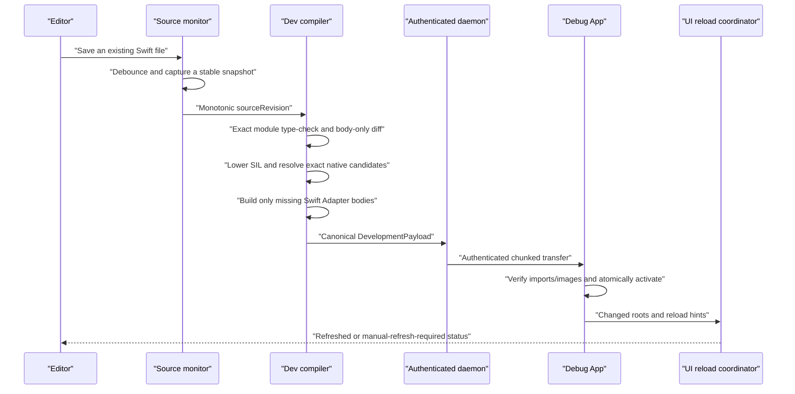

# Development Live Reload

[简体中文](Development-Live-Reload.zh-CN.md)

Helix Live Reload shortens the edit–run loop for an already running development
App. After Hub enables the project and Xcode completes one normal Run, saving a
supported Swift implementation can compile a new generation, transfer it to a
Simulator or development device, activate it in the same process, and refresh
the affected UI.

This is a development feature. It is isolated from production packages, keys,
storage, and lifecycle.

The App target keeps its original sources. It may also be the source target;
extracting a Feature framework is unnecessary. Hub links the package, installs
a configuration-scoped compiler proxy, compiles generated Bridge and bootstrap
objects under DerivedData, and starts dynamic `HelixDevSupport` automatically.
Application source imports no generated Swift and creates no
`ApplicationSession`.

## Unified Helix service and launch modes

Live Reload no longer creates a daemon per Xcode Run and does not use a custom
LLDB init, LLDB Python, launch environment, injected secret, or direct host
setting. The macOS Helix application owns one `_helix._tcp` service. It can also
adopt an already running `helix hub run` process through the same owner-only
control interface; the GUI never terminates a service it does not own.

The Xcode lifecycle carries identity instead of credentials:

1. The selected source target's ordinary Sources phase compiles its current
   membership through a transparent configuration-scoped proxy. After the real
   compiler succeeds, Helix validates that exact invocation, generates the
   Shell and Bridge, and asks the service to reserve a one-time invitation.
   Adding, deleting, moving, or generating a Swift source requires no Helix
   file-list update.
   The validated module receipt, SDK symbol graphs, and individual declaration
   probes are content-addressed local build facts. An unchanged build reuses
   them automatically. The final Prepare state is deliberately regenerated so
   that every build receives a fresh single-use Hub invitation; no project
   cache configuration or API allowlist is required.
2. The hidden Bridge object embeds that invitation plus the public pin of the
   persistent Helix Host Identity. No session secret is written to the project
   or App environment.
3. After the App is linked, the Scheme Run pre-action registers the exact
   executable UUID and complete Build Context, then binds the reservation to
   that final Shell.
4. Xcode launches the App with the normal Apple debugger. The hidden bootstrap
   starts `HelixDevSupport`; at process startup, `DevRuntime.LaunchMode.current()`
   uses Darwin `sysctl` and `P_TRACED` once. A traced launch enters
   `automaticXcode`; failure to inspect the process fails closed into `manual`.
5. Automatic mode browses the single service, verifies the compiled Host pin,
   proves the exact App/Shell identity, and redeems the invitation over pinned
   TLS. The authenticated channel then carries source diagnostics, HLBC
   generations, activation results, and reconnect leases.

The persistent Build Context registry is reconstructible development state, not
a compatibility database. If its owner-only regular file cannot be decoded or
validated by the current build, Hub moves it aside for diagnosis and starts
with an empty registry; the next normal Xcode build republishes current
contexts. A symbolic link, broad permissions, or another insecure filesystem
shape still prevents startup instead of being silently replaced.

The decision is fixed for the process lifetime. If the developer stops Xcode
and later opens the same installed build from the Home Screen, the new process
is manual: it does no Bonjour browsing and requests no local-network access
until the developer enters the four-character code shown by Helix and confirms.
Attaching a debugger later cannot turn that process into automatic mode.

Codes are case-insensitive, contain four characters from
`ABCDEFGHJKMNPQRSTUVWXYZ23456789`, expire after two minutes by default, and are
single-use. Five failed attempts trigger the configured rate limit. A short
code is only a user-presence signal: the connection still requires the pinned
P-256 Host Identity, exact registered Build Context, TLS transcript, and App
process identity. A code cannot select a vaguely matching bundle ID.

The automatically installed development overlay provides the manual pairing
surface and process-lifetime session ownership. Advanced products may still
present `DevRuntime.PairingView(session:)` or call
`ApplicationSession.connect(pairingCode:)` from a custom debug UI, but ordinary
integration does neither. A successful manual pairing is intentionally not
persisted across launches.

## Save-to-screen sequence



The monitor watches the exact source membership that Xcode captured
automatically in the current Dev Build Manifest. Adding, deleting, moving, or
generating a target source needs an ordinary Xcode build so Xcode can publish
the new membership; it never requires a Helix source list or configuration.
Editor safe-save renames and in-place writes are debounced, and the snapshotter
requires two matching inode, size, modification-time, and content-hash reads.
Every transaction has a monotonically increasing `sourceRevision`; a slower old
compile or transfer cannot overwrite a newer accepted save.

Compilation failure, artifact verification failure, activation failure, or UI refresh failure
does not discard the last successful code generation. Code activation and UI
refresh are reported separately.

## How the HLBC generation is compiled

The first Debug build captures the real Swift frontend job, SDK, target,
module/source set, compiler arguments, and link context. `helix dev prepare`
replays compiler probes in isolated outputs and verifies that the captured job
can produce the canonical SIL facts required by the bytecode compiler. It does
not approximate the project's build settings.

For an accepted save transaction, Helix:

1. Captures one stable revision of every source in the current module build context.
2. Re-type-checks that complete module and rejects interface, stored-layout,
   source-membership, dependency, or build-setting changes.
3. Uses declaration identities and implementation fingerprints to determine
   the changed eligible roots, then asks the captured Swift compiler for SIL.
4. Builds a closed call table. Patch-local functions take precedence, followed
   by eligible Shell `EntryIndex` routes, the Shell's linked native imports, and
   exact dormant candidates from the authenticated Build Receipt. First-use
   candidates receive deterministic session-local IDs after the linked prefix;
   the Shell interface hash does not change. `NativeImportID` remains only a
   compact dispatch slot, never authority.
5. Lowers only supported canonical SIL into typed HLIR and HLBC, runs the
   independent verifier, then inspects the produced import table. Objective-C
   and supported C candidates use their common Runtime invokers. Only a missing
   pure-Swift candidate causes Hub to compile its exact Adapter body, using the
   captured compiler job and the content-addressed Adapter cache.
6. Frames HLBC, promoted imports, Adapter image descriptors, hashes, and image
   bytes as one canonical version-1 `DevelopmentPayload`, then sends it over the
   authenticated session.
7. The App rechecks session/revision, compiler and SDK identity, target, Shell
   identity, every Descriptor/Key, Mach-O identity/signature/dependencies, size,
   capabilities, and bytecode. It constructs one immutable native-capability
   snapshot and only then atomically publishes the generation.

No Swift compiler, linker, JIT, or source file is sent to or executed in the
App process. A qualified Simulator or macOS development process may receive a
signed, exact on-demand Swift Adapter image; physical iOS rejects that image
path and asks for a normal rebuild. Release and development reuse the
compiler/verifier/HLVM core, but development artifacts are ephemeral and
authenticated by a one-run Dev Session rather than the production package
trust chain. Raw HLBC is not a development transport, even when no Adapter is
needed.

## Native calls, instance `self`, and recursion

HLBC cannot call an arbitrary Swift symbol merely because it exists in the
process. A call is accepted only when it resolves to a function in the same
bytecode image, an eligible Shell entry, a linked exact NativeImport, or an exact
Build-Receipt candidate promoted by the authenticated development transaction.
Entry routes are preferred, so ordinary calls between patchable App functions
remain generation-aware; NativeImport is for a bounded API whose native
implementation must run outside HLVM. Patch bytes cannot name a new selector,
C symbol, Swift symbol, ABI, or process address.

This is also the execution split for standard-library APIs. Managed collection
algorithms use generic, verifier-visible HLBC semantic plans and callbacks; they
are not reimplemented as one opcode per source API. A concrete framework member
whose state belongs to the native runtime uses its exact measured NativeImport,
while a patch-local Swift implementation remains an ordinary same-image call.
Representation conversion, ownership, effects, re-entrancy, and resource
budgeting are therefore checked at one of those explicit boundaries rather than
hidden behind a name-based native dispatch.

Sequential async execution follows the same split. A fully concrete
`async`/`async throws` root may contain multiple suspension points, call exact
patch-local async functions, and call exact generated async NativeImports. Its
permanent Shell bridge is an exact hashed source-body wrapper: it chooses the
lexical original before any possible suspension when no route exists, or pins
one immutable generation and one-shot dispatch plan for the complete resumed
call. `nonisolated` and `MainActor` resume semantics, cancellation checkpoints,
declared errors, and deterministic cleanup are preserved. Task creation,
`async let`, task groups, continuations, async closure values, AsyncSequence,
TaskLocal, custom actors/global actors, and live `inout`/address access across a
suspension remain fail-closed.

Hub derives NativeImport discovery scope, access effects, actor restrictions,
and synchronous/suspending deadlines from the selected workflow and the exact
compiler evidence. Normal projects do not write a NativeImport YAML document
or declaration allowlist. Internally the generated contract still distinguishes
`pure`, `read`, and `read-write`, clamps non-MainActor synchronous calls to the
short bounded deadline, and gives suspending calls a separate continuous
deadline. A larger deadline never authorizes a broader effect. Explicit policy
documents remain a lower-level standalone compiler interface, not Xcode
onboarding.

A Swift generic collection method is not a safe NativeImport shortcut. Its
physical ABI may carry concrete-type metadata, protocol witness tables,
specialization-dependent ownership, indirect results, and private reabstraction
details; its closure and collection values also do not share HLVM's runtime
representation. Those details are toolchain contracts rather than stable Shell
capabilities. NativeImport is therefore reserved for an exact generated bridge,
a stable native C/Objective-C-shaped operation, or a fixed represented adapter
around a native semantic leaf. The last category must erase every generic
parameter before dispatch and must be independently type-, effect-, and
resource-checked. Supported Swift Sequence APIs are instead recognized at the
frontend and lowered onto a small set of typed cursors, builders, mutations,
and ordinary closure calls.

VM-owned `Any` follows the same split. Erasure and dynamic-cast instructions
carry a closed recursive logical type descriptor separately from the physical
HLBC register shape. The verifier proves descriptor/storage agreement, and the
VM validates recursive payload invariants, depth, allocation, and traversal
fuel. This preserves distinctions such as `Int` versus `Int64`, Character
versus String, Substring versus Array, ArraySlice versus Array, and their nested
Optional/Array/Dictionary/Set/tuple occurrences without serializing Swift
metadata or calling a generic cast through NativeImport. At a Swift Shell
boundary, recursively composed concrete codecs materialize the supported
scalar, text, Optional, Array, Dictionary, and Set family; shapes that cannot
be reconstructed exactly remain fail-closed.

`String(describing:)` and `String(reflecting:)` are the concrete native-leaf
case. The frontend recognizes their generic SIL entry but never dispatches that
physical ABI. It proves the represented source type is Shell-materializable,
erases it to VM-owned `Any`, and calls a fixed `Any -> String` NativeImport.
`debugPrint` uses the already-concrete `[Any], String, String -> Void` ABI.
Mutually exclusive writes into one existential Array-literal element are
merged as typed HLBC block arguments before finalization, so Optional
coalescing and equivalent control flow do not depend on textual block order.
All four rendering operations share a 64 KiB bound; ArraySlice, tuple,
patch-local, native-object, and closure payloads are rejected by compiler proof
or the boundary codec before the Swift formatter or I/O executes.

Scalar/text conversion uses the same boundary. The frontend's concrete and
generic ABI entry points for `Bool`, every represented signed or unsigned
fixed-width integer, `Float`, and `Double` parsing converge on one
type-directed `scalar_from_string` operation; integer radix formatting
converges on `integer_to_string`. StringProtocol inputs are accepted only when
their concrete representation is String or Substring. The verifier checks the
Optional target and every operand type, and the VM validates radix `2...36`,
charges input work, and reserves the maximum formatted output before calling
Swift's native parser or formatter as a private implementation leaf. This
reuses native standard-library behavior without exposing its generic ABI as a
NativeImport or multiplying operations by API, scalar type, or bit width.

Swift failure helpers are normalized at that boundary as well. The current
frontend forms behind `precondition`, `fatalError`, active assertions, and
`try!` become verified terminal control flow rather than calls to private Swift
runtime symbols. Static diagnostics use an ordinary trap; dynamic String or
represented Error details, including bounded identities for concrete
`throws(Failure)` errors, use one `source_failure` terminator. Direct
`assertionFailure` evaluates its autoclosure on the failing path, while
`Optional.unsafelyUnwrapped` reuses the generic Optional projection and nil
trap. Logical source-map coordinates supply the file and line without
serializing build-machine paths into the instruction.

Text follows that same split rather than receiving an API-shaped import table.
The compiler keeps String and the one-grapheme Character contract logically
distinct even though both use the compact HLBC String value, and normalizes
Substring to a Character Array. `string_characters` and the two verified
`string_join` modes are the only representation boundaries; count, traversal,
transforms, split, subsequences, relations, and joining then reuse existing
finite-Sequence plans. Character and Substring Shell codecs revalidate the
erased invariants. Element append, finite-Sequence `append(contentsOf:)`/`+=`,
edge/count removal, `popLast`, clearing, and capacity hints reuse one represented
`RangeReplaceableCollection` plan across String, Substring, Array, and normalized
Array-backed views. The plan validates concrete destination identity and
Sequence.Element, materializes only sources that need it, and preserves String
grapheme and collection ownership semantics; no Swift generic NativeImport or
API-specific opcode is introduced. `String.Index`, UTF views, and Foundation
text behavior stay fail-closed until their own semantics are represented
explicitly.

Payload-free `nil` values recover their wrapped type from verified bytecode
context, so the same Array/Dictionary builders, mutation/sort/split states, and
VM equality path work for every represented `Optional<T>` without a
type-specific adapter. Generic indirect results also use one compiler-address
sink, including whole elements and tuple fields inside an in-progress Array
literal.

A save may introduce a reachable ordinary top-level helper, private class
instance method, or computed accessor in an existing source file. It may also
introduce non-exported file/module-scope struct, enum, and pure class types used
by that graph. The compiler follows the direct same-module call graph, assigns
image-local function and qualified nominal IDs, verifies every signature,
ownership convention, and value shape, and ships the closed graph with the
changed Shell root. A pure class's reference identity and field storage belong
to HLVM; they are not dynamically registered Swift metadata.

A fully static, read-only `KeyPath` literal used as a function value is a
compile-time descriptor, not a new HLBC runtime value. Helix validates the
compiler-generated `swift_getAtKeyPath` thunk and its ownership skeleton, proves
the exact stored-property/getter chain, and replaces it with a typed,
zero-capture projection function. This covers composed patch-local struct/class
fields and concrete computed or SDK getters already available through the
normal same-image/NativeImport call table. The same projection CFG represents
static Optional chaining, force, and final wrapping, preserving both payload
ownership and nil traps. Dynamic KeyPath parameters, captured components such
as subscript indices, otherwise unproven components, and
writable/reference-writable mutation remain fail-closed; no KeyPath metadata
object enters the artifact.
For an imported Objective-C property descriptor, the generated concrete
accessor remains in the image while its physical framework call resolves to the
exact captured NativeImport. Physical `NSString`/`Optional<NSString>` results are
accepted as `String` only when that Swift-typed boundary proves and performs the
bridge. When the compiler carries that physical bridge through a basic-block
parameter, Helix derives the logical parameter type from every incoming edge,
requires all predecessors to agree, and then validates the printed Objective-C
type against that exact logical bridge. This covers ordinary ternary and
Optional-expression joins without admitting an arbitrary foreign type.

Local-class field initialization uses field-sensitive definite/possible-state
dataflow across aliases and control-flow joins. It does not treat
`end_init_ref` as a timestamp: a first write initializes empty storage, a
default-initialized field is assigned, and mutually exclusive initializer
branches are each classified from their incoming state.

When a new `final` class inherits an HLXI-captured, `NSObject`-compatible project
or system type, Helix can register an Objective-C host under the closed hosted
profile and pass the object to UIKit as that superclass. The initial profile is
limited to inherited no-argument initialization, no new stored properties, and
no-argument/Bool `Void` overrides; native code cannot identify the patch's
concrete Swift type. This is a verified selector/ABI surface, not arbitrary IMP
or native-ABI injection.

Every new Dev Shell automatically includes the exact NativeImports for
`Swift.print`, `Swift.debugPrint`, `String(describing:)`, and
`String(reflecting:)`, so adding those operations to a supported body needs no
App catalog setup. The compiler lowers variadic arguments into VM-owned
`Array<Any>`, links omitted separator/terminator values as ordinary
default-argument generators, and applies the fixed `Any` adapter for the two
generic String initializers. Fully concrete defaults on other functions use the
same mechanism; an ineligible affected caller or remaining generic metadata
fails the save transaction with a full-build diagnostic. Cross-module
public/package default changes also require a normal build because one module
receipt cannot prove that every precompiled caller was replaced.

A managed development Shell also audits public members for every module that
contributes an imported native type proven by the current App build. Helix reads the symbol graph
from the captured Swift toolchain and exact SDK. The extractor receives only
the captured module-loading/search arguments it supports; source-only flags
such as compilation conditions and frontend transforms remain on the typed
AST/SIL path. Helix filters declarations against
the Shell minimum OS and declaration isolation, excludes deprecated or
unavailable declarations, then sends generated probes
through the same typed AST and canonical SIL pipeline used for project source.
Only uniquely measured, Bridge-compatible synchronous initializers, instance
or static methods, and readable or writable properties become exact Catalog
candidates. Calls already used by the baseline become linked NativeImports;
unused candidates remain data-only records in the authenticated Build Receipt.
When such a declaration has a compiler-proven Objective-C ABI in the supported
matrix, its exact NativeImport is a compact descriptor bound to the shared
Objective-C invoker; no selector-specific Swift wrapper is emitted. Exact Swift
adapters remain for representable overlays and ABI shapes that cannot use that
generic boundary. Baseline-used adapters are grouped into deterministic
per-module Packs; a dormant Swift candidate is compiled and cached only if a
later HLBC generation actually imports it. A proven C function uses the
restricted common C invoker when its exact ABI fits the AOT matrix. A linked
baseline import uses the Bridge-bound declaration address; an authenticated
first-use development candidate resolves only the Descriptor-fixed entry point
from the current linked process. Neither path accepts a caller-selected symbol.
The symbol-graph function signature is aligned with the full declaration before
probing. Helix recovers only declaration-level `@escaping` and `@autoclosure`
markers that the signature view is permitted to omit; any other missing
attribute remains ineligible. For a concrete SDK generic specialization already
proven by the build, the probe substitutes the owner's generic parameters and
records only that concrete member ABI. The unspecialized owner spelling is deliberately
not installed as an alias of multiple specializations.
This covers Swift and Objective-C APIs through one path, including
`UIColor.black`, `UIColor.init(white:alpha:)`, `UIView.isHidden`,
`UIView.alpha`, `UIView.setNeedsLayout()`,
`UIView.setAnimationsEnabled(_:)`, `UIView.performWithoutAnimation(_:)`,
`UIView.animate(withDuration:animations:completion:)`,
`UIButton.configurationUpdateHandler`, concrete
`NSLayoutAnchor<NSLayoutXAxisAnchor>`/`NSLayoutAnchor<NSLayoutYAxisAnchor>`
members, `URLCache.shared`, `Bundle.main`, and
`Bundle.path(forResource:ofType:)` when every boundary type is already represented.
For a MainActor-isolated measured declaration, a non-Sendable callback retains
the enclosing MainActor restriction even when the printed SDK typealias omits
it; an explicitly `@Sendable` callback keeps its own declared executor
contract. The exact frontend probe remains authoritative for the final ABI.
For each such imported SDK type, Helix also nominates the exact zero-argument
`Type()` expression even when an inherited or importer-synthesized initializer
is absent from the symbol graph. It becomes a NativeImport only when the same
frontend probe proves that exact call and ABI, so types that require arguments
remain unavailable.
The logical Swift `throws` contract is also preserved for the canonical
Clang-importer `NSError **` bridge proven by the captured SIL, such as
`FileManager.removeItem(atPath:)`; an unfamiliar pointer, sentinel, cleanup, or
error-conversion shape fails closed. Swift-overlay names such as `Bundle` and
physical aliases such as `CGFloat` are resolved from compiler identity and
source evidence instead of guessed from Objective-C runtime spelling. Those
compiler-proven Swift/SIL spellings are retained as server-side aliases of the
same compiler-proven native identity for later patch compilation; ambiguous aliases are
omitted and none enter the device interface. Symbol-graph implicitly unwrapped
optionals such as `UIViewController.view: UIView!` remain valid probe syntax
and are measured by the frontend as their exact Optional ABI instead of being
dropped before compilation. This
source boundary still ignores inherited implicit constructors that the frontend
synthesizes for a project subclass; beyond the separately proven zero-argument
SDK-type construction above, inherited `Bundle`/`Coder` parameters do not enter
the generated interface merely because a superclass declares them. A compiler-proven
Objective-C protocol parameter keeps the v1 `AnyObject` logical boundary
identity while its physical descriptor retains the exact protocol existential.
The generic invoker checks runtime conformance before dispatch, inside
`MainActor` when the operation is actor-isolated. Plain `Any` and `AnyObject`
are not inferred to be protocols. Development keeps unused qualified candidates
as data-only Receipt records and promotes them only when one save first uses
them. Release uses the same measured surface with the managed production policy
and emits every qualified candidate into its immutable Native Capability
Manifest. Neither policy introduces a new boundary type by itself. Runtime
lookup is restricted to the descriptor's exact class and selector; patch code
cannot provide or compose either string.

For a supported source `class` instance method, the hidden Bridge carries
`self` as the build-captured reference `TypeID`. Statically generated TypeOps
for project classes, or the shared data-driven TypeOps path for compiler-proven
Objective-C classes, retain, identify, and validate the object without exposing
a process pointer in HLBC.
This establishes the receiver path for class methods; individual property and
method operations still need a supported Shell entry or exact NativeImport.
The measured member path above supplies those exact imports for its proven
shapes. Async or unspecialized/open generic SDK members, closure-bearing members
outside the exact synchronous callback profile, subscripts, unsupported actor
executor hops, and any
parameter/result shape outside the captured Bridge surface are not silently
approximated and currently require a normal build. Suspending NativeImports in
this stage come from exact project-source discovery or an explicit catalog;
the managed SDK measurement path does not infer async declarations or convert
completion handlers.

Swift commonly spells a class receiver as `@guaranteed self` in SIL. Each
captured Entry or NativeImport descriptor independently records whether a value
crosses that boundary as owned or borrowed. Helix preserves the physical SIL
convention for call validation: borrowed-to-borrowed values pass through,
while borrowed-to-owned values receive one typed VM copy. An owned physical
value cannot satisfy a borrowed boundary because that would erase the
source-level consume. Local same-image calls still require an exact ownership
ABI. This prevents a harmless borrow convention from rejecting private
instance helpers without weakening type, effect, address, or capability
checks.

The frontend may encode an Objective-C `super` dispatch with both an upcast for
the call ABI and a same-type `unchecked_ref_cast` as its lookup token. Helix
treats that second spelling as an alias only when both sides are the same captured
reference `TypeID`; a cast between different captured types remains rejected.

Imported Optional properties also produce address-form SIL when source code
compares or copies them. Helix tests such storage without consuming it, carries
the `.some` proof through an exact `copy_addr` in that case block, and unwraps
only the proven address. Sibling control-flow state stays independent, and an
unchecked payload take without a dominating `.some` edge fails closed.

Direct recursion resolves to the function in the same immutable HLBC image, so
an ordinary recursive Swift body remains ordinary recursion. A call chain pins
one runtime generation, preventing a concurrent save from mixing generations
halfway through the call. `LiveReload.previous` belongs to the explicit Native
Dynamic Replacement backend and is not portable to HLBC. Automatic routing may
select that backend on a qualified Simulator, but source intended to work on
both Simulator and device should restore older behavior with another save or an
explicit generation rollback/tombstone instead of depending on this
backend-specific call convention.

## Generations, transfer, and lifetime

Each successful transaction is one immutable development generation. On a
qualified Simulator build the payload is a newly compiled, signed native Swift
image; on a device or when native replacement is unavailable it is verified
HLBC, optionally accompanied by exact development Adapter images on qualified
Simulator/macOS targets. Helix never mutates an already loaded image. The
daemon sends an offer manifest and one bounded canonical payload over the
authenticated Dev Session, and the App validates the complete transaction
before activation. An HLBC baseline restore may legitimately carry no bytecode
and only remove inherited routes.

The default live HLBC payload limit is 16 MiB. Activation flattens inherited
routes into one immutable snapshot, so a lookup does not depend on keeping an
unbounded ancestry chain. By default the registry strongly retains the active
snapshot and its direct rollback predecessor. An older snapshot remains alive
only while an already-running call or an explicit diagnostic lease pins it; the
lease carries the resolved routes and verified images needed to finish safely.

Count and unique-artifact byte ceilings include these in-flight snapshots. If
all eviction candidates are pinned, activation fails transactionally and the
previous generation remains active; it does not evict a running call. Once the
lease is released, the next registry operation compacts that snapshot. A
separate process-wide high-water mark prevents a compacted generation ID from
being reused. Development generations are never installed in production patch
storage, and restarting the App returns to the Dev Shell baseline.

Every HLBC generation pins an immutable native-capability snapshot containing
the linked baseline plus development candidates already published by that
session. An escaping native callback lease retains that same snapshot, so a
later save cannot change what its callback may call. Development Adapter images
cannot be safely unloaded; their count and mapped bytes share the same
process-lifetime native-image budget as Dynamic Replacement generations. A
failed image load is never published. If loader state cannot be proven clean,
the App marks native state uncertain and rejects further image-bearing payloads
until restart. Reconnect identity reports the exact published
`NativeCallKey`-to-`NativeImportID` mapping, the independently published
development `TypeID` inventory, and mapped-image resource totals. Hub can
therefore preserve compact IDs already referenced by active HLBC and reuse the
existing session state.

Two saves may overlap while Hub is compiling the same first-use Swift Adapter.
If the earlier transaction publishes it first, the App treats the later,
descriptor-identical session import as an idempotent replay: it neither maps nor
charges the redundant image again, while any changed ID, key, descriptor, ABI,
contract, or binding still rejects the complete transaction. A payload that
mixes already-published and genuinely new imports loads only the images required
by the new imports before activating the new generation.

The checked-in soak activates 128 real verified HLBC generations, exercises a
failed save without changing the active generation, validates rollback and
invocation, and proves that only the active/direct-predecessor snapshots remain
strongly retained after compaction. This is deterministic in-process evidence;
long-duration real-device memory pressure and foreground/background cycling
still require qualification.

## Backend policy

`.automatic` is the generated and public default. A qualified iOS Simulator
prefers native Swift Dynamic Replacement, which preserves the compiler's normal
body semantics and avoids making HLBC syntax coverage the everyday reload
ceiling. If that backend is not prepared for every changed root, routing falls
back to verified HLBC. Physical-device builds continue to select HLBC unless a
separate device/native matrix has been explicitly qualified; production Hot
Patch never receives this development image-loading authority.

The checked-in Simulator E2E runs the same eight-update, five-scenario UIKit
workflow twice: once through automatic native routing and once with HLBC forced.
The forced run proves first use of a dormant pure-Swift SDK candidate, signed
on-demand Adapter loading, generation activation, and final source restoration
without reinstalling the Shell. Native images cannot be unloaded safely, so
count and mapped-byte limits remain process-lifetime resource bounds; the
diagnostic asks for an App restart before those bounds are exhausted. The
128-generation deterministic soak separately exercises the HLBC lifecycle.

## Why code activation does not automatically redraw a page

Replacing a function changes future calls. It does not make UIKit call
`viewDidLoad`, `loadView`, or a previously completed initializer again. Helix
therefore treats UI update as a second, explicit phase.

`ReloadIndex` records changed source/type identities and hints. UIKit target
discovery is automatic; application code does not maintain a `typeRegistry`.
For each action, the coordinator reconstructs the compiler's stable nominal ID
from `String(reflecting:)`/Objective-C runtime class names, walks the concrete
class's superclass chain, and compares those IDs with the changed type IDs.

The instance search starts from foreground-active or foreground-inactive
`UIWindowScene` windows. It traverses root, presented, navigation, tab, split,
and child controller graphs, filters to visible loaded controllers by default,
and de-duplicates object identities. It matches controllers first. Only types
still unmatched cause a scan of the loaded UIView trees, which avoids paying a
full view-walk cost for the common controller case. A base-class edit therefore
refreshes a displayed subclass instance without registration.

Actions for all matching levels of one inheritance chain are merged once per
instance. Conflicting recreation factories fail explicitly instead of applying
an arbitrary rule. The unified coordinator also distinguishes “no displayed
UIKit instance” from an active matching SwiftUI boundary and emits one useful
warning rather than duplicate UIKit/SwiftUI warnings.

The four policies are:

- `observeOnly`: activate code without forcing UI work;
- `invalidate`: request constraints, layout, display, or explicitly permitted
  data-source invalidation;
- `invokeHook`: call an idempotent `LiveReload.Reloadable` hook implemented by
  the page or view;
- `recreate`: build a replacement controller through a registered factory and
  restore explicitly captured route and UI state.

Layout and drawing callbacks normally infer `invalidate`, so changing a
displayed UIViewController or UIView requires neither registration nor an App
hook. Constraint, layout, and display invalidation operate on the same object,
preserving navigation position and in-memory state. Immediate layout is skipped
while a controller transition is active. Broad `UITableView`/
`UICollectionView.reloadData()` remains disabled by default; a page should use
an explicit hook when data ownership or side effects require application logic.
Initialization callbacks may infer `invokeHook` or `recreate` because Helix
never directly replays arbitrary lifecycle methods. Factory registration is
therefore an advanced reconstruction mechanism, not normal setup.

For SwiftUI, wrap an injection boundary:

```swift
struct ProfileScreen: View {
    var body: some View {
        content
            .liveReloadBoundary(mode: .invalidateBody)
    }
}
```

`LiveReload.Pulse.shared` advances after activation. `invalidateBody` preserves
the existing identity tree where possible; `recreateSubtree` changes the
boundary identity and intentionally resets local `@State`. Boundaries can be
filtered by `NominalTypeID` so an unrelated edit does not refresh every SwiftUI
screen.

## Supported edits

The default workflow is designed for supported bodies of declarations already
in the Dev Shell. Original Swift access control is preserved, but lexical
visibility alone does not create a VM capability: every native operation must
also resolve through an eligible Entry or exact NativeImport. Supported local
closures and already indexed same-image helpers may use synchronous `@escaping`
parameters, internal closure returns, nested closure captures, and synchronous
throwing paths. Concrete `throws(Failure)` channels remain exact through
nonescaping and escaping closure values, stored aggregates, concrete generic
forwarding, supported higher-order standard-library specializations, and catch
  continuations; `typed-throws-1` identifies and validates the patch-local
Error nominal, and only a concrete Swift reabstraction thunk may erase it to
`any Error`. This does not make typed-throws roots or throwing NativeImport
callbacks valid. Closure values may also flow through Optional, tuple, Array,
Dictionary, patch-local struct/enum/class fields, mutable callback variables,
and higher-order function signatures. This covers capture lists, recursive
callbacks, local/bound method references, multiple trailing closures,
autoclosures, operator/overload and unbound-method references, synchronous
`@MainActor` closure values, common closure-variable forms, and strong `self`
captures through one value model. A recursively called local helper can also
form a closure value without splitting its callable identity. On-stack
closures and `withoutActuallyEscaping` carry a verified dynamic lifetime;
`withExtendedLifetime` uses the ordinary synchronous closure-call model while
holding a type-generic anchor across both normal and typed-error exits. A
nonescaping closure may borrow caller-owned `inout` storage, but must close
before that modify access and cannot promote the borrow into an escaping
context. Direct-only closure and `defer` helpers keep their physical address ABI
instead of being mistaken for managed closure construction. Imported
free/global-function, bound instance-method, and initializer references can use
the same managed closure construction with a declared `NativeImportID`; native
receivers are ordinary captured suffixes and compiler-only metatypes are
erased. This is a target-category rule rather than an API-specific adapter. The
function-value route requires an identity argument
projection and a representation-preserving ABI adapter; default-argument call
variants remain direct-call-only. Copyable linear captures such as captured imported
references are copied into the managed context. Borrowed target parameters
reuse that value and owned target parameters receive a fresh, resource-charged
copy on every invocation; fully concrete
reabstraction thunks are linked into the image rather than treated as
NativeImports. Concrete same-image calls can also monomorphize source generic
closure helpers from semantic SIL, including direct, throwing, recursive,
rethrowing, returning, and escaping function-value forms; each concrete type
argument list receives a deterministic image target. Successive clauses prove
same-type, protocol, superclass/`AnyObject`, and dependent associated-type
requirements from exact frontend evidence. Represented standard values use
closed, toolchain-checked evidence only where Helix already executes the exact
semantics. In addition to `Sequence`/`Collection`, concrete generic helpers can
use common `Equatable`/`Comparable`, numeric, `Strideable`, literal,
description, and lossless-parsing requirements. Their exact witness references
become verifier-visible comparison, arithmetic, mutation, shift, fixed-width
bounds/bit/query/overflow operations, distance, conversion, or text operations;
compiler-only literal payloads are validated and erased before HLBC. Recursive
values contribute `Hashable` only as a closed
constraint for VM-defined hashing—Helix does not synthesize Swift `Hasher`
execution. Imported conformers are not inferred from native storage and still
need a concrete operation already captured as an exact NativeImport. Custom
values likewise do not inherit protocols from their storage shape. This also
covers constrained generic
extension methods, reachable concrete instances of file/module-scope generic
structs, enums, and final classes, and concrete opaque results—including outer-
generic and ordered multiple results—whose entry buffers reveal the underlying
type. This path does not invent runtime generic, opaque, or witness metadata. A
fully concrete patch-local conformance, including a conditional conformance
whose instantiated requirements recursively prove, can resolve one exact
witness to a static image thunk and form a bound method; unproven conditional,
open-world, missing, or ambiguous dispatch still fails closed. Immutable local
protocol existentials also use the conformance inventory when their complete,
nonconditional current-module conformer set is finite. Local
`any P`, compositions, inherited and class-bound requirements, erasure/opening,
closed narrowing or widening, bound methods, closure results, synchronous
throwing calls, and checked/forced protocol casts lower to exact represented
type sets and finite image-function tables. No Swift metadata or witness table
enters HLBC; the Verifier bounds each set to 4,096 cases and HLVM meters exact
lookup work. Such Swift existential values remain image-local and cannot cross
a Shell or ordinary NativeImport boundary; proven Objective-C `!foreign`
protocol erasure continues to cross as a captured native `AnyObject` reference.
Mutable existential opening/writeback remains rejected. Mutable captures use
the same VM-managed cell for scalar,
collection, tuple, and patch-local struct storage, including Swift escape
boxes. Safe `weak` and checked `unowned` capture lists and captured weak locals
use a second managed storage kind shared by patch-local and captured native
reference identities. Weak loads become `nil` after release; dead checked
unowned loads produce a controlled VM trap. The compiler's
`[inferred_immutable]` capture-box decoration is accepted only in its exact
known position and has no semantic effect; read-only Optional address
projections retire their detached payload owner before the parent stack storage
is released. Unknown box decorations and unbalanced payload ownership remain
fail-closed. `unowned(unsafe)` and weak/unowned
stored-property layouts remain rejected. Fully concrete Array, Dictionary, and Set values share verified closure
traversal for common `map`/`flatMap`/`compactMap`, reduction, visit, predicate,
`count(where:)`, and comparator-selection operations. Container-preserving
`filter` uses the same traversal for all three; Dictionary `mapValues` and `compactMapValues`
project their specialized value callback from each represented `(Key, Value)`
element, while `reduce(into:_:)` uses scoped inout accumulation. Represented
managed Collections and finite concrete progressions share one typed Sequence
strategy. Managed Array, Dictionary, and Set share direct `count`, exact
Collection `underestimatedCount`, `isEmpty`, and `first` queries, while
represented Array storage additionally supplies `last`; normalized
Array-backed views use the same query semantics. Zip retains the source
Sequence-witness estimate, including zero for represented enumerated and
flattened/joined inputs instead of substituting its materialized tuple count.
Equality
`contains(_:)`, natural extrema, and cross-source relations
drive its cursor directly, so short-circuiting and first-tie semantics do not
require an intermediate Array. `enumerated`, `Array(sequence)`, heterogeneous
`zip`, natural/comparator `sorted`, and `Set(sequence)` use the same typed
builder only when their result needs complete storage. Stable comparator
`sorted(by:)` accepts Array, Set, Dictionary, and supported finite-progression
elements through the same verified sort CFG. String and Array-backed sources
share short-circuiting Collection prefix/drop predicates and reverse `last`
searches; direct Sequence prefix also accepts supported finite progressions.
Mutating natural/comparator ordering accepts represented Array-backed mutable
collections whose canonical index model is integer-based. It preserves the
logical index base and commits comparator ordering only on normal completion.
Finite integer ranges and supported numeric strides enter that same forward
closure traversal for Array-producing transforms, reductions, visits,
short-circuit predicates, and comparator selection. Equality membership,
natural extrema, and mixed-source Sequence relations also stream those
compiler-only typed bounds/stride values. Integer Range/ClosedRange `count`,
`underestimatedCount`, `isEmpty`, `first`, and `last` are constant-time bound
operations with exact full-width cardinality and checked `Int` overflow;
represented Comparable Range
bounds also support `isEmpty`, `overlaps`, `clamped(to:)`, and direct bound
projection. Their typed compare/select plan preserves empty-range overlap and
floating-point equality/signed-zero behavior without a generic NativeImport.
Stride underestimated counts stream the same fuel-bounded cursor with constant
auxiliary storage. Half-open fixed-width-integer Range count subsequences move
and clamp one typed bound in constant time without narrowing the complete
cardinality to Int.
Sorting, Set construction/algebra,
`Array(sequence)`, `enumerated`, `reversed`, and `zip` reuse the typed Array
builder when a complete stored or random-access representation is required.
One-sided `RangeExpression` containment and switch patterns over represented
integer, floating, String, and Character bounds reuse the scalar comparison
plan. Integer `Range`, `ClosedRange`, one-sided, and full-range subscripts over
Array-backed sources reuse the same typed slice boundary and preserve the
source's logical base; String/Substring full-range materialization retains its
separate Character representation. The compiler erases these range wrappers
instead of binding Swift's generic Collection ABI as NativeImports or adding
one opcode per source API. Using a one-sided range as a potentially infinite
Sequence, progression index results other than the exact element-valued index
of finite `Range<Int>`, private `String.Index`,
`ReversedCollection.Index`, and other opaque index identities remain
fail-closed rather than acquiring guessed semantics.
`Bool.toggle()` and global `swap` likewise use a value-mutation plan over the
shared compiler-address sink. Swap validates nonoverlapping storage and reads
both represented values before either assignment, so ordinary locals,
aggregate projections, frame storage, and mutable closure captures do not need
separate API adapters.
Array `partition(by:)` and `removeAll(where:)` share a typed linear mutable
snapshot while their predicate calls remain ordinary verified CFG edges;
partition preserves Swift's low/high scan, removal preserves forward visits,
and both write back completed swaps if the predicate throws. Producing variants
use one linear element buffer
and a typed Array/Dictionary/Set finalizer, while
separator- and predicate-driven Array-backed `split` use one kind-checked
linear range state with exact `maxSplits`, empty-segment, and throwing-edge
semantics. Every Array-backed split segment retains its logical lower bound;
String subsequences retain Character elements but do not claim `String.Index`
identity. Meanwhile,
supported Optional and Result payload transforms use the same selected-case
plan. `Result(catching:)` uses a construction plan over the throwing closure's
ordinary verified normal/error CFG edges, so it needs neither an API-specific
opcode nor a generic standard-library NativeImport.
Common Array structural edits—including nonmutating concatenation,
contents insertion, range replacement/removal, reversal, and swapping—are
supported for matching Array-backed sources and represented copyable elements.
Array, ArraySlice, recursively Array-backed Slice, and Repeated share the
represented integer-index movement and mutating `formIndex` families; generic
associated-index results preserve the frontend's indirect result ABI. Empty and
`minimumCapacity` Dictionary/Set construction share a typed plan that validates
the nonnegative precondition before producing represented empty storage.
Element append, `append(contentsOf:)`, `+=`, edge/count removal, `popLast`,
clearing, and capacity hints use the broader represented
`RangeReplaceableCollection` plan shared by String, Substring, Array, and
normalized Array-backed views. Contents append accepts any supported finite
represented Sequence whose canonical source-level Element identity and physical
shape match,
including Array-backed views, managed Set/Dictionary storage, String/Substring
Character sequences, and concrete progressions where the Swift constraint is
valid. Both paths are type-driven rather than special-cased for a framework
class. Reading physical
`Array.capacity` and requesting `randomElement()` remain rejected because those
storage and randomness policies are not represented. Dictionary default lookup
invokes its autoclosure only for a missing key. Its scoped `_modify` and Array
element `_modify` share frame-backed lending and write back on normal `end_apply` and
throwing `abort_apply`, including nested collections and imported references.
Dictionary merging, mutating merge, uniquing construction, and grouping share
one typed linear accumulator and the ordinary closure CFG. These operations
therefore preserve duplicate-only combining, traversal order, partial mutating
writeback on error, and imported-reference ownership without a per-API opcode
or a Swift-standard-library NativeImport.
Tuple labels are likewise treated as compile-time structure: if the frontend
expresses label erasure with an Array or Dictionary cast helper, Helix removes
the call only after proving that the source types differ solely by those
labels and both recursively normalized managed types are identical. A real
collection element conversion still fails closed.
Natural `sorted()` is available across represented managed Collections and
supported finite progressions whose elements are VM-comparable scalars;
mutating `sort()` uses the same integer-index Array-backed boundary. Mutating
ordering commits only on its normal continuation, so a throwing callback leaves
the original collection unchanged.
Multi-branch local initialization
uses field-sensitive definite/possible state, so conditional replacement and
cleanup are supported while reads remain fail-closed until every field is
definitely initialized. Physical `@in` and `@inout` conventions drive storage
effects for every supported call, and Optional payload projection distinguishes
read, consume, and mutation before rebuilding nested represented values; these
rules are type- and ABI-driven rather than UIKit-specific. Ordinary nonthrowing
mutating helpers use verified temporary address storage when their receiver is
a compiler-only projection. Frame/runtime-backed inout helpers and closures may
throw because their access scopes close on both continuations; overlapping or
throwing compiler-only projections without symmetric writeback still fail
closed. Ordinary closure values cannot cross the Shell/Native boundary or
survive the current pinned VM invocation. The exact NativeImport callable
profile has two controlled crossings: checked nonescaping/escaping callback
parameters, and direct or Optional native-origin callable results. A callback
may receive one source-proven escaping native callable argument layer; an
import may return the same native callable shape, escaping by construction.
Both become identity-bearing targets invoked by ordinary typed closure control
flow, while image-local closures remain invalid as native results.
Swift 6 may emit a synchronous MainActor executor assertion at the start of a
closure body. Helix removes only the exact pinned `MainActor.shared` assertion
shape after the function has acquired a verifier-visible MainActor effect; the
VM independently enforces the main-thread requirement before root and native
callback entry. A changed runtime ABI, escaping scaffold value, extra
predecessor, duplicate assertion, or nonisolated function fails closed.
When a direct NativeImport call omits an Optional Objective-C block parameter,
the compiler-emitted `Optional.none` is checked against that exact physical
block spelling and projected away without creating a VM closure value. The
generated Swift invoker then supplies the source default.

The current generator collects reachable ordinary functions, private class
instance methods, computed accessors, and their non-exported patch-local types
when they are added to an existing watched source file. Patch-local
nonrecursive structs and enums may be newly declared at file/module scope and
may contain supported stored fields, instance/static computed accessors, and
mutating helpers. A pure `final class` supports reference identity, stored
fields, private/ordinary methods, and computed accessors. These types cannot
cross a Shell Entry, NativeImport, generation, or native-storage boundary; the
one exception is a verifier-approved hosted-class projection to its captured
superclass. A type declared inside a function has
no stable declaration identity in Helix's current textual SIL contract and is
rejected with its exact type name; move it to file/module scope instead.

For an existing source reference class, exact Bridge discovery also covers
supported stored or computed instance properties and supported static
properties through their canonical getter/setter SIL. A closure-valued setter
is authoritatively escaping because assignment stores the value; direct and
Optional closure-valued getters use the native callable-result contract above.
Existing synchronous computed declarations are also indexed as parent groups
with exact getter/setter roots. This covers global, instance, static/class and
source-extension properties; instance/static subscripts; shorthand or explicit
getters; setters with custom value names; `mutating get`; `nonmutating set`;
and per-accessor visibility such as `private(set)`. An eligible existing Shell
struct or enum uses one synchronous logical `inout` entry region for a mutable
accessor receiver. Normal and declared-error exits—including an ordinary
`throws` getter—write back the exact decoded value; traps write back nothing.
Explicit `_read`/`_modify`, async or typed-throws Shell accessors,
availability-constrained declarations, generic accessor declarations or
accessors in generic nominal/extension contexts, accessors on private nested
receivers that generated file-scope code cannot name, recursive
Native accessor replacement, multiple/async `inout`, and unsupported callable
signatures still fail closed rather than being inferred from names. A fully
concrete async getter may instead become an exact async NativeImport; it is not
also exposed as a Shell accessor root.

Explicit `willSet` and `didSet` bodies on directly declared ordinary stored
properties are indexed independently. The Shell build replaces each exact,
hashed body in the derived source with a permanent dispatch wrapper and keeps
the lexical baseline body as fallback; it does not depend on an observer
dynamic replacement or synthesize a callable original. This covers globals,
eligible captured struct receivers, and source reference classes, including
implicit/custom old/new-value names and private same-file access. Captured value
receivers receive transactional self writeback. Static/class, inherited,
lazy/wrapped, weak/unowned/Objective-C, availability/generic, actor/global-actor,
baseline-magic-literal, and old/new-value ABI-shape changes fail closed. A
patched reference observer also cannot directly assign its own observed
property because an ordinary setter NativeImport would incorrectly re-enter
the observer; sibling property access remains available under the captured
source policy.

An unrelated declaration is not collected merely because it exists, and this
feature does not add source files or native ABI. Changes to an existing native
stored layout, signature, generic constraint, isolation, superclass,
conformance, enum cases, source membership, build settings, macro/plugin input,
linked dependency, asset, storyboard, or generated resource still require a
normal build and, where applicable, reinstall.

See [Capabilities and Limits](Capabilities-and-Limits.md) for the comparison
with production HLBC.

## Debugging and diagnostics

HLBC has no native dSYM because it is verified bytecode rather than a Mach-O
image. Compiler debug metadata is lowered to a verified map from
function/block/instruction coordinates to logical Swift file, line, and column.
Host absolute paths are removed from production artifacts. The disassembler
annotates instructions from this map; on a trap the VM emits its exact program
counter, and Runtime adds the pinned generation, Shell entry, function name, and
logical source location.

The terminal and Debug overlay report source revision, generation, backend,
activation result, UI refresh result, whether old code remains active, and the
next action. A failed save is not presented as a successful reload. Interactive
HLBC breakpoints, stepping, and expression evaluation remain future work;
native development generations emit and register their own dSYM artifacts.

Compiler and rebuild diagnostics cross the same authenticated Dev channel as
the generation. The App therefore leaves `Compiling` and presents the failure
even when no payload can be produced; error events expand the panel so the next
action is visible. The collapsed pill stays on one line, may be dragged by its
pill within the current scene's safe area, and keeps its top-right anchor when
expanded or collapsed. By default it animates away after five seconds without
a new status event and animates back on the next event. Keep it persistent with:

```swift
let environment = DevRuntime.LiveReloadEnvironment(
    overlayConfiguration: .init(
        startsExpanded: false,
        automaticallyHides: false
    )
)
```
