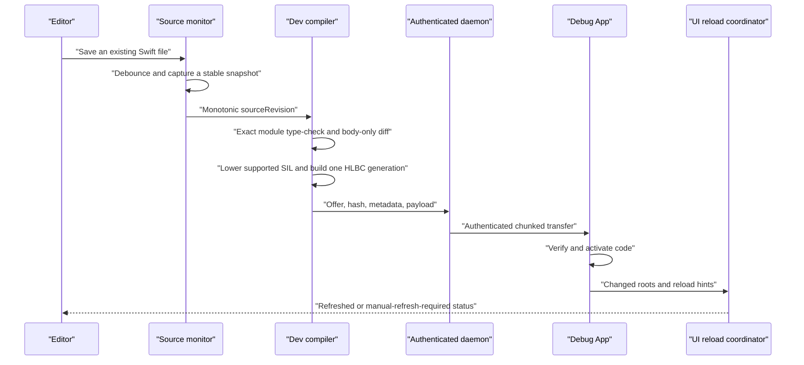

# Development Live Reload

[简体中文](Development-Live-Reload.zh-CN.md)

Helix Live Reload shortens the edit–run loop for an already running Debug App.
After the one-time Xcode integration and Dev Shell build, saving the body of an
eligible Swift declaration can compile a new generation, transfer it to a
Simulator or development device, activate it in the same process, and refresh
the affected UI.

This is a development feature. It is isolated from production packages, keys,
storage, and lifecycle.

The App does not compile or import generated Swift. The Feature target keeps
its original sources; an App build phase compiles Helix's generated Bridge into
a validated object under DerivedData and links it into the executable. A stable
C provider symbol lets `DevRuntime.ApplicationSession` discover the Build
Contract, Shell interface, Runtime factory, and Bridge installer automatically.

## Xcode Run session handoff

The shared Live Reload Scheme starts one authenticated daemon in its Run
pre-action and writes a mode-`0600` custom LLDB init containing the
single-session launch material. The init first configures
`target.env-vars` as the fast path for LLDB-owned launches. It also starts a
bounded LLDB Python installer because Xcode can source the init before the
real App target exists and discard state attached to its temporary target.

The installer waits for a running real target in which the exported
`helix_dev_runtime_handoff_probe` symbol has resolved. It briefly stops that
process, runs one LLDB command-interpreter expression that injects every
environment value, and resumes the process in a `finally` path. The expression
short-circuits on failure and writes `HLX_DEV_HANDOFF_READY=sessionID` last, so
Runtime never consumes a partially injected credential set. This direct
handoff avoids mutating `SBBreakpoint` options from a background Python thread;
Xcode 26 testing showed that a breakpoint could be created while its command,
one-shot, and auto-continue properties were silently lost.

When its initial environment is empty, `DevRuntime.ApplicationSession` polls
the C entry point explicitly for up to twenty seconds, five seconds longer than
the installer deadline. The probe proves that the Dev Runtime image is loaded
and gives the App a bounded point at which to observe the completed handoff; it
is not used as an injection breakpoint.

The probe is not a dispatch hook and has no production role. A tiny C shim
target owns the symbol and Runtime calls its imported declaration, preventing
Swift optimization from bypassing the address LLDB observes. The Release
aggregate does not link
`HelixDevRuntime`. The generated `live-stop.sh` remains the eager cleanup path,
but Xcode may skip a Launch post-action after an explicit Stop. A supervised
daemon therefore waits five seconds for a genuine reconnect after its
authenticated App disconnects, then stops itself and removes `Session.json`,
`Helix.lldbinit`, and the private bootstrap. Keep the `ApplicationSession`
strongly owned for the App lifetime and do not disable
`debuggerHandoffEnabled` for the generated Xcode workflow.

## Save-to-screen sequence



The monitor watches only source files frozen into the Dev Build Manifest.
Editor safe-save renames and in-place writes are debounced, and the snapshotter
requires two matching inode, size, modification-time, and content-hash reads.
Every transaction has a monotonically increasing `sourceRevision`; a slower old
compile or transfer cannot overwrite a newer accepted save.

Compilation failure, artifact verification failure, activation failure, or UI refresh failure
does not discard the last successful code generation. Code activation and UI
refresh are reported separately.

## How the HLBC generation is compiled

The first Debug build captures the real Swift frontend job, SDK, target,
module/source set, compiler arguments, and link context. `helix dev prepare`
replays compiler probes in isolated outputs and verifies that the captured job
can produce the canonical SIL facts required by the bytecode compiler. It does
not approximate the project's build settings.

For an accepted save transaction, Helix:

1. Captures one stable revision of every source in the frozen module context.
2. Re-type-checks that complete module and rejects interface, stored-layout,
   source-membership, dependency, or build-setting changes.
3. Uses declaration identities and implementation fingerprints to determine
   the changed eligible roots, then asks the captured Swift compiler for SIL.
4. Builds a closed call table. Patch-local functions take precedence, followed
   by eligible Shell `EntryIndex` routes and exact `NativeImportID` capabilities
   that the Dev Shell emitted at build time.
5. Lowers only the supported canonical SIL into typed HLIR and HLBC, then runs
   the independent structural and semantic verifier on the Mac.
6. Sends one immutable, session-bound live artifact. The App rechecks session,
   revision, target, Shell identity, hash, size, capabilities, and bytecode
   validity before atomically activating it.

No Swift compiler, linker, JIT, dylib, or source file is sent to or executed on
the iOS process. Release and development reuse the compiler/verifier/HLVM core,
but development artifacts are ephemeral and authenticated by a one-run Dev
Session rather than by the production package trust chain.

## Native calls, instance `self`, and recursion

HLBC cannot call an arbitrary Swift symbol merely because it exists in the
process. A call is accepted only when it resolves to a function in the same
bytecode image, an eligible Shell entry, or an exact NativeImport generated into
that Shell. Entry routes are preferred, so ordinary calls between patchable App
functions remain generation-aware; NativeImport is for a bounded API whose
native implementation must run outside HLVM.

Every new Dev Shell automatically includes the exact NativeImport for
`Swift.print(_:separator:terminator:)`, so adding
`print("value:", value)` to a supported body needs no App catalog setup. The
compiler lowers the variadic arguments into a VM-owned `Array<Any>` and links
the omitted separator/terminator as ordinary default-argument generators in
the same image. Fully concrete defaults on other functions use the same
mechanism; an ineligible affected caller or remaining generic metadata fails
the save transaction with a full-build diagnostic. Cross-module public/package
default changes also require a normal build because one module receipt cannot
prove that every precompiled caller was replaced.

For a supported source `class` instance method, the hidden Bridge carries
`self` as a frozen reference `TypeID`. Generated `NativeTypeOperations` retain,
identify, and validate the object without exposing a process pointer in HLBC.
This establishes the receiver path for class methods; individual property and
method operations still need a supported Shell entry or exact NativeImport.
Struct/enum writeback, actor executors, and static/class metatype ABI are not
silently approximated and currently require a normal build.

Swift commonly spells a class receiver as `@guaranteed self` in SIL, while an
Entry/NativeImport Bridge owns each value that crosses the device boundary.
Helix preserves the physical SIL convention for call validation, then inserts a
typed VM copy only for that borrowed-to-owned boundary. Local same-image calls
still require an exact ownership ABI. This prevents a harmless borrow
convention from rejecting private instance helpers without weakening type,
effect, address, or capability checks.

Direct recursion resolves to the function in the same immutable HLBC image, so
an ordinary recursive Swift body remains ordinary recursion. A call chain pins
one runtime generation, preventing a concurrent save from mixing generations
halfway through the call. `LiveReload.previous` belongs to the explicit Native
Dynamic Replacement experiment and is not accepted by the default HLBC path;
restoring older behavior is done by another save or an explicit generation
rollback/tombstone, not by a hidden source-level call convention.

## Generations, transfer, and lifetime

Each successful transaction is one immutable bytecode generation. Helix does
not maintain a mutable dylib or append Swift files to an image. The daemon sends
an offer manifest and bounded HLBC bytes over the authenticated Dev Session;
the App verifies the complete artifact before activation. A baseline restore
may legitimately carry no bytecode and only remove inherited routes.

The default live HLBC payload limit is 16 MiB. Activation flattens inherited
routes into one immutable snapshot, so a lookup does not depend on keeping an
unbounded ancestry chain. By default the registry strongly retains the active
snapshot and its direct rollback predecessor. An older snapshot remains alive
only while an already-running call or an explicit diagnostic lease pins it; the
lease carries the resolved routes and verified images needed to finish safely.

Count and unique-artifact byte ceilings include these in-flight snapshots. If
all eviction candidates are pinned, activation fails transactionally and the
previous generation remains active; it does not evict a running call. Once the
lease is released, the next registry operation compacts that snapshot. A
separate process-wide high-water mark prevents a compacted generation ID from
being reused. Development generations are never installed in production patch
storage, and restarting the App returns to the Dev Shell baseline.

The checked-in soak activates 128 real verified HLBC generations, exercises a
failed save without changing the active generation, validates rollback and
invocation, and proves that only the active/direct-predecessor snapshots remain
strongly retained after compaction. This is deterministic in-process evidence;
long-duration real-device memory pressure and foreground/background cycling are
still qualification gates.

## Backend policy

`.automatic` and the public default select HLBC on both Simulator and device.
The router does not silently fall back to Native when bytecode lowering rejects
a transaction: it reports the exact unsupported construct and requires either a
supported edit or a normal build. This keeps behavior and source coverage
consistent across targets.

Native Dynamic Replacement remains an explicit internal experiment for Swift
compiler investigation and differential tests. It may still build and load a
dylib on a qualified environment, but it is never selected automatically and is
not the product Live Reload contract. The checked-in HLBC Simulator E2E is
passing; physical-iPhone qualification remains an outstanding evidence gate.

## Why code activation does not automatically redraw a page

Replacing a function changes future calls. It does not make UIKit call
`viewDidLoad`, `loadView`, or a previously completed initializer again. Helix
therefore treats UI update as a second, explicit phase.

`ReloadIndex` records changed source/type identities and hints. UIKit target
discovery is automatic; application code does not maintain a `typeRegistry`.
For each action, the coordinator reconstructs the compiler's stable nominal ID
from `String(reflecting:)`/Objective-C runtime class names, walks the concrete
class's superclass chain, and compares those IDs with the changed type IDs.

The instance search starts from foreground-active or foreground-inactive
`UIWindowScene` windows. It traverses root, presented, navigation, tab, split,
and child controller graphs, filters to visible loaded controllers by default,
and de-duplicates object identities. It matches controllers first. Only types
still unmatched cause a scan of the loaded UIView trees, which avoids paying a
full view-walk cost for the common controller case. A base-class edit therefore
refreshes a displayed subclass instance without registration.

Actions for all matching levels of one inheritance chain are merged once per
instance. Conflicting recreation factories fail explicitly instead of applying
an arbitrary rule. The unified coordinator also distinguishes “no displayed
UIKit instance” from an active matching SwiftUI boundary and emits one useful
warning rather than duplicate UIKit/SwiftUI warnings.

The four policies are:

- `observeOnly`: activate code without forcing UI work;
- `invalidate`: request constraints, layout, display, or explicitly permitted
  data-source invalidation;
- `invokeHook`: call an idempotent `LiveReload.Reloadable` hook implemented by
  the page or view;
- `recreate`: build a replacement controller through a registered factory and
  restore explicitly captured route and UI state.

Layout and drawing callbacks normally infer `invalidate`, so changing a
displayed UIViewController or UIView requires neither registration nor an App
hook. Constraint, layout, and display invalidation operate on the same object,
preserving navigation position and in-memory state. Immediate layout is skipped
while a controller transition is active. Broad `UITableView`/
`UICollectionView.reloadData()` remains disabled by default; a page should use
an explicit hook when data ownership or side effects require application logic.
Initialization callbacks may infer `invokeHook` or `recreate` because Helix
never directly replays arbitrary lifecycle methods. Factory registration is
therefore an advanced reconstruction mechanism, not normal setup.

For SwiftUI, wrap an injection boundary:

```swift
struct ProfileScreen: View {
    var body: some View {
        content
            .liveReloadBoundary(mode: .invalidateBody)
    }
}
```

`LiveReload.Pulse.shared` advances after activation. `invalidateBody` preserves
the existing identity tree where possible; `recreateSubtree` changes the
boundary identity and intentionally resets local `@State`. Boundaries can be
filtered by `NominalTypeID` so an unrelated edit does not refresh every SwiftUI
screen.

## Supported edits

The default workflow is designed for supported bodies of declarations already
in the Dev Shell. Original Swift access control is preserved, but lexical
visibility alone does not create a VM capability: every native operation must
also resolve through an eligible Entry or exact NativeImport. Supported local
closures and already indexed same-image helpers may use synchronous `@escaping`
parameters, internal closure returns, and nested closure captures. The closure
still cannot cross the Shell/Native boundary or survive the current pinned VM
invocation.

The current generator does not automatically collect arbitrary new file-level
functions, types, extensions, or Swift files. It also rejects changes to stored
layout, signatures, generic constraints, isolation, superclass, conformance,
enum cases, source membership, build settings, macro/plugin inputs, linked
dependencies, assets, storyboards, and generated resources. Those changes need
a normal build and, where applicable, reinstall.

Patch-local nonrecursive structs and enums are supported when their declarations
already exist at file/module scope in the Shell. A type declared inside a
function has no frozen declaration identity in Helix's current textual SIL
contract and is rejected with its exact type name; move it to file scope and do
a normal build first.

See [Capabilities and Limits](Capabilities-and-Limits.md) for the comparison
with production HLBC.

## Debugging and diagnostics

HLBC has no native dSYM because it is verified bytecode rather than a Mach-O
image. Compiler debug metadata is lowered to a verified map from
function/block/instruction coordinates to logical Swift file, line, and column.
Host absolute paths are removed from production artifacts. The disassembler
annotates instructions from this map; on a trap the VM emits its exact program
counter, and Runtime adds the pinned generation, Shell entry, function name, and
logical source location.

The terminal and Debug overlay report source revision, generation, backend,
activation result, UI refresh result, whether old code remains active, and the
next action. A failed save is not presented as a successful reload. Interactive
HLBC breakpoints, stepping, and expression evaluation remain future work; the
explicit Native experiment retains its separate dSYM tooling.
