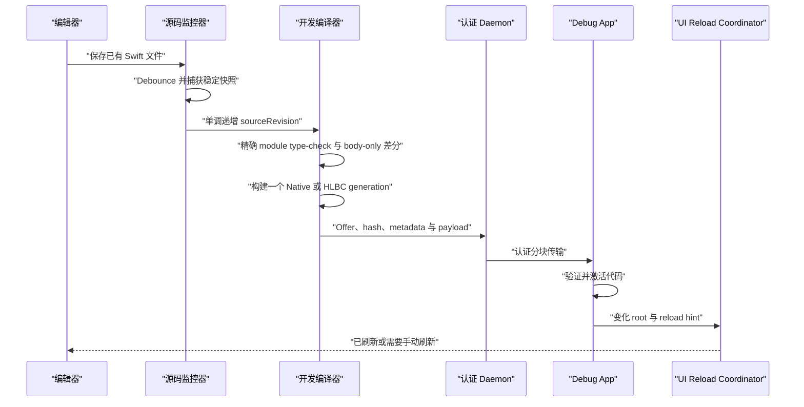

# 开发期热重载

[English](Development-Live-Reload.md)

Helix Live Reload 用于缩短正在运行的 Debug App 的修改循环。完成一次性 Xcode 集成和 Dev Shell 构建后，保存一个 eligible Swift 声明的函数体，可以在同一进程中编译新 generation、传给 Simulator、激活代码并刷新受影响的 UI。

这是开发功能，与生产补丁的产物、密钥、存储和生命周期完全隔离。

App 不会编译或 import 生成 Swift。Feature target 始终保留原始源码；App build phase 只在 DerivedData 中把 Helix Bridge 编译成经过校验的 object，再链接进 executable。`DevRuntime.ApplicationSession` 通过稳定 C provider 符号自动取得 Build Contract、Shell interface、Runtime factory 与 Bridge installer。

## Xcode Run 会话交接

共享 Live Reload Scheme 会在 Run pre-action 中启动一次认证 daemon，并写出权限为 `0600` 的自定义 LLDB init；文件只包含本次会话的临时材料。init 先用 `target.env-vars` 覆盖由 LLDB 负责 launch 的快路径，同时启动一个有界的 LLDB Python installer。之所以需要后者，是因为 Xcode 可能在真实 App target 创建前加载 init，并丢弃挂在临时 target 上的状态。

installer 等待正在运行的真实 target 和已经解析的 `helix_dev_runtime_handoff_probe`。找到后短暂停住 App，通过 LLDB command interpreter 执行一条环境注入表达式，并在 `finally` 路径恢复进程。表达式遇错即短路，最后才写 `HLX_DEV_HANDOFF_READY=sessionID`，所以 Runtime 不会读取半套凭据。这里不再从后台 Python 线程修改 `SBBreakpoint` 属性；Xcode 26 实测中曾出现“断点已创建，但 command、one-shot 与 auto-continue 静默丢失”的情况。

初始环境为空时，`DevRuntime.ApplicationSession` 最多二十秒显式调用 C probe，比 installer deadline 多保留五秒。probe 用来确认 Dev Runtime image 已加载，并给 App 一个有界的 handoff 观察点；它不再承担注入断点。probe 也不是运行时分发入口，不进入生产路径。Release 聚合产品不链接 `HelixDevRuntime`。

`live-stop.sh` 仍是主动清理快路径，但 Xcode 在显式 Stop 后可能跳过 Launch post-action。受监管 daemon 因此会在已认证 App 断线后保留五秒重连窗口；仍未重连就自行停止，并清理 `Session.json`、`Helix.lldbinit` 与 private bootstrap。业务必须在 App 生命周期中强持有 `ApplicationSession`，生成的 Xcode 工作流不要关闭 `debuggerHandoffEnabled`。

## 从保存到页面变化



监控器只观察 Dev Build Manifest 冻结的源文件。编辑器 safe-save rename 与原地写入会先 debounce；Snapshotter 要求连续两次读取的 inode、大小、修改时间和内容 hash 全部一致。每个 transaction 都有单调递增的 `sourceRevision`，较慢的旧编译或传输无法覆盖后来已接受的保存。

编译、签名、加载或 UI 刷新失败都不会丢掉上一个成功代码 generation。代码是否激活与 UI 是否刷新会分开报告。

## 原生 Replacement 如何编译

第一次 Debug Build 会捕获真实 Swift frontend job、SDK、target、module/源码集合、链接输入和签名身份。`helix dev prepare` 在隔离输出中复放该 job，并用 fresh source 编译 capability probe，验证 implicit dynamic、private source-file import、canonical SIL 与 replacement chaining。它不会只看参数名字，也不会在每次 App 启动时执行两代 dylib 运行实验。

对于通过检查的 body-only 修改，Helix 会：

1. 在完整 module 上下文中重新 type-check，比较 interface 与传递 implementation fingerprint。
2. 通过 Reload Index 定位已有 replacement root。
3. 只提取这些函数体。
4. 请求精确编译器生成 typed AST，按 USR 识别声明及其 self reference，只修改编译器报告的 UTF-8 标识符范围。
5. 生成 `@_dynamicReplacement` 声明，经过正常 SILGen、IRGen 和 LLVM，再链接、签名唯一命名的 dylib。
6. 生成匹配的 dSYM 与 Swift module，并验证 DWARF UUID。

这是由 typed AST 身份与 SIL 检查约束的源码重建，不是 LLVM 插桩、原始符号 rebinding，也不是已经实现的 SIL function cloning。

private source-file import 让 replacement body 能解析原 module 中原本可用的 private、internal 与 public 声明，但不会让补丁访问 App 从未链接的 framework。

## 递归与上一代实现

在 Swift Dynamic Replacement 中，replacement 内部调用被替换声明时具有“上一代实现”的特殊含义。如果原样复制普通递归函数体，它会错误地递归进旧 generation。Helix 会把精确 self reference 重绑定到当前 replacement identity，修正这一语义。

普通 Swift 仍然表示普通递归：

```swift
func factorial(_ value: Int) -> Int {
    value < 2 ? 1 : value * factorial(value - 1)
}
```

上面的递归边保持在当前 generation。确实要调用上一代时必须显式说明：

```swift
func adjustedPrice(_ input: Int) -> Int {
    LiveReload.previous {
        adjustedPrice(input)
    } + 1
}
```

`LiveReload.previous` 是编译器 marker，不是通用运行时分发器。当前 marker 只接受一个表达式，可以是 `async throws`，并且不能嵌套在另一个用户 closure 内。没有经过 Helix 变换时会主动 trap，避免静默调用错误实现。

静态 SIL 测试会区分当前代的 `function_ref` 与显式上一代的 `prev_dynamic_function_ref`。macOS 运行时 E2E 已经连续装载两代全局、实例、static、class 和具体泛型递归 replacement，并验证第二代的 explicit previous 能到达第一代。

## Generation、传输与 Image 生命周期

Helix 为每个成功 Native transaction 构建一个独立不可变 image，并不是维护一个 dylib 后不断往里面追加保存的 Swift 文件。Native live artifact 由 offer manifest 与 dylib 字节构成，通过认证 Dev Session 传输；App 先将其写入有界临时文件，再检查 hash、Mach-O、架构、依赖、会话和 generation 身份。

App 使用 local、immediate binding 调用 `dlopen`。已经成功加载的 image 会保留到进程退出，因为在途 frame、closure、metadata 或 replacement descriptor 仍可能引用它们。Helix 不调用 `dlclose`。默认限制为：

- 单个 Native payload 64 MiB，单个 HLBC live payload 16 MiB；
- 50 个 Native image 时给出软提醒；
- 80 个 Native image 或累计 256 MiB image 字节时硬停止。

达到硬上限后要求重启 App。Live generation 不会像生产补丁那样持久化，所以重启后回到 Dev Shell baseline。

## 后端选择

Simulator Native Dynamic Replacement 是目前已验证的主路径。Native 不可用时，开发路由器可以选择 HLBC，但前提是一个 HLBC transaction 能覆盖全部变化 root。某个函数一旦存在活动 generation，在重启前会保持 backend affinity，因此同一次原子 transaction 不会混合 Native 与 HLBC 实现。

当前没有已经实现的 `-interposable` 回退。如果两个后端都无法安全编译，Helix 会明确要求完整构建。

真实开发 iPhone 的 Native 加载作为实验路径存在：它会使用捕获到的 device target 与 expanded signing identity，但在精确 Xcode、iOS、架构、Team ID、签名和 Library Validation 矩阵完成资格前必须保持禁用。Simulator 成功不能代替真机资格。

## 为什么代码激活后页面不会天然重绘

替换函数只会改变之后的调用，不会让 UIKit 再次调用已经完成的 `viewDidLoad`、`loadView` 或 initializer。因此 Helix 把 UI 更新作为第二个明确阶段。

`ReloadIndex` 记录变化的源码/类型身份和 hint。UIKit target discovery 现在完全自动化，业务代码不再维护 `typeRegistry`。Coordinator 会从 `String(reflecting:)` 与 Objective-C runtime class name 还原编译器使用的稳定 nominal ID，并沿具体类的 superclass 链与变化类型匹配。

实例搜索从 foreground active/inactive 的 `UIWindowScene` 开始，遍历 root、presented、navigation、tab、split 与 child controller 图；默认只保留已经加载且可见的 controller，并按对象 identity 去重。它会先匹配 controller，只有仍未命中的类型才扫描这些 controller 已加载的 UIView tree，从而避免普通页面修改每次都付出完整 view walk。修改基类也能直接命中当前展示的子类实例。

同一实例若同时命中继承链上的多个 action，会先按统一升级规则合并。互相冲突的 recreation factory 会明确失败，不会随机选择。统一 Coordinator 还会区分“当前没有 UIKit 实例”和“存在匹配的 SwiftUI boundary”，避免两套系统各报一次无意义 warning。

四种策略是：

- `observeOnly`：只激活代码，不强制 UI 操作；
- `invalidate`：请求 constraint、layout、display 或明确允许的数据源 invalidation；
- `invokeHook`：调用页面或 View 实现的幂等 `LiveReload.Reloadable` hook；
- `recreate`：通过注册 Factory 构建新的 Controller，并恢复显式捕获的路由和 UI 状态。

常见 layout、drawing callback 会推导为 `invalidate`，所以修改正在展示的 UIViewController 或 UIView 时既不需要注册，也不需要 App hook。Constraint、layout 和 display invalidation 都作用于原实例，可以保留导航位置与内存状态；controller 正在 transition 时会跳过 immediate layout。广泛调用 `UITableView`/`UICollectionView.reloadData()` 仍默认关闭；数据所有权或副作用确实需要业务逻辑时再使用显式 hook。初始化 callback 可能推导为 `invokeHook` 或 `recreate`，因为 Helix 不会直接重放任意 lifecycle method。Factory registration 因此是高级页面重建机制，不是普通接入步骤。

SwiftUI 可以包一层注入边界：

```swift
struct ProfileScreen: View {
    var body: some View {
        content
            .liveReloadBoundary(mode: .invalidateBody)
    }
}
```

代码激活后会推进 `LiveReload.Pulse.shared`。`invalidateBody` 尽量保留原 identity tree；`recreateSubtree` 会改变 boundary identity，并有意重置局部 `@State`。Boundary 还可以按 `NominalTypeID` 过滤，避免无关修改刷新所有 SwiftUI 页面。

## 支持哪些修改

当前 Native 工作流面向 Dev Shell 中已经存在的声明 body。补丁在原 source-file/module 上下文中编译，因此可以调用已有 private 成员。写在变化 body 内的局部 helper、closure 和局部类型可以由 Swift 一并编译。

当前生成器不会自动收集任意新增的文件级函数、类型、extension 或 Swift 文件，也会拒绝 stored layout、函数签名、泛型约束、isolation、superclass、conformance、enum case、source membership、Build Settings、macro/plugin 输入、链接依赖、asset、storyboard 和生成资源变化。这些修改需要正常构建，必要时重新安装。

与生产 HLBC 的对比见[能力与限制](Capabilities-and-Limits.zh-CN.md)。

## 调试符号与诊断

每个 Native generation 都有 UUID 匹配的 dSYM、Swift module 和 source map。App 确认激活后，CLI 会输出可粘贴到 Xcode LLDB 控制台的 `target symbols add`、Swift module search path 和 source-map 命令。自动 LLDB attachment 与自动符号注册尚未实现。

编译诊断保留逻辑源码位置。终端与 Debug Overlay 会报告 source revision、generation、backend、激活结果、UI 刷新结果、旧代码是否仍然有效以及下一步动作。失败的保存不会被展示成成功热重载。
