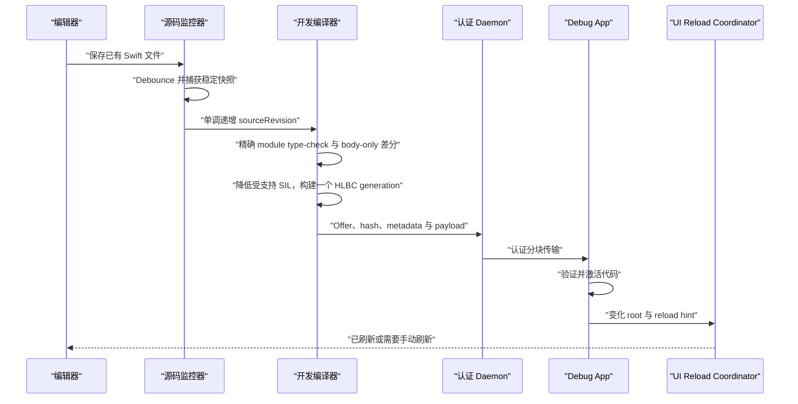

# 开发期热重载

[English](Development-Live-Reload.md)

Helix Live Reload 用于缩短正在运行的 Debug App 的修改循环。完成一次性 Xcode 集成和 Dev Shell 构建后，保存一个 eligible Swift 声明的函数体，可以在同一进程中编译新 generation、传给 Simulator 或开发设备、激活代码并刷新受影响的 UI。

这是开发功能，与生产补丁的产物、密钥、存储和生命周期完全隔离。

App 不会编译或 import 生成 Swift。Feature target 始终保留原始源码；App build phase 只在 DerivedData 中把 Helix Bridge 编译成经过校验的 object，再链接进 executable。`DevRuntime.ApplicationSession` 通过稳定 C provider 符号自动取得 Build Contract、Shell interface、Runtime factory 与 Bridge installer。

## Xcode Run 会话交接

共享 Live Reload Scheme 会在 Run pre-action 中启动一次认证 daemon，并写出权限为 `0600` 的自定义 LLDB init；文件只包含本次会话的临时材料。init 先用 `target.env-vars` 覆盖由 LLDB 负责 launch 的快路径，同时启动一个有界的 LLDB Python installer。之所以需要后者，是因为 Xcode 可能在真实 App target 创建前加载 init，并丢弃挂在临时 target 上的状态。

installer 等待正在运行的真实 target 和已经解析的 `helix_dev_runtime_handoff_probe`。找到后短暂停住 App，通过 LLDB command interpreter 执行一条环境注入表达式，并在 `finally` 路径恢复进程。表达式遇错即短路，最后才写 `HLX_DEV_HANDOFF_READY=sessionID`，所以 Runtime 不会读取半套凭据。这里不再从后台 Python 线程修改 `SBBreakpoint` 属性；Xcode 26 实测中曾出现“断点已创建，但 command、one-shot 与 auto-continue 静默丢失”的情况。

初始环境为空时，`DevRuntime.ApplicationSession` 最多二十秒显式调用 C probe，比 installer deadline 多保留五秒。probe 用来确认 Dev Runtime image 已加载，并给 App 一个有界的 handoff 观察点；它不再承担注入断点。probe 也不是运行时分发入口，不进入生产路径。Release 聚合产品不链接 `HelixDevRuntime`。

`live-stop.sh` 仍是主动清理快路径，但 Xcode 在显式 Stop 后可能跳过 Launch post-action。受监管 daemon 因此会在已认证 App 断线后保留五秒重连窗口；仍未重连就自行停止，并清理 `Session.json`、`Helix.lldbinit` 与 private bootstrap。业务必须在 App 生命周期中强持有 `ApplicationSession`，生成的 Xcode 工作流不要关闭 `debuggerHandoffEnabled`。

## 从保存到页面变化



监控器只观察 Dev Build Manifest 冻结的源文件。编辑器 safe-save rename 与原地写入会先 debounce；Snapshotter 要求连续两次读取的 inode、大小、修改时间和内容 hash 全部一致。每个 transaction 都有单调递增的 `sourceRevision`，较慢的旧编译或传输无法覆盖后来已接受的保存。

编译、artifact 验证、激活或 UI 刷新失败都不会丢掉上一个成功代码 generation。代码是否激活与 UI 是否刷新会分开报告。

## HLBC generation 如何编译

第一次 Debug Build 会捕获真实 Swift frontend job、SDK、target、module/源码集合、编译参数和链接上下文。`helix dev prepare` 在隔离输出中复放编译器 probe，确认捕获的 job 能产生字节码编译器所需的 canonical SIL 事实；它不会近似猜测工程 Build Settings。

对于通过检查的一次保存，Helix 会：

1. 为冻结 module 上下文中的全部源码捕获同一个稳定 revision。
2. 重新 type-check 完整 module，并拒绝 interface、stored layout、source membership、依赖或 Build Settings 变化。
3. 通过声明身份与 implementation fingerprint 确定变化的 eligible root，再让捕获的 Swift 编译器产出 SIL。
4. 构造闭合调用表：patch-local 函数优先，其次是 eligible Shell `EntryIndex`，最后是 Dev Shell 在构建期实际生成的精确 `NativeImportID` 能力。
5. 只把受支持的 canonical SIL 降成强类型 HLIR 与 HLBC，并在 Mac 端运行独立结构和语义 Verifier。
6. 发送一个不可变、绑定本次会话的 live artifact。App 在原子激活前重新检查 session、revision、target、Shell identity、hash、大小、capability 与字节码合法性。

iOS 进程不会接收或执行 Swift 编译器、linker、JIT、dylib 或源文件。Release 与开发路径复用编译器、Verifier 与 HLVM 核心，但开发 artifact 是临时的，并由一次性 Dev Session 认证，而不是使用生产包信任链。

## 原生调用、实例 `self` 与递归

一个 Swift 符号仅仅存在于进程中，并不代表 HLBC 可以随意调用它。调用必须精确解析到同一 bytecode image 中的函数、eligible Shell Entry，或者已生成进 Shell 的精确 NativeImport。Entry 路由优先，因此可补丁 App 函数之间的普通调用仍然感知 generation；NativeImport 用来承载必须离开 HLVM 执行的有界原生 API。

对于受支持的源码 `class` 实例方法，隐藏 Bridge 会把 `self` 作为冻结的引用 `TypeID` 传入。生成的 `NativeTypeOperations` 负责 retain、identity 与类型验证，不把进程指针写进 HLBC。这条路径解决了 class method receiver；具体属性或方法操作仍必须拥有受支持的 Shell Entry 或精确 NativeImport。struct/enum writeback、actor executor 与 static/class metatype ABI 不会被猜测模拟，当前需要正常构建。

Swift SIL 通常把 class receiver 写成 `@guaranteed self`，而 Entry/NativeImport Bridge 会拥有每一个跨设备边界的值。Helix 用物理 SIL convention 验证调用，再只对 borrowed→owned 的边界插入强类型 VM copy；同 image 的局部调用仍要求 ownership ABI 完全一致。这样既不会因无害的 borrow spelling 错误拒绝 private 实例 helper，也没有放宽类型、effect、address 或 capability 检查。

直接递归会解析到同一个不可变 HLBC image 内的函数，因此普通递归 Swift 语义保持不变。一次调用链会固定一个 Runtime generation，并发保存不会让它在中途混用两代实现。`LiveReload.previous` 只属于显式 Native Dynamic Replacement 实验，默认 HLBC 路径不接受它；恢复旧行为应通过再次保存或显式 generation rollback/tombstone 完成，而不是依赖隐藏的源码调用约定。

## Generation、传输与生命周期

每个成功 transaction 都是一个不可变 bytecode generation。Helix 不维护可变 dylib，也不会往 image 中持续追加 Swift 文件。Daemon 通过认证 Dev Session 发送 offer manifest 与有界 HLBC 字节，App 验证完整 artifact 后才激活。恢复 baseline 时可以没有 bytecode，只携带停止继承旧 route 的信息。

默认单个 live HLBC payload 上限为 16 MiB。激活会把继承 route 展平成一个不可变、自包含 snapshot，因此路由查询不依赖一条无限增长的祖先链。Registry 默认强保留当前 snapshot 与直接回滚前代；更旧 snapshot 只有在已开始调用或显式诊断 lease 仍固定它时才继续存活。lease 自身携带完成调用所需的已解析 route 与已验证 image。

数量上限与去重后的 artifact 字节预算会把这些执行中 snapshot 一并计算。如果所有可淘汰项都被固定，新 generation 会以 transaction 方式失败，旧 generation 保持活动，不会为了接收新代码而破坏执行中的调用。lease 释放后，下一次 Registry 操作会压缩旧 snapshot。独立的全进程 generation ID 高水位保证已压缩 ID 不能复用。开发 generation 不进入生产补丁存储；重启 App 后回到 Dev Shell baseline。

仓库内 soak 会激活 128 个真实验证后 HLBC generation，验证一次失败保存不会改变 active generation，并覆盖 rollback、调用结果以及压缩后只强保留 active/直接前代 snapshot。这是确定性的进程内证据；真机长时间内存压力和前后台循环仍属于资格 Gate。

## 后端策略

`.automatic` 与公开默认配置在 Simulator 和设备上都选择 HLBC。字节码 lowering 拒绝 transaction 时，路由器不会偷偷回退到 Native；它会报告精确的不支持语法，要求调整为受支持修改或正常构建。这样两个目标上的行为和源码覆盖保持一致。

Native Dynamic Replacement 只保留为必须显式选择的内部 Swift 编译器实验与差分测试。它仍可在经过资格验证的环境中构建、加载 dylib，但不会自动选中，也不属于产品 Live Reload 合同。仓库 HLBC Simulator E2E 已通过，真实 iPhone 资格验证仍是待补证据。

## 为什么代码激活后页面不会天然重绘

替换函数只会改变之后的调用，不会让 UIKit 再次调用已经完成的 `viewDidLoad`、`loadView` 或 initializer。因此 Helix 把 UI 更新作为第二个明确阶段。

`ReloadIndex` 记录变化的源码/类型身份和 hint。UIKit target discovery 现在完全自动化，业务代码不再维护 `typeRegistry`。Coordinator 会从 `String(reflecting:)` 与 Objective-C runtime class name 还原编译器使用的稳定 nominal ID，并沿具体类的 superclass 链与变化类型匹配。

实例搜索从 foreground active/inactive 的 `UIWindowScene` 开始，遍历 root、presented、navigation、tab、split 与 child controller 图；默认只保留已经加载且可见的 controller，并按对象 identity 去重。它会先匹配 controller，只有仍未命中的类型才扫描这些 controller 已加载的 UIView tree，从而避免普通页面修改每次都付出完整 view walk。修改基类也能直接命中当前展示的子类实例。

同一实例若同时命中继承链上的多个 action，会先按统一升级规则合并。互相冲突的 recreation factory 会明确失败，不会随机选择。统一 Coordinator 还会区分“当前没有 UIKit 实例”和“存在匹配的 SwiftUI boundary”，避免两套系统各报一次无意义 warning。

四种策略是：

- `observeOnly`：只激活代码，不强制 UI 操作；
- `invalidate`：请求 constraint、layout、display 或明确允许的数据源 invalidation；
- `invokeHook`：调用页面或 View 实现的幂等 `LiveReload.Reloadable` hook；
- `recreate`：通过注册 Factory 构建新的 Controller，并恢复显式捕获的路由和 UI 状态。

常见 layout、drawing callback 会推导为 `invalidate`，所以修改正在展示的 UIViewController 或 UIView 时既不需要注册，也不需要 App hook。Constraint、layout 和 display invalidation 都作用于原实例，可以保留导航位置与内存状态；controller 正在 transition 时会跳过 immediate layout。广泛调用 `UITableView`/`UICollectionView.reloadData()` 仍默认关闭；数据所有权或副作用确实需要业务逻辑时再使用显式 hook。初始化 callback 可能推导为 `invokeHook` 或 `recreate`，因为 Helix 不会直接重放任意 lifecycle method。Factory registration 因此是高级页面重建机制，不是普通接入步骤。

SwiftUI 可以包一层注入边界：

```swift
struct ProfileScreen: View {
    var body: some View {
        content
            .liveReloadBoundary(mode: .invalidateBody)
    }
}
```

代码激活后会推进 `LiveReload.Pulse.shared`。`invalidateBody` 尽量保留原 identity tree；`recreateSubtree` 会改变 boundary identity，并有意重置局部 `@State`。Boundary 还可以按 `NominalTypeID` 过滤，避免无关修改刷新所有 SwiftUI 页面。

## 支持哪些修改

默认工作流面向 Dev Shell 中已经存在、且字节码后端支持的声明 body。原 Swift access control 会保留，但源码可见并不自动创造 VM capability；每个原生操作还必须通过 eligible Entry 或精确 NativeImport 解析。受支持的局部 closure 与已经索引的同 image helper 可以使用同步 `@escaping` 参数、内部 closure 返回和嵌套 closure 捕获；closure 仍不能跨 Shell/Native 边界，也不能活过当前固定的 VM invocation。

当前生成器不会自动收集任意新增的文件级函数、类型、extension 或 Swift 文件，也会拒绝 stored layout、函数签名、泛型约束、isolation、superclass、conformance、enum case、source membership、Build Settings、macro/plugin 输入、链接依赖、asset、storyboard 和生成资源变化。这些修改需要正常构建，必要时重新安装。

补丁内非递归 struct/enum 在声明已经随 Shell 存在于文件/module scope 时受支持。函数内部声明的 nominal type 在当前 textual SIL 合同中没有冻结的声明身份，因此会用精确类型名拒绝；应先移到文件 scope 并正常构建一次。

与生产 HLBC 的对比见[能力与限制](Capabilities-and-Limits.zh-CN.md)。

## 调试与诊断

HLBC 是验证后字节码而不是 Mach-O image，因此没有原生 dSYM。编译器 debug metadata 会降低成经过 Verifier 检查的 function/block/instruction → 逻辑 Swift 文件、行、列映射；生产 artifact 会移除构建机绝对路径。反汇编使用该映射标注指令；发生 trap 时 VM 给出精确 program counter，Runtime 再补充固定的 generation、Shell entry、函数名与逻辑源码位置。

终端与 Debug Overlay 会报告 source revision、generation、backend、激活结果、UI 刷新结果、旧代码是否仍然有效以及下一步动作。失败的保存不会被展示成成功热重载。HLBC 的交互式 breakpoint、单步和表达式求值仍是后续工作；显式 Native 实验保留自己独立的 dSYM 工具。
