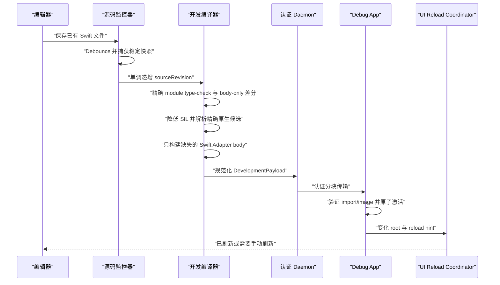

# 开发期热重载

[English](Development-Live-Reload.md)

脚本安装、编译器包装器共存、Prepare 失败恢复及大模块测量见
[大型工程接入](Large-Project-Integration.zh-CN.md)。

Helix Live Reload 用于缩短正在运行的开发 App 的修改循环。Hub 为工程启用 Helix、Xcode 正常 Run 一次后，保存一个受支持的 Swift 实现，就可以在同一进程中编译新 generation、传给 Simulator 或开发设备、激活代码并刷新受影响的 UI。

这是开发功能，与生产补丁的产物、密钥、存储和生命周期完全隔离。

App target 保留原始源码，也可以直接作为源码 target，不需要先拆 Feature framework。Hub 自动链接 package、安装仅作用于目标 configuration 的 compiler proxy、在 DerivedData 中编译 Bridge 与 bootstrap object，并启动动态 `HelixDevSupport`。业务源码不 import 生成 Swift，也不创建 `ApplicationSession`。

## 统一 Helix Service 与启动模式

Live Reload 不再为每次 Xcode Run 创建 daemon，也不使用自定义 LLDB init、LLDB Python、launch environment、注入 secret 或直连 host。macOS Helix 应用持有唯一 `_helix._tcp` 服务；如果开发者已经运行 `helix hub run`，GUI 会通过同一个 owner-only control interface 接管显示，但不会终止不属于自己的 Service。

Xcode lifecycle 传递的是身份，不是凭据：

1. 所选源码 target 的普通 Sources phase 会通过仅作用于目标 configuration 的透明 proxy 编译当前 membership。真实编译成功后，Helix 校验这次精确 invocation、生成 Shell 与 Bridge，再向 Service 预留一个绑定 profile 的一次性邀请。增加、删除、移动或生成 Swift 源文件都不需要更新 Helix 文件列表。已经验证的模块 receipt、SDK symbol graph 和单声明探测会自动作为内容寻址的本地构建事实复用；最终 Prepare 仍会重新生成，以便每次构建获得新的单次 Hub invitation。项目不需要配置缓存或 API allowlist。
2. 隐藏 Bridge object 只嵌入邀请和持久 Helix Host Identity 的公开 pin。Project 与 App environment 都不会写入 session secret。
3. App link 完成后，Scheme Run pre-action 注册精确 executable UUID 与完整 Build Context，再把预留邀请绑定到最终 Shell。
4. Xcode 用默认 Apple debugger 启动 App。隐藏 bootstrap 自动启动 `HelixDevSupport`；进程开始时，`DevRuntime.LaunchMode.current()` 只调用一次 Darwin `sysctl` 并检查 `P_TRACED`。被跟踪的进程进入 `automaticXcode`；探测失败会保守进入 `manual`。
5. Automatic 模式发现唯一服务、校验编译进 Bridge 的 Host pin、证明精确 App/Shell identity，再通过 pinned TLS 兑换邀请。后续认证通道传输源码诊断、HLBC generation、激活结果与 reconnect lease。

持久 Build Context registry 是可以由 Xcode 重建的开发状态，不是兼容数据库。如果 owner-only 普通文件无法被当前 build 解码或验证，Hub 会先把它移到隔离文件供排障，再以空 registry 启动；下一次正常 Xcode Build 会发布当前 context。symbolic link、过宽权限或其他不安全 filesystem 形态仍会阻止启动，不会被静默替换。

模式在整个进程周期内固定。开发者 Stop Xcode 后，从桌面直接打开同一个已安装包会产生 manual 新进程：输入 Mac Helix 当前四位码并确认前，它不浏览 Bonjour，也不请求本地网络。之后再 attach debugger 也不能把进程切成 automatic。

四位码大小写不敏感，字符集是 `ABCDEFGHJKMNPQRSTUVWXYZ23456789`，默认两分钟过期且只能兑换一次；连续五次失败会触发配置的限流。短码只代表用户在场，连接仍须同时通过 P-256 Host Identity pin、精确注册的 Build Context、TLS transcript 与 App process identity。只有相同 bundle ID 并不足以配对。

自动安装的开发 overlay 提供手动配对界面并持有进程级 session。高级产品仍可在自定义调试 UI 中展示 `DevRuntime.PairingView(session:)` 或调用 `ApplicationSession.connect(pairingCode:)`，普通接入不需要这样做。手动配对不会保存到下次启动。

## 从保存到页面变化



监控器观察 Xcode 自动捕获到当前 Dev Build Manifest 的精确 target 源码成员。新增、删除、移动或生成 target 源码后，只需正常执行一次 Xcode Build，让 Xcode 发布新的源码成员；开发者不需要维护 Helix 源码列表或额外配置。编辑器 safe-save rename 与原地写入会先 debounce；Snapshotter 要求连续两次读取的 inode、大小、修改时间和内容 hash 全部一致。每个 transaction 都有单调递增的 `sourceRevision`，较慢的旧编译或传输无法覆盖后来已接受的保存。

编译、artifact 验证、激活或 UI 刷新失败都不会丢掉上一个成功代码 generation。代码是否激活与 UI 是否刷新会分开报告。

## HLBC generation 如何编译

第一次 Debug Build 会捕获真实 Swift frontend job、SDK、target、module/源码集合、编译参数和链接上下文。`helix dev prepare` 在隔离输出中复放编译器 probe，确认捕获的 job 能产生字节码编译器所需的 canonical SIL 事实；它不会近似猜测工程 Build Settings。

对于通过检查的一次保存，Helix 会：

1. 为当前 module 构建上下文中的全部源码捕获同一个稳定 revision。
2. 重新 type-check 完整 module，并拒绝 interface、stored layout、source membership、依赖或 Build Settings 变化。
3. 通过声明身份与 implementation fingerprint 确定变化的 eligible root，再让捕获的 Swift 编译器产出 SIL。
4. 构造闭合调用表：patch-local 函数优先，其次是 eligible Shell `EntryIndex`、Shell 已链接的原生 import，以及认证 Build Receipt 中的精确未使用候选。首次使用的候选会在已链接前缀之后确定性获得 session-local ID，Shell interface hash 不变；`NativeImportID` 只承担紧凑派发，不是权限凭据。
5. 只把受支持的 canonical SIL 降成强类型 HLIR 与 HLBC，运行独立 Verifier，再检查产物真正使用的 import。Objective-C 与受支持 C 候选直接复用通用 Runtime 调用器；只有缺失的纯 Swift 候选才会让 Hub 依据捕获的真实 compiler job 编译精确 Adapter body，并使用内容寻址缓存。
6. 把 HLBC、提升的 import、Adapter image 描述、hash 与 image bytes 组成一个规范化的版本 1 `DevelopmentPayload`，再通过认证 session 传输。
7. App 重新检查 session/revision、compiler 与 SDK identity、target、Shell identity、每个 Descriptor/Key、Mach-O identity/签名/依赖、大小、capability 与字节码，然后构造一份不可变原生能力快照；全部成功后才原子发布 generation。

App 进程不会接收或执行 Swift 编译器、linker、JIT 或源文件。经过资格验证的 Simulator/macOS 开发进程可以接收一份签名、精确的按需 Swift Adapter image；物理 iOS 会拒绝这条 image 路径并要求正常重建。Release 与开发路径复用编译器、Verifier 与 HLVM 核心，但开发 artifact 是临时的，并由一次性 Dev Session 认证，而不是使用生产包信任链。即使无需 Adapter，开发传输也不接受裸 HLBC。

## 原生调用、实例 `self` 与递归

一个 Swift 符号仅仅存在于进程中，并不代表 HLBC 可以随意调用它。调用必须精确解析到同一 bytecode image 中的函数、eligible Shell Entry、已链接的精确 NativeImport，或由认证开发事务提升的精确 Build Receipt 候选。Entry 路由优先，因此可补丁 App 函数之间的普通调用仍然感知 generation；NativeImport 用来承载必须离开 HLVM 执行的有界原生 API。补丁 bytes 不能自行提交新的 selector、C/Swift symbol、ABI 或进程地址。

标准库 API 也遵循同一执行边界。受管集合算法使用通用、Verifier 可见的 HLBC 语义计划与 callback，不会按源码 API 一项配一个 opcode；状态属于原生 Runtime 的具体 framework member 使用实测得到的精确 NativeImport；patch-local Swift 实现仍是普通同 image 调用。表示转换、ownership、effect、重入和资源预算都会在这些明确边界上验证，而不会隐藏到按名字分发的原生调用后面。没有 payload 的 `nil` 会从已经验证的 bytecode 上下文恢复 wrapped type，因此同一套 Array/Dictionary builder、mutation/sort/split state 与 VM equality 可直接服务所有可表示的 `Optional<T>`，不需要类型特例。泛型间接结果也统一写入 compiler address，包括尚在构造中的 Array 字面量整体 element 与 Tuple 字段。

顺序异步执行沿用同一分层。完全具体的 `async`/`async throws` root 可以包含多个 suspension point，调用精确 patch-local async function 与生成式 async NativeImport。永久 Shell Bridge 是绑定 hash 的精确源码 body wrapper：没有 route 时，它会在第一次可能挂起前选择词法 original；命中 route 时，则为整条恢复调用固定一个不可变 generation 和只能消费一次的 dispatch plan。`nonisolated`/`MainActor` 恢复语义、取消检查、已声明错误与确定性清理都会保留。Task 创建、`async let`、TaskGroup、continuation、async closure value、AsyncSequence、TaskLocal、custom actor/global actor，以及跨 suspension 仍存活的 `inout`/address access 继续 fail closed。

Hub 会根据所选工作流和精确编译器证据自动生成 NativeImport 的发现范围、访问 effect、actor 限制以及同步/挂起 deadline。普通工程不编写 NativeImport YAML 或声明白名单。内部生成合同仍区分 `pure`、`read` 与 `read-write`，把非 MainActor 同步调用钳制在很短的 bounded deadline，并给挂起调用单独的连续 deadline；延长 deadline 也不会扩大访问 effect。显式 policy 文档仍可作为底层 standalone compiler 接口，但不是 Xcode 接入步骤。

Swift 泛型集合方法并不是安全的 NativeImport 捷径。它的物理 ABI 可能携带具体类型 metadata、protocol witness table、随 specialization 改变的 ownership、间接结果和私有 reabstraction 细节；closure 与集合值也不使用 HLVM 的 Runtime 表示。这些属于具体 toolchain 合同，并非稳定 Shell capability。因此 NativeImport 只承载精确生成的 Bridge、稳定的 C/Objective-C 形状原生操作，或包住原生语义 leaf 的固定表示适配层；最后一种必须在 dispatch 前擦除所有泛型参数，并独立校验类型、effect 与资源。受支持 Swift Sequence API 则由 frontend 识别，再降低到少量强类型 cursor、builder、mutation 与普通 closure 调用。

VM-owned `Any` 也遵循这条分界。擦除与动态转换指令把闭合的递归逻辑类型描述符和物理 HLBC register shape 分开携带；Verifier 证明描述符与 storage 一致，VM 则校验递归 payload invariant、深度、分配和遍历 fuel。这样无需序列化 Swift metadata，也无需通过 NativeImport 调用泛型 cast，就能保留 `Int`/`Int64`、Character/String、Substring/Array、ArraySlice/Array 及其嵌套 Optional/Array/Dictionary/Set/Tuple 的区别。穿过 Swift Shell 边界时，递归组合的具体 codec 会物化受支持的标量、文本、Optional、Array、Dictionary 与 Set；无法精确重建的形状继续 fail closed。

`String(describing:)` 与 `String(reflecting:)` 是上述原生 leaf 的具体例子。frontend 会识别它们的泛型 SIL 入口，但绝不 dispatch 该物理 ABI；Compiler 先证明表示层源码类型可由 Shell 精确物化，擦除为 VM-owned `Any`，再调用固定的 `Any -> String` NativeImport。`debugPrint` 则使用已经完全具体的 `[Any], String, String -> Void` ABI。同一个 existential Array 字面量 element 若在互斥路径上写入，会在 finalize 前以强类型 HLBC block argument 合流，因此 Optional 合并及等价控制流不依赖 textual block 顺序。四种渲染操作统一限制 64 KiB；ArraySlice、Tuple、补丁内值、native object 与 closure payload 会由 Compiler 证明或边界 codec 拒绝，不会进入 Swift formatter 或实际 I/O。

标量与文本转换也使用同一边界。frontend 为 `Bool`、全部可表示有/无符号定宽整数、`Float` 与 `Double` 解析产生的具体或泛型 ABI 入口，统一归一为一条按目标类型驱动的 `scalar_from_string`；整数进制格式化统一归一为 `integer_to_string`。StringProtocol 输入只在具体表示为 String 或 Substring 时接纳。Verifier 会检查 Optional target 与全部 operand 类型；VM 则在调用 Swift 原生 parser/formatter 这一私有实现 leaf 前验证 radix `2...36`、计入输入工作量，并预留格式化结果的最大存储。这样既复用了原生标准库行为，也没有把泛型 ABI 暴露成 NativeImport，更不会按 API、标量类型或位宽扩增操作。

Swift 失败 helper 也在同一边界归一化。当前 frontend 为 `precondition`、`fatalError`、生效中的 assertion 与 `try!` 产生的形态，会成为受验证的终止控制流，而不是对 Swift 私有 runtime symbol 的调用。静态诊断使用普通 trap；动态 String、可表示 Error detail 与具体 `throws(Failure)` 错误的有界身份共用一条 `source_failure` terminator。直接 `assertionFailure` 只在失败路径求值 autoclosure，`Optional.unsafelyUnwrapped` 则复用通用 Optional projection 与 nil trap。文件和行信息来自逻辑 source map，不会把构建机路径序列化进指令。

文本遵循同一分层，不会得到按 API 罗列的 import 表。Compiler 在逻辑上区分 String 与“恰好一个扩展字素簇”的 Character 合同，即使两者都使用紧凑 HLBC String value；Substring 则归一为 Character Array。`string_characters` 与两种经过验证的 `string_join` 是仅有的表示边界，count、遍历、变换、split、subsequence、关系与 joining 随后复用现有有限 Sequence plan。Character/Substring Shell codec 会重新验证被擦除的 invariant。单元素 append、有限 Sequence 的 `append(contentsOf:)`/`+=`、首尾/计数删除、`popLast`、清空和容量提示会在 String、Substring、Array 与已归一的 Array-backed view 之间复用同一个可表示 `RangeReplaceableCollection` 计划。该计划先验证具体 destination 身份与 Sequence.Element，只在 source 确有需要时物化，并保留 String grapheme 与集合 ownership 语义；不会绑定 Swift 泛型 NativeImport，也不会增加按 API 划分的 opcode。`String.Index`、UTF view 与 Foundation 文本行为会继续 fail closed，直到各自语义被显式表示。

一次保存可以在现有源码文件中新增可达的普通顶层 helper、class private 实例方法或计算 accessor，也可以新增只被该调用图使用、且不导出原生 ABI 的文件/module scope struct/enum/pure class。编译器会沿当前 module 的直接调用图递归收集，为函数和完整限定 nominal 分配 image-local ID，逐一验证具体签名、ownership convention 与值形状，再与变化的 Shell root 一起下发闭合图。pure class 的引用 identity 与字段 storage 由 HLVM 持有，并不是动态注册的 Swift metadata。

作为函数值使用的完全静态只读 `KeyPath` 字面量属于编译期 descriptor，不会成为新的 HLBC Runtime value。Helix 会验证编译器生成的 `swift_getAtKeyPath` thunk 及其 ownership skeleton，证明精确的 stored-property/getter 链，再把它替换为强类型、零捕获的投影函数。该路径覆盖可组合的 patch-local struct/class 字段，以及已经能通过普通同 image/NativeImport 调用表解析的具体计算属性或 SDK getter；同一投影 CFG 还会表达静态 Optional chain、force 与末尾 wrap，并保留 payload ownership 和 nil trap。动态 KeyPath 参数、带 subscript index 等 capture 或无法证明的 component，以及 writable/reference-writable mutation 都会 fail closed；artifact 中不会出现 KeyPath metadata 对象。

对于 imported Objective-C property descriptor，generated concrete accessor 仍留在 image 内，其物理 framework 调用则解析到精确记录到当前构建的 NativeImport。只有 Swift-typed 边界能够证明并执行 bridge 时，物理 `NSString`/`Optional<NSString>` 返回才会被接纳为 `String`。若编译器让该物理 bridge 穿过 basic-block 参数，Helix 会从每条 incoming edge 推导逻辑参数类型，要求所有 predecessor 完全一致，再把打印出的 Objective-C 类型与这条精确逻辑 bridge 对齐；因此普通三元与 Optional 表达式合流可以工作，但任意 foreign type 仍不能借机进入。

局部 class 字段初始化使用跨 alias 与控制流合流的字段级 definite/possible-state 数据流，而不会把 `end_init_ref` 当作时间分界：空 storage 的第一次写入是 initialize，已有默认值的字段是 assign，initializer 中互斥分支则分别按各自 incoming state 分类。

如果新增 `final` class 继承一个 HLXI 中已记录且`NSObject` 兼容的项目类或系统类，Helix 还可按 hosted profile 为它注册 Objective-C host，使对象以 superclass 身份交给 UIKit。首版只支持继承的无参初始化、无新增 stored property，以及 no-arg/Bool `Void` override；原生代码不能识别补丁具体 Swift 类型。这是验证过的闭合 selector/ABI 能力，不是开放任意 Objective-C IMP 或新原生 ABI。

新 Dev Shell 会自动包含 `Swift.print`、`Swift.debugPrint`、`String(describing:)` 与 `String(reflecting:)` 的精确 NativeImport，因此在受支持 body 中新增这些操作不需要开发者配置 Catalog。Compiler 会把 variadic 参数降成 VM-owned `Array<Any>`，把省略的 separator/terminator 作为通用默认参数 generator 链入同一 image，并为两个泛型 String initializer 应用固定 `Any` 适配层。其他函数的完全具体默认参数使用同一机制；非 eligible 调用点、泛型 metadata 或跨 module public/package 默认值无法证明完整覆盖时，保存事务会明确失败并要求正常构建。

受管开发 Shell 还会审计当前 App 构建已经证明的 imported native type 所属 module 的公开成员。Helix 从捕获的同一 Swift toolchain 与精确 SDK 读取 symbol graph；extractor 只接收它支持的 module loading/search 参数，编译条件和 frontend transform 等 source-only flag 仍留在 typed AST/SIL 路径。随后按 Shell minimum OS 和声明隔离过滤候选，并排除 deprecated 或 unavailable 声明，再把生成的探针送入项目源码共用的 typed AST 与 canonical SIL 流程。只有唯一测得且 Bridge-compatible 的同步 initializer、实例/静态 method、可读/可写 property，才会成为精确 Catalog 候选。baseline 已使用的调用进入已链接 NativeImport；未使用候选只作为数据保存在认证 Build Receipt。若编译器证明其 Objective-C ABI 落在支持矩阵内，这条 NativeImport 只保存紧凑 Descriptor 并绑定共用 Objective-C 调用器，不再生成 selector 专属 Swift wrapper。编译器证明的 C function 若落在有限 AOT ABI 矩阵，则绑定受限 C Invoker：baseline import 使用 Bridge 绑定的声明地址，开发期首次使用则只能按 Receipt Descriptor 固定的 entry point 在当前已链接进程中解析，调用方不能选择 symbol。无法使用通用边界、但仍可表示的 overlay/ABI shape 会保留精确 Swift Adapter；baseline 已使用项按 module 归入可独立缓存的确定性 Adapter Pack，未使用项直到后续 HLBC 真正引用时才按需编译和缓存。这条通路同时覆盖 Swift、Objective-C 与受支持 C API，包括 boundary type 已可表示时的 `UIColor.black`、`UIColor.init(white:alpha:)`、`UIViewController()`、`UIView.isHidden`、`UIView.alpha`、`UIView.setNeedsLayout()`、`UIView.setAnimationsEnabled(_:)`、`URLCache.shared`、`Bundle.main`、`Bundle.path(forResource:ofType:)` 与 `CACurrentMediaTime()`。对每个这类 imported SDK type，即使 symbol graph 没有列出继承或 importer 合成的无参 initializer，Helix 也会额外提名一次精确 `Type()` 表达式；只有同一 frontend 探针证明该调用及 ABI 后才会纳入，因此必须传参的类型不会被误收。对于捕获 SIL 已证明为 canonical Clang-importer `NSError **` 形状的调用（例如 `FileManager.removeItem(atPath:)`），还会保留逻辑 Swift `throws`；任何陌生的 pointer、sentinel、cleanup 或错误转换形状都会 fail closed。`Bundle` 等 Swift overlay 名与 `CGFloat` 等物理 alias 都来自编译器 identity 和源码位置证据，而不是猜测 Objective-C runtime 拼写；这些 Compiler 已证明的 Swift/SIL 拼写会作为同一原生 identity 的 server-side alias 保留下来，供后续补丁编译使用。有歧义的 alias 会被忽略，且不会进入设备 interface。frontend 为项目子类合成的其他继承型隐式 constructor 不属于源码边界；除上述单独证明的 SDK 类型无参构造外，其 `Bundle`/`Coder` 参数不会仅因 superclass 声明而进入生成 interface。编译器已证明的 Objective-C protocol 参数继续使用 v1 `AnyObject` 逻辑边界 identity，物理 Descriptor 则保留精确 protocol existential；通用调用器会在消息发送前检查运行时 conformance，并在操作受 MainActor 隔离时把检查与调用一起放在 actor 内。普通 `Any`/`AnyObject` 不会被猜成 protocol。开发策略会把未使用的合格候选保留为纯 Receipt 数据，只在某次保存第一次使用时提升；Release 则使用同一套实测调用面和受管生产策略，把全部合格候选写入不可变 Native Capability Manifest。两种策略都不会自行引入新的 boundary type；Runtime 只执行当前 Shell、发布 Manifest 或认证 session snapshot 中由精确 Descriptor 固定的原生调用，补丁不能提供或拼接 selector、symbol 或 pointer。

Swift initializer 一旦通过精确 typecheck，其不同打印形式的 owner 与 result nominal（包括
重命名的嵌套 value/reference type）会统一为一个 identity；Objective-C reference 则继续以
runtime class 为 canonical identity。

探针前会把 symbol-graph function signature 与完整 declaration 对齐，只恢复 signature 视图允许省略的声明级 `@escaping`/`@autoclosure`；其他缺失 attribute 继续拒绝。若当前构建已经证明 SDK 泛型 owner 的具体 specialization，Helix 会替换 owner generic parameter，只记录该具体 member ABI，并且不会把未 specialization 的 owner 拼写同时设为多个具体类型的 alias。由此，`UIView.performWithoutAnimation(_:)`、`UIView.animate(withDuration:animations:completion:)`、`UIButton.configurationUpdateHandler` 与具体 X/Y `NSLayoutAnchor` member 都可走同一测量路径。MainActor 隔离声明中的非 Sendable callback 会保留外围 MainActor 限制，即便 SDK typealias 的打印结果省略了该信息；显式 `@Sendable` callback 则保留自身声明的 executor 合同，最终 ABI 仍以精确 frontend 探针为准。async、未 specialization/开放式 generic SDK member，以及不受支持的 actor executor hop 仍会 fail closed。

MainActor 类型隔离还会沿 Symbol Graph 的继承关系传递。跨 graph 继承漏掉该事实时，
只有编译器明确给出 actor 违规诊断才允许用 MainActor 探针重试；显式 `nonisolated` 始终
优先。Swift 6 若把某个共享可变状态判为并发不安全，只会拒绝该候选，不会中止后台
Catalog 发布。

symbol graph 中 `UIViewController.view: UIView!` 这类隐式解包 Optional 仍是合法探针语法，会由 frontend 测成精确 Optional ABI，不会在编译前被丢弃。

对于受支持的源码 `class` 实例方法，隐藏 Bridge 会把 `self` 作为当前构建捕获的引用 `TypeID` 传入。项目 class 使用静态生成的 TypeOps；Compiler 已证明的 Objective-C class 则使用共享的数据驱动 TypeOps。两者都负责 retain、identity 与类型验证，不把进程指针写进 HLBC。这条路径解决了 class method receiver；具体属性或方法操作仍必须拥有受支持的 Shell Entry 或精确 NativeImport。上面的实测成员路径会为已经证明的形状提供这种精确 import。async 或 generic SDK 成员、超出精确同步 callback profile 的带 closure 成员、subscript、actor executor hop，以及超出当前 Bridge 可表示类型面的参数/结果都不会被猜测模拟，当前需要正常构建。本阶段的 suspending NativeImport 来自精确的项目源码发现或显式 catalog；受管 SDK 测量路径不会推断 async 声明，也不会把 completion handler 自动转换为 async。

Swift SIL 通常把 class receiver 写成 `@guaranteed self`。每个已记录的 Entry 或 NativeImport descriptor 会分别记录值以 owned 还是 borrowed 方式跨越边界。Helix 保留物理 SIL convention 来验证调用：borrowed→borrowed 直接传递，borrowed→owned 才插入一次强类型 VM copy；owned 物理值不能满足 borrowed 边界，否则会抹掉源码层的 consume。同 image 的局部调用仍要求 ownership ABI 完全一致。这样既不会因无害的 borrow spelling 错误拒绝 private 实例 helper，也没有放宽类型、effect、address 或 capability 检查。

frontend 可能同时用一次 upcast 表达 Objective-C `super` 调用的物理 ABI，再用同类型 `unchecked_ref_cast` 作为方法查找 token。Helix 只在两端确实是同一个已记录的 reference `TypeID` 时把后者视为 alias；不同的已记录类型之间的 cast 仍然拒绝。

Imported Optional property 在比较或复制时还会产生 address-form SIL。Helix 会先以不消费 storage 的方式判断分支，在 `.some` case 内把证明沿精确 `copy_addr` 传递，再只 unwrap 已证明的地址；兄弟控制流的状态彼此独立，没有受 `.some` edge 支配的 payload take 会 fail closed。

直接递归会解析到同一个不可变 HLBC image 内的函数，因此普通递归 Swift 语义保持不变。一次调用链会固定一个 Runtime generation，并发保存不会让它在中途混用两代实现。`LiveReload.previous` 只属于 Native Dynamic Replacement 后端，不能移植到 HLBC；自动路由可能在经过资格验证的 Simulator 上选择该后端，但同时面向 Simulator 与设备的源码不应依赖这种后端专用调用约定。恢复旧行为应通过再次保存或显式 generation rollback/tombstone 完成。

## Generation、传输与生命周期

每个成功 transaction 都是一个不可变开发 generation。经过资格验证的 Simulator build 使用新编译并签名的原生 Swift image；设备或原生替换不可用时使用验证后的 HLBC，经过资格验证的 Simulator/macOS HLBC 事务还可以带上精确开发 Adapter image。Helix 不会修改已经加载的 image。Daemon 通过认证 Dev Session 发送 offer manifest 与一份有界规范 payload，App 验证完整事务后才激活。HLBC 恢复 baseline 时可以没有 bytecode，只携带停止继承旧 route 的信息。

默认单个 live HLBC payload 上限为 16 MiB。激活会把继承 route 展平成一个不可变、自包含 snapshot，因此路由查询不依赖一条无限增长的祖先链。Registry 默认强保留当前 snapshot 与直接回滚前代；更旧 snapshot 只有在已开始调用或显式诊断 lease 仍固定它时才继续存活。lease 自身携带完成调用所需的已解析 route 与已验证 image。

数量上限与去重后的 artifact 字节预算会把这些执行中 snapshot 一并计算。如果所有可淘汰项都被固定，新 generation 会以 transaction 方式失败，旧 generation 保持活动，不会为了接收新代码而破坏执行中的调用。lease 释放后，下一次 Registry 操作会压缩旧 snapshot。独立的全进程 generation ID 高水位保证已压缩 ID 不能复用。开发 generation 不进入生产补丁存储；重启 App 后回到 Dev Shell baseline。

每个 HLBC generation 都会固定一份不可变原生能力 snapshot，其中包含已链接 baseline 和本 session 已发布的开发候选。escaping 原生 callback lease 会继续持有同一份 snapshot，因此后续保存不能改变该 callback 能调用什么。开发 Adapter image 不能安全卸载，其数量与映射字节会和 Dynamic Replacement generation 共用全进程原生 image 预算。失败 image 不会发布；若 loader 状态无法证明干净，App 会标记 native state uncertain，并在重启前拒绝后续带 image 的 payload。重连 identity 会报告精确的 `NativeCallKey` 到 `NativeImportID` 映射、独立发布的开发 `TypeID` 清单和已映射 image 资源总量；Hub 因而可以保留活动 HLBC 已引用的紧凑 ID，并复用现有 session 状态。

两次保存可能在 Hub 编译同一个首次使用的 Swift Adapter 时重叠。如果较早事务先完成发布，App 会把后一份 Descriptor 完全相同的 session import 当作幂等重放，不会再次映射或重复计费其中已经多余的 image；只要 ID、Key、Descriptor、ABI、contract 或 binding 有任何变化，整个事务仍会被拒绝。一份 payload 同时包含已发布 import 与真正的新 import 时，只会加载新 import 实际需要的 image，再激活新 generation。

仓库内 soak 会激活 128 个真实验证后 HLBC generation，验证一次失败保存不会改变 active generation，并覆盖 rollback、调用结果以及压缩后只强保留 active/直接前代 snapshot。这是确定性的进程内证据；真机长时间内存压力和前后台循环仍需真机资格验证。

## 后端策略

`.automatic` 是生成配置和公开 API 的默认值。经过资格验证的 iOS Simulator 会优先选择原生 Swift Dynamic Replacement，直接保留 Swift 编译器的普通函数体语义，避免把 HLBC 语法覆盖变成日常热重载上限；只要变化 root 不能全部使用该后端，就回退到验证后的 HLBC。物理设备默认仍选择 HLBC，除非另有明确通过的 device/native 矩阵；生产 Hot Patch 不具备这项开发期 image 加载权限。

接入方完成设备、OS、签名和 replacement chaining 组合验证后，可以在 `HostPlan.json`
的 `profiles` 数组中，为 Live Reload Profile 显式设置
`"deviceNativeMatrixQualified": true`。省略或设为 `false` 会保留真机 HLBC 默认值；
Hot Patch Profile 不接受 `true`。修改后重新生成集成并完整构建 App。同一个 Profile 值
会同时配置 Hub 路由和 App 公布的后端能力；独立的
`hlx_dev_runtime_autostart_device_native_qualified_v1` C 入口启用资格配置，旧的
`hlx_dev_runtime_autostart_v1` 行为不变。这个字段记录接入方的资格决定，并不替代真机
验证；资源限制和签名 image 校验仍然生效。

仓库 Simulator E2E 会把同一套八次更新、五个 UIKit 场景分别通过自动原生路由和强制 HLBC 各执行一轮。强制 HLBC 轮次会验证纯 Swift SDK 候选从 dormant 状态首次使用、签名按需 Adapter 加载、generation 激活和最终源码恢复，全程无需重新安装 Shell。原生 image 无法安全卸载，因此数量和累计映射字节仍是进程生命周期资源边界，接近边界时会明确要求重启 App；另一个 128 代确定性 soak 独立验证 HLBC 生命周期。

## 为什么代码激活后页面不会天然重绘

替换函数只会改变之后的调用，不会让 UIKit 再次调用已经完成的 `viewDidLoad`、`loadView` 或 initializer。因此 Helix 把 UI 更新作为第二个明确阶段。

`ReloadIndex` 记录变化的源码/类型身份和 hint。UIKit target discovery 现在完全自动化，业务代码不再维护 `typeRegistry`。Coordinator 会从 `String(reflecting:)` 与 Objective-C runtime class name 还原编译器使用的稳定 nominal ID，并沿具体类的 superclass 链与变化类型匹配。

文件作用域 nominal ID 还包含运行时反射无法还原的逻辑源文件路径。这类 private root
需要显式 reload boundary 或手动刷新，Helix 不会把它匹配到另一个同名类型。
详见[文件作用域身份](Architecture.zh-CN.md#文件作用域的源码类型身份)。

实例搜索从 foreground active/inactive 的 `UIWindowScene` 开始，遍历 root、presented、navigation、tab、split 与 child controller 图；默认只保留已经加载且可见的 controller，并按对象 identity 去重。它会先匹配 controller，只有仍未命中的类型才扫描这些 controller 已加载的 UIView tree，从而避免普通页面修改每次都付出完整 view walk。修改基类也能直接命中当前展示的子类实例。

同一实例若同时命中继承链上的多个 action，会先按统一升级规则合并。互相冲突的 recreation factory 会明确失败，不会随机选择。统一 Coordinator 还会区分“当前没有 UIKit 实例”和“存在匹配的 SwiftUI boundary”，避免两套系统各报一次无意义 warning。

四种策略是：

- `observeOnly`：只激活代码，不强制 UI 操作；
- `invalidate`：请求 constraint、layout、display 或明确允许的数据源 invalidation；
- `invokeHook`：调用页面或 View 实现的幂等 `LiveReload.Reloadable` hook；
- `recreate`：通过注册 Factory 构建新的 Controller，并恢复显式捕获的路由和 UI 状态。

常见 layout、drawing callback 会推导为 `invalidate`，所以修改正在展示的 UIViewController 或 UIView 时既不需要注册，也不需要 App hook。Constraint、layout 和 display invalidation 都作用于原实例，可以保留导航位置与内存状态；controller 正在 transition 时会跳过 immediate layout。广泛调用 `UITableView`/`UICollectionView.reloadData()` 仍默认关闭；数据所有权或副作用确实需要业务逻辑时再使用显式 hook。初始化 callback 可能推导为 `invokeHook` 或 `recreate`，因为 Helix 不会直接重放任意 lifecycle method。Factory registration 因此是高级页面重建机制，不是普通接入步骤。

SwiftUI 可以包一层注入边界：

```swift
struct ProfileScreen: View {
    var body: some View {
        content
            .liveReloadBoundary(mode: .invalidateBody)
    }
}
```

代码激活后会推进 `LiveReload.Pulse.shared`。`invalidateBody` 尽量保留原 identity tree；`recreateSubtree` 会改变 boundary identity，并有意重置局部 `@State`。Boundary 还可以按 `NominalTypeID` 过滤，避免无关修改刷新所有 SwiftUI 页面。

## 支持哪些修改

默认工作流面向 Dev Shell 中已经存在、且字节码后端支持的声明 body。原 Swift access control 会保留，但源码可见并不自动创造 VM capability；每个原生操作还必须通过 eligible Entry 或精确 NativeImport 解析。受支持的局部 closure 与已经索引的同 image helper 可以使用同步 `@escaping` 参数、内部 closure 返回、嵌套 closure 捕获和同步 throwing 路径。具体 `throws(Failure)` 会在 nonescaping/escaping closure、stored aggregate、具体泛型转发和 catch continuation 之间保留精确的错误类型；补丁内 Error nominal 由 `typed-throws-1` capability 标识并校验，并且只能通过编译器已经具体化的 Swift reabstraction thunk 擦除为 `any Error`。这不会放开 typed-throws root 或 throwing NativeImport callback。closure 值还可以进入 Optional、Tuple、Array、Dictionary、补丁内 struct/enum/class 字段、可变 callback 变量与高阶函数签名；capture list、递归 callback、局部/绑定 method 引用、多 trailing closure、autoclosure 与强 `self` 捕获都复用同一值模型。on-stack closure 与 `withoutActuallyEscaping` 带有经过验证的动态生命周期；nonescaping closure 可以借用调用者的 `inout` storage，但必须先于 modify access 关闭，也不能把借用提升到 escaping context。仅直接调用的 closure 与 `defer` helper 会保留物理 address ABI，不会被误判成 managed closure construction。具体同 image 调用还可以从语义 SIL 单态化源码泛型 closure helper，包括直接、throwing、递归、rethrows、返回 closure 与 escaping function-value 形态；每组具体类型参数都获得确定性的 image target。该路径不会伪造运行时 metadata 或 witness dispatch，因此仍依赖二者的 body 会明确失败。标量、集合、Tuple 与补丁内 struct 的可变捕获（包括 Swift escape box）统一使用 VM-managed cell；完全具体的 Array、Dictionary 与 Set 会为常见 `map`/`flatMap`/`compactMap`、归约、访问、predicate 和 comparator selection 复用同一套已验证遍历 CFG。三种容器的 `filter` 也走这条路径并保留容器类型；Dictionary 的 `mapValues`/`compactMapValues` 则从统一的 `(Key, Value)` 元素投影其专用 value callback ABI。所有产生新容器的变体共用 invocation-local 线性元素缓冲，并按结果类型收尾为 Array/Dictionary/Set。其中 Array 的 first/last 搜索会保留 Swift 的正向/反向 predicate 调用顺序，comparator 驱动的 `min(by:)`/`max(by:)` 会保留参数顺序和首元素 tie 语义，`reduce(into:_:)` 使用 frame-owned accumulator 与逐次 scoped inout callback，稳定的 `sorted(by:)`/`sort(by:)` 使用通用排序状态。可变自然/comparator 排序接受规范索引模型为整数的可表示 Array-backed mutable Collection，并保留逻辑基址。`partition(by:)` 与 `removeAll(where:)` 共用强类型线性可变快照，predicate 仍是普通受验证 CFG edge；前者保留 Swift 的 low/high 双向扫描，后者保留正向访问，两者在 predicate 抛错时都会写回抛错前已经完成的交换。separator 与 predicate 两类 Array-backed `split` 共用带 kind 校验的线性 range 状态，精确保留 maxSplits、空段及抛错边语义；每个 Array-backed 片段还会保留其逻辑下界，而 String subsequence 只保留 Character 元素、不声明 `String.Index` identity；受支持的 Optional/Result payload 变换统一使用选定 case 计划。VM 可直接比较的标量还支持自然 `sorted()`/`sort()`。可变排序只在 normal continuation 统一写回，comparator 抛错时原集合保持不变。常见 Array 结构编辑也已覆盖，包括非可变拼接、contents insert、范围替换/删除、反转和交换；只要来源能归一为类型匹配的 Array-backed 值且 element 可表示、可复制，就走同一类型驱动路径。单元素 append、`append(contentsOf:)`、`+=`、首尾/计数删除、`popLast`、清空与容量提示使用更广的可表示 `RangeReplaceableCollection` 计划，由 String、Substring、Array 和已归一的 Array-backed view 共用。contents append 可以接受规范化源码级 Element 身份与物理 shape 均匹配的任意受支持有限可表示 Sequence，包括 Array-backed view、managed Set/Dictionary storage、String/Substring Character Sequence，以及 Swift 约束成立时的具体 progression。两条路径都由类型驱动，不会为某个 framework class 写特例。跨分支局部初始化使用字段敏感的“确定/可能初始化”状态，因此支持条件覆盖与清理，但所有字段确定初始化前仍会拒绝读取。所有受支持调用都会按物理 `@in`/`@inout` convention 推导 storage 效果；Optional payload projection 也会先区分 read、consume 与 mutation，再按需重建嵌套表示值。这些规则由类型和 ABI 驱动，不是 UIKit 专项兼容。普通 nonthrowing mutating helper 在 receiver 是 compiler-only projection 时会使用经过验证的临时 address storage；frame/runtime-backed inout helper 与 closure 可以 throwing，并在两条 continuation 上关闭 access scope；重叠或没有 normal/error 对称写回模型的 compiler-only projection 仍会 fail closed。普通 closure 值不能跨 Shell/Native 边界，也不能活过当前固定的 VM invocation。精确 NativeImport callable profile 开放两种受控穿越：经过检查的 nonescaping/escaping callback 参数，以及直接或 Optional 的原生 callable 结果。callback 可以把一层经源码证明为 escaping 的原生 callable 交给 VM；import 也可以返回同一原生 callable shape，且返回值天然 escaping。二者都会成为具有 identity 的 target，由普通强类型 closure 控制流调用；image-local closure 仍不能作为原生结果越界。

Swift 6 在同步 MainActor closure 开头生成的 executor assertion，只有在函数已获得 Verifier 可见的 MainActor effect 且形状与固定的 `MainActor.shared` 检查完全一致时才会被移除；VM 会在 root 与 native callback 入口独立校验主线程。Runtime ABI 变化、脚手架值逃逸、额外 predecessor、重复 assertion 或 nonisolated 函数都会 fail closed。Swift 为 weak capture 生成的 `[inferred_immutable]` box decoration 也只在精确已知位置接纳且不改变语义；read-only Optional address projection 会在父 stack storage 释放前回收 detached payload owner，未知 decoration 或不平衡 ownership 仍拒绝。

直接 NativeImport 调用省略 Optional Objective-C block 参数时，编译器生成的 `Optional.none` 会先与精确物理 block 拼写核对，再在进入 HLBC 前投影掉，不会制造 VM closure；生成的 Swift invoker 随后按源码规则补默认值。

经过上下文定型的运算符/重载函数引用、unbound method、同步 `@MainActor` closure 与常见 lazy/可变/条件 closure 变量复用上述值模型；递归局部 helper 可以同时直接调用并形成 closure 值，而不会拆分 callable identity。

这里“仍依赖 witness dispatch”的边界特指运行时、无法证明的条件式、开放式、缺失或歧义派发。具体同 image 泛型调用会从连续 generic clause 中证明 same-type、protocol、superclass/`AnyObject` 与 dependent associated-type requirement，再为每组参数单态化；它覆盖受约束 extension method、文件/module scope 泛型 struct/enum/final class 的可达具体实例，以及能从精确 entry result buffer 得到 underlying type 的单个、依赖外层泛型和保持顺序的多个 opaque result。若补丁内 struct/enum/class 的完整 conformance record 能唯一匹配 requirement ABI，且条件 conformance 的实例化 requirement 也能在同一闭合环境递归证明，Compiler 会把 getter/setter、static、mutating、throwing、继承/默认实现及绑定 method 直接解析成静态 image thunk；不会把泛型、opaque 或 witness metadata 带入 HLBC。不可变的局部 protocol existential 仍只在当前 module 的完整非条件 conformer 集合有限时复用这份 inventory：局部 `any P`、composition、继承与 class-bound requirement、erasure/opening、闭合 narrowing/widening、绑定 method、closure 返回、同步 throwing 调用和 checked/forced protocol cast 都会降低为精确表示类型集合与有限 image-function 表。Swift metadata 与 witness table 不会进入 HLBC；Verifier 把每个集合限制在 4,096 项，HLVM 对精确查找计入 fuel。这类 Swift existential value 只能留在 image 内，不能穿过 Shell 或普通 NativeImport；另行证明的 Objective-C `!foreign` protocol 擦除仍以已记录的原生 `AnyObject` reference 越界。mutable existential opening/writeback 仍会拒绝。

已表示标准值的泛型约束不会伪造 witness table：Compiler 只使用经过当前 toolchain 校验、且 Helix 已有精确执行语义的闭合证据。除 `Sequence`/`Collection` 外，具体泛型 helper 还能使用常用 `Equatable`/`Comparable`、数值、`Strideable`、字面量、description 与无损解析 requirement。对应的精确 witness 会变成 Verifier 可见的比较、算术、原地修改、移位、定宽整数边界/位属性/query/overflow、distance、conversion 或文本操作；compiler-only 字面量 payload 会先校验并在进入 HLBC 前擦除。递归值的 `Hashable` 只作为 VM 已定义哈希语义的闭合约束，Compiler 不会伪造 Swift `Hasher` 执行。imported conformer 也不会因 native storage 被推断，仍必须走目标 Shell 已记录的具体 NativeImport 操作；自定义值同样不会因 storage 形状相似而继承协议。

`withExtendedLifetime` 复用普通同步 closure 调用模型，并让类型通用的 lifetime anchor 跨 normal 与 typed-error 两条出口保持存活；它不会把标准库泛型 ABI 记录成 NativeImport。

Swift frontend 已携带具体错误 substitution 的标准库高阶专门化会继续保留 `Failure`；旧式 `rethrows` 调用则必须经过具体 reabstraction thunk 才能进入 `any Error` 通道。

安全的 `weak` 与 checked `unowned` capture list，以及被捕获的 weak 局部变量，会与可变 capture 一起归一到 managed-capture ABI。其不持有对象的 storage 同时覆盖补丁内 class 和已记录的 identity 的 native reference；对象释放后 weak load 返回 `nil`，已失效的 checked-unowned load 则触发受控 VM trap。`unowned(unsafe)` 与 weak/unowned stored-property layout 继续 fail closed。

`Result(catching:)` 复用 throwing closure 已有的受验证 normal/error CFG，只调用 closure 一次，再把两条 continuation 分别装入具体 `Result` case；它不调用 Swift 泛型 NativeImport，也不增加 API 专属 opcode。`Error` existential 在本地聚合中作为动态叶节点处理，其具体值树在构造时和 VM 边界都受深度与 fuel 限制。

`count(where:)` 复用上述来源无关的 cursor 与普通 throwing closure CFG，并以 checked `Int` accumulator 计数，不需要结果 builder。容量变更提示可用，但读取物理 `Array.capacity` 与调用 `randomElement()` 会明确拒绝，因为对应的存储和随机性 policy 尚未进入表示层。

String 在一次受验证的 Character Array 物化后也复用这套 closure CFG；保留容器的 `filter` 会通过通用 builder 收尾为 String。String 与 Array-backed 来源支持 Collection `prefix/drop(while:)` 和反向 `last(where:)`，而 Sequence `prefix(while:)` 的直接 Array 结果形式还接受受支持有限 progression。String/Substring 的 append 与首尾/计数删除、`popLast` 均按扩展字素簇执行，并同 Array/ArraySlice 的 Element/Sequence append 和边缘变更共用结构性计划；直接 String/Character suffix 不拆分 destination，其他 Character Sequence 只物化并 join source。可变自然/comparator 排序使用具有可表示整数索引模型的 Array-backed mutable Collection 边界。

可表示的 managed Collection 与有限具体 progression 共用一种强类型 Sequence 策略。等值 `contains(_:)`、自然极值与跨来源关系直接驱动 cursor，因此短路与首个 tie 不需要中间 Array；`enumerated`、`Array(sequence)`、异构 `zip`、自然/comparator `sorted` 与 `Set(sequence)` 只有在结果需要完整存储时才复用统一 builder。稳定的 comparator `sorted(by:)` 可接受 Array、Set、Dictionary 与受支持有限 progression element；自然 `sorted()` 可接受 element 为 VM-comparable 标量的这些来源。可变 `sort()`/`sort(by:)` 接受具有可表示整数索引模型的 Array-backed mutable Collection，保留逻辑基址，并继续只在 normal continuation 写回。

managed Array、Dictionary、Set 共用直接的 `count`、精确 Collection `underestimatedCount`、`isEmpty`、`first` 查询；具有已表示双向存储的 Array 另支持 `last`，已经归一的 Array-backed view 使用同一套查询语义。Zip 会保留来源的 Sequence-witness 估算规则：可表示的 enumerated 与 flattened/joined 输入贡献 `0`，不会被已经物化的 Tuple Array 精确长度替代。String 的 `count`/`isEmpty` 直接执行，`first`/`last` 则通过其经过验证的 Character Array 进入相同边界语义。

Array、ArraySlice、递归 Array-backed Slice 与 Repeated 共用已表示的整数索引移动及变异式 `formIndex` 家族；泛型 associated-index 结果保留 frontend 的间接返回 ABI。Dictionary/Set 的空构造与 `minimumCapacity` 构造共用一个强类型计划，并在产生空 storage 前验证非负 precondition。

有限整数 Range 与受支持数值 stride 也会进入同一套正向 closure 遍历，用于产生 Array 的变换、归约、访问、短路 predicate 与 comparator selection。等值 membership、自然极值与混合来源 Sequence 关系同样直接流式驱动这些仅存在于 Compiler 的强类型 bounds/stride 值；Stride 的 `underestimatedCount` 通过同一受 fuel 限制的 cursor 精确计数，只使用常数额外空间。半开定宽整数 Range 的计数式 subsequence 会在常数时间内移动并 clamp 一个强类型 bound，不把完整基数收窄到 Int。排序、Set 构造/代数、`Array(sequence)`、`enumerated`、`reversed` 与 `zip` 只有在结果需要完整存储或随机访问表示时才复用强类型 Array builder。

可表示整数、浮点、String 与 Character bounds 的单侧 `RangeExpression` containment 和 switch pattern 共用标量比较计划。Array-backed 来源的整数 `Range`、`ClosedRange`、单侧与全范围下标统一复用强类型 slice 边界并保留逻辑基址；String/Substring 的全范围物化仍保留独立 Character 表示。Compiler 会消除这些范围 wrapper，不把 Swift 泛型 Collection ABI 绑定为 NativeImport，也不为每个源码 API 增加 opcode。有限整数 `Range`/`ClosedRange` 的反向 `last(where:)` 复用已有有界物化 adapter；`Range<Int>` 的 predicate index 搜索直接返回匹配 element 这一精确 index，`ClosedRange.Index` 保持不透明。把单侧范围当作可能无限的 Sequence、上述精确 element-valued index 之外的 progression index 结果、私有 `String.Index`、`ReversedCollection.Index` 与其他不透明 index identity 仍会明确 fail closed，不会猜测语义。

整数 Range/ClosedRange 的 `count`、`underestimatedCount`、`isEmpty`、`first`、`last` 是直接读取 bounds 的常数时间操作；count 精确覆盖完整 element 位宽，并在基数超过 `Int.max` 时 trap。具有可表示 Comparable bounds 的 Range 还支持 `isEmpty`、`overlaps`、`clamped(to:)` 与上下界直接投影，但不会因此获得迭代能力；共享的强类型 compare/select 计划会保留空区间 overlap 和浮点相等/signed-zero 语义，不引入泛型 NativeImport。

`Bool.toggle()` 与全局 `swap` 同样通过共享 compiler-address sink 上的值修改计划执行。swap 会验证 storage 不重叠，并在写入任一 destination 前读取两个可表示值，因此普通局部变量、aggregate projection、frame storage 与可变 closure capture 无需各自的 API adapter。

已记录的 imported reference 等可复制线性值也可以被 closure 捕获；构造 managed context 时生成 context 副本，调用时 borrowed 目标参数复用该副本，owned 目标参数则在每次调用重新复制，inout 线性捕获仍会被拒绝。已记录的 NativeImport 全局/自由函数、绑定实例方法与 initializer 引用可以直接成为同一静态目标模型中的 closure；native receiver 作为普通 capture suffix，compiler-only metatype 经校验后擦除。该路径必须使用 identity 参数投影和表示保持的 ABI adapter；默认参数调用变体仍只能直接调用。完全具体的 reabstraction thunk 会直接链接进 image，不会被误判成 NativeImport。Dictionary 默认查找只在缺键时调用 autoclosure；其 scoped `_modify` 与 Array element `_modify` 共用 frame-backed 借出，并在正常 `end_apply` 与抛错 `abort_apply` 两条出口都通过普通强类型集合原语回写，覆盖嵌套集合和 imported-reference element。

Dictionary 的 merging、可变 merge、uniquing 构造与 grouping 共用一个强类型线性 accumulator 和普通 closure CFG，因此可以统一保留“只对重复 key combine”、来源遍历顺序、抛错时可变操作的部分回写及 imported-reference ownership；不需要为每个 API 增加 opcode，也不会把 Swift 标准库泛型方法绑定成 NativeImport。

Tuple label 同样只属于编译期结构：frontend 若用 Array 或 Dictionary cast helper 表达 label 擦除，Helix 只有在原始类型仅有 label 差异、且递归归一后的两端 managed type 也完全相同时才会消除该调用；真正的集合 element 转换仍会 fail closed。

当前生成器会收集现有受监视源码文件中新增、且能从变化 root 或 hosted callback 到达的普通函数、class private 实例方法、计算 accessor 及其不导出的 patch-local 类型。补丁内非递归 struct/enum 可以随本次保存新增在文件/module scope，并可包含受支持的 stored field、实例/静态计算 accessor 与 mutating helper；pure `final class` 支持引用 identity、stored field、private/普通 method 和 computed accessor。它们不能跨 Shell Entry、NativeImport、generation 或原生存储边界；唯一例外是 hosted class 经 Verifier 证明后投影成已记录的 superclass。函数内部 nominal 在当前 textual SIL 合同中没有稳定声明 identity，因此会用精确类型名拒绝；把它移到文件/module scope 即可。

对已有源码 reference class，精确 Bridge 发现还会通过 canonical getter/setter SIL 覆盖受支持的 stored/computed 实例属性与 static 属性。closure 属性赋值因存储语义被权威判定为 escaping；直接或 Optional closure getter 使用上述原生 callable 结果合同。已有同步计算声明本身也会按父声明分组，并建立精确 getter/setter root：覆盖 global、实例、static/class 与源码 extension 属性，实例/static 下标，简写/显式 getter，自定义 setter value 名，`mutating get`、`nonmutating set`，以及 `private(set)` 等按 accessor 计算的可见性。Eligible 的 Shell 已有 struct/enum 会把可变 accessor receiver 作为唯一的同步逻辑 `inout` Entry 区域；normal 与已声明 error 出口（包括普通 `throws` getter）写回精确解码后的值，trap 不写回。显式 `_read`/`_modify`、async 或 typed-throws Shell accessor、带 availability 的声明、泛型 accessor 声明或位于泛型 nominal/extension 上下文中的 accessor、生成的文件作用域代码无法命名 private 嵌套 receiver 的 accessor、递归 Native accessor replacement、多个/async `inout` 与不受支持的 callable 签名仍会 fail closed。完全具体的 async getter 可以改为精确 async NativeImport，但不会同时成为 Shell accessor root。

直接声明的普通 stored property 上，显式 `willSet` 与 `didSet` body 会被独立索引。Shell build 在 derived source 中把每个绑定精确 hash 的 body 替换成永久 dispatch wrapper，并把词法位置中的 baseline body 保留为 fallback；它不依赖 observer dynamic replacement，也不会合成可调用 original。当前覆盖 global、eligible indexed struct receiver 与源码 reference class，包括隐式/自定义 old/new-value 名和同文件 private 访问；indexed value receiver 会得到事务性 self writeback。static/class、继承、lazy/wrapped、weak/unowned/Objective-C、availability/泛型、actor/global-actor、baseline magic literal 以及 old/new-value ABI shape 变化会 fail closed。补丁后的 reference observer 也不能直接给自身被观察属性赋值，因为普通 setter NativeImport 会错误地重入 observer；兄弟属性访问在 indexed source policy 允许时仍可使用。

仅仅声明但不可达的内容不会进入补丁，该能力也不会新增源码文件或原生 ABI 表面。已有原生类型的 stored layout、函数签名、泛型约束、isolation、superclass、conformance、enum case，以及 source membership、Build Settings、macro/plugin 输入、链接依赖、asset、storyboard 和生成资源变化仍需要正常构建，必要时重新安装。

与生产 HLBC 的对比见[能力与限制](Capabilities-and-Limits.zh-CN.md)。

## 调试与诊断

声明发现可按逻辑文件限定范围，并在被消费的 AST/SIL 映射有歧义或缺失时排除有明确
源码归属的声明。编译器 USR 与逻辑文件绑定整组 accessor/closure，不猜测候选，已收集
的局部 body operation 会回滚。编译器、源码、类型、ABI、Catalog 的全局校验仍须通过。
Live Reload 默认局部排除，Hot Patch/headless 默认严格，均可显式覆盖。策略进入
receipt/Prepare 缓存 identity，范围外源码仍保留整模块失效权威。Host Plan v2 承载范围，
不带新配置的 v1 继续可读。默认值、诊断与迁移边界见
[大型工程接入](Large-Project-Integration.zh-CN.md#声明范围与局部排除)。


HLBC 是验证后字节码而不是 Mach-O image，因此没有原生 dSYM。编译器 debug metadata 会降低成经过 Verifier 检查的 function/block/instruction → 逻辑 Swift 文件、行、列映射；生产 artifact 会移除构建机绝对路径。反汇编使用该映射标注指令；发生 trap 时 VM 给出精确 program counter，Runtime 再补充固定的 generation、Shell entry、函数名与逻辑源码位置。

终端与 Debug Overlay 会报告 source revision、generation、backend、激活结果、UI 刷新结果、旧代码是否仍然有效以及下一步动作。失败的保存不会被展示成成功热重载。HLBC 的交互式 breakpoint、单步和表达式求值仍是后续工作；原生开发 generation 会生成并注册自己的 dSYM artifact。

编译失败与必须完整构建的诊断会沿同一条认证 Dev 通道回到 App。因此即使 Mac 端无法生成 payload，浮层也会离开 `Compiling` 并显示失败；错误事件会自动展开详情。折叠 pill 始终保持单行，可拖动到当前 scene 安全区的其他位置，展开/折叠时保持右上锚点。默认在 5 秒没有新状态后动画隐藏，新事件到达时再动画显示。如果希望常驻，可以这样配置：

```swift
let environment = DevRuntime.LiveReloadEnvironment(
    overlayConfiguration: .init(
        startsExpanded: false,
        automaticallyHides: false
    )
)
```

compiler proxy 现在在编译前保存 `FrontendAttempt.hlxswiftc`，供 `helix xcode preflight`
使用（默认 `inputs,typed-ast`）。只有成功编译才更新 `FrontendInvocation.hlxswiftc` 并运行
post-compile。仅输入预检不生成 AST/SIL，也不扫描依赖缓存；typed 检查仍需要可用的编译
依赖，局部检查通过不代表完整 receipt 或 runtime 支持。见[预检说明](Large-Project-Integration.zh-CN.md#成功构建前的预检)。
