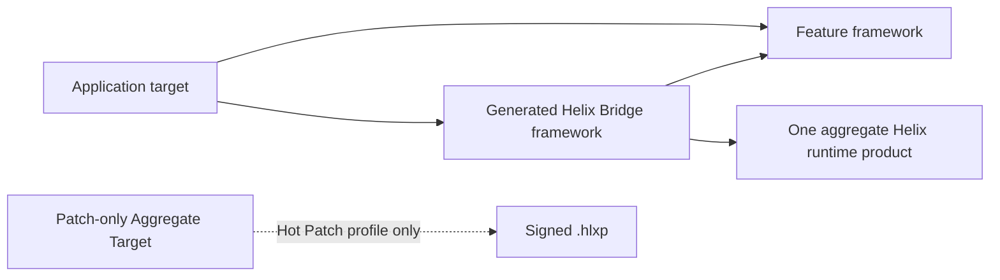

# Getting Started

[简体中文](Getting-Started.zh-CN.md)

This guide takes an existing Xcode application from “no Helix integration” to
one working development Live Reload profile and, optionally, one production
HLBC Hot Patch profile. The checked-in demo is the executable reference; use
this guide to understand which pieces must be reproduced in a real project.

## 1. Choose the workflow you need

You may integrate either or both workflows, but keep their targets and build
configurations separate.

| Need | Profile | App runtime | Typical Scheme |
| --- | --- | --- | --- |
| Save an existing Swift body and update a running Debug page | `liveReload` | `HelixDevAppRuntime` | A shared Debug Run Scheme |
| Build a signed HLBC package for a frozen released Shell | `hotPatch` | `HelixAppRuntime` | A Release Build/Archive Scheme plus a Patch-only Aggregate Scheme |

Start with Live Reload on one small feature module. Add a Hot Patch profile only
after the team understands the Release Shell, archive retention, signing, and
distribution-policy responsibilities.

## 2. Prepare the project shape

Helix works at a Swift module boundary. Select or create a feature framework
that owns the source files you want to reload or patch. The App consumes that
feature through its normal public API.

Each profile uses this target shape:



The Feature target contains handwritten business sources. The generated Bridge
target contains only Helix Derived Sources: permanent entries, build contracts,
Reload Index data, and NativeImport factories. The App embeds and signs both
frameworks.

Do not begin with an enormous monolithic App module unless it is unavoidable.
Every patch compile must re-type-check the complete selected module, so a
focused feature boundary improves correctness, build latency, and reviewability.

## 3. Add the package products

Add Helix as a Swift package dependency to the Xcode project. For each App
configuration, link one aggregate product and no overlapping runtime leaves:

- Release or Hot Patch App: `HelixAppRuntime`
- Debug or Live Reload App: `HelixDevAppRuntime`

Build-side products such as Compiler, Build Tools, Release Tools, Dev Tools, and
the CLI do not belong in an iOS App target. The generated scripts invoke the
macOS `helix` executable.

## 4. Create the Host Plan

Create `HelixXcode.json` in the project root. It is the checked-in, human-
reviewed description of stable target and workflow facts. It must not contain a
device UDID, DerivedData path, session secret, or private-key content.

A minimal Live Reload plan looks like this:

```json
{
  "schemaVersion": 2,
  "projectPath": "Store.xcodeproj",
  "integrationRoot": ".helix/xcode",
  "features": [
    {
      "id": "checkout",
      "moduleName": "CheckoutFeature",
      "bridgeModuleName": "CheckoutFeatureHelixBridge",
      "sourceRoot": "CheckoutFeature",
      "patchConfigurationPath": "Configurations/Checkout.yml",
      "sourceFiles": [
        "Sources/CheckoutViewController.swift",
        "Sources/CheckoutModel.swift"
      ]
    }
  ],
  "profiles": [
    {
      "id": "checkout-live",
      "workflow": "liveReload",
      "schemeName": "Store Live Reload",
      "applicationTargetName": "Store",
      "configurationName": "Debug",
      "bundleIdentifier": "com.example.store",
      "namespaceSeed": "store-checkout-live",
      "featureID": "checkout"
    }
  ]
}
```

The `sourceFiles` list is the complete module context Helix must capture, not a
list of files expected to change today. Paths are safe, project-relative, and
must stay inside the declared source root.

The referenced patch configuration selects the source scope used when indexing
the module. A minimal file-scope configuration is:

```yaml
schema: 1
modules:
  CheckoutFeature:
    include:
      - Sources/**/*.swift
```

For a Hot Patch profile, add a separate `hotPatch` profile with a Release
configuration and a `patch` object. The object names the Patch Aggregate Target
and Scheme, output directory, Quick Patch recipe, trusted root, signing
certificate, private key, and optional Simulator inbox:

```json
{
  "id": "checkout-hot",
  "workflow": "hotPatch",
  "schemeName": "Store Hot Patch Shell",
  "applicationTargetName": "Store",
  "configurationName": "Release",
  "bundleIdentifier": "com.example.store",
  "namespaceSeed": "store-checkout-release",
  "featureID": "checkout",
  "patch": {
    "actionTargetName": "HelixPatchAction",
    "actionSchemeName": "Store Build Patch",
    "recipePath": "Configurations/QuickPatchRecipe.json",
    "trustedRootPath": ".helix/private/TrustedRoot.json",
    "signingCertificatePath": ".helix/private/SigningCertificate.json",
    "privateKeyPath": ".helix/private/PatchSigningKey.json",
    "outputRoot": ".helix/patches",
    "simulatorInboxPath": "Documents/Helix/Current.hlxp"
  }
}
```

The plan records where secrets must be found; it never contains them. Ignore
the private material, sessions, patch output, and local DerivedData. Development
trust material can be created for isolated demos with
`helix patch create-development-identity`; never use that identity in
production.

See [Demo/HelixXcode.json](../Demo/HelixXcode.json) for the complete two-profile
example.

## 5. Generate and validate the Integration Kit

Build or install the `helix` executable, then run from the project root:

```bash
swift run helix xcode generate \
  --plan HelixXcode.json \
  --output .helix/xcode

swift run helix xcode validate --plan HelixXcode.json
```

The generated kit contains canonical Host Plan and manifest files, shared and
per-profile xcconfig files, source file lists, thin lifecycle scripts, and a
generated `Integration.md` with the exact target/Scheme checklist. Commit the
non-secret kit if that matches the project's generated-artifact policy. Do not
edit individual generated files; change the Host Plan and regenerate.

Run validation in CI. It detects missing, extra, modified, stale, or incorrectly
permissioned generated artifacts and validates every declared Swift source.

## 6. Wire the Xcode targets once

For each profile:

1. Set `Profiles/<profile>/Feature.xcconfig` as the selected Feature target
   configuration's Base Configuration.
2. Create the `<Feature>HelixBridge` framework target and set
   `Profiles/<profile>/Bridge.xcconfig` as its Base Configuration.
3. Add every generated path in `FeatureSources.xcfilelist` and
   `BridgeSources.xcfilelist` to the corresponding target's Compile Sources
   phase once.
4. Make the App depend on, link, embed, and sign both Feature and Bridge
   frameworks.
5. Link the profile's one aggregate runtime product into the App and generated
   Bridge. Do not add the other aggregate or overlapping leaf runtimes.
6. Keep Feature, Bridge, and App source membership distinct. The same original
   and generated Swift source must never be compiled twice.

The Feature xcconfig routes selected sources through materialized Derived
Sources. `#sourceLocation` preserves diagnostics at editable files, while the
manifest separately records the physical compiled basename needed by Swift
private source-file imports.

## 7. Wire the Scheme lifecycle

Use the generated scripts at these exact lifecycle points:

| Workflow | Xcode location | Script | Build settings supplied by |
| --- | --- | --- | --- |
| Both | First Scheme Build pre-action | `prepare.sh` | Feature target |
| Hot Patch | Last Scheme Build post-action | `audit.sh` | App target |
| Live Reload | Scheme Run pre-action | `live-start.sh` | App target |
| Live Reload | Scheme Run post-action | `live-stop.sh` | App target |
| Live Reload | Run action custom LLDB init file | `$(HELIX_LLDB_INIT_FILE)` | Scheme setting |
| Patch build | Patch Aggregate Target's only Run Script | `patch.sh` | Aggregate target/profile xcconfig |

For Hot Patch, create the Aggregate Target named in the plan, give it the
profile xcconfig, and create a shared Patch Scheme containing only that target.
If the Patch Scheme also builds the App, it can overwrite the frozen baseline
and is incorrectly configured.

Do not start the Live daemon from a Build post-action. The Run pre-action binds
one daemon and one-use credential to the actual Run lifecycle. The generated
LLDB init uses `target.env-vars` for LLDB-owned launches and a bounded Python
installer for Xcode's dummy-target/late-attach ordering. The installer waits
for the running real target, briefly stops it, injects the complete environment
through one LLDB command-interpreter expression, and always resumes it. The
retained `DevRuntime.ApplicationSession` polls the exported C probe when its
initial environment is empty. The ready marker is injected last, so partial
credentials fail closed. Keep `debuggerHandoffEnabled` at its default `true`
for this Scheme. The Run post-action is the eager stop path; if Xcode skips it,
the supervised daemon stops and removes private handoff files five seconds
after the authenticated App remains disconnected.

## 8. Bootstrap the App runtime

Generated Bridge types expose the build contracts and bootstrap function. Keep
the application session alive for the lifetime of the App.

### Debug / Live Reload

The core shape is:

```swift
import HelixDevRuntime
import HelixLiveReloadAPI
import CheckoutFeatureHelixBridge

@MainActor
final class DevelopmentRuntimeOwner {
    let environment = DevRuntime.LiveReloadEnvironment()
    let session: DevRuntime.ApplicationSession

    init() throws {
        let runtime = try CheckoutFeatureBridge.makeRuntime()
        session = try DevRuntime.ApplicationSession(
            build: CheckoutFeatureBridge.makeDevBuildContract(),
            runtime: runtime,
            shell: CheckoutFeatureBridge.makeShellInterface(),
            environment: environment,
            installBridge: CheckoutFeatureBridge.bootstrap,
            options: .init(
                supportedBackends: [.nativeDynamicReplacement, .hlbc],
                nativeChainingProbePassed: true
            )
        )
    }
}
```

The example sets the Native qualification bit because the checked-in Simulator
matrix is the intended development target. Do not set it for a physical-device
matrix that has not been qualified. Register each reloadable UIKit type with a
stable `NominalTypeID`, or add SwiftUI `.liveReloadBoundary(...)` wrappers.
Implement `LiveReload.Reloadable` for pages that need application-specific,
idempotent refresh work.

Call `environment.startOverlay()` only after the business window is key and
visible. The overlay is optional; the session itself is not.

### Release / Hot Patch

A Release owner constructs `PatchRuntime.ApplicationSession` from the generated
patch build contract, Shell interface, runtime and bootstrap function, plus:

- an installation ID that remains stable for this App installation;
- an Application Support directory for the Patch Store;
- trusted roots embedded as immutable App resources;
- an explicit acceptance policy containing only approved distribution policies
  and policy IDs;
- the current trusted time.

At a successful healthy launch, call the session's health-marking API after the
App reaches its declared healthy point. Install downloaded or locally staged
packages through `install(localPackageURL:nowUnixSeconds:)`; do not write routes
directly into `Runtime.GenerationRegistry`. The checked-in
[HotPatchDemo.Application.swift](../Demo/HotPatchDemo/HotPatchDemo.Application.swift)
is a concrete implementation.

## 9. Validate the wiring

Run static checks before the first App build:

```bash
swift run helix xcode validate --plan HelixXcode.json
swift run helix xcode doctor --plan HelixXcode.json \
  --profile checkout-live --static
swift run helix xcode doctor --plan HelixXcode.json \
  --profile checkout-hot --static
```

During a generated Xcode phase, active doctor checks also compare the live build
environment, target, configuration, compiler, output paths, bundle identity,
and integration artifacts.

Before accepting the integration, verify:

- the complete Feature source set is in the Host Plan;
- Feature, Bridge, and App source membership does not overlap incorrectly;
- frameworks are embedded, signed, and load through `@rpath`;
- Release and Debug each link only their intended aggregate runtime;
- lifecycle actions use the correct build-settings provider;
- the Patch Scheme contains only the Aggregate Target;
- secrets and local artifacts are ignored;
- each visible page has an explicit refresh policy;
- `validate`, `doctor`, Release audit, iOS runtime tests, and at least one real
  demo flow pass.

## 10. Perform the first Live Reload

1. Select the shared Live Reload Scheme and a Simulator.
2. Click Run once. The Build pre-action materializes the Dev Shell; the Run
   pre-action starts the authenticated daemon; LLDB launches the App with the
   one-run session material.
3. Navigate to a registered page and change in-memory state so state retention
   is visible.
4. Edit only the body of an indexed Swift declaration and save. Do not click
   Build.
5. Watch the terminal or overlay for compile, transfer, `codeActive`, and UI
   refresh status.
6. Save a second edit to verify chaining, then restore the baseline text and
   save again. Restoring source creates another replacement generation.
7. Stop the Xcode Run. The Run post-action requests eager termination; if
   Xcode skips that action, the supervised daemon self-terminates and cleans
   private handoff files after the five-second reconnect grace period.

If the result is `codeActive` plus `manualRefreshRequired`, the replacement is
working but the page lacks a safe reload rule. Add an invalidation hint,
idempotent `Reloadable` hook, registered factory, or SwiftUI boundary.

## 11. Build the first Hot Patch

1. Select the Hot Patch Shell Scheme and build, run, or archive the Release
   configuration. The post-action finalizes the real executable identity,
   audits the complete App bundle, and freezes `ReleaseBaseline.json`.
2. Preserve that App and baseline. Do not rebuild it after making the incident
   edit.
3. Change an eligible Swift implementation while keeping the complete module
   source set, interface, toolchain, SDK, target and archived identity intact.
4. Update the Quick Patch recipe with a unique package/campaign revision,
   incident, validity, resource, rollout, rollback, and policy information.
   Adapt the checked-in
   [demo recipe](../Demo/Configurations/QuickPatchRecipe.json) rather than
   inventing field names.
5. Build the Patch-only Scheme. It type-checks the frozen module, emits and
   verifies HLBC, signs `.hlxp`, and optionally stages it to a booted Simulator
   containing the already installed App.
6. Feed the package to `PatchRuntime.ApplicationSession.install(...)`. A local
   inbox is only a mock transport; verification, storage, anti-rollback, WAL,
   activation, health, and rollback remain the production client path.
7. Exercise rollback and confirm the original behavior returns without
   rebuilding or reinstalling the App.

The current release builder accepts only internal and enterprise HLBC policies.
It rejects App Store and controlled-native Release configurations.

## Common failures

| Symptom | Meaning and action |
| --- | --- |
| Generated kit is stale or modified | Regenerate from the Host Plan and review the diff; do not hand-edit the kit |
| Captured frontend invocation is missing | Verify the Live Feature uses the generated xcconfig and compiler proxy, then perform one clean Run |
| Private member is unavailable | Check the compiled physical source basename in the manifest; `#sourceLocation` alone is not private identity |
| Interface or source-membership changed | This is not a body-only transaction; perform a full build |
| No eligible patch change | The body matches the frozen baseline or the declaration is outside the patchable surface |
| Release baseline mismatch | Restore the exact audited source, Xcode/SDK, target, configuration, and binary identity |
| Code is active but UI is unchanged | Add or correct the page's reload policy; do not replay lifecycle methods manually |
| Native image limit warning or hard stop | Stop and Run the Debug App again; Helix deliberately does not `dlclose` Swift replacement images |
| Simulator package staging fails | Boot exactly one intended Simulator and install the matching Release App before building the Patch Scheme |

For the underlying behavior and limits, continue with
[Architecture](Architecture.md), [Development Live Reload](Development-Live-Reload.md),
[Production Hot Patching](Production-Hot-Patching.md), and
[Capabilities and Limits](Capabilities-and-Limits.md).
