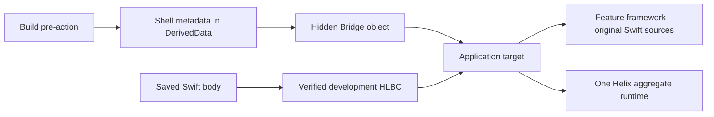

# Getting Started

[简体中文](Getting-Started.zh-CN.md)

This guide integrates one Swift feature module with Helix. The important
property of the current design is that generated Swift never becomes an Xcode
source file: developers keep editing the original Feature sources, while Helix
materializes and compiles its Bridge privately under DerivedData.

## 1. Choose a workflow

| Need | Host configuration | Runtime product |
| --- | --- | --- |
| Save an existing Swift body and update a running Debug page | `liveReload` | `HelixDevAppRuntime` |
| Build a signed HLBC package for an audited Release Shell | `hotPatch` | `HelixAppRuntime` |

The workflows share compiler facts and stable identities, but their runtime
products, transports, trust, and artifacts remain separate. An App target must
link exactly one aggregate runtime product for a given configuration.

## 2. Select a Feature module

Helix works at a Swift module boundary. Prefer a focused framework that owns the
implementations you want to reload or patch. Its normal target continues to
compile the original handwritten files.



There is no generated Bridge framework, generated source target, generated
source membership, or generated import in application code. The App links one
private relocatable object produced before its Sources phase. That object
exports a stable provider symbol and is otherwise an implementation detail.

## 3. Add the package

Add Helix as a Swift package dependency. Link only one of these products into
the App configuration:

- Debug Live Reload: `HelixDevAppRuntime`
- Release Hot Patch: `HelixAppRuntime`

The Feature target does not need a Helix runtime product. Build-side products
and the `helix` executable run on macOS and must not enter a Release App bundle.

## 4. Describe the integration

Create a checked-in `HelixXcode.json` at the project root. Schema 3 records
stable project facts only; it contains no DerivedData path, device ID, session
credential, or generated module name.

```json
{
  "schemaVersion": 3,
  "projectPath": "Store.xcodeproj",
  "integrationRoot": ".helix/xcode",
  "features": [
    {
      "id": "checkout",
      "moduleName": "CheckoutFeature",
      "sourceRoot": "CheckoutFeature",
      "patchConfigurationPath": "Configurations/Checkout.yml",
      "sourceFiles": [
        "Sources/CheckoutViewController.swift",
        "Sources/CheckoutModel.swift"
      ]
    }
  ],
  "profiles": [
    {
      "id": "checkout-live",
      "workflow": "liveReload",
      "schemeName": "Store Live Reload",
      "applicationTargetName": "Store",
      "configurationName": "Debug",
      "bundleIdentifier": "com.example.store",
      "namespaceSeed": "store-checkout-live",
      "featureID": "checkout"
    }
  ]
}
```

`sourceFiles` is the complete module context, not a list of files expected to
change today. Every path is relative to `sourceRoot`. The patch configuration
selects declarations from those same logical paths:

```yaml
schema: 1
modules:
  CheckoutFeature:
    include:
      - Sources/**/*.swift
```

A Hot Patch profile uses a Release configuration and adds the `patch` object
shown in [Demo/HelixXcode.json](../Demo/HelixXcode.json). It names the
Patch-only Aggregate target and Scheme, recipe, trust files, output directory,
and optional Simulator inbox. Secret contents never belong in the Host Plan.

## 5. Generate the Integration Kit

```bash
swift run helix xcode generate --plan HelixXcode.json
swift run helix xcode validate --plan HelixXcode.json
```

The output root comes from `integrationRoot`; passing `--output` is optional.
The kit contains canonical contracts, xcconfig files, and thin lifecycle
scripts. It deliberately contains no Xcode source list and asks the project to
reference no generated Swift file. Change the Host Plan and regenerate instead
of editing individual kit files.

## 6. Perform the one-time Xcode wiring

For each profile, follow its generated `.helix/xcode/Integration.md`:

1. Keep the Feature's ordinary Swift files in its existing Sources phase and
   set `Profiles/<profile>/Feature.xcconfig` as that configuration's Base
   Configuration.
2. Set `Profiles/<profile>/Application.xcconfig` as the App configuration's
   Base Configuration.
3. Add one App Run Script phase **before App Sources**:

   ```sh
   /bin/sh "$(HELIX_INTEGRATION_ROOT)/Profiles/<profile>/bridge.sh"
   ```

   Declare `$(HELIX_BRIDGE_OBJECT)` as its output. Do not add that object or any
   file below `$(HELIX_BUILD_ROOT)` to the Project navigator.
4. Link the Feature framework and the profile's single aggregate runtime into
   the App. There is no Bridge target or Bridge framework to link or embed.

`HelixAppRuntime` contains only production hot-patch modules.
`HelixDevAppRuntime` additionally carries the Dev protocol, Live Reload API,
transport, activation, and UI tooling. The Live Reload API is not a standalone
package product and cannot enter Release through the documented aggregate.

`Application.xcconfig` adds the hidden object to `OTHER_LDFLAGS` and forces the
provider symbol `_hlx_bridge_provider_v1` to remain reachable. The build phase
reconstructs the successful Feature compiler invocation, compiles the generated
Bridge in an isolated temporary directory, validates its architecture and
platform, then atomically publishes `HelixBridge.o` under DerivedData.

## 7. Wire the Scheme lifecycle

| Workflow | Xcode location | Generated script | Build settings from |
| --- | --- | --- | --- |
| Both | First Scheme Build pre-action | `prepare.sh` | Feature target |
| Hot Patch | Last Scheme Build post-action | `audit.sh` | App target |
| Live Reload | Scheme Run pre-action | `live-start.sh` | App target |
| Live Reload | Scheme Run post-action | `live-stop.sh` | App target |
| Live Reload | Run custom LLDB init file | `$(HELIX_LLDB_INIT_FILE)` | Scheme |
| Patch build | Patch Aggregate target Run Script | `patch.sh` | Aggregate target |

The compiler proxy is scoped to the Feature target. It transparently forwards
the real `swiftc` invocation and stores a permission-restricted, atomic capture
for later live generations. The App, packages, and unrelated targets keep Xcode's
normal driver.

The Live Run pre-action creates a one-run authenticated session. The LLDB init
injects its credentials without checking them into the Scheme. Keep the default
debugger handoff enabled; it covers Xcode's late-attach launch ordering. The Run
post-action stops eagerly, while the daemon also has a bounded disconnect
cleanup path.

## 8. Start the runtime without generated imports

### Debug / Live Reload

Keep one session alive for the App lifetime:

```swift
import HelixDevRuntime

@MainActor
final class DevelopmentRuntimeOwner {
    let session: DevRuntime.ApplicationSession

    init() throws {
        session = try DevRuntime.ApplicationSession(environment: .init())
    }
}
```

Ordinary App code imports only the stable runtime module. At startup,
`Runtime.LinkedBridge` resolves `hlx_bridge_provider_v1` from the current
process image. The provider supplies the exact Build Contract, Shell interface,
Runtime factory, and Bridge installer through a type-erased API. A missing or
mismatched hidden object fails startup explicitly instead of silently disabling
Helix.

The public default accepts only authenticated HLBC live artifacts. Native
Dynamic Replacement can be selected only through the internal experimental
configuration and is not required for App integration.

### Release / Hot Patch

Release code uses the same automatic provider and supplies only product-owned
storage and policy:

```swift
let session = try PatchRuntime.ApplicationSession(
    installationID: installationID,
    storeRootURL: patchStoreURL,
    trustStore: trustStore,
    acceptancePolicy: acceptancePolicy,
    nowUnixSeconds: now
)
```

The App still owns trusted roots, installation identity, accepted distribution
policies, health marking, download transport, and rollback UX. See
[HotPatchDemo.Application.swift](../Demo/HotPatchDemo/HotPatchDemo.Application.swift)
for the complete composition.

## 9. Understand automatic UI refresh

UIKit no longer requires a `typeRegistry`. For every reload hint, Helix:

1. derives the same stable `(module, canonical type name)` identity used by the
   compiler from the runtime class name;
2. walks each concrete class's superclass chain, so a changed base controller
   also matches displayed subclasses;
3. traverses foreground App windows and their presented/navigation/tab/split/
   child controller graphs;
4. matches visible controller instances first, then scans their loaded view
   trees for remaining UIView type IDs; and
5. applies the inferred invalidation policy to the existing instance.

Common layout and drawing callbacks therefore need no App registration and no
manual hook. Helix requests constraints/layout/display invalidation and performs
immediate layout only when no controller transition is active.

Some behaviors remain explicit by design:

- A `viewDidLoad`/initialization change is not blindly replayed. Use an
  idempotent `LiveReload.Reloadable` hook, or register a factory when the page
  must be reconstructed.
- Broad table/collection `reloadData()` is opt-in because it can trigger
  application side effects.
- SwiftUI has value instances rather than a discoverable UIKit object graph;
  wrap the relevant subtree in `.liveReloadBoundary(for:)`.
- Model/service and event-handler changes activate code but normally request no
  UI work.

Factory registration is an advanced recreation facility, not a prerequisite
for ordinary Live Reload.

## 10. Validate and try Live Reload

```bash
swift run helix xcode doctor \
  --plan HelixXcode.json \
  --profile checkout-live \
  --static
```

Then:

1. Run the shared Live Reload Scheme once.
2. Navigate to the UIKit page you want to edit and change some in-memory state.
3. Edit only the body of an indexed declaration and save; do not Build.
4. Confirm compile, transfer, `codeActive`, and `UI refreshed` separately.
5. Save another edit to verify that a later HLBC generation atomically replaces
   the first one in the same App process.

Changing an existing native stored layout, signature, inheritance, conformance,
enum cases, actor isolation, source membership, linked dependencies, or build
settings requires a normal build. A changed root may use newly introduced
reachable ordinary helpers, private class methods, computed accessors, and
non-exported file/module-scope struct, enum, or pure class types declared in an
existing watched source file. A new `final` class may also inherit an
HLXI-frozen, `NSObject`-compatible project or system type under the closed
hosted profile and cross into native code as that superclass; the current
profile permits only inherited no-argument initialization, no new stored
properties, and no-argument/Bool `Void` overrides. Adding a new file or
arbitrary native Swift metadata remains outside this workflow.

## 11. Build a Hot Patch

1. Build/archive the Release Shell Scheme. Its post-action finalizes the real
   executable identity, audits the bundle, and freezes the baseline.
2. Preserve that exact build and complete source context.
3. Change an eligible implementation without changing its interface.
4. Update the patch recipe with a new revision, incident, validity, limits,
   rollout, rollback, and policy data.
5. Build the Patch-only Scheme. It emits verified HLBC and signs `.hlxp`
   without rebuilding or reinstalling the App.
6. Deliver the bytes through your transport and call
   `PatchRuntime.ApplicationSession.install(...)`.

The current Release builder accepts internal and enterprise HLBC policies. It
rejects App Store and controlled-native Release configurations.

## Common failures

| Symptom | Meaning and action |
| --- | --- |
| Linked Bridge provider is missing | The App does not use `Application.xcconfig`, the hidden phase is after Sources, or its output/link flags are absent |
| Feature compiler capture is missing/stale | Use `Feature.xcconfig` and perform one clean Run with the correct Scheme |
| Source is indexed but no root is patchable | Check that the patch configuration pattern is relative to `sourceRoot` and includes the logical path |
| Code is active but UI is unchanged | The changed function is observe-only, no displayed UIKit/SwiftUI target matches, or explicit hook/factory work is required |
| Interface or source membership changed | This is not a body-only transaction; perform a full build |
| HLBC lowering reports an unsupported construct | Follow the precise diagnostic, simplify the edit to the supported subset, or perform a normal build |
| Release baseline mismatch | Restore the audited sources, Xcode/SDK, target, configuration, and binary identity |

Continue with [Architecture](Architecture.md),
[Development Live Reload](Development-Live-Reload.md),
[Production Hot Patching](Production-Hot-Patching.md), and
[Capabilities and Limits](Capabilities-and-Limits.md).
