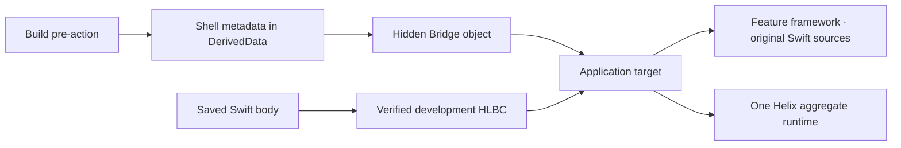

# Getting Started

[简体中文](Getting-Started.zh-CN.md)

This guide integrates one Swift feature module with Helix. The important
property of the current design is that generated Swift never becomes an Xcode
source file: developers keep editing the original Feature sources, while Helix
materializes and compiles its Bridge privately under DerivedData.

## 1. Choose a workflow

| Need | Host configuration | Runtime product |
| --- | --- | --- |
| Save an existing Swift body and update a running Debug page | `liveReload` | `HelixDevAppRuntime` |
| Build a signed HLBC package for an audited Release Shell | `hotPatch` | `HelixAppRuntime` |

The workflows share compiler facts and stable identities, but their runtime
products, transports, trust, and artifacts remain separate. An App target must
link exactly one aggregate runtime product for a given configuration.

## 2. Select a Feature module

Helix works at a Swift module boundary. Prefer a focused framework that owns the
implementations you want to reload or patch. Its normal target continues to
compile the original handwritten files.



There is no generated Bridge framework, generated source target, generated
source membership, or generated import in application code. The App links one
private relocatable object produced before its Sources phase. That object
exports a stable provider symbol and is otherwise an implementation detail.

## 3. Add the App runtime dependency

Choose SwiftPM or CocoaPods. Link only one runtime into an App configuration:

- Debug Live Reload: `HelixDevAppRuntime`
- Release Hot Patch: `HelixAppRuntime`

With SwiftPM, add the Helix package and link the same-named product. App source
continues to import the leaf API module, such as `HelixDevRuntime` or
`HelixPatch`. With CocoaPods, use separate App targets:

```ruby
target 'HotPatchApp' do
  pod 'HelixAppRuntime',
      :git => 'https://github.com/TangentW/Helix.git',
      :branch => 'main'
end

target 'LiveReloadApp' do
  pod 'HelixDevAppRuntime',
      :git => 'https://github.com/TangentW/Helix.git',
      :branch => 'main'
end
```

Pin a tag or commit for a production project. The podspecs can also live in a
private Specs repository; Helix does not need to be published to CocoaPods
trunk. CocoaPods App source imports `HelixAppRuntime` or
`HelixDevAppRuntime` because each Pod is a self-contained aggregate module.
The hidden Bridge selects the SwiftPM leaf modules or CocoaPods aggregate at
compile time without an application setting.

The Feature target does not need a Helix runtime dependency. Build-side
products and the `helix` executable run on macOS and must not enter a Release
App bundle. Git, private-spec, and local `:path` installations all compile the
same checked-in Runtime sources directly; no preparation command or generated
source directory is involved. See [CocoaPods/README.md](../CocoaPods/README.md)
for the exact source boundary and validation commands.

## 4. Open Helix and choose the project

The user-facing macOS application is named **Helix**. In this repository it is
built from `Hub/`:

```bash
Hub/Scripts/build-app.sh release
open Hub/.build/Helix.app
```

The status-bar UI is a thin frontend. Project parsing, deterministic planning,
file transactions, service ownership, pairing, and Build Context registration
are reusable `Sources` modules, so headless tools do not depend on SwiftUI.

Choose an `.xcodeproj`, `.xcworkspace`, or a source directory. A workspace is
resolved to concrete projects; if it contains more than one, Helix asks which
project to configure. This discovery step is read-only.

## 5. Configure the workflows in the GUI

A new project starts with Hot Patch and Live Reload selected. For each selected
workflow choose:

- an App target;
- the Swift Feature target that owns the editable implementations;
- a shared Scheme;
- one configuration present on both targets.

Helix resolves the module name and bundle identifier from Xcode's real build
settings. Profile identity, namespace, patch recipe, trust files, output path,
and optional Simulator inbox remain editable under Advanced settings. A skipped
workflow stays available for later installation. An installed workflow cannot
be silently disabled, and the integration root is locked after the first
installation so reconfiguration cannot leave stale PBX references behind.

Hot Patch and Live Reload require distinct App targets. The Release target must
link only `HelixAppRuntime`; the development target must link only
`HelixDevAppRuntime`. Helix detects SwiftPM products and App-target CocoaPods
xcconfig linkage, then reports a code-level action when one is missing. It does
not inject dependency linkage or application startup code.

## 6. Apply and review the project transaction

Click **Configure Project**. Helix rereads the project, resolves exact build
settings, builds one canonical plan, and commits every owned mutation together.
If validation or a write fails, no partial project state is kept.

The transaction creates or updates:

| Area | What Helix owns |
| --- | --- |
| Public plan | `.helix/xcode/HostPlan.json`, profile contracts, manifest, and generated guide |
| Compiler selection | one `Configurations/Helix/<feature>.yml` with project-wide source discovery and explicit entrypoint policy |
| Xcode settings | wrapper xcconfigs that preserve the target's previous Base Configuration |
| Bridge | one App phase before Sources; generated Swift and `HelixBridge.o` stay under DerivedData |
| Scheme lifecycle | Build preparation, Release audit, exact Live executable registration, and Patch build action |
| Hot Patch | an empty Aggregate target used only as a Patch Scheme anchor, recipe, output paths, and optional local development trust material |
| Live Reload networking | `_helix._tcp` plus a local-network usage description in the App plist |

For an explicit existing `Info.plist`, Helix preserves unrelated keys and an
existing nonempty usage description while adding the missing Bonjour service.
For a target that asked Xcode to generate its plist, Helix creates a small
Hub-owned plist and points only that configuration at it. A configured plist
path that is missing is an error; Helix does not guess a replacement.

Generated Swift is never added to the project navigator, target membership, or
Compile Sources. The phase compiles the Bridge privately using the captured
Feature invocation, validates its platform and architecture, and atomically
publishes the object before the App links it. The stable provider symbol lets
the runtime load the exact Shell contract without a generated import.

The generated Xcode dispatcher locates the exact `helix` helper published by
the running service in an owner-only rendezvous file. A packaged Helix app ships
that helper inside `Contents/Helpers`. Normal projects need neither
`HELIX_EXECUTABLE` nor a shell `PATH` edit.

The local Dev Protocol and service-rendezvous schema use version 1. Helix
accepts exactly that version and fails closed on every other value; it does not
migrate, reinterpret, or selectively delete local state based on historical
version numbers. Pre-release state has no compatibility contract; invalid local
artifacts must be removed and regenerated by the configured Xcode build.

Service and pairing failures are shown inline in the status-bar panel, so the
panel does not disappear behind a separate alert. Use **Retry** after correcting
the reported condition; retrying never terminates an independently launched
headless service.

## 7. Understand the generated Xcode lifecycle

| Workflow | Xcode location | Purpose |
| --- | --- | --- |
| Both | first Scheme Build pre-action | prepare the exact Feature Shell and capture contract |
| Hot Patch | last Scheme Build post-action | finalize the linked executable and audit the complete Release bundle |
| Live Reload | Scheme Run pre-action | register the exact final executable and activate its reserved invitation |
| Patch build | Patch Scheme Build pre-action, App as `EnvironmentBuildable` | compile, sign, and optionally stage `.hlxp` without rebuilding the App |

Live Reload uses Xcode's ordinary Apple debugger. The Build pre-action reserves
a one-time invitation; the hidden Bridge contains only that invitation and the
persistent Helix Host Identity pin. After link, the Run pre-action registers the
exact executable UUID and Build Context. There is no custom LLDB init, Python
installer, launch environment, Run post-action, host address, port, or session
secret in the project.

The Feature compiler proxy is limited to the selected Feature configuration. It
forwards every real `swiftc` argument and commits an owner-only capture used by
later saves. App, package, and unrelated targets keep Xcode's normal driver.

## 8. Start the runtime without generated imports

### Debug / Live Reload

Keep one session alive for the App lifetime:

```swift
#if canImport(HelixDevAppRuntime)
import HelixDevAppRuntime // CocoaPods
#else
import HelixDevRuntime
#endif

@MainActor
final class DevelopmentRuntimeOwner {
    let session: DevRuntime.ApplicationSession

    init() throws {
        session = try DevRuntime.ApplicationSession(environment: .init())
    }
}
```

Keep the owner for the process lifetime. In an App with an existing debug menu,
present the reusable pairing/status page for direct launches:

```swift
NavigationLink("Helix") {
    DevRuntime.PairingView(session: runtimeOwner.session)
}
```

The same operation is also available without SwiftUI:

```swift
try await runtimeOwner.session.connect(pairingCode: "AB2C")
```

An App launched by the Xcode debugger locks into automatic mode at process
startup, discovers the single `_helix._tcp` service, verifies the compiled Host
pin, and redeems the build-scoped invitation. Opening the installed App later
from the Home Screen creates a new process in manual mode. It performs no
Bonjour browsing or network access until the developer enters the current
four-character Helix code and confirms. Attaching a debugger later does not
change that decision, and a manual pairing is not persisted to the next launch.

Ordinary App code imports only the stable runtime module. At startup,
`Runtime.LinkedBridge` resolves `hlx_bridge_provider_v1` from the current
process image. The provider supplies the exact Build Contract, Shell interface,
Runtime factory, and Bridge installer through a type-erased API. A missing or
mismatched hidden object fails startup explicitly instead of silently disabling
Helix.

The public default accepts only authenticated HLBC live artifacts. Native
Dynamic Replacement can be selected only through the internal experimental
configuration and is not required for App integration.

### Release / Hot Patch

Release code uses the same automatic provider and supplies only product-owned
storage and policy:

```swift
#if canImport(HelixAppRuntime)
import HelixAppRuntime // CocoaPods
#else
import HelixCore
import HelixPatch
#endif

let session = try PatchRuntime.ApplicationSession(
    installationID: installationID,
    storeRootURL: patchStoreURL,
    trustStore: trustStore,
    acceptancePolicy: acceptancePolicy,
    nowUnixSeconds: now
)
```

The App still owns trusted roots, installation identity, accepted distribution
policies, health marking, download transport, and rollback UX. See
[HotPatchDemo.Application.swift](../Demo/HotPatchDemo/HotPatchDemo.Application.swift)
for the complete composition.

## 9. Understand automatic UI refresh

UIKit no longer requires a `typeRegistry`. For every reload hint, Helix:

1. derives the same stable `(module, canonical type name)` identity used by the
   compiler from the runtime class name;
2. walks each concrete class's superclass chain, so a changed base controller
   also matches displayed subclasses;
3. traverses foreground App windows and their presented/navigation/tab/split/
   child controller graphs;
4. matches visible controller instances first, then scans their loaded view
   trees for remaining UIView type IDs; and
5. applies the inferred invalidation policy to the existing instance.

Common layout and drawing callbacks therefore need no App registration and no
manual hook. Helix requests constraints/layout/display invalidation and performs
immediate layout only when no controller transition is active.

Some behaviors remain explicit by design:

- A `viewDidLoad`/initialization change is not blindly replayed. Use an
  idempotent `LiveReload.Reloadable` hook, or register a factory when the page
  must be reconstructed.
- Broad table/collection `reloadData()` is opt-in because it can trigger
  application side effects.
- SwiftUI has value instances rather than a discoverable UIKit object graph;
  wrap the relevant subtree in `.liveReloadBoundary(for:)`.
- Model/service and event-handler changes activate code but normally request no
  UI work.

Factory registration is an advanced recreation facility, not a prerequisite
for ordinary Live Reload.

## 10. Validate and try Live Reload

```bash
swift run helix xcode doctor \
  --plan .helix/xcode/HostPlan.json \
  --profile checkout-live \
  --static
```

Then:

1. Run the shared Live Reload Scheme once.
2. Navigate to the UIKit page you want to edit and change some in-memory state.
3. Edit only the body of an indexed declaration and save; do not Build.
4. Confirm compile, transfer, `codeActive`, and `UI refreshed` separately.
5. Save another edit to verify that a later HLBC generation atomically replaces
   the first one in the same App process.

Changing an existing native stored layout, signature, inheritance, conformance,
enum cases, actor isolation, source membership, linked dependencies, or build
settings requires a normal build. A changed root may use newly introduced
reachable ordinary helpers, private class methods, computed accessors, and
non-exported file/module-scope struct, enum, or pure class types declared in an
existing watched source file. A new `final` class may also inherit an
HLXI-frozen, `NSObject`-compatible project or system type under the closed
hosted profile and cross into native code as that superclass; the current
profile permits only inherited no-argument initialization, no new stored
properties, and no-argument/Bool `Void` overrides. Adding a new file or
arbitrary native Swift metadata remains outside this workflow.

## 11. Build a Hot Patch

1. Build/archive the Release Shell Scheme. Its post-action finalizes the real
   executable identity, audits the bundle, and freezes the baseline.
2. Preserve that exact build and complete source context.
3. Change an eligible implementation without changing its interface.
4. Update the patch recipe with a new revision, incident, validity, limits,
   rollout, rollback, and policy data.
5. Build the Patch-only Scheme. It emits verified HLBC and signs `.hlxp`
   without rebuilding or reinstalling the App.
6. Deliver the bytes through your transport and call
   `PatchRuntime.ApplicationSession.install(...)`.

The current Release builder accepts internal and enterprise HLBC policies. It
rejects App Store and controlled-native Release configurations.

## Common failures

| Symptom | Meaning and action |
| --- | --- |
| Linked Bridge provider is missing | The App does not use `Application.xcconfig`, the hidden phase is after Sources, or its output/link flags are absent |
| Feature compiler capture is missing/stale | Use `Feature.xcconfig` and perform one clean Run with the correct Scheme |
| Source is indexed but no root is patchable | Check that the patch configuration pattern is relative to `sourceRoot` and includes the logical path |
| Code is active but UI is unchanged | The changed function is observe-only, no displayed UIKit/SwiftUI target matches, or explicit hook/factory work is required |
| Interface or source membership changed | This is not a body-only transaction; perform a full build |
| HLBC lowering reports an unsupported construct | Follow the precise diagnostic, simplify the edit to the supported subset, or perform a normal build |
| Release baseline mismatch | Restore the audited sources, Xcode/SDK, target, configuration, and binary identity |

Continue with [Architecture](Architecture.md),
[Development Live Reload](Development-Live-Reload.md),
[Production Hot Patching](Production-Hot-Patching.md), and
[Capabilities and Limits](Capabilities-and-Limits.md).
