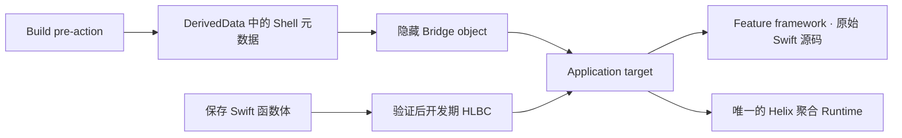

# 使用入门

[English](Getting-Started.md)

这份文档说明如何把一个 Swift Feature 模块接入 Helix。当前方案最重要的变化是：Helix 生成的 Swift 代码不会进入 Xcode 工程，也不需要开发者导入或引用。开发者始终修改原来的 Feature 源文件，Helix 只在 DerivedData 中生成并私下编译 Bridge。

## 1. 先选择工作流

| 需求 | Profile | App Runtime |
| --- | --- | --- |
| 保存已有 Swift 函数体，立即更新正在运行的 Debug 页面 | `liveReload` | `HelixDevAppRuntime` |
| 为经过审计的 Release Shell 构建签名 HLBC 补丁 | `hotPatch` | `HelixAppRuntime` |

两条路径共享编译器事实与稳定身份，但 Runtime、传输、信任材料和产物彼此隔离。同一个 App configuration 只能链接一个聚合 Runtime 产品。

## 2. 选择 Feature 模块

Helix 以 Swift module 为边界。建议先选一个职责清晰的 framework，包含需要热重载或热修复的实现。原 Feature target 仍然编译开发者手写的源文件。



这里不再存在生成 Bridge framework、生成源码 target、生成源码 target membership 或生成模块 import。App 只会在 Sources phase 之前链接一个私下生成的 relocatable object；它导出稳定的 provider 符号，其余内容都属于 Helix 内部实现。

## 3. 添加 Package

把 Helix 加为 Swift Package 依赖，并按 configuration 给 App 链接一个产品：

- Debug Live Reload：`HelixDevAppRuntime`
- Release Hot Patch：`HelixAppRuntime`

Feature target 不需要链接 Helix Runtime。Compiler、Build Tools、Dev Tools 与 `helix` CLI 只在 macOS 构建侧运行，不能进入 Release App bundle。

## 4. 打开 Helix 并选择工程

macOS 上给开发者看到的应用名是 **Helix**。在当前仓库中这样构建：

```bash
Hub/Scripts/build-app.sh release
open Hub/.build/Helix.app
```

菜单栏 UI 只是薄前端。工程解析、确定性计划、文件事务、Service ownership、配对与 Build Context 注册都在 `Sources`，所以 headless 工具不依赖 SwiftUI。

可以选择 `.xcodeproj`、`.xcworkspace` 或源码目录。Workspace 会先解析成具体 Project；如果存在多个候选，Helix 会让开发者明确选择。这一步只读，不会改工程。

## 5. 在 GUI 中配置能力

新工程默认勾选 Hot Patch 与 Live Reload。每一项需要选择：

- App target；
- 承载可修改实现的 Swift Feature target；
- shared Scheme；
- App 与 Feature 都存在的 configuration。

Helix 会从 Xcode 真实 Build Settings 解析 module name 与 bundle identifier。Profile identity、namespace、patch recipe、信任文件、输出目录和可选 Simulator inbox 放在高级配置中。首次没选的能力以后还能安装；已经安装的能力不能被静默关闭。第一次安装后，integration root 会锁定，避免重配置后留下旧目录和悬空 PBX 引用。

Hot Patch 与 Live Reload 必须使用不同 App target。Release target 只能链接 `HelixAppRuntime`，开发 target 只能链接 `HelixDevAppRuntime`。Helix 会检查产品并列出缺失的代码层动作，但不会偷偷注入 Package linkage 或 App 启动代码。

## 6. 应用并检查工程事务

点击 **Configure Project** 后，Helix 会重新读取工程、解析精确 Build Settings、生成一份 canonical plan，再一次性提交全部受管修改。校验或写入失败时不会保留半套工程状态。

事务会创建或更新：

| 区域 | Helix 管理的内容 |
| --- | --- |
| 公开计划 | `.helix/xcode/HostPlan.json`、profile contract、manifest 与生成说明 |
| 编译选择 | `Configurations/Helix/<feature>.yml`，按完整工程源码发现并明确 entrypoint policy |
| Xcode settings | 保留 target 原 Base Configuration 的 wrapper xcconfig |
| Bridge | App Sources 前的一个 phase；生成 Swift 与 `HelixBridge.o` 只留在 DerivedData |
| Scheme lifecycle | Build 准备、Release 审计、Live 最终 executable 注册与 Patch 构建动作 |
| Hot Patch | 只作为 Patch Scheme 锚点的空 Aggregate target、recipe、输出路径和可选本地开发信任材料 |
| Live Reload 网络 | App plist 中的 `_helix._tcp` 与本地网络用途说明 |

显式 `Info.plist` 会保留业务 key 和已有非空用途说明，只补缺少的 Bonjour service。原来由 Xcode 自动生成 plist 的 target，会得到一份很小的 Hub-owned plist，并且只让对应 configuration 使用它。如果工程明确配置了 plist 路径但文件不存在，Helix 会报错，不会猜一份替代文件。

生成 Swift 永远不会进入 Project Navigator、target membership 或 Compile Sources。Bridge phase 会复用已捕获的 Feature 编译参数，在 DerivedData 中私下编译，校验平台与架构，再在 App link 前原子发布 object。Runtime 通过稳定 provider symbol 取得精确 Shell contract，无需业务 import 生成模块。

生成的 Xcode dispatcher 会从 owner-only Service rendezvous 文件找到正在运行的 Helix 发布的精确 `helix` helper；打包后的 App 把 helper 放在 `Contents/Helpers`。普通工程无需设置 `HELIX_EXECUTABLE`，也不依赖 shell `PATH`。

## 7. 理解生成的 Xcode 生命周期

| 工作流 | Xcode 位置 | 用途 |
| --- | --- | --- |
| 两者 | Scheme Build 第一个 pre-action | 准备精确 Feature Shell 与捕获合同 |
| Hot Patch | Scheme Build 最后一个 post-action | finalize 已链接 executable 并审计完整 Release bundle |
| Live Reload | Scheme Run pre-action | 注册精确最终 executable，并激活预留邀请 |
| Patch 构建 | Patch Scheme Build pre-action，App 作为 `EnvironmentBuildable` | 不重建 App，直接编译、签名并可选 stage `.hlxp` |

Live Reload 使用 Xcode 默认 Apple debugger。Build pre-action 会预留一次性邀请，隐藏 Bridge 只保存邀请与持久 Helix Host Identity pin；App link 完成后，Run pre-action 再注册精确 executable UUID 与 Build Context。工程里没有自定义 LLDB init、Python installer、launch environment、Run post-action、host、port 或 session secret。

Feature compiler proxy 只作用于所选 Feature configuration。它逐项转发真实 `swiftc` 参数，并以 owner-only 方式提交后续保存所需的 capture。App、Package 与无关 target 继续使用 Xcode 默认 driver。

## 8. App 不再引用生成代码

### Debug / Live Reload

只需让一个 session 在 App 生命周期内保持存活：

```swift
import HelixDevRuntime

@MainActor
final class DevelopmentRuntimeOwner {
    let session: DevRuntime.ApplicationSession

    init() throws {
        session = try DevRuntime.ApplicationSession(environment: .init())
    }
}
```

这个 owner 要活到进程结束。已有调试菜单的 App 可以展示复用的配对与状态页：

```swift
NavigationLink("Helix") {
    DevRuntime.PairingView(session: runtimeOwner.session)
}
```

不使用 SwiftUI 时可以直接调用同一操作：

```swift
try await runtimeOwner.session.connect(pairingCode: "AB2C")
```

由 Xcode debugger 启动的 App 会在进程开始时锁定 automatic 模式，发现唯一 `_helix._tcp` 服务、验证编译进 Bridge 的 Host pin，再兑换构建范围邀请。之后从桌面直接打开同一已安装 App，会创建 manual 模式的新进程：开发者输入当前四位码并确认前，App 不浏览 Bonjour，也不访问本地网络。进程启动后再 attach debugger 不会改变模式，手动配对也不会保存到下次启动。

业务代码只 import 稳定 Runtime module。启动时，`Runtime.LinkedBridge` 从当前进程 image 解析 `hlx_bridge_provider_v1`。Provider 通过 type-erased API 提供精确 Build Contract、Shell interface、Runtime factory 与 Bridge installer。隐藏 object 缺失或身份不匹配时会明确启动失败，不会悄悄把 Helix 关闭。

公开默认配置只接受经过认证的 HLBC live artifact。Native Dynamic Replacement 只能通过内部实验配置显式选择，不是 App 接入前置条件。

### Release / Hot Patch

Release 路径同样自动发现 provider，App 只提供自己的存储与策略：

```swift
let session = try PatchRuntime.ApplicationSession(
    installationID: installationID,
    storeRootURL: patchStoreURL,
    trustStore: trustStore,
    acceptancePolicy: acceptancePolicy,
    nowUnixSeconds: now
)
```

可信根、installation identity、允许的分发策略、健康标记、下载传输与回滚交互仍由产品负责。完整实现见 [HotPatchDemo.Application.swift](../Demo/HotPatchDemo/HotPatchDemo.Application.swift)。

## 9. UIKit 页面无需 typeRegistry

每个 reload hint 到达后，Helix 会自动完成：

1. 从运行时类名还原编译器使用的稳定 `(module, canonical type name)` identity；
2. 沿具体类的 superclass 链匹配，因此修改基类也能命中正在展示的子类实例；
3. 遍历前台 App window，以及 presented/navigation/tab/split/child controller 图；
4. 先匹配可见 controller，再针对尚未命中的类型扫描其已加载 view tree；
5. 把推导出的 invalidation policy 应用到现有实例。

因此常见 layout、drawing 与 configuration callback 不需要 App 注册类型，也不需要手写刷新 hook。Helix 会按 hint 请求 constraints/layout/display invalidation；controller 正在 transition 时不会强行执行 immediate layout。

以下行为仍然有意保持显式：

- `viewDidLoad` 或初始化逻辑不会被盲目重放。确实需要业务刷新时实现幂等 `LiveReload.Reloadable`；必须重建页面时才注册 factory。
- 全量 `UITableView`/`UICollectionView.reloadData()` 可能触发业务副作用，因此默认不做 broad reload。
- SwiftUI 是值语义视图，没有可像 UIKit 一样遍历的对象图，需要在目标子树加 `.liveReloadBoundary(for:)`。
- Model/service 与 event-handler 修改只激活代码，通常不请求 UI 工作。

Factory registration 是高级页面重建能力，不是普通 Live Reload 的接入前置条件。

## 10. 验证并执行第一次 Live Reload

```bash
swift run helix xcode doctor \
  --plan .helix/xcode/HostPlan.json \
  --profile checkout-live \
  --static
```

然后：

1. Run 一次共享 Live Reload Scheme。
2. 打开要修改的 UIKit 页面，并制造一些需要保留的内存状态。
3. 只修改已索引声明的函数体并保存，不要 Build。
4. 分别确认 compile、transfer、`codeActive` 与 `UI refreshed`。
5. 再保存一次，验证后一代 HLBC generation 会在同一个 App 进程中原子替换第一代。

已有原生类型的 stored layout、函数签名、继承、conformance、enum case、actor isolation、源码 membership、链接依赖或 Build Settings 变化都需要正常构建。变化 root 可以使用现有受监视源码文件中新加、且可达的普通 helper、class private 方法、计算 accessor，以及不导出 ABI 的文件/module scope struct/enum/pure class。新增 `final` class 还可在闭合 hosted profile 内继承已冻结的 `NSObject` 兼容项目类或系统类，以 superclass 身份交给原生代码；当前仅开放继承无参初始化、无新增 stored property 与 no-arg/Bool `Void` override。新增文件或任意新原生 Swift metadata 仍不属于这条工作流。

## 11. 构建 Hot Patch

1. Build/Archive Release Shell Scheme；post-action 会 finalize 真实 executable identity、审计 bundle 并冻结 baseline。
2. 保存这一份构建与完整源码上下文。
3. 只修改 eligible implementation，不改变 interface。
4. 给 patch recipe 分配新 revision，并填写 incident、有效期、资源限制、rollout、rollback 与 policy。
5. 构建 Patch-only Scheme；它不会重建或重装 App，只生成已验证并签名的 `.hlxp`。
6. 通过你的传输层下发，再调用 `PatchRuntime.ApplicationSession.install(...)`。

当前 Release builder 只接受 internal 与 enterprise HLBC policy，会拒绝 App Store 和 controlled-native Release 配置。

## 常见问题

| 现象 | 含义与处理 |
| --- | --- |
| 找不到 linked Bridge provider | App 没使用 `Application.xcconfig`、隐藏 phase 不在 Sources 前，或 output/link flags 缺失 |
| Feature compiler capture 缺失或过期 | 确认使用 `Feature.xcconfig`，再通过正确 Scheme clean Run 一次 |
| 源码已索引但没有 patchable root | 检查 patch 配置 pattern 是否相对 `sourceRoot`，且确实匹配 logical path |
| `codeActive` 但 UI 没变化 | 函数是 observe-only、当前没有匹配的 UIKit/SwiftUI 实例，或确实需要显式 hook/factory |
| Interface 或源码 membership 变化 | 已超出 body-only transaction，执行正常构建 |
| HLBC lowering 报告不支持的语法 | 按精确诊断调整到受支持子集，或执行一次正常构建 |
| Release baseline 不匹配 | 恢复审计时的源码、Xcode/SDK、target、configuration 与二进制身份 |

继续阅读[总体架构](Architecture.zh-CN.md)、[开发期热重载](Development-Live-Reload.zh-CN.md)、[生产热补丁](Production-Hot-Patching.zh-CN.md)和[能力与限制](Capabilities-and-Limits.zh-CN.md)。
