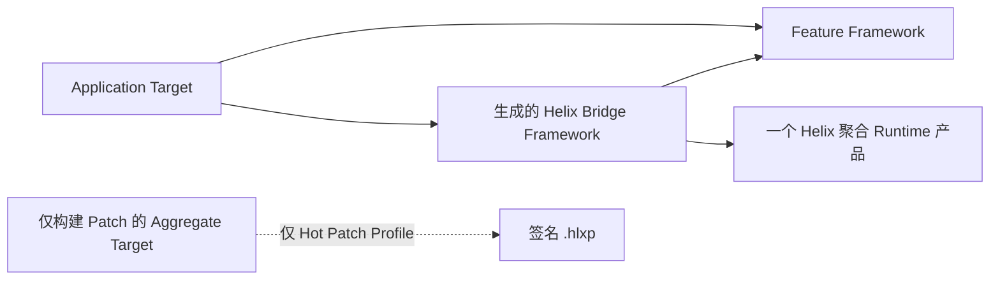

# 使用入门

[English](Getting-Started.md)

本文把一个尚未接入 Helix 的 Xcode App 带到“完成第一次开发期 Live Reload”，并可选完成“第一次生产 HLBC Hot Patch”。仓库 Demo 是可执行参考，本文说明真实项目需要复现哪些部分。

## 1. 先选择需要的工作流

可以只接入一种，也可以两种都接入，但 target 与 Build Configuration 必须分开。

| 需求 | Profile | App Runtime | 常用 Scheme |
| --- | --- | --- | --- |
| 保存已有 Swift body 后更新正在运行的 Debug 页面 | `liveReload` | `HelixDevAppRuntime` | 共享 Debug Run Scheme |
| 为冻结的已发布 Shell 构建签名 HLBC 包 | `hotPatch` | `HelixAppRuntime` | Release Build/Archive Scheme 加仅构建 Patch 的 Aggregate Scheme |

建议先在一个小型 Feature module 中接入 Live Reload。只有团队理解 Release Shell、归档保留、签名和分发 policy 责任后，再增加 Hot Patch profile。

## 2. 整理工程结构

Helix 工作在 Swift module 边界。选择或创建一个 Feature framework，用来承载希望热重载或打补丁的源码；App 通过正常公开接口使用它。

每个 profile 使用以下 target 结构：



Feature Target 保存手写业务源码。生成 Bridge Target 只包含 Helix Derived Sources：永久入口、Build Contract、Reload Index 与 NativeImport Factory。App 负责 embed and sign 两个 framework。

除非无法避免，不要第一天就把巨型 App module 整体接入。每次补丁编译都要重新 type-check 完整目标 module，清晰的 Feature 边界有利于正确性、编译延迟和 Review。

## 3. 添加 Package 产品

把 Helix 作为 Swift Package Dependency 加入 Xcode 工程。每个 App Configuration 只能链接一个聚合产品，不要再添加有重叠模块的 Runtime leaf：

- Release 或 Hot Patch App：`HelixAppRuntime`
- Debug 或 Live Reload App：`HelixDevAppRuntime`

Compiler、Build Tools、Release Tools、Dev Tools 与 CLI 等构建侧产品不能进入 iOS App target。生成脚本会调用 macOS 上的 `helix` executable。

## 4. 编写 Host Plan

在工程根目录创建 `HelixXcode.json`。它是可以提交并人工 Review 的稳定 target/workflow 合同，不能包含设备 UDID、DerivedData 路径、session secret 或私钥内容。

最小 Live Reload Plan 如下：

```json
{
  "schemaVersion": 2,
  "projectPath": "Store.xcodeproj",
  "integrationRoot": ".helix/xcode",
  "features": [
    {
      "id": "checkout",
      "moduleName": "CheckoutFeature",
      "bridgeModuleName": "CheckoutFeatureHelixBridge",
      "sourceRoot": "CheckoutFeature",
      "patchConfigurationPath": "Configurations/Checkout.yml",
      "sourceFiles": [
        "Sources/CheckoutViewController.swift",
        "Sources/CheckoutModel.swift"
      ]
    }
  ],
  "profiles": [
    {
      "id": "checkout-live",
      "workflow": "liveReload",
      "schemeName": "Store Live Reload",
      "applicationTargetName": "Store",
      "configurationName": "Debug",
      "bundleIdentifier": "com.example.store",
      "namespaceSeed": "store-checkout-live",
      "featureID": "checkout"
    }
  ]
}
```

`sourceFiles` 是 Helix 必须捕获的完整 module 上下文，不是“今天准备修改的文件”列表。路径必须是安全的工程相对路径，并位于声明的 source root 内。

被引用的 Patch Configuration 选择索引 module 时使用的源码范围。最小文件范围配置如下：

```yaml
schema: 1
modules:
  CheckoutFeature:
    include:
      - Sources/**/*.swift
```

要增加 Hot Patch，应创建另一个使用 Release Configuration 的 `hotPatch` profile，并添加 `patch` 对象。该对象声明 Patch Aggregate Target/Scheme、输出目录、Quick Patch recipe、trusted root、签名证书、私钥和可选 Simulator inbox：

```json
{
  "id": "checkout-hot",
  "workflow": "hotPatch",
  "schemeName": "Store Hot Patch Shell",
  "applicationTargetName": "Store",
  "configurationName": "Release",
  "bundleIdentifier": "com.example.store",
  "namespaceSeed": "store-checkout-release",
  "featureID": "checkout",
  "patch": {
    "actionTargetName": "HelixPatchAction",
    "actionSchemeName": "Store Build Patch",
    "recipePath": "Configurations/QuickPatchRecipe.json",
    "trustedRootPath": ".helix/private/TrustedRoot.json",
    "signingCertificatePath": ".helix/private/SigningCertificate.json",
    "privateKeyPath": ".helix/private/PatchSigningKey.json",
    "outputRoot": ".helix/patches",
    "simulatorInboxPath": "Documents/Helix/Current.hlxp"
  }
}
```

Plan 只记录 secret 应该位于哪里，绝不包含 secret。私钥、session、Patch 输出和本地 DerivedData 必须忽略。`helix patch create-development-identity` 可以为隔离 Demo 创建开发信任材料，绝不能用于生产。

完整双 Profile 示例见 [Demo/HelixXcode.json](../Demo/HelixXcode.json)。

## 5. 生成并验证 Integration Kit

构建或安装 `helix` executable，然后在工程根目录执行：

```bash
swift run helix xcode generate \
  --plan HelixXcode.json \
  --output .helix/xcode

swift run helix xcode validate --plan HelixXcode.json
```

生成 Kit 包含 canonical Host Plan/Manifest、共享与 Profile xcconfig、源码 file list、薄生命周期脚本，以及带精确 target/Scheme 接线清单的 `Integration.md`。如果工程允许提交生成产物，可以提交非 secret Kit。不要手改单个生成文件，应修改 Host Plan 后重新生成。

CI 应运行 validate。它会发现缺失、额外、手改、过时、权限错误的生成产物，并验证每个声明的 Swift 源文件。

## 6. 一次性接线 Xcode Target

对每个 profile：

1. 把 `Profiles/<profile>/Feature.xcconfig` 设置为所选 Feature target configuration 的 Base Configuration。
2. 创建 `<Feature>HelixBridge` framework target，把 `Profiles/<profile>/Bridge.xcconfig` 设为 Base Configuration。
3. 将 `FeatureSources.xcfilelist` 和 `BridgeSources.xcfilelist` 中的每个生成路径分别加入对应 target 的 Compile Sources，一次即可。
4. App 依赖、链接、embed 并签名 Feature 与 Bridge framework。
5. App 与生成 Bridge 只链接该 profile 对应的一个聚合 Runtime；不要加入另一个聚合产品或重叠 leaf。
6. Feature、Bridge 与 App 的 source membership 必须保持清晰，不能同时编译同一份 original 和 generated Swift 源码。

Feature xcconfig 会让选定源码通过 materialized Derived Sources 进入 Xcode。`#sourceLocation` 保持诊断指向可编辑文件；Manifest 还会单独记录 Swift private source-file import 所需的物理编译 basename。

## 7. 接线 Scheme 生命周期

生成脚本必须放在以下准确位置：

| Workflow | Xcode 位置 | 脚本 | Build Settings 来源 |
| --- | --- | --- | --- |
| 两者 | 第一个 Scheme Build pre-action | `prepare.sh` | Feature target |
| Hot Patch | 最后一个 Scheme Build post-action | `audit.sh` | App target |
| Live Reload | Scheme Run pre-action | `live-start.sh` | App target |
| Live Reload | Scheme Run post-action | `live-stop.sh` | App target |
| Live Reload | Run action Custom LLDB Init File | `$(HELIX_LLDB_INIT_FILE)` | Scheme setting |
| Patch 构建 | Patch Aggregate Target 的唯一 Run Script | `patch.sh` | Aggregate target/profile xcconfig |

Hot Patch 要创建 Plan 中命名的 Aggregate Target，使用 Profile xcconfig，再创建只包含该 Target 的共享 Patch Scheme。如果 Patch Scheme 同时构建 App，它会覆盖冻结 baseline，说明配置错误。

不要从 Build post-action 启动 Live Daemon。Run pre-action 会把一个 daemon 与一次性凭据绑定到真实 Run 生命周期。生成的 LLDB init 用 `target.env-vars` 覆盖由 LLDB 负责 launch 的快路径，用有界 Python installer 处理 Xcode dummy-target/late-attach 时序。installer 等待正在运行的真实 target，短暂停住 App，通过一条 LLDB command-interpreter 表达式注入完整环境，并确保恢复进程；初始环境为空时，App 生命周期内强持有的 `DevRuntime.ApplicationSession` 会轮询导出的 C probe。ready 标记最后写入，部分凭据会 fail closed。该 Scheme 应保持 `debuggerHandoffEnabled` 的默认值 `true`。Run post-action 是主动停止快路径；若 Xcode 跳过它，受监管 daemon 会在 App 断线五秒后自行退出并清理私有 handoff 文件。

## 8. 在 App 中启动 Runtime

生成 Bridge 类型会提供 Build Contract 与 bootstrap 函数。Application Session 必须在整个 App 生命周期中保持存活。

### Debug / Live Reload

核心结构如下：

```swift
import HelixDevRuntime
import HelixLiveReloadAPI
import CheckoutFeatureHelixBridge

@MainActor
final class DevelopmentRuntimeOwner {
    let environment = DevRuntime.LiveReloadEnvironment()
    let session: DevRuntime.ApplicationSession

    init() throws {
        let runtime = try CheckoutFeatureBridge.makeRuntime()
        session = try DevRuntime.ApplicationSession(
            build: CheckoutFeatureBridge.makeDevBuildContract(),
            runtime: runtime,
            shell: CheckoutFeatureBridge.makeShellInterface(),
            environment: environment,
            installBridge: CheckoutFeatureBridge.bootstrap,
            options: .init(
                supportedBackends: [.nativeDynamicReplacement, .hlbc],
                nativeChainingProbePassed: true
            )
        )
    }
}
```

示例设置 Native qualification，是因为目标为仓库已经验证的 Simulator 矩阵。没有通过资格的真实设备矩阵不能设置为 true。为每个可刷新的 UIKit 类型注册稳定 `NominalTypeID`，或者为 SwiftUI 添加 `.liveReloadBoundary(...)`。需要业务刷新逻辑的页面实现幂等 `LiveReload.Reloadable`。

只有在业务 window 已经 key and visible 后再调用 `environment.startOverlay()`。Overlay 可选，Session 本身不是可选项。

### Release / Hot Patch

Release Owner 通过生成的 Patch Build Contract、Shell Interface、Runtime 与 bootstrap 构造 `PatchRuntime.ApplicationSession`，并额外提供：

- 当前 App 安装周期稳定的 installation ID；
- 位于 Application Support 的 Patch Store 目录；
- 作为不可变 App Resource 内置的 trusted root；
- 只包含获批 distribution policy 与 policy ID 的明确 Acceptance Policy；
- 当前可信时间。

App 到达声明的健康启动点后调用 Session 的 mark-healthy API。下载或本地 stage 的包必须通过 `install(localPackageURL:nowUnixSeconds:)` 安装，不能直接写入 `Runtime.GenerationRegistry`。具体实现见 [HotPatchDemo.Application.swift](../Demo/HotPatchDemo/HotPatchDemo.Application.swift)。

## 9. 检查接线

首次构建 App 前先运行静态检查：

```bash
swift run helix xcode validate --plan HelixXcode.json
swift run helix xcode doctor --plan HelixXcode.json \
  --profile checkout-live --static
swift run helix xcode doctor --plan HelixXcode.json \
  --profile checkout-hot --static
```

由生成 Xcode Phase 调用的 active doctor 还会检查当前 Build Environment、target、configuration、compiler、输出路径、bundle identity 与集成产物。

接入完成前应确认：

- Host Plan 包含 Feature 的完整源码集合；
- Feature、Bridge 与 App source membership 没有错误重叠；
- Framework 已 embed/sign 并通过 `@rpath` 加载；
- Release/Debug 分别只链接目标聚合 Runtime；
- 生命周期 action 使用正确的 Build Settings provider；
- Patch Scheme 只包含 Aggregate Target；
- Secret 与本地产物均被忽略；
- 每个可见页面有明确 refresh policy；
- `validate`、`doctor`、Release Audit、iOS Runtime Test 和至少一次真实 Demo 流程通过。

## 10. 完成第一次 Live Reload

1. 选择共享 Live Reload Scheme 与 Simulator。
2. 点击一次 Run。Build pre-action materialize Dev Shell；Run pre-action 启动认证 Daemon；LLDB 使用本次一次性会话材料启动 App。
3. 进入已注册页面，并修改一项内存状态，便于观察状态是否保留。
4. 只修改一个已索引 Swift 声明的 body 并保存，不要点击 Build。
5. 在终端或 Overlay 中观察 compile、transfer、`codeActive` 与 UI refresh 状态。
6. 再保存一次修改验证 chaining，然后把文本恢复 baseline 并再次保存。恢复源码也会创建一个新 replacement generation。
7. Stop 本次 Xcode Run。Run post-action 会主动结束 Daemon；若 Xcode
   跳过该动作，Daemon 会在五秒重连宽限后自行退出并清理私有文件。

若结果是 `codeActive` 加 `manualRefreshRequired`，说明 replacement 已工作，但页面缺少安全刷新规则。应添加 invalidation hint、幂等 `Reloadable` hook、注册 Factory 或 SwiftUI boundary。

## 11. 构建第一次 Hot Patch

1. 选择 Hot Patch Shell Scheme，使用 Release Configuration build、run 或 archive。post-action 会 finalize 真实 executable identity、审计完整 App Bundle，并冻结 `ReleaseBaseline.json`。
2. 保留这个 App 与 baseline。修改事故代码后不要重新构建它。
3. 修改一个 eligible Swift implementation，同时保持完整 module source set、interface、toolchain、SDK、target 与归档 identity 不变。
4. 为 Quick Patch recipe 填写唯一 package/campaign revision、incident、有效期、资源、rollout、rollback 和 policy 信息。请基于仓库中的 [Demo Recipe](../Demo/Configurations/QuickPatchRecipe.json)修改，不要自行猜字段名。
5. 构建仅包含 Patch 的 Scheme。它会对冻结 module 重新 type-check、生成并验证 HLBC、签名 `.hlxp`，还可以把包 stage 到已经安装目标 App 的 booted Simulator。
6. 把包交给 `PatchRuntime.ApplicationSession.install(...)`。本地 inbox 只是 Mock Transport；验签、存储、anti-rollback、WAL、激活、health 与 rollback 仍走生产客户端路径。
7. 执行回滚，确认不重建、不重装 App 也能恢复原行为。

当前 Release Builder 只接受 internal 与 enterprise HLBC policy，会拒绝 App Store 与 controlled-native Release 配置。

## 常见问题

| 现象 | 含义与处理 |
| --- | --- |
| Generated Kit stale 或被修改 | 从 Host Plan 重新生成并 Review diff，不要手改 Kit |
| 找不到 captured frontend invocation | 确认 Live Feature 使用生成 xcconfig 与 compiler proxy，然后执行一次 clean Run |
| private member 不可见 | 检查 Manifest 中物理编译 source basename；仅有 `#sourceLocation` 不代表 private identity |
| interface 或 source membership 变化 | 这不是 body-only transaction，需要完整构建 |
| 没有 eligible patch change | body 与冻结 baseline 相同，或声明不属于 patchable surface |
| Release baseline mismatch | 恢复精确审计源码、Xcode/SDK、target、configuration 与 binary identity |
| Code active 但 UI 不变 | 添加或修正页面 reload policy，不要手工重放生命周期方法 |
| Native image 到达提醒或硬上限 | Stop 后重新 Run Debug App；Helix 有意不 `dlclose` Swift replacement image |
| Simulator stage 失败 | 先启动唯一目标 Simulator，并安装匹配的 Release App，再构建 Patch Scheme |

原理与限制见[总体架构](Architecture.zh-CN.md)、[开发期热重载](Development-Live-Reload.zh-CN.md)、[生产热补丁](Production-Hot-Patching.zh-CN.md)和[能力与限制](Capabilities-and-Limits.zh-CN.md)。
