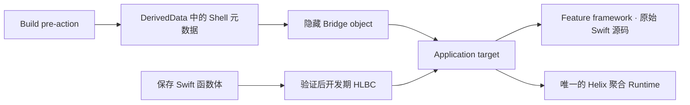

# 使用入门

[English](Getting-Started.md)

这份文档说明如何把一个 Swift Feature 模块接入 Helix。当前方案最重要的变化是：Helix 生成的 Swift 代码不会进入 Xcode 工程，也不需要开发者导入或引用。开发者始终修改原来的 Feature 源文件，Helix 只在 DerivedData 中生成并私下编译 Bridge。

## 1. 先选择工作流

| 需求 | Profile | App Runtime |
| --- | --- | --- |
| 保存已有 Swift 函数体，立即更新正在运行的 Debug 页面 | `liveReload` | `HelixDevAppRuntime` |
| 为经过审计的 Release Shell 构建签名 HLBC 补丁 | `hotPatch` | `HelixAppRuntime` |

两条路径共享编译器事实与稳定身份，但 Runtime、传输、信任材料和产物彼此隔离。同一个 App configuration 只能链接一个聚合 Runtime 产品。

## 2. 选择 Feature 模块

Helix 以 Swift module 为边界。建议先选一个职责清晰的 framework，包含需要热重载或热修复的实现。原 Feature target 仍然编译开发者手写的源文件。



这里不再存在生成 Bridge framework、生成源码 target、生成源码 target membership 或生成模块 import。App 只会在 Sources phase 之前链接一个私下生成的 relocatable object；它导出稳定的 provider 符号，其余内容都属于 Helix 内部实现。

## 3. 添加 Package

把 Helix 加为 Swift Package 依赖，并按 configuration 给 App 链接一个产品：

- Debug Live Reload：`HelixDevAppRuntime`
- Release Hot Patch：`HelixAppRuntime`

Feature target 不需要链接 Helix Runtime。Compiler、Build Tools、Dev Tools 与 `helix` CLI 只在 macOS 构建侧运行，不能进入 Release App bundle。

## 4. 描述集成

在工程根目录创建并提交 `HelixXcode.json`。Schema 3 只记录稳定工程事实，不包含 DerivedData 路径、设备 ID、会话凭据或生成模块名。

```json
{
  "schemaVersion": 3,
  "projectPath": "Store.xcodeproj",
  "integrationRoot": ".helix/xcode",
  "features": [
    {
      "id": "checkout",
      "moduleName": "CheckoutFeature",
      "sourceRoot": "CheckoutFeature",
      "patchConfigurationPath": "Configurations/Checkout.yml",
      "sourceFiles": [
        "Sources/CheckoutViewController.swift",
        "Sources/CheckoutModel.swift"
      ]
    }
  ],
  "profiles": [
    {
      "id": "checkout-live",
      "workflow": "liveReload",
      "schemeName": "Store Live Reload",
      "applicationTargetName": "Store",
      "configurationName": "Debug",
      "bundleIdentifier": "com.example.store",
      "namespaceSeed": "store-checkout-live",
      "featureID": "checkout"
    }
  ]
}
```

`sourceFiles` 是完整 module 上下文，不是“今天可能会改的文件”。路径都相对 `sourceRoot`。Patch 配置再从同一组逻辑路径中选择声明：

```yaml
schema: 1
modules:
  CheckoutFeature:
    include:
      - Sources/**/*.swift
```

Hot Patch profile 使用 Release configuration，并增加 `patch` 对象，用来指定 Patch-only Aggregate target 与 Scheme、recipe、信任材料路径、输出目录和可选 Simulator inbox。完整例子见 [Demo/HelixXcode.json](../Demo/HelixXcode.json)。Host Plan 只记录密钥在哪里，不包含密钥内容。

## 5. 生成 Integration Kit

```bash
swift run helix xcode generate --plan HelixXcode.json
swift run helix xcode validate --plan HelixXcode.json
```

输出位置由 `integrationRoot` 决定，因此 `--output` 可以省略。Kit 包含 canonical contract、xcconfig 和很薄的生命周期脚本；它不再生成供 Xcode 引用的源码清单，也不会要求工程引用任何生成 Swift 文件。需要调整时修改 Host Plan 后重新生成，不要手改 Kit 内的文件。

## 6. 一次性完成 Xcode 接线

逐个 profile 按 `.helix/xcode/Integration.md` 操作：

1. Feature 原有 Swift 文件继续留在原 Sources phase，把 `Profiles/<profile>/Feature.xcconfig` 设为对应 configuration 的 Base Configuration。
2. 把 `Profiles/<profile>/Application.xcconfig` 设为 App configuration 的 Base Configuration。
3. 在 App 的 Sources phase **之前**增加一个 Run Script：

   ```sh
   /bin/sh "$(HELIX_INTEGRATION_ROOT)/Profiles/<profile>/bridge.sh"
   ```

   Output 声明为 `$(HELIX_BRIDGE_OBJECT)`。不要把这个 object 或 `$(HELIX_BUILD_ROOT)` 下的任何文件加入 Project Navigator。
4. App 只链接 Feature framework 与该 profile 的唯一聚合 Runtime。没有 Bridge target，也没有 Bridge framework 需要链接或 embed。

`HelixAppRuntime` 只包含生产热补丁模块；`HelixDevAppRuntime` 才额外带入 Dev Protocol、Live Reload API、传输、激活与 UI 工具。Live Reload API 不再作为独立 package product 发布，也不会通过文档规定的 Release 聚合产品进入生产包。

`Application.xcconfig` 会把隐藏 object 加入 `OTHER_LDFLAGS`，并强制保留 `_hlx_bridge_provider_v1`。Build phase 会从成功的 Feature 编译记录中还原真实参数，在隔离临时目录中编译生成 Bridge，校验 object 的架构与平台，最后原子发布到 DerivedData 的 `HelixBridge.o`。Xcode 不会看到半写入产物。

## 7. 配置 Scheme 生命周期

| 工作流 | Xcode 位置 | 生成脚本 | Build Settings 来源 |
| --- | --- | --- | --- |
| 两者 | Scheme Build 第一个 pre-action | `prepare.sh` | Feature target |
| Hot Patch | Scheme Build 最后一个 post-action | `audit.sh` | App target |
| Live Reload | Scheme Run pre-action | `live-start.sh` | App target |
| Live Reload | Scheme Run post-action | `live-stop.sh` | App target |
| Live Reload | Run 自定义 LLDB init | `$(HELIX_LLDB_INIT_FILE)` | Scheme |
| Patch 构建 | Patch Aggregate target Run Script | `patch.sh` | Aggregate target |

透明 compiler proxy 只作用于 Feature target：它原样转发真实 `swiftc`，再以 owner-only 权限原子保存调用记录，供后续 live generation 编译复放。App、Package 与无关 target 继续使用 Xcode 默认 driver。

Live Run pre-action 会创建一次性认证会话，LLDB init 在不把凭据写进 Scheme 的前提下注入环境。保留默认 debugger handoff，它用于覆盖 Xcode late-attach 的启动顺序。Run post-action 负责主动停止；若 Xcode 没执行 post-action，daemon 也会在有界断连窗口后自行清理。

## 8. App 不再引用生成代码

### Debug / Live Reload

只需让一个 session 在 App 生命周期内保持存活：

```swift
import HelixDevRuntime

@MainActor
final class DevelopmentRuntimeOwner {
    let session: DevRuntime.ApplicationSession

    init() throws {
        session = try DevRuntime.ApplicationSession(environment: .init())
    }
}
```

业务代码只 import 稳定 Runtime module。启动时，`Runtime.LinkedBridge` 从当前进程 image 解析 `hlx_bridge_provider_v1`。Provider 通过 type-erased API 提供精确 Build Contract、Shell interface、Runtime factory 与 Bridge installer。隐藏 object 缺失或身份不匹配时会明确启动失败，不会悄悄把 Helix 关闭。

公开默认配置只接受经过认证的 HLBC live artifact。Native Dynamic Replacement 只能通过内部实验配置显式选择，不是 App 接入前置条件。

### Release / Hot Patch

Release 路径同样自动发现 provider，App 只提供自己的存储与策略：

```swift
let session = try PatchRuntime.ApplicationSession(
    installationID: installationID,
    storeRootURL: patchStoreURL,
    trustStore: trustStore,
    acceptancePolicy: acceptancePolicy,
    nowUnixSeconds: now
)
```

可信根、installation identity、允许的分发策略、健康标记、下载传输与回滚交互仍由产品负责。完整实现见 [HotPatchDemo.Application.swift](../Demo/HotPatchDemo/HotPatchDemo.Application.swift)。

## 9. UIKit 页面无需 typeRegistry

每个 reload hint 到达后，Helix 会自动完成：

1. 从运行时类名还原编译器使用的稳定 `(module, canonical type name)` identity；
2. 沿具体类的 superclass 链匹配，因此修改基类也能命中正在展示的子类实例；
3. 遍历前台 App window，以及 presented/navigation/tab/split/child controller 图；
4. 先匹配可见 controller，再针对尚未命中的类型扫描其已加载 view tree；
5. 把推导出的 invalidation policy 应用到现有实例。

因此常见 layout、drawing 与 configuration callback 不需要 App 注册类型，也不需要手写刷新 hook。Helix 会按 hint 请求 constraints/layout/display invalidation；controller 正在 transition 时不会强行执行 immediate layout。

以下行为仍然有意保持显式：

- `viewDidLoad` 或初始化逻辑不会被盲目重放。确实需要业务刷新时实现幂等 `LiveReload.Reloadable`；必须重建页面时才注册 factory。
- 全量 `UITableView`/`UICollectionView.reloadData()` 可能触发业务副作用，因此默认不做 broad reload。
- SwiftUI 是值语义视图，没有可像 UIKit 一样遍历的对象图，需要在目标子树加 `.liveReloadBoundary(for:)`。
- Model/service 与 event-handler 修改只激活代码，通常不请求 UI 工作。

Factory registration 是高级页面重建能力，不是普通 Live Reload 的接入前置条件。

## 10. 验证并执行第一次 Live Reload

```bash
swift run helix xcode doctor \
  --plan HelixXcode.json \
  --profile checkout-live \
  --static
```

然后：

1. Run 一次共享 Live Reload Scheme。
2. 打开要修改的 UIKit 页面，并制造一些需要保留的内存状态。
3. 只修改已索引声明的函数体并保存，不要 Build。
4. 分别确认 compile、transfer、`codeActive` 与 `UI refreshed`。
5. 再保存一次，验证后一代 HLBC generation 会在同一个 App 进程中原子替换第一代。

Stored layout、函数签名、继承、conformance、enum case、actor isolation、源码 membership、链接依赖或 Build Settings 变化都需要正常构建。变化 root 可以调用现有受监视源码文件中新加、且可达的普通 helper 或 class private 方法；新增文件或新的原生 ABI 表面仍不属于这条工作流。

## 11. 构建 Hot Patch

1. Build/Archive Release Shell Scheme；post-action 会 finalize 真实 executable identity、审计 bundle 并冻结 baseline。
2. 保存这一份构建与完整源码上下文。
3. 只修改 eligible implementation，不改变 interface。
4. 给 patch recipe 分配新 revision，并填写 incident、有效期、资源限制、rollout、rollback 与 policy。
5. 构建 Patch-only Scheme；它不会重建或重装 App，只生成已验证并签名的 `.hlxp`。
6. 通过你的传输层下发，再调用 `PatchRuntime.ApplicationSession.install(...)`。

当前 Release builder 只接受 internal 与 enterprise HLBC policy，会拒绝 App Store 和 controlled-native Release 配置。

## 常见问题

| 现象 | 含义与处理 |
| --- | --- |
| 找不到 linked Bridge provider | App 没使用 `Application.xcconfig`、隐藏 phase 不在 Sources 前，或 output/link flags 缺失 |
| Feature compiler capture 缺失或过期 | 确认使用 `Feature.xcconfig`，再通过正确 Scheme clean Run 一次 |
| 源码已索引但没有 patchable root | 检查 patch 配置 pattern 是否相对 `sourceRoot`，且确实匹配 logical path |
| `codeActive` 但 UI 没变化 | 函数是 observe-only、当前没有匹配的 UIKit/SwiftUI 实例，或确实需要显式 hook/factory |
| Interface 或源码 membership 变化 | 已超出 body-only transaction，执行正常构建 |
| HLBC lowering 报告不支持的语法 | 按精确诊断调整到受支持子集，或执行一次正常构建 |
| Release baseline 不匹配 | 恢复审计时的源码、Xcode/SDK、target、configuration 与二进制身份 |

继续阅读[总体架构](Architecture.zh-CN.md)、[开发期热重载](Development-Live-Reload.zh-CN.md)、[生产热补丁](Production-Hot-Patching.zh-CN.md)和[能力与限制](Capabilities-and-Limits.zh-CN.md)。
