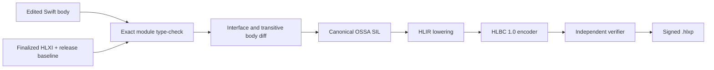
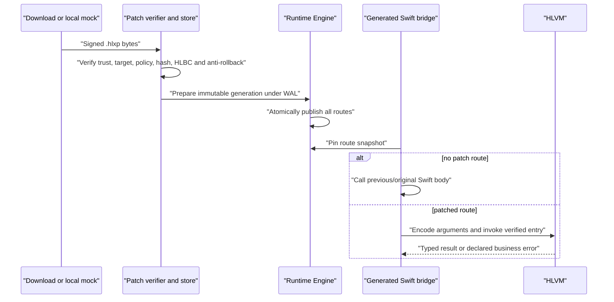

# Production Hot Patching

[简体中文](Production-Hot-Patching.zh-CN.md)

Helix production patches are signed, build-specific HLBC programs. Engineers
write normal Swift, but a released App executes only verified bytecode through
the runtime that was shipped inside that App. There is no on-device compiler,
JIT, downloaded Swift source, or downloaded native dylib in this path.

## What must exist before an incident

Hot patching is prepared during the normal Release build. It cannot be added to
an arbitrary binary after it has shipped.

The Release pipeline must:

1. Freeze a Shell namespace, App identity, compiler, SDK, target, source set,
   and semantic compiler arguments.
2. Index declarations with the exact Swift frontend and decide which existing
   roots are patchable.
3. Generate Derived Sources containing permanent dynamic replacement bridges,
   exact Swift entry wrappers, and allowed native invokers. Handwritten source
   files are not rewritten.
4. Build and sign the App with `HelixAppRuntime`.
5. Finalize an HLXI archive with the linked Mach-O UUID and preserve the exact
   release source baseline and toolchain artifacts for future patch builds.

The App contains compact route, type, and native-import tables. Sensitive build
facts such as complete private source context stay in the server-side archive.

## From a Swift edit to HLBC

During an incident, an engineer checks out the exact released baseline and
changes an existing eligible implementation. The patch builder uses the full
module source set—not an isolated parser—to retain normal Swift name lookup,
overload resolution, private visibility, conditional compilation, generics,
and synthesized declarations.



The build fails before packaging when it sees an interface, layout, isolation,
source-membership, toolchain, SDK, unsupported SIL, or unapproved native-call
change. Helix does not weaken these checks to make a patch build succeed.

HLBC is a versioned, typed register bytecode, not serialized SIL. It replaces
compiler-private pointers and numbering with stable IDs, explicit ownership,
effects, capabilities, and bounded operations. The independent verifier
reconstructs control flow, register types, ownership, access scopes, call
signatures, capability requirements, and resource constraints without trusting
the patch compiler.

## Calling existing Swift from a patch

A patch cannot call arbitrary code merely because a Swift declaration exists
in the App. Calls cross one of these frozen boundaries:

- another function included in the same HLBC image;
- an eligible Shell entry identified by `FunctionKey` and `EntryIndex`;
- an allowlisted `NativeImportID` backed by a generated, exact-signature Swift
  factory in the installed App.

The patch compiler closes over reachable same-module implementation functions.
Consequently, a patch may add an ordinary top-level helper or a private class
instance method and call it from a changed archived root, provided its complete
concrete signature and body fit the HLBC profile. Such a declaration is private
to that immutable bytecode image: it does not create a new Shell entry, native
symbol, Swift metadata record, selector, or callable API for native code. Its
body is included in the root's transitive implementation fingerprint, so a
later change produces a distinct generation even when the root call site stays
textually unchanged.

Native imports may be listed explicitly or discovered at build time from a
file, module, or project scope. Project scope expands into individual canonical
descriptors and generated invokers; it is never a wildcard interpreted on the
device. Adding a call in a patch works only when the released Shell already
contains the matching capability and its effects are allowed by policy.

This design avoids relying on unstable Swift symbol lookup, metadata guessing,
or an unrestricted `dlsym` API. It also means that expanding the callable
native surface normally requires a new App release.

## Package trust and installation

A `.hlxp` contains a canonical manifest and one or more hashed payload records.
The implemented release builder currently accepts only `internalHLBC` and
`enterpriseHLBC`. It rejects `appStoreHLBC` and `controlledNative`.

The client chain includes:

- an Ed25519 root/leaf certificate model and package signature verification;
- bounded, sequential download with incremental SHA-256 validation;
- target checks for bundle/build, Shell interface, Mach-O UUID, architecture,
  OS range, policy, signer, time, and rollout rules;
- a canonical, immutable verified package store;
- monotonic campaign revisions and anti-rollback state;
- a nonce-based activation write-ahead log;
- immutable Runtime generations, active health proof, Crash Guard, last-known-
  good recovery, revocation, and rollback to previous packages or originals.



A server control plane is not required to test this client chain. The checked-
in Hot Patch demo can copy a generated package into the Simulator App's inbox
as a mock download; the App still follows the normal verification, store, WAL,
activation, health, and rollback path.

## Generation behavior

Activation never updates routes one function at a time. Helix builds a complete
immutable generation, validates every route and capability, then publishes one
snapshot. An outer bridge call pins that snapshot for the complete synchronous
or asynchronous call chain, including permitted native re-entry. Concurrent
activation therefore affects later calls without changing the generation seen
halfway through an existing call.

Inherited routes are materialized into the published snapshot. The registry
keeps the active snapshot and, by default, its direct rollback predecessor;
older snapshots are compacted unless an in-flight lease still needs them. Such
a lease is self-contained, so compaction never redirects or invalidates the
running call. Registry count and unique-artifact byte ceilings are checked
before publication, and a capacity failure leaves both active routing and the
generation-ID high-water mark unchanged. Compaction never makes an old ID
available to ordinary activation. Verified durable recovery is the narrow
exception: it may rehydrate the exact historical package/ID after routing has
returned to originals, while the high-water mark remains unchanged and all
later activations must still exceed it. Reinstalling the exact package that is
already active is also idempotent: Helix re-verifies current trust, target,
policy, expiry, revocation, and anti-rollback state, then returns the existing
lease without creating a WAL record or advancing the generation high-water mark.

If no patch is active, the permanent Bridge invokes the original Swift body.
The no-patch fast path does not construct a VM call frame; it still pays the
cost of the dynamic entry and generation lookup, which remains part of the
device performance qualification.

## Current language boundary

The current wire versions are HLBC 1.0 and HLXI 1.0. The implemented subset
includes common integer and floating-point operations and conversions,
`min`/`max`/`abs`, Bool, Unicode String transforms and interpolation,
one-grapheme Character literals for the bounded String predicate path,
tuple/Optional including address projection and verified force-unwrap traps,
recursive Array/Dictionary equality,
common Array index/search plus represented managed Collection extrema,
cross-container Sequence relations, and nonmutating ordering; type-generic,
Array-backed structural concatenation/insertion/replacement/removal/reversal/
swap, predicate removal, bidirectional partition, and capacity hints, including
context-typed nil elements and generic indirect results written into
Array-literal construction storage;
Dictionary lookup/subscript mutation including lazy default
lookup and scoped default-value writeback, `updateValue`,
`removeValue`, `removeAll`, key/value projection, unique-key sequence
construction, uniquing construction, Dictionary/represented-Sequence
`merging`/`merge`, represented-Collection grouping, and capacity hints; typed Set
construction/query/mutation/iteration/algebra with recursively VM-defined
Equatable/Hashable semantics. Common fully concrete transforms, reductions,
visits, predicate queries, and comparator selection share one closure traversal
across Array, Dictionary, and Set; all three preserve their container through
`filter`, while Dictionary also supports `mapValues` and `compactMapValues`.
Frontend Array/Dictionary cast helpers may erase tuple labels only when the
original types differ solely by those labels and both complete VM types match;
real element, key, value, and reference conversions remain rejected.
The subset additionally includes typed `enumerated`, `Array(sequence)`, and
heterogeneous `zip` over represented managed Collections, plus
reversed/repeated/sliced/joined Array-backed adapters,
`Optional.map`/`flatMap`, concrete `Result` payload transforms and
`Result.get()` for patch-local value payloads, VM-owned `Any`, and common
dynamic casts, fixed-width integer `Range`/`ClosedRange` iteration,
integer and floating-point `stride`, scalar Range containment, and common
forward Sequence transforms, reductions, visits, predicates, comparator
selection, and Array-backed adapters over those finite progression sources.
They reuse the existing typed cursor/builder/closure semantics rather than
Swift generic NativeImports or per-API opcodes. The subset also includes
structured control flow, newly introduced non-exported ordinary/private helpers,
computed accessors, file- or module-scope patch-local struct/enum, pure HLVM classes, and
concrete `Result` values,
payload-carrying local errors, scoped patch-local `inout`/`mutating` helpers,
synchronous nonthrowing or throwing patch-local closures, type-independent
managed mutable captures, copyable linear captures with a borrowed capture ABI,
and same-image `@escaping` return/capture flows, fully concrete compiler
specializations, reabstraction thunks, and default-argument generators, an
automatically frozen `Swift.print` NativeImport, and top-level non-suspending
`async`, `async throws`, and `@MainActor async` entries. A new `final` class may
also inherit an HLXI-frozen, `NSObject`-compatible project or system type under
the closed hosted profile and cross into native code as that superclass. The
current profile is limited to inherited no-argument initialization, no stored
properties, and no-argument/Bool `Void` overrides.

It is not arbitrary Swift. Generic roots, runtime metadata/witness dispatch, a
patch concrete Swift type identity visible to native code, function-local
nominal declarations, hosted stored properties/custom initializers/arbitrary
callback ABIs, changes to existing native stored layout, closure persistence or native/Shell boundary crossing,
async closures, caller-owned `inout` capture, true `await`/continuations, actor-isolated `self`,
custom global actors, unrestricted pointers, reflection-based field access, and
unregistered native APIs are rejected. See
[Capabilities and Limits](Capabilities-and-Limits.md) for the practical matrix.

HLBC carries a verifier-checked source map from function/block/instruction
coordinates to logical Swift locations. Production packaging removes build-host
absolute paths. If execution traps, HLVM reports the exact program counter and
Runtime enriches it with the pinned generation, Shell entry, function, and
logical file/line/column; this is diagnostic mapping, not an interactive
breakpoint or expression-evaluation debugger.

## Building a package

The exact inputs depend on the generated Release integration, but the build
surface is:

```bash
swift run helix patch build \
  --archive Build/Shell.hlxi \
  --config Config/Release.json \
  --certificate Config/LeafCertificate.json \
  --private-key Secrets/LeafPrivateKey.json \
  --trusted-root Config/TrustedRoot.json \
  --output Build/Patch.hlxp \
  Sources/Feature/A.swift Sources/Feature/B.swift
```

The source list must represent the complete module required by the frozen
archive. Production signing can be provided by an injected signing service so
the builder does not need direct access to a long-lived private key.

Helix Hub creates an empty Patch Aggregate target that supports both `iphoneos`
and `iphonesimulator`; it is only the shared Scheme's build anchor. The actual
`patch.sh` action is a Scheme Build pre-action whose `EnvironmentBuildable` is
the App target, so it receives the App's exact version and platform without
copying those settings or rebuilding the App. Select the same destination
family used to build and audit the frozen Release Shell: a device archive
produces an iOS/arm64 package, while a Simulator baseline produces an iOS
Simulator package. The action never converts one platform's baseline into the
other.

## Distribution status

The repository implements the production client and package-building mechanics,
not an authorization to bypass platform policy. The App Store channel is
explicitly `policyBlocked`. A real deployment still needs a documented target
distribution, legal and security approval, device and business-corpus
qualification, operational control-plane design, and an emergency disable
process. Technical success in the Simulator does not close those gates.
