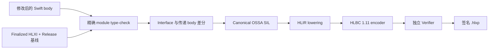
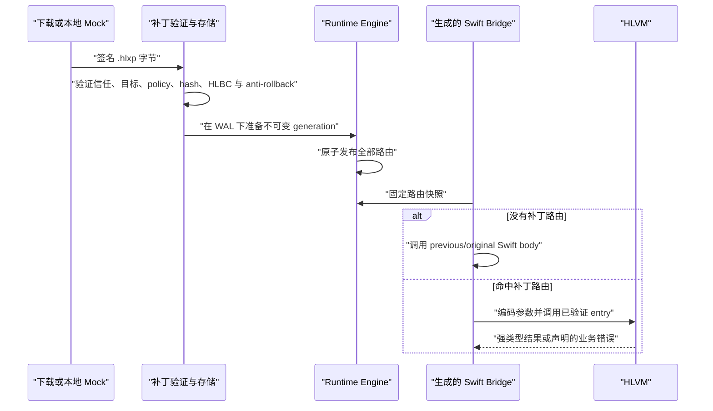

# 生产热补丁

[English](Production-Hot-Patching.md)

Helix 的生产补丁是经过签名、绑定具体构建的 HLBC 程序。工程师编写普通 Swift，但已发布 App 只会通过随 App 安装的 Runtime 执行验证后的字节码。这条路径没有设备端编译器、JIT、下发 Swift 源码或下发原生 dylib。

## 事故发生前必须准备什么

热补丁能力要在正常 Release 构建期间准备，无法在任意二进制发布后再补进去。

Release 流水线需要：

1. 冻结 Shell namespace、App 身份、编译器、SDK、target、源码集合和语义编译参数。
2. 使用精确 Swift frontend 索引声明，决定哪些已有 root 可以打补丁。
3. 生成 Derived Sources，其中包含永久 Dynamic Replacement Bridge、精确 Swift 入口 wrapper 和允许的原生 invoker；不会重写手写源码。
4. 让 App 使用 `HelixAppRuntime` 构建并签名。
5. 链接完成后用真实 Mach-O UUID finalize HLXI，并保留精确 Release 源码基线及工具链产物供以后构建补丁。

App 内只保留紧凑的路由、类型和 NativeImport 表。完整私有源码上下文等敏感构建信息保留在服务端归档中。

## 从 Swift 修改到 HLBC

发生事故时，工程师检出精确的发布基线，修改已有 eligible implementation。补丁构建器使用完整 module 源码，而不是把一个文件交给简化解析器，因此能够保留正常 Swift 的名字查找、重载选择、private 可见性、条件编译、泛型和合成声明语义。



只要发现 interface、布局、isolation、源文件成员关系、工具链、SDK、不支持的 SIL 或未授权原生调用变化，构建就会在打包前失败。Helix 不会为了让补丁成功而放松这些检查。

HLBC 是版本化的强类型寄存器字节码，不是序列化 SIL。它把编译器私有指针和编号替换成稳定 ID、显式 ownership、effect、capability 与有界操作。独立 Verifier 不信任 Patch Compiler，会重新验证控制流、寄存器类型、ownership、access scope、调用签名、能力要求和资源边界。

## 补丁如何调用已有 Swift

某个 Swift 声明存在于 App 中，不代表补丁可以随意调用它。调用只能跨越以下冻结边界之一：

- 同一个 HLBC image 中的其他函数；
- 由 `FunctionKey` 与 `EntryIndex` 标识的 eligible Shell entry；
- 由 App 内生成的精确签名 Swift factory 支撑、且在 allowlist 中的 `NativeImportID`。

Patch Compiler 会递归闭合当前 module 内可达的实现函数。因此，补丁可以在现有源码文件中新增普通顶层 helper 或 class 的 private 实例方法，并从发生变化的已归档 root 调用它；前提是完整具体签名和函数体都落在 HLBC 子集内。这类声明只存在于该不可变 bytecode image 中，不会创建新的 Shell Entry、原生符号、Swift metadata、selector，也不能被原生代码直接调用。Helix 会把 helper 的函数体计入 root 的传递实现指纹，所以即使 root 的调用点文字没有再变化，之后修改 helper 仍会产生不同 generation。

NativeImport 既可以显式列出，也可以在构建期按文件、module 或工程范围发现。工程范围会展开成逐项 canonical descriptor 与生成 invoker，设备端从不解释“全工程 wildcard”。补丁中新增某个调用的前提是已发布 Shell 已经包含对应 capability，并且 policy 允许它的 effect。

这种设计不依赖不稳定的 Swift 符号查找、metadata 猜测或万能 `dlsym` API。代价也很明确：要扩大补丁能调用的原生表面，通常需要重新发版。

## 包信任与安装

`.hlxp` 包含 canonical manifest 和带 hash 的 payload 记录。当前 Release Builder 只接受 `internalHLBC` 与 `enterpriseHLBC`，会拒绝 `appStoreHLBC` 和 `controlledNative`。

客户端安全链已经包含：

- Ed25519 root/leaf 证书模型与包签名验证；
- 有界顺序下载和增量 SHA-256 校验；
- bundle/build、Shell interface、Mach-O UUID、架构、系统范围、policy、signer、时间和 rollout 目标检查；
- canonical 且不可变的 verified package store；
- campaign 单调 revision 与 anti-rollback 状态；
- 基于 nonce 的激活 WAL；
- 不可变 Runtime generation、active health proof、Crash Guard、LKG 恢复、吊销，以及回退到旧包或 originals。



测试这条客户端链并不依赖服务端控制面。仓库中的 Hot Patch Demo 可以把生成包复制到 Simulator App inbox，模拟一次下载；App 仍会走正式验签、存储、WAL、激活、health 与回滚流程。

## Generation 语义

激活不会逐个函数修改路由。Helix 会先构造完整不可变 generation，验证每条路由和 capability，再一次性发布快照。最外层 Bridge 调用会为整条同步或异步调用链固定该快照，包括允许的原生重入。因此，并发激活只影响后续调用，不会让一次进行中的调用执行到一半切换 generation。

发布前会把继承 route 物化进 snapshot。Registry 默认保留当前 snapshot 与直接回滚前代；更旧 snapshot 会被压缩，除非仍有执行中 lease 需要它。lease 是自包含的，所以压缩不会重定向或使正在运行的调用失效。发布前会同时检查 snapshot 数量与去重后的 artifact 字节上限；容量失败不会修改活动路由或 generation ID 高水位。普通激活不能复用被压缩的旧 ID。唯一的窄例外是经过验证的持久化恢复：路由回到原始实现后，它可以重新挂载完全相同的历史 package/ID，但高水位保持不变，后续新激活仍必须超过该高水位。重复安装当前已经激活的完全相同 package 也是幂等操作：Helix 仍会重新检查当前信任、目标、policy、有效期、吊销和 anti-rollback 状态，但会直接返回现有 lease，不创建 WAL，也不推进 generation 高水位。

没有活动补丁时，永久 Bridge 会调用原始 Swift body。无补丁 fast path 不创建 VM CallFrame，但依然包含动态入口与 generation lookup 的成本，该成本仍需在真实设备性能资格中验证。

## 当前语言边界

当前 wire 版本为 HLBC 1.11 与 HLXI 2.6。已实现子集包括常用整数和浮点操作与转换、Bool、String 操作和插值、用于有界 String predicate 路径的单 grapheme Character 字面量、包含 address projection 的 Tuple/Optional、Array 与 Dictionary 值语义、VM-owned `Any` 与常用动态转换、半开 `Range<Int>` 循环、结构化控制流、可随补丁新增且不导出 ABI 的普通/private helper、computed accessor、文件/module scope struct/enum、pure HLVM class、具体 `Result` 及带 payload 的局部 Error、受限的补丁内 `inout`/`mutating` helper、包含同 image `@escaping` 返回/捕获流程的同步补丁内 closure、编译器已经完全具体化的 specialization 和默认参数 generator、自动冻结的 `Swift.print` NativeImport，以及顶层无 suspension 的 `async`、`async throws` 和 `@MainActor async` 入口。新增 `final` class 还可在闭合 hosted profile 内继承已冻结的 `NSObject` 兼容项目类或系统类，并以 superclass 身份交给原生代码；当前只支持继承无参初始化、无 stored property 与 no-arg/Bool `Void` override。

它并非任意 Swift。generic root、运行时 metadata/witness 分派、原生可识别的补丁具体 Swift 类型、函数内部 nominal 声明、hosted stored property/自定义 initializer/任意 callback ABI、已有原生类型的 stored layout 变化、closure 持久化或跨 Native/Shell 边界、throwing/async closure、真正的 `await`/continuation、actor-isolated `self`、custom global actor、不受限指针、基于反射的字段访问和未注册原生 API 都会被拒绝。实用矩阵见[能力与限制](Capabilities-and-Limits.zh-CN.md)。

HLBC 会携带经过 Verifier 检查的 function/block/instruction → 逻辑 Swift 位置映射；生产打包会移除构建机绝对路径。执行发生 trap 时，HLVM 会给出精确 program counter，Runtime 再补充固定的 generation、Shell entry、函数和逻辑文件/行/列。这是诊断映射，不是支持 breakpoint、单步或表达式求值的交互式调试器。

## 构建补丁包

精确输入取决于生成的 Release 集成，但核心命令面如下：

```bash
swift run helix patch build \
  --archive Build/Shell.hlxi \
  --config Config/Release.json \
  --certificate Config/LeafCertificate.json \
  --private-key Secrets/LeafPrivateKey.json \
  --trusted-root Config/TrustedRoot.json \
  --output Build/Patch.hlxp \
  Sources/Feature/A.swift Sources/Feature/B.swift
```

源码列表必须代表冻结归档所需的完整 module。生产签名可以通过注入 signing service 完成，让 Builder 无需直接接触长期私钥。

Helix Hub 会创建一个同时支持 `iphoneos` 与 `iphonesimulator` 的空 Patch Aggregate target；它只作为 shared Scheme 的构建锚点。真正的 `patch.sh` 是 Scheme Build pre-action，`EnvironmentBuildable` 指向 App target，因此能拿到 App 的精确版本与平台设置，不需要复制配置，也不会重建 App。构建 Patch Scheme 时应选择与已审计 Release Shell 相同的平台：真机归档产生 iOS/arm64 包，Simulator 基线产生 iOS Simulator 包。Patch Action 不会把一个平台的基线转换成另一个平台。

## 分发状态

仓库实现的是生产客户端与补丁构建机制，不是绕过平台政策的授权。App Store 通道被明确设为 `policyBlocked`。真实部署仍需要明确目标分发方式、法务与安全批准、设备和业务 corpus 资格、运维控制面设计以及紧急停用方案。Simulator 中技术跑通并不代表这些 Gate 已经关闭。
