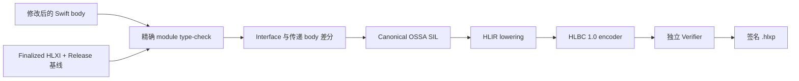
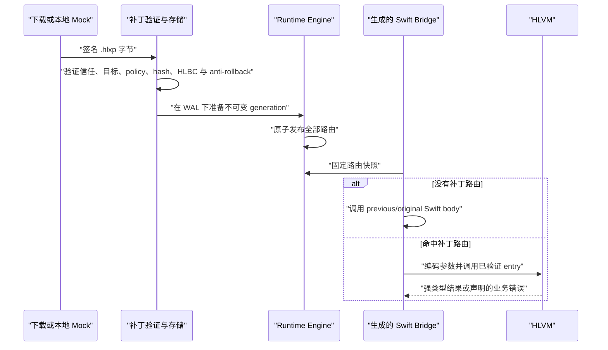

# 生产热补丁

[English](Production-Hot-Patching.md)

Helix 的生产补丁是经过签名、绑定具体构建的 HLBC 程序。工程师编写普通 Swift，但已发布 App 只会通过随 App 安装的 Runtime 执行验证后的字节码。这条路径没有设备端编译器、JIT、下发 Swift 源码或下发原生 dylib。

## 事故发生前必须准备什么

热补丁能力要在正常 Release 构建期间准备，无法在任意二进制发布后再补进去。

Release 流水线需要：

1. 冻结 Shell namespace、App 身份、编译器、SDK、target、源码集合和语义编译参数。
2. 使用精确 Swift frontend 索引声明，决定哪些已有 root 可以打补丁。
3. 生成 Derived Sources，其中包含永久 Dynamic Replacement Bridge、精确 Swift 入口 wrapper 和允许的原生 invoker；不会重写手写源码。
4. 让 App 使用 `HelixAppRuntime` 构建并签名。
5. 链接完成后用真实 Mach-O UUID finalize HLXI，并保留精确 Release 源码基线及工具链产物供以后构建补丁。

App 内只保留紧凑的路由、类型和 NativeImport 表。完整私有源码上下文等敏感构建信息保留在服务端归档中。

## 从 Swift 修改到 HLBC

发生事故时，工程师检出精确的发布基线，修改已有 eligible implementation。补丁构建器使用完整 module 源码，而不是把一个文件交给简化解析器，因此能够保留正常 Swift 的名字查找、重载选择、private 可见性、条件编译、泛型和合成声明语义。



只要发现 interface、布局、isolation、源文件成员关系、工具链、SDK、不支持的 SIL 或未授权原生调用变化，构建就会在打包前失败。Helix 不会为了让补丁成功而放松这些检查。

HLBC 是版本化的强类型寄存器字节码，不是序列化 SIL。它把编译器私有指针和编号替换成稳定 ID、显式 ownership、effect、capability 与有界操作。独立 Verifier 不信任 Patch Compiler，会重新验证控制流、寄存器类型、ownership、access scope、调用签名、能力要求和资源边界。

## 补丁如何调用已有 Swift

某个 Swift 声明存在于 App 中，不代表补丁可以随意调用它。调用只能跨越以下冻结边界之一：

- 同一个 HLBC image 中的其他函数；
- 由 `FunctionKey` 与 `EntryIndex` 标识的 eligible Shell entry；
- 由 App 内生成的精确签名 Swift factory 支撑、且在 allowlist 中的 `NativeImportID`。

Patch Compiler 会递归闭合当前 module 内可达的实现函数。因此，补丁可以在现有源码文件中新增普通顶层 helper 或 class 的 private 实例方法，并从发生变化的已归档 root 调用它；前提是完整具体签名和函数体都落在 HLBC 子集内。这类声明只存在于该不可变 bytecode image 中，不会创建新的 Shell Entry、原生符号、Swift metadata、selector，也不能被原生代码直接调用。Helix 会把 helper 的函数体计入 root 的传递实现指纹，所以即使 root 的调用点文字没有再变化，之后修改 helper 仍会产生不同 generation。

NativeImport 既可以显式列出，也可以在构建期按文件、module 或工程范围发现。工程范围会展开成逐项 canonical descriptor 与生成 invoker，设备端从不解释“全工程 wildcard”。补丁中新增某个调用的前提是已发布 Shell 已经包含对应 capability，并且 policy 允许它的 effect。

这种设计不依赖不稳定的 Swift 符号查找、metadata 猜测或万能 `dlsym` API。代价也很明确：要扩大补丁能调用的原生表面，通常需要重新发版。

## 包信任与安装

`.hlxp` 包含 canonical manifest 和带 hash 的 payload 记录。当前 Release Builder 只接受 `internalHLBC` 与 `enterpriseHLBC`，会拒绝 `appStoreHLBC` 和 `controlledNative`。

客户端安全链已经包含：

- Ed25519 root/leaf 证书模型与包签名验证；
- 有界顺序下载和增量 SHA-256 校验；
- bundle/build、Shell interface、Mach-O UUID、架构、系统范围、policy、signer、时间和 rollout 目标检查；
- canonical 且不可变的 verified package store；
- campaign 单调 revision 与 anti-rollback 状态；
- 基于 nonce 的激活 WAL；
- 不可变 Runtime generation、active health proof、Crash Guard、LKG 恢复、吊销，以及回退到旧包或 originals。



测试这条客户端链并不依赖服务端控制面。仓库中的 Hot Patch Demo 可以把生成包复制到 Simulator App inbox，模拟一次下载；App 仍会走正式验签、存储、WAL、激活、health 与回滚流程。

## Generation 语义

激活不会逐个函数修改路由。Helix 会先构造完整不可变 generation，验证每条路由和 capability，再一次性发布快照。最外层 Bridge 调用会为整条同步或异步调用链固定该快照，包括允许的原生重入。因此，并发激活只影响后续调用，不会让一次进行中的调用执行到一半切换 generation。

发布前会把继承 route 物化进 snapshot。Registry 默认保留当前 snapshot 与直接回滚前代；更旧 snapshot 会被压缩，除非仍有执行中 lease 需要它。lease 是自包含的，所以压缩不会重定向或使正在运行的调用失效。发布前会同时检查 snapshot 数量与去重后的 artifact 字节上限；容量失败不会修改活动路由或 generation ID 高水位。普通激活不能复用被压缩的旧 ID。唯一的窄例外是经过验证的持久化恢复：路由回到原始实现后，它可以重新挂载完全相同的历史 package/ID，但高水位保持不变，后续新激活仍必须超过该高水位。重复安装当前已经激活的完全相同 package 也是幂等操作：Helix 仍会重新检查当前信任、目标、policy、有效期、吊销和 anti-rollback 状态，但会直接返回现有 lease，不创建 WAL，也不推进 generation 高水位。

没有活动补丁时，永久 Bridge 会调用原始 Swift body。无补丁 fast path 不创建 VM CallFrame，但依然包含动态入口与 generation lookup 的成本，该成本仍需在真实设备性能资格中验证。

## 当前语言边界

当前 wire 版本为 HLBC 1.0 与 HLXI 1.0。已实现子集包括常用整数和浮点操作与转换、`min`/`max`/`abs`、Bool、具有显式逻辑合同的 String/Character/Substring、Unicode String 转换和插值、包含 address projection 的 Tuple/Optional、递归 Array/Dictionary 相等、常见 Array 索引/搜索，以及可表示 managed Collection 与有限具体 progression 上流式执行的自然极值、等值 membership、跨来源 Sequence 关系和非可变排序。Array 还支持 element 类型通用、来源可归一为 Array-backed 值的结构拼接、插入、替换、删除、反转、交换、predicate 删除、双向 partition 与容量提示；Array-backed storage 会把物理元素与逻辑整数基址分开保存，`ArraySlice` 与递归 Array-backed `Slice` 因而会跨调用、聚合、Optional、派生 view、搜索、split、排序和受支持变异保留 bounds，`Array(sequence)` 有意生成零基新 Array；Dictionary 支持查找/下标变更（包括惰性默认查找和 scoped 默认值回写）、`updateValue`、`removeValue`、`removeAll`、key/value 投影、唯一键序列构造与容量提示；Set 支持基于递归 VM-defined Equatable/Hashable 语义的强类型构造、查询、变更、迭代与集合代数。常见完全具体的变换、归约、访问、predicate 查询和 comparator selection 会在 Array、Dictionary、Set 上复用同一套 closure 遍历；三种容器的 `filter` 都会保留容器类型，Dictionary 另支持 `mapValues` 与 `compactMapValues`。已实现子集还包括 managed Collection 上强类型的 `enumerated`、`Array(sequence)` 与异构 `zip`，以及 Array-backed 的 reversed/repeated/sliced/joined adapter、`Optional.map`/`flatMap`、使用补丁内局部值 payload 的具体 `Result` payload 变换与 `Result.get()`、VM-owned `Any` 与常用动态转换、定宽整数 `Range`/`ClosedRange` 迭代、整数与浮点 `stride`、标量 Range containment、结构化控制流、可随补丁新增且不导出 ABI 的普通/private helper、computed accessor、文件/module scope struct/enum、pure HLVM class、具体 `Result` 及带 payload 的局部 Error、受限的补丁内 `inout`/`mutating` helper、同步 nonthrowing/throwing 补丁内 closure、类型无关的 managed mutable capture、可复用 borrowed 值或在每次调用生成 owned 副本的可复制线性捕获、同 image `@escaping` 返回/捕获、递归存储与高阶 closure 值、类型通用的同步 `withExtendedLifetime`、动态检查的 `withoutActuallyEscaping`、词法期 nonescaping closure 对调用者 `inout` 的借用、编译器已经完全具体化的 specialization、reabstraction thunk 和默认参数 generator、自动冻结的 `Swift.print`、`Swift.debugPrint` 与固定 String description NativeImport，以及顶层无 suspension 的 `async`、`async throws` 和 `@MainActor async` 入口。新增 `final` class 还可在闭合 hosted profile 内继承已冻结的 `NSObject` 兼容项目类或系统类，并以 superclass 身份交给原生代码；当前只支持继承无参初始化、无 stored property 与 no-arg/Bool `Void` override。

闭包值还支持补丁内 enum case、具体 `Optional`/`Result` case 构造器、补丁内 struct initializer 与 static factory，以及表示保持的 NativeImport 全局/自由函数、绑定实例方法和 initializer 引用。经过上下文定型的运算符/重载及 unbound method 引用、同步 `@MainActor` closure、常见 lazy/可变/条件 closure 变量，以及既递归直接调用又形成 closure 值的局部 helper 也复用同一 callable 图。native receiver 进入普通 closure context，compiler-only initializer metatype 在校验后擦除；其他具体 metatype 同样只作为经过身份校验的编译期物理参数，并在进入 HLBC 前擦除。自定义 initializer 的字段式构建会在全部字段初始化后，通过统一 aggregate storage 重建值。这里没有运行时 Swift metadata、逐类型构造器特例或版本分叉，协议、schema、ABI 与产品版本仍保持 1/1.0。

在同一个 verified image 内，具体 `throws(Failure)` callable 会在直接调用、closure 调用、escaping aggregate storage、具体泛型转发、受支持的具体标准库高阶调用及 catch continuation 之间保留精确的、符合 `Error` 的补丁内 nominal。这条当前 v1 ABI 由 `typed-throws-1` 门禁，throw payload 不会退化为 String；只有编译器已经具体化的 reabstraction thunk 才能把它转换为 `throws(any Error)`。typed-throws Shell root 与 throwing NativeImport callback 仍不在支持范围内。

安全的 `weak` 与 checked `unowned` capture list，以及被捕获的 weak 局部变量，会复用一个类型无关的 managed-capture storage。其不持有对象的 handle 支持补丁内 class 与已冻结 identity 的 native reference；对象释放后 weak load 归零，已失效的 checked-unowned load 触发受控 VM trap。该能力由 `non-owning-references-1` 门禁，并在开发期直接纳入统一的 v1 schema，不保留旧方案兼容层；HLBC、HLXI、ABI 与产品版本仍为 1/1.0。

`Any` 不会序列化 Swift existential metadata，也不会把泛型 cast 交给 NativeImport。HLBC 1.0 会在每次擦除/转换旁记录闭合的递归逻辑类型描述符，并与紧凑物理 storage 分离；Verifier 校验描述符/storage 一致性，VM 递归检查 payload shape、Hashable 资格、深度、fuel 与转换碰撞。由此可保留共用 storage 的源码身份和嵌套 Optional/Array/Dictionary/Set/Tuple 转换，同时继续把 native object、closure 与用户自定义 Hashable witness 排除在下载执行面之外。若递归转换会把不同的 Dictionary key 或 Set element 折叠为同一值，HLVM 会触发受控 trap，以匹配 Swift 对集合不变量的终止检查。

同 image 的具体泛型执行完全发生在编译期。Compiler 会依据精确、完整的 frontend conformance 证据求解连续 generic clause 中的 same-type、superclass/`AnyObject`、dependent associated-type 以及可递归证明的条件 conformance requirement。用户 conformance 以精确 frontend record 为准；已表示的标准值族则只使用经过当前 toolchain 校验、且 VM 已有执行语义的集合、相等/比较、数值、`Strideable`、字面量、description 与无损解析闭合证据，其中也包括定宽整数边界与位/query 操作、wrapping/reporting-overflow 算术及 full-width 乘法。精确 witness 会变成 Verifier 可见的操作，compiler-only 字面量 payload 会在序列化前消除；递归 `Hashable` 证据不会伪造 Swift `Hasher`，imported native conformer 也仍需另行冻结的具体 NativeImport，绝不会把相似 storage 当作自定义或 imported conformance。可达泛型 helper 与受约束 extension method 会单态化；文件/module scope 泛型 struct、enum 和 final class 模板只物化具体 image 实例。frontend entry 的精确结果 buffer 同样会把单个、依赖外层泛型及保持顺序的多个 opaque result 替换成 underlying type。泛型、opaque 和 witness metadata 都不会序列化；未解析或开放式证据继续拒绝。

不可变的局部 protocol existential 使用更严格的闭世界表示。对于当前 module 内完整、非条件式的 conformer，Compiler 保留 `any P` identity，并生成有界的精确类型 cast 集合和“精确类型 → witness function”表。它覆盖 composition、继承、补丁内 struct/class value 与 `AnyObject` 约束、不可变 erasure/opening 与闭合 narrowing/widening、绑定 method、closure 返回、同步 throwing requirement，以及 checked/forced protocol cast。Verifier 要求唯一的共同 callable ABI 和具体 image target，每个集合最多 4,096 项；HLVM 只做精确匹配，并按完整查找规模计入 fuel。Swift protocol metadata 和 witness table 仍不会进入 HLBC。这些 Swift existential 只能留在 image 内，不能穿过 Shell 或普通 NativeImport；另行证明的 Objective-C `!foreign` protocol 擦除仍是冻结的原生 `AnyObject` reference。条件式、imported、开放式与 mutable existential dispatch 继续拒绝。

当前 module 中已有的 Shell struct/enum 使用独立的冻结逻辑值边界。Eligible 的 copyable、非泛型、非递归值可以成为参数、结果或实例 receiver，包括 extension method，以及普通、`borrowing`、`consuming`、`mutating` ownership 的 normal/throwing 路径。同步 Entry 可以具有恰好一个逻辑 `inout` 区域，包括可变 `self`。Interface 会记录精确源码限定的 struct field 或 enum case、label、顺序、递归可表示类型、copyability 与受支持的 conformance 事实。同源构造 hook 和生成的流式 codec 能在不依赖 Swift ABI layout、反射或运行时 metadata 的前提下重建 private storage；Release indexing、Patch 源码重放、device hash 与独立验证都要求完全相同的定义。嵌套值与可表示的标量、文本、`Any`、Optional、Array、Dictionary、Set、Tuple storage 可以递归组合。生成边界把该区域复制到 invocation-scoped HLVM storage，在 normal 或已声明 error continuation 返回唯一且类型精确的 writeback，并且只在 return/error payload 成功解码后提交；VM trap 不暴露 writeback。因此 field mutation、嵌套 projection、COW collection 修改与 enum 状态转换在 Shell 边界具备事务性。

同一套精确 Entry 模型也覆盖已有的同步计算属性与下标。Frontend 以父声明 identity 把 getter/setter 归为一个替换声明，同时为每个 accessor 保留独立的 SIL ABI 与源码 anchor。当前支持简写/显式 getter、get/set 对、`mutating get`、`nonmutating set`、global/实例属性、static/class 属性、实例/static 下标，以及 receiver 与函数体可表示的源码 extension 成员。Access control 按 accessor 独立判断，因此 `private(set)` 可以只选择 eligible getter，而生成的替换声明仍保留精确 fallback setter。值类型 receiver 的 accessor 使用该 Entry 唯一的同步逻辑 `inout` 区域，在 normal 与已声明 error 出口提交同一个强类型 writeback；普通同步 `throws` getter 因而会在成功和抛错路径都保留 mutation，VM trap 则不提交。显式协程 accessor（`_read`/`_modify`）、async 或 typed-throws accessor、带 availability 的声明、泛型 accessor 声明或位于泛型 nominal/extension 上下文中的 accessor、生成的文件作用域代码无法命名 private 嵌套 receiver 的 accessor、多个/async `inout` 与 mutable existential writeback 仍会 fail closed。该能力继续使用同一套 v1 合同，不产生兼容版本。

直接声明的普通 stored-property observer 走一条独立的精确源码 body 路径，因为 Swift 没有可调用 observer 的源码拼写，而 observer-only `@_dynamicReplacement` 在正常多文件构建中并不可靠。Shell materialization 会把每个显式 `willSet`/`didSet` body 绑定到已索引的 UTF-8 range 与 hash，再在原文件的 derived copy 中将它替换成永久 HLBC dispatch wrapper。词法位置中的 baseline body 仍是 wrapper 的正常 fallback，因此 private/fileprivate 访问、隐式或自定义 `newValue`/`oldValue` 名称、直接访问被观察 storage，以及 Swift 的 observer 递归规则都会留在原始上下文。global observer、eligible frozen struct receiver 和源码 reference-class receiver 可以独立选择。可变 value receiver 复用其他 Shell value Entry 的单一事务性 `inout` 区域与精确 writeback；传递依赖的 frozen-value codec 仍放在各自类型的定义文件中。Reference observer 只有在普通 frozen source scope 与 policy 明确允许时，才能使用对应 source-property NativeImport。补丁后的 reference observer 不能直接给自身被观察属性赋值：若把它路由为普通 setter 会递归重入 observer，与 Swift 的词法 storage 规则不一致，因此该形态会 fail closed。

当前 observer profile 限于同步、非泛型、非隔离、非 static 且直接声明的形态。static/class observer、继承 override、lazy/wrapped storage、weak/unowned 或 Objective-C storage、带 availability 或泛型的上下文、actor/global-actor isolation、baseline magic literal，以及会改变 observer 是否带逻辑 old/new-value 参数的修改都会 fail closed。系统不会为 observer 生成 Native replacement 或可调用 OriginalEntry；不可达的 nested-original 路径会防御性 trap。

原生文本渲染是一个有意收窄的例外：它复用 Swift 原生语义 leaf，但不会把泛型标准库 API 整体交给 NativeImport。Compiler 会识别泛型 `String(describing:)` 与 `String(reflecting:)` SIL 入口，证明递归的标量、文本、Optional、Array、Dictionary、Set 值可穿过 Swift codec，再转换成固定 `Any -> String` Shell ABI；泛型 metadata 与 witness table 不会跨边界。`Swift.print` 与 `Swift.debugPrint` 使用其完全具体的 `[Any], String, String -> Void` ABI。四个 import 都会冻结进当前 Shell，并统一限制 64 KiB 输出；分支内的 existential 写入会先通过强类型 HLBC block parameter 合流，再 finalize Array 字面量。ArraySlice、Tuple、补丁内值、native object 与 closure 仍只可在 verified image 内使用，并会由 Compiler 证明或边界 codec 拒绝，不会进入 Swift formatter 或实际 I/O。HLBC、HLXI、ABI、schema 与产品版本继续保持 1/1.0。

`Result(catching:)` 会把同步 throwing closure 的 normal/error continuation 直接构造成具体 `Result`，closure 只调用一次；它复用既有 closure CFG 与本地 enum 原语，不执行 Swift 泛型 NativeImport。受管 `Error` existential 可以成为本地聚合负载，但具体值树在构造和 VM 边界都执行 capability、深度与 fuel 检查；native handle 仍不能嵌入局部 `Result`。

文本能力不再局限于 Character 字面量判断。String/Character/Substring 使用显式逻辑合同：Character producer 与 Shell Bridge 验证恰好一个扩展字素簇，Substring 归一为 Character Array；String 的 `count`/`isEmpty` 不分配，需要 element 的遍历、变换、关系、基于数量的 subsequence、split、`Array(sequence)` 与 reversal 只物化一次并复用现有有限 Sequence plan。String/Substring 转换、Character 序列构造、嵌套 Character flatten、String 序列 joining、append/repetition、String/Character 比较与文本插值只使用两条 Verifier 可见的表示原语，不依赖 Swift 泛型 NativeImport 或逐源码 API opcode。单元素 append、有限 Sequence 的 `append(contentsOf:)`/`+=`、首尾/计数删除、`popLast`、清空与容量提示在 String、Substring、Array 和已归一的 Array-backed view 之间复用同一个可表示 `RangeReplaceableCollection` 变更计划。contents source 会在规范化源码级 Element 身份与物理 shape 通过校验后复用现有 managed Collection/progression 物化边界；直接 String/Character suffix 不拆分 destination。标量解析同样按类型驱动：一条受验证操作覆盖 String 到 `Bool`，以及各自受支持 String/Substring 入口上的全部可表示有/无符号定宽整数、`Float` 与 `Double`；另一条覆盖完整整数族的 radix 格式化。VM 只有在类型、radix、fuel 与分配检查完成后，才可在内部调用 Swift 原生 parser/formatter；泛型标准库 ABI 不会被序列化或注册成 NativeImport。超出 `2...36` 的 radix 是与 Swift 一致的受控 trap；两条操作仍属于当前 HLBC 1.0 合同。私有 String index、UTF view、index-sensitive 修改与 Foundation 文本语义仍会 fail closed。

managed Array、Dictionary、Set 共用直接的 `count`、精确 Collection `underestimatedCount`、`isEmpty`、`first` 查询，Array 另支持 `last`，已经归一的 Array-backed view 使用同一套查询语义；Zip 会递归保留来源的 Sequence-witness 估算值，包括 enumerated 与 flattened/joined 来源的 `0`。`count(where:)` 在这些容器与受支持有限 progression 上复用同一 streaming cursor 和普通 throwing closure CFG。容量变更提示以及 Dictionary/Set 的 `minimumCapacity` 构造可用，负数保留 Swift precondition；读取 `Array.capacity` 与调用 `randomElement()` 会在相应存储或随机性 policy 被表示前明确拒绝。

Array、ArraySlice、递归 Array-backed Slice 与 Repeated 共用整数索引移动及变异式 `formIndex` 家族；Repeated 还复用零基 start/end、距离、indices、安全下标与泛型 associated-index 的间接结果 ABI。

有限整数 Range/ClosedRange 与受支持数值 stride 还会复用现有强类型 cursor/builder/closure 语义，覆盖常见正向 Sequence 变换、归约、访问、predicate、comparator selection、自然极值/排序、关系、Set 构造/代数与 Array-backed adapter。整数 Range/ClosedRange 的 `count`、`underestimatedCount`、`isEmpty`、`first`、`last` 是常数时间 bounds 查询，count 精确覆盖完整 element 位宽并在超过 `Int.max` 时 trap；StrideTo/StrideThrough 的 `underestimatedCount` 通过同一受 fuel 限制的 cursor 精确流式计数，只使用常数额外空间。半开定宽整数 Range 的计数式 subsequence 会在常数时间内移动并 clamp 一个 bound，不把完整基数收窄到 Int。具有可表示 Comparable bounds 的 Range 还支持 `isEmpty`、`overlaps`、`clamped(to:)` 与上下界投影，并通过同一强类型 compare/select 计划保留空区间 overlap 与浮点 signed-zero 语义。只消费 element 的操作直接流式执行，只有结果需要完整存储时才使用 builder；不会把 Swift 泛型方法绑定成 NativeImport，也不会为每个源码 API 增加 opcode。

`Bool.toggle()` 与全局 `swap` 归一为共享 compiler-address sink 上的值修改语义族。swap 要求两个 storage 不重叠，并在任一写入前完成两次读取，因此局部值、aggregate projection、frame address 与可变 closure cell 共用同一路径，不增加逐 API opcode 或 NativeImport。

可表示整数、浮点、String 与 Character bounds 的单侧 `RangeExpression` containment 和 switch 匹配复用同一套强类型比较。Array-backed 来源的整数 `Range`、`ClosedRange`、单侧与全范围下标统一复用强类型 slice 边界并保留逻辑基址；String/Substring 的全范围物化仍保留独立 Character 表示。这些只存在于 Compiler 的计划不会序列化 Swift 泛型 metadata 或 witness table，也不会为每个集合 API 新增 NativeImport 或 opcode。可能无限的 partial-range Sequence 来源、自定义 `Comparable` witness、私有 `String.Index`、`ReversedCollection.Index` 与其他不透明 index identity 仍会被拒绝。

Optional 强制解包与 `unsafelyUnwrapped` 会复用同一强类型 projection，并保留专用且经过验证的 nil trap。`precondition`、fatal-error 家族、生效中的 assertion 与失败的 `try!` 错误边会降低为终止 trap；动态 String/Error detail 统一使用一条 `source_failure`。这些路径不会把 Swift runtime failure symbol 加入 NativeImport Catalog，源码位置仍来自脱敏的 HLBC source map。没有 payload 的 nil element/key/value 会从静态上下文恢复 wrapped type；泛型间接结果也可经统一 compiler-address sink 写入 Array 字面量构造 storage，当前 wire 仍为 HLBC 1.0 与 HLXI 1.0。

可表示的 managed Array、Set 与 Dictionary 还会通过通用 cursor 直接执行极值、等值 membership 与跨容器 Sequence 关系；非可变排序、`enumerated`、`Array(sequence)` 与异构 `zip` 只在结果需要完整存储时进入统一物化边界。Dictionary element 保持 `(Key, Value)` Tuple，Set/Dictionary 顺序使用确定的 VM 迭代顺序。可变自然/comparator 排序接受具有可表示整数索引模型的 Array-backed mutable Collection，并保留逻辑基址。

Dictionary 的具体能力还包括 uniquing 构造、Dictionary/可表示 Sequence 两种 `merging`/`merge`，以及可表示 Collection 的 grouping；这些 API 共用受验证的线性 accumulator 和普通 closure CFG，不绑定 Swift 标准库的私有泛型 ABI。

frontend 的 Array/Dictionary cast helper 只有在原始类型仅有 Tuple label 差异、且两端完整 VM 类型也相同时才可被消除；真正的 element、key、value 或 reference 转换仍会被拒绝。

NativeImport 还可通过同一套生成式 adapter 接受精确的直接或 Optional callback 参数，Swift closure 与 Objective-C block 共用该路径。v1 profile 接受同步、nonthrowing callback，保留 nonescaping/escaping 与 global-actor 合同，并允许递归可桥接的普通 callback 参数。若 Swift 类型检查能够证明嵌套 callable 是 escaping，外层 callback 还可以接收一层直接或 Optional 的原生 callable；该 callable 自身必须同步、nonthrowing，其参数与结果使用 callback bridge value（包括受限 `Error` 代理），并通过同一条强类型 VM closure 调用执行。递归 callable signature 以及把 callable 放进集合、Tuple 或 `Any` 的形态仍会拒绝。精确 NativeImport 本身也可以按相同的同步、nonthrowing、component 不含 closure 的 profile 返回直接或 Optional 的原生 callable。生成 Bridge 会创建具有 identity 的 escaping target，并在 import context 关闭前按精确 deadline 与已签名资源上限完成编码；image-local closure 不可替代，后续调用仍执行 MainActor 与非 Sendable 重叠检查。结果可以是 `Void`，也可以是具有确定性失败值的普通递归 bridge value：标量、文本、`Any`、Optional、空集合以及元素都可默认构造的 Tuple 均可使用；直接 native value 因不存在 framework-neutral 的可构造实例而拒绝，Optional native value 则可安全回退为 `nil`。直接或 Optional `Error` callback 参数以有界 opaque proxy 跨边界，只携带动态类型文本名，不携带原生 payload、类型 metadata 或语义 identity；Shell entry、普通 NativeImport 参数/结果以及 callback 结果仍会拒绝 `Error`。nonthrowing callback 失败时，生成 wrapper 会先返回确定性的 ABI 值；若 importer 仍在执行，该失败会被保留并在 native frame 返回后使外层 NativeImport trap，已经脱离原调用的 escaping callback 则通过 Runtime telemetry 上报。escaping handle 会保留 image 与 generation lease；在通用 Swift `Sendable` 语义实现前，Runtime 会串行化 callback 执行。经过检查的源码默认参数投影使 UIKit animation/transition/property-animator、Dispatch queue/group、OperationQueue、Timer、URLSession、NotificationCenter、`NSPredicate`、`FileManager` enumeration 与 `UIContextualAction` completion callback 无需逐 API 的 VM 实现。Swift `Any` boxing、Objective-C protocol 擦除与 Foundation value-overlay bridge 同样冻结为精确且通用的 NativeImport adapter，而不是 API 特有的 Runtime 行为。ABI、schema、capability 与产品版本全部继续保持 1/1.0。

它并非任意 Swift。generic root、运行时 metadata，以及运行时、无法证明的条件式、开放式、歧义或 mutable-existential witness dispatch（已证明的闭合具体——包括条件 witness——与不可变闭合 existential witness 会由 Compiler 解析成 image call）、Swift protocol existential value 穿过 Shell 或普通 NativeImport、原生可识别的补丁具体 Swift 类型、函数内部 nominal 声明、hosted stored property/自定义 initializer/任意 callback ABI、已有原生类型的 stored layout 变化、多个或 async `inout` 区域、显式协程/async/typed-throws/availability-constrained/generic-context Shell accessor、无法由生成代码命名 private 嵌套 receiver 的 accessor、不受支持的 stored-property observer profile、closure 穿过 Shell Entry 或上述精确 callable profile 之外的 NativeImport 位置、throwing/async/inout callback ABI、递归或 nonescaping 的嵌套 callable 参数、没有 framework-neutral 失败值的 callback 结果、并发 `Sendable` closure 执行、async closure、`unowned(unsafe)`、weak/unowned stored-property layout、escaping closure 对调用者 `inout` 的捕获、真正的 `await`/continuation、actor-isolated `self`、custom global actor、`autoreleasepool` 等带原生运行时语义的 closure scope、不受限指针、基于反射的字段访问和未注册原生 API 都会被拒绝。实用矩阵见[能力与限制](Capabilities-and-Limits.zh-CN.md)。

HLBC 会携带经过 Verifier 检查的 function/block/instruction → 逻辑 Swift 位置映射；生产打包会移除构建机绝对路径。执行发生 trap 时，HLVM 会给出精确 program counter，Runtime 再补充固定的 generation、Shell entry、函数和逻辑文件/行/列。这是诊断映射，不是支持 breakpoint、单步或表达式求值的交互式调试器。

上文的 witness 分派限制指运行时、无法证明的条件式、开放式、歧义或 mutable-existential 派发；完全具体且 requirement 已证明的 call（包括条件 conformance）与不可变闭合 existential call 都会由 Compiler 提前解析为 image call，不携带 Swift witness table，也不改变 1/1.0 合同。

同一套 NativeImport callback 发现与生成机制也覆盖原生 method、initializer、completion 参数及 callback 属性 setter，包括 `UIAction`/`UIAlertAction`、`UIViewController.present`、cell configuration handler 与 `Operation.completionBlock`。属性赋入 closure 属于存储，因此即使属性函数类型不能书写 `@escaping`，合同也会将其生命周期固定为 escaping，并保留表达式的 actor isolation；这里没有 framework/API 特例，也没有版本分叉。

## 构建补丁包

精确输入取决于生成的 Release 集成，但核心命令面如下：

```bash
swift run helix patch build \
  --archive Build/Shell.hlxi \
  --config Config/Release.json \
  --certificate Config/LeafCertificate.json \
  --private-key Secrets/LeafPrivateKey.json \
  --trusted-root Config/TrustedRoot.json \
  --output Build/Patch.hlxp \
  Sources/Feature/A.swift Sources/Feature/B.swift
```

源码列表必须代表冻结归档所需的完整 module。生产签名可以通过注入 signing service 完成，让 Builder 无需直接接触长期私钥。

Helix Hub 会创建一个同时支持 `iphoneos` 与 `iphonesimulator` 的空 Patch Aggregate target；它只作为 shared Scheme 的构建锚点。真正的 `patch.sh` 是 Scheme Build pre-action，`EnvironmentBuildable` 指向 App target，因此能拿到 App 的精确版本与平台设置，不需要复制配置，也不会重建 App。构建 Patch Scheme 时应选择与已审计 Release Shell 相同的平台：真机归档产生 iOS/arm64 包，Simulator 基线产生 iOS Simulator 包。Patch Action 不会把一个平台的基线转换成另一个平台。

## 分发状态

仓库实现的是生产客户端与补丁构建机制，不是绕过平台政策的授权。App Store 通道被明确设为 `policyBlocked`。真实部署仍需要明确目标分发方式、法务与安全批准、设备和业务 corpus 资格、运维控制面设计以及紧急停用方案。Simulator 中技术跑通并不代表这些 Gate 已经关闭。
