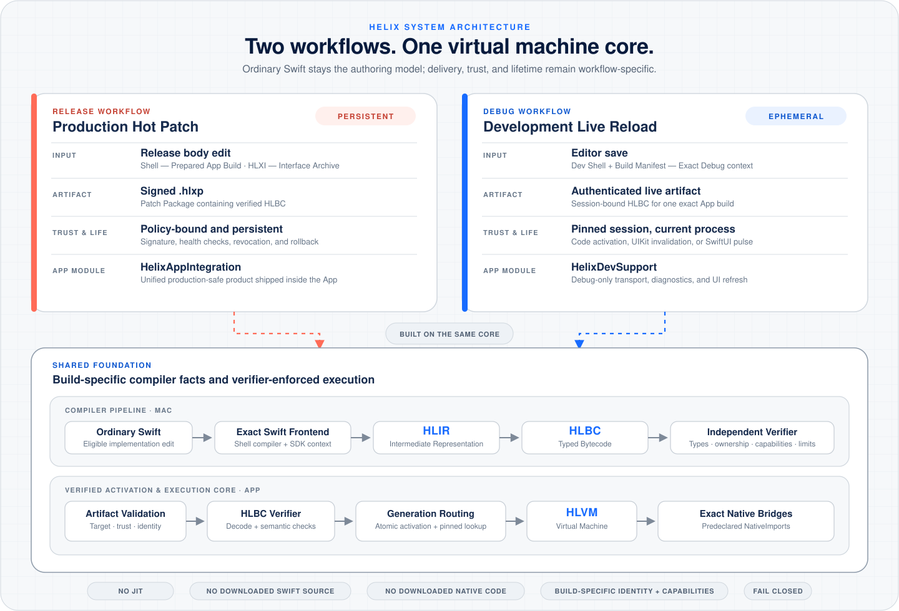

   
  <strong>Hot patching and live reload for Swift — that’s dark magic.</strong>

<strong>English</strong> | <a href="README.zh-CN.md">简体中文</a>

Helix brings hot patching and live reload to Swift. Edit the code and hit save —
the running App updates instantly. When an issue reaches production, build the
fix into a patch and deploy it directly to production.

HLBC and HLVM make the magic happen: Swift becomes verified bytecode and runs
inside the virtual machine. One powerful VM core drives both live reload and
production hot patching.

> **Status:** Helix is under active development and testing as we expand
> coverage across more projects and use cases.

## Live Reload in action

Edit Swift in Xcode and save. Helix compiles and activates the change in the
running App without rebuilding or reinstalling it, while preserving its
in-memory state.

https://github.com/user-attachments/assets/7b3d4124-23a0-44ad-8c27-57a5080d03d6

## Start here

| Goal | Guide |
| --- | --- |
| Run the checked-in UIKit Demo and see production Hot Patch and development Live Reload work end to end | [UIKit Demo](Demo/README.md) |
| Enable Helix in an existing App with automatic target, scheme, package, compiler, Bridge, and runtime setup | [Getting Started](Docs/Getting-Started.md) |
| See which Swift code changes Helix supports today and which changes still require a normal rebuild | [Capabilities and Limits](Docs/Capabilities-and-Limits.md) |
| Understand how Swift compilation, HLBC, HLVM, activation, and workflow isolation fit together | [Architecture](Docs/Architecture.md) |
| Prepare a Release Shell, build and sign a `.hlxp` patch, then install, activate, and roll it back | [Production Hot Patching](Docs/Production-Hot-Patching.md) |
| Trace a saved Swift change through compilation, authenticated delivery, runtime activation, and UIKit/SwiftUI refresh | [Development Live Reload](Docs/Development-Live-Reload.md) |
| Use the Helix Mac assistant to discover a project, configure both workflows, and manage development sessions | [Helix Hub](Hub/README.md) |

## App integration

Helix Hub links one production-safe product, `HelixAppIntegration`, and starts
it through a generated hidden bootstrap. Application source does not import or
initialize Helix. The same App target can use both workflows through different
configurations.

| Build role | Product | Behavior |
| --- | --- | --- |
| Every configured App target | `HelixAppIntegration` | Production verifier, HLVM, patch installation, recovery, and rollback; no development transport or loader |
| Live Reload configuration only | dynamic `HelixDevSupport` | Authenticated development updates, Simulator native loading, diagnostics, and UI refresh; linked and embedded only by the generated development configuration |

Hub discovers or creates the scheme, reuses or adds the Swift package, captures
the real Xcode compile, generates the Bridge under DerivedData, and starts the
selected runtime automatically. There is no user-maintained source list, API
allowlist, or manual build-freezing step.
Mappings remain editable after setup, and Hub can transactionally reconfigure
or remove its Xcode integration while preserving application source and the
project's original settings.

The compiler, Helix Hub, and CLI run on the Mac. Do not link these build-side
tools into an iOS Release App.

## Requirements

- macOS 14 or newer for build-side tools and the Helix application.
- iOS 15 or newer for App runtime targets.
- Xcode with a Swift 6 toolchain for compiler-backed integration and fixtures.
- A normal signed Xcode build before Live Reload or Release Shell finalization.

The package manifest uses Swift tools 6.1. Patch and Live Reload artifacts remain
bound to the compiler, SDK, sources, settings, and binary identity captured for
their target Shell.

## License

Helix is licensed under the [Apache License 2.0](LICENSE).
