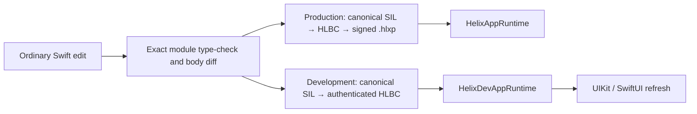

# Helix

[简体中文](README.zh-CN.md)

Helix turns edits to existing Swift implementations into either a verified
production bytecode patch or a development-only Live Reload generation. Patch
authors keep writing ordinary Swift; Helix preserves the target build's compiler
context and rejects changes it cannot apply safely.

> **Project status:** the repository contains an executable technical baseline,
> not a claim of unrestricted Swift support or approved App Store hot-patch
> delivery. Production App Store distribution is explicitly policy-blocked;
> physical-device qualification, an external top-200 corpus, long-duration
> device soak, and control-plane gates remain.

## Why Helix

Swift does not offer Objective-C's general runtime method swizzling, and an iOS
App cannot assume that arbitrary downloaded machine code may be loaded. Helix
handles the two useful scenarios separately:

| Mode | What is delivered | How it runs | Primary goal |
| --- | --- | --- | --- |
| Production Hot Patch | A signed `.hlxp` containing verified HLBC | A verifier and HLVM already shipped in the App | Repair an eligible released function without compiling code on the device |
| Development Live Reload | A session-bound, authenticated HLBC live artifact | The verifier and HLVM in a Debug App | Save a supported Swift body and refresh the running UIKit/SwiftUI page without reinstalling |

Both modes share exact Swift frontend facts, build-specific identities,
interface/body compatibility checks, native capability contracts, and immutable
generation semantics. Their artifacts, trust roots, transports, persistence,
and Release/Debug runtimes remain isolated.



To integrate an App, start with the step-by-step
[Getting Started guide](Docs/Getting-Started.md). For design and operating
details, read [Architecture](Docs/Architecture.md),
[Production Hot Patching](Docs/Production-Hot-Patching.md),
[Development Live Reload](Docs/Development-Live-Reload.md), and
[Capabilities and Limits](Docs/Capabilities-and-Limits.md).

## Start using Helix

The full guide contains the Host Plan schemas, Xcode target graph, Scheme action
locations, runtime bootstrap examples, first Live Reload, first Hot Patch, and
troubleshooting. The shortest path is:

1. Add the Helix package and choose a focused Swift Feature framework.
2. Link `HelixDevAppRuntime` for a Debug Live Reload profile or
   `HelixAppRuntime` for a Release Hot Patch profile.
3. Write `HelixXcode.json` with the complete Feature source list and profile.
4. Generate and validate the deterministic integration:

   ```bash
   swift run helix xcode generate \
     --plan HelixXcode.json \
     --output .helix/xcode
   swift run helix xcode validate --plan HelixXcode.json
   ```

5. Follow `.helix/xcode/Integration.md` to connect the Feature and aggregate
   runtime, apply the Feature/App xcconfig files, add the hidden Bridge phase,
   and wire Scheme actions. No generated Swift file or Bridge target enters the
   Xcode project. Then run `helix xcode doctor` for each profile.
6. Keep one stable `ApplicationSession` alive. UIKit automatically discovers
   displayed controller/view instances; SwiftUI still needs a pulse boundary.
7. Run the Live Reload Scheme once and save an existing Swift body, or freeze a
   Release Shell and use the Patch-only Scheme to build a signed `.hlxp`.

Before migrating a production project, run the checked-in
[UIKit demo](Demo/README.md) end to end. Its Host Plan, five-target Xcode graph,
runtime bootstrap, shared Schemes, local mock download, and save-to-screen flow
are executable examples rather than pseudocode. Use the
[Xcode Run E2E cases](Xcode-Run-E2E-Test-Cases.md) when recording the GUI-only
Live Reload acceptance run.

## What is implemented

- Build-specific Shell identities, `FunctionKey`, `TypeID`, `EntryIndex`,
  capabilities, quotas, diagnostics, and interface archives.
- Release Derived Sources and permanent Swift bridges without modifying
  handwritten source files.
- Canonical HLBC 1.10 encoding/decoding, independent structural and semantic
  verification, a typed-register HLVM, exact native bridges, immutable
  generations, and pinned call-chain snapshots.
- Exact-toolchain Swift-to-HLBC compilation for the documented subset: common
  scalar and String operations, bounded Character predicates, Optional
  projection, `Range<Int>` loops, Array/Dictionary value semantics,
  file/module-scope patch-local struct/enum and concrete `Result`,
  payload-carrying local errors, scoped local `inout`/`mutating`, synchronous
  patch-local closures including bounded `@escaping` return/capture flows,
  concrete compiler specializations and default-argument generators,
  VM-owned `Any` with common dynamic casts, automatically frozen `Swift.print`,
  and non-suspending async entries.
- NativeImport v2 and schema 2 build-time discovery by declaration, file,
  module, or project scope, plus dual-evidence freezing of baseline-used APIs
  from imported Apple or third-party modules. Raw enums, OptionSets, opaque
  values, references, accessors, methods, global values/functions, simple
  imported C values, Objective-C bridges, and ownership are emitted as exact
  generated invokers; they are never device wildcards.
- Signed `.hlxp` creation and verification, bounded downloads, immutable
  storage, anti-rollback, activation WAL, Crash Guard, last-known-good recovery,
  signed revocation, and rollback.
- Exact Debug frontend-job capture and replay, stable save snapshots,
  monotonic scheduling, HLBC generation, authenticated transfer,
  verifier-backed activation, UIKit refresh, SwiftUI pulse boundaries, and a
  Debug overlay. Verified logical source maps enrich VM traps without leaking
  production build-host paths.
- A checked-in application-shaped business corpus and a 128-generation
  in-process soak covering failed saves, rollback, invocation, bounded snapshot
  retention, and generation-ID monotonicity.
- An explicitly selected Native Dynamic Replacement backend for internal
  compiler experiments and differential validation. It is not selected by the
  automatic router and is not the supported Live Reload delivery path.
- A deterministic Xcode Integration Kit and checked-in UIKit applications for
  both Hot Patch and Live Reload workflows.
- CLI commands for Shell construction, Xcode integration, patch compilation,
  package inspection/disassembly, Dev Sessions, and benchmarks.

## Important boundaries

- Production patches execute bytecode; they do not download Swift source or
  native machine code and do not use a JIT.
- A production patch may call only same-image functions, eligible Shell entries,
  and exact NativeImports already emitted into the released App.
- Live Reload currently targets bodies of declarations already present in the
  Dev Shell. New arbitrary file-level declarations and new Swift files require a
  normal build.
- Stored-layout, function-signature, superclass, conformance, enum-case,
  isolation, source-membership, linked-dependency, and build-setting changes
  require a normal build.
- Code activation does not imply UI refresh. UIKit automatically matches
  displayed controller/view classes and applies inferred invalidation; custom
  hooks or factories remain explicit for initialization/recreation. SwiftUI
  uses a pulse boundary. Helix does not blindly replay lifecycle methods.
- Simulator and device Live Reload use the same HLBC artifact, transport,
  verifier, and HLVM path. The checked-in Simulator E2E is passing; a physical
  iPhone qualification matrix is still required before claiming device proof.
- The Release builder accepts internal and enterprise HLBC policies. It rejects
  App Store HLBC and controlled native Release packages.

The complete practical matrix is in
[Capabilities and Limits](Docs/Capabilities-and-Limits.md).

## Requirements

- macOS 14 or newer for the package's build-side tools.
- iOS 15 or newer for App runtime targets.
- Xcode with a Swift 6 toolchain for compiler-backed integration and fixtures.
- A normal signed Xcode build before Live Reload or Release Shell finalization;
  Helix captures the actual frontend, SDK, link, source, and signing facts rather
  than synthesizing an approximate command.

The package manifest uses Swift tools 6.1. Exact patch and Live Reload builds are
bound to the compiler and SDK identity captured for their target Shell.

## Package products

An App target links exactly one aggregate runtime product. Do not combine an
aggregate with overlapping leaf products.

| App target | Product | Purpose |
| --- | --- | --- |
| Release / Production | `HelixAppRuntime` | HLBC verification, execution, package lifecycle, and no development loader |
| Debug / Dev Shell | `HelixDevAppRuntime` | Release capabilities plus authenticated Dev transport, ephemeral HLBC activation, and UI reload support |

Build-side modules such as `HelixCompiler`, `HelixBuildTools`,
`HelixReleaseTools`, `HelixDevTools`, and CLI targets belong on macOS. They must
not be linked into an iOS Release App. The release audit scans the final bundle
for development leakage.

## Build and test

```bash
swift build
swift test
swift test -Xswiftc -warnings-as-errors
swift test -c release -Xswiftc -warnings-as-errors
```

The current full SwiftPM baseline contains 457 tests in 73 suites. The recorded
Debug, warnings-as-errors, and optimized Release runs pass. Platform-specific
fixtures can be run with an available Simulator UDID:

```bash
Tests/Fixtures/LiveReloadE2E/run-ios-runtime-tests.sh SIMULATOR_UDID
Tests/Fixtures/LiveReloadE2E/run-simulator-e2e.sh SIMULATOR_UDID
Tests/Fixtures/LiveReloadE2E/run-release-audit.sh
```

The iOS target contains 9 runtime/UI cases. The HLBC Live Reload E2E preserves
one App PID while applying a changed implementation and then a second generation
that restores the baseline. The Release audit builds a separate iOS 15 target
linked only to `HelixAppRuntime`.

Run the microbenchmark in Release mode:

```bash
swift run -c release helix-benchmark --output /tmp/helix-benchmark.json
swift run -c release helix-benchmark \
  --baseline /tmp/helix-benchmark.json \
  --output /tmp/helix-benchmark-candidate.json
```

Report schema 2 includes typed HLVM calls, bridge overhead, and a
`@MainActor` UIKit NativeImport scenario. A comparable baseline/policy
violation exits with status 3 so CI cannot mistake a regression for success.
The optional `--policy PATH` flag replaces the built-in p50/p95 tolerances
with a canonical `RegressionPolicy` JSON document.
Mac microbenchmarks are regression evidence, not a substitute for real-iPhone
startup, scrolling, interaction, memory-pressure, or tail-latency tests.

## CLI overview

```bash
swift run helix xcode --help
swift run helix shell --help
swift run helix patch --help
swift run helix dev --help
```

The major command groups are:

- `helix xcode generate|validate|phase|doctor` for deterministic Xcode
  integration and lifecycle execution.
- `helix shell metadata|index|index-project|build|finalize|audit-release` for a
  patchable Release Shell.
- `helix patch compile|build|inspect|disassemble` for HLBC and signed packages.
- `helix dev prepare|validate|run` for authenticated development sessions.

A package build uses a finalized Shell archive, complete module source context,
release policy, and signing material:

```bash
swift run helix patch build \
  --archive Build/Shell.hlxi \
  --config Config/Release.json \
  --certificate Config/LeafCertificate.json \
  --private-key Secrets/LeafPrivateKey.json \
  --trusted-root Config/TrustedRoot.json \
  --output Build/Patch.hlxp \
  Sources/Feature/A.swift Sources/Feature/B.swift
```

Any toolchain, SDK, source-set, interface, target-identity, policy, signature, or
unsupported SIL mismatch fails before package creation.

## Xcode integration and demos

The generated integration starts from a checked-in Host Plan:

```bash
swift run helix xcode generate --plan HelixXcode.json --output .helix/xcode
swift run helix xcode validate --plan HelixXcode.json
```

It generates xcconfig fragments, file lists, Scheme actions, Derived Sources,
and lifecycle scripts without silently rewriting an unknown project graph.
Connect the generated artifacts to the documented targets and shared Schemes,
then keep the plan under review as the project changes.

For an executable reference, open
[Demo/HelixDemo.xcodeproj](Demo/HelixDemo.xcodeproj) and follow
[Demo/README.md](Demo/README.md). The Hot Patch app exercises a signed package
through a Simulator mock-download inbox. The Live Reload app exercises real
build capture, save detection, authenticated HLBC transfer, verified activation,
and UI refresh.

## Repository map

- `Sources/HelixCore`, `HelixBytecode`, `HelixInterface`, `HelixVerifier`,
  `HelixVM`, and `HelixRuntime`: identity, formats, verification, execution, and
  generation routing.
- `Sources/HelixPatch`: package trust, download, storage, activation, recovery,
  revocation, and rollback.
- `Sources/HelixCompiler`, `HelixBuildTools`, and `HelixReleaseTools`: exact
  Swift/SIL processing, Shell construction, Xcode integration, and release
  package building.
- `Sources/HelixDevProtocol`, `HelixDevTools`, and `HelixDevRuntime`:
  development sessions, live-artifact generation, activation, and UI reload.
  `HelixLiveReloadAPI` is an internal Dev-only contract target shared by that
  graph; it is neither a standalone product nor part of `HelixAppRuntime`.
- `Sources/HelixCLIKit`, `HelixCLI`, `HelixBenchmarks`, and
  `HelixBenchmarkCLI`: commands and performance tooling.
- `Tests`: unit, negative, compiler fixture, integration, Simulator, release
  leakage, and benchmark regression coverage.
- `Demo`: checked-in UIKit Hot Patch and Live Reload applications and generated
  Xcode integration.
- `Docs`: concise English and Chinese architecture, workflow, and capability
  documentation, including the complete integration guide.

Swift declarations use empty-enum namespaces and `Namespace.Type` names instead
of mechanical type prefixes. Protocol spellings such as HLBC, HLXI, `.hlxp`,
hash domains, diagnostic codes, and generated ABI symbols keep their stable
wire-level names.

## License

Helix is licensed under the [Apache License 2.0](LICENSE).
