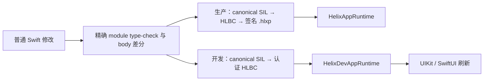

# Helix

[English](README.md)

Helix 可以把已有 Swift 实现的修改编译成经过验证的生产字节码补丁，或者仅用于开发的 Live Reload generation。补丁作者仍然编写普通 Swift；Helix 会保留目标构建的编译器上下文，并拒绝无法安全应用的修改。

> **项目状态：** 当前仓库是一套可执行技术基线，不代表已经支持任意 Swift，也不代表已经获得 App Store 热补丁下发资格。生产 App Store 通道被明确阻断；真实设备资格、外部 top-200 corpus、真机长时间 soak 和控制面 Gate 仍未关闭。

## 为什么需要 Helix

Swift 不具备 Objective-C 那样通用的 Runtime method swizzling，iOS App 也不能假设可以任意加载下发的机器码。Helix 把两个有实际价值的场景分开处理：

| 模式 | 下发内容 | 执行方式 | 主要目标 |
| --- | --- | --- | --- |
| 生产热补丁 | 内含验证后 HLBC 的签名 `.hlxp` | App 中随版本安装的 Verifier 与 HLVM | 不在设备编译代码的前提下修复已发布的 eligible 函数 |
| 开发期热重载 | 会话绑定、经过认证的 HLBC live artifact | Debug App 中的 Verifier 与 HLVM | 保存受支持的 Swift 函数体后刷新正在运行的 UIKit/SwiftUI 页面，无需重新安装 |

两种模式共享精确 Swift frontend 事实、绑定构建的身份、interface/body 兼容检查、原生能力合同和不可变 generation 语义；但它们的 artifact、信任根、传输、持久化与 Release/Debug Runtime 严格隔离。



接入现有 App 时请先按[使用入门](Docs/Getting-Started.zh-CN.md)逐步操作。设计和运行细节见[总体架构](Docs/Architecture.zh-CN.md)、[生产热补丁](Docs/Production-Hot-Patching.zh-CN.md)、[开发期热重载](Docs/Development-Live-Reload.zh-CN.md)和[能力与限制](Docs/Capabilities-and-Limits.zh-CN.md)。

## 开始使用 Helix

完整入门文档包含 Host Plan Schema、Xcode Target 图、Scheme Action 位置、Runtime 启动示例、第一次 Live Reload、第一次 Hot Patch 和常见故障处理。最短接入路径如下：

1. 添加 Helix Package，并选择一个职责清晰的 Swift Feature Framework。
2. Debug Live Reload Profile 链接 `HelixDevAppRuntime`；Release Hot Patch Profile 链接 `HelixAppRuntime`。
3. 编写 `HelixXcode.json`，列出 Feature 的完整源码集合与 Profile。
4. 生成并验证确定性集成：

   ```bash
   swift run helix xcode generate \
     --plan HelixXcode.json \
     --output .helix/xcode
   swift run helix xcode validate --plan HelixXcode.json
   ```

5. 按 `.helix/xcode/Integration.md` 接线 Feature 与聚合 Runtime，设置 Feature/App xcconfig、隐藏 Bridge phase 和 Scheme Action。Xcode 工程中不会出现生成 Swift 文件或 Bridge target。随后对每个 Profile 运行 `helix xcode doctor`。
6. 在 App 生命周期内保持一个稳定的 `ApplicationSession`；UIKit 会自动发现已展示的 controller/view 实例，SwiftUI 仍需要 pulse boundary。
7. Live Reload 只需 Run 一次 Scheme 后保存已有 Swift body；Hot Patch 则先冻结 Release Shell，再通过只包含 Patch Target 的 Scheme 构建签名 `.hlxp`。

迁移生产工程前，建议先完整运行仓库中的 [UIKit Demo](Demo/README.md)。它的 Host Plan、5 Target Xcode 图、Runtime 启动、共享 Scheme、本地 Mock 下载和保存到页面变化都是可执行示例，而不是伪代码。需要留存真实 GUI 验收记录时，按根目录的 [Xcode Run 端到端测试用例](Xcode-Run-E2E-Test-Cases.md)执行。

## 已实现内容

- 绑定具体构建的 Shell identity、`FunctionKey`、`TypeID`、`EntryIndex`、capability、quota、diagnostic 与 Interface Archive。
- 不修改手写源文件的 Release Derived Sources 与永久 Swift Bridge。
- Canonical HLBC 1.9 编解码、独立结构/语义验证、强类型寄存器 HLVM、精确 Native Bridge、不可变 generation 与固定调用链快照。
- 使用精确工具链把已声明 Swift 子集编译成 HLBC：常用标量与 String、有界 Character predicate、Optional projection、`Range<Int>` 循环、Array/Dictionary 值语义、文件/module scope 的补丁内 struct/enum 与具体 `Result`、带 payload 的局部错误、受限局部 `inout`/`mutating`、包含有界 `@escaping` 返回/捕获流程的同步补丁内 closure、具体化 compiler specialization 与无 suspension async entry。
- NativeImport v2，以及 schema 2 的 declaration/file/module/project 构建期发现。大范围配置会展开为逐项精确 invoker，不会成为设备端 wildcard。
- 签名 `.hlxp` 构建与验证、有界下载、不可变存储、anti-rollback、激活 WAL、Crash Guard、LKG 恢复、签名吊销与回滚。
- 精确 Debug frontend job 捕获与复放、稳定保存快照、单调调度、HLBC 生成、认证传输、Verifier 激活、UIKit 刷新、SwiftUI pulse boundary 与 Debug Overlay。经过验证的逻辑源码映射可以增强 VM trap，同时不会泄漏生产构建机路径。
- 仓库内接近业务代码的 corpus，以及覆盖失败保存、回滚、调用、有界 snapshot 保留和 generation ID 单调性的 128 代进程内 soak。
- 仅供内部编译器实验和差分验证、必须显式选择的 Native Dynamic Replacement 后端；自动路由不会选它，它也不是受支持的 Live Reload 下发路径。
- 确定性的 Xcode Integration Kit，以及仓库内 Hot Patch 与 Live Reload 两个 UIKit App。
- Shell 构建、Xcode 集成、Patch 编译、包检查/反汇编、Dev Session 和 Benchmark CLI。

## 重要边界

- 生产补丁执行字节码，不下发 Swift 源码或原生机器码，也不使用 JIT。
- 生产补丁只能调用同 image 函数、eligible Shell entry 与已发布 App 中已经生成的精确 NativeImport。
- Live Reload 当前面向 Dev Shell 中已经存在的声明 body；新增任意文件级声明或 Swift 文件需要正常构建。
- Stored layout、函数签名、superclass、conformance、enum case、isolation、source membership、链接依赖与 Build Settings 变化都需要正常构建。
- 代码激活不等于 UI 已刷新。UIKit 会自动匹配已展示 controller/view 类型并执行推导出的 invalidation；初始化或重建所需的自定义 hook/factory 仍保持显式。SwiftUI 使用 pulse boundary。Helix 不会盲目重放生命周期方法。
- Simulator 与设备使用同一套 HLBC artifact、传输、Verifier 与 HLVM 路径。仓库 Simulator E2E 已通过；真实 iPhone 仍需完成资格矩阵后才能宣称经过验证。
- Release Builder 只接受 internal 与 enterprise HLBC policy，会拒绝 App Store HLBC 和 controlled native Release 包。

完整矩阵见[能力与限制](Docs/Capabilities-and-Limits.zh-CN.md)。

## 环境要求

- 构建侧工具要求 macOS 14 或更高版本。
- App Runtime target 要求 iOS 15 或更高版本。
- 编译器集成与 fixture 需要包含 Swift 6 工具链的 Xcode。
- Live Reload 或 Release Shell finalize 前必须先有一次正常签名 Xcode 构建；Helix 会捕获真实 frontend、SDK、link、source 与 signing 事实，不会拼一条近似命令。

Package Manifest 使用 Swift tools 6.1。精确补丁与 Live Reload 构建会绑定对应目标 Shell 捕获到的 compiler 和 SDK 身份。

## Package 产品

一个 App target 只能链接一个聚合 Runtime 产品，不要再叠加有重复模块的 leaf product。

| App target | 产品 | 用途 |
| --- | --- | --- |
| Release / Production | `HelixAppRuntime` | HLBC 验证、执行和包生命周期，不包含开发加载器 |
| Debug / Dev Shell | `HelixDevAppRuntime` | Release 能力，加上认证 Dev 传输、临时 HLBC 激活与 UI Reload |

`HelixCompiler`、`HelixBuildTools`、`HelixReleaseTools`、`HelixDevTools` 与 CLI 等构建侧模块只应运行在 macOS，不得链接到 iOS Release App。Release Audit 会扫描最终 bundle 是否泄漏开发能力。

## 构建与测试

```bash
swift build
swift test
swift test -Xswiftc -warnings-as-errors
swift test -c release -Xswiftc -warnings-as-errors
```

当前完整 SwiftPM 基线包含 411 个测试、65 个 suite，记录的 Debug、warnings-as-errors 与优化 Release 回归均通过。可使用 Simulator UDID 运行平台 fixture：

```bash
Tests/Fixtures/LiveReloadE2E/run-ios-runtime-tests.sh SIMULATOR_UDID
Tests/Fixtures/LiveReloadE2E/run-simulator-e2e.sh SIMULATOR_UDID
Tests/Fixtures/LiveReloadE2E/run-release-audit.sh
```

iOS target 当前包含 9 个 Runtime/UI 用例。HLBC Live Reload E2E 会保持同一个 App PID，先应用修改后的实现，再用第二个 generation 恢复 baseline。Release Audit 会构建一个只链接 `HelixAppRuntime` 的独立 iOS 15 target。

使用 Release 模式运行 microbenchmark：

```bash
swift run -c release helix-benchmark --output /tmp/helix-benchmark.json
swift run -c release helix-benchmark \
  --baseline /tmp/helix-benchmark.json \
  --output /tmp/helix-benchmark-candidate.json
```

报告 schema 2 包含强类型 HLVM 调用、Bridge 开销和 `@MainActor` UIKit NativeImport 场景。可比的 baseline/policy 发生回归时进程会以状态码 3 退出，CI 不会把性能退化误判为成功。
可选的 `--policy PATH` 会用一份 canonical `RegressionPolicy` JSON 覆盖内建的 p50/p95 容差。
Mac microbenchmark 只作为回归证据，不能代替真实 iPhone 的启动、滚动、交互、内存压力或尾延迟测试。

## CLI 概览

```bash
swift run helix xcode --help
swift run helix shell --help
swift run helix patch --help
swift run helix dev --help
```

主要命令组如下：

- `helix xcode generate|validate|phase|doctor`：确定性 Xcode 集成与生命周期执行。
- `helix shell metadata|index|index-project|build|finalize|audit-release`：构建可打补丁的 Release Shell。
- `helix patch compile|build|inspect|disassemble`：构建 HLBC 与签名包。
- `helix dev prepare|validate|run`：运行认证开发会话。

构建签名包需要 finalized Shell Archive、完整 module 源码上下文、Release Policy 与签名材料：

```bash
swift run helix patch build \
  --archive Build/Shell.hlxi \
  --config Config/Release.json \
  --certificate Config/LeafCertificate.json \
  --private-key Secrets/LeafPrivateKey.json \
  --trusted-root Config/TrustedRoot.json \
  --output Build/Patch.hlxp \
  Sources/Feature/A.swift Sources/Feature/B.swift
```

任何工具链、SDK、源码集合、interface、目标身份、policy、签名或不支持的 SIL 不匹配，都会在包生成前失败。

## Xcode 集成与 Demo

生成集成从仓库内的 Host Plan 开始：

```bash
swift run helix xcode generate --plan HelixXcode.json --output .helix/xcode
swift run helix xcode validate --plan HelixXcode.json
```

它会生成 xcconfig、file list、Scheme action、Derived Sources 与生命周期脚本，不会静默改写未知工程图。工程接入生成产物与共享 Scheme 后，应随着项目变化持续 Review Host Plan。

可执行参考见 [Demo/HelixDemo.xcodeproj](Demo/HelixDemo.xcodeproj) 与 [Demo/README.md](Demo/README.md)。Hot Patch App 会通过 Simulator mock-download inbox 走签名包客户端链；Live Reload App 会走真实构建捕获、保存检测、认证 HLBC 传输、验证后激活与 UI 刷新。

## 仓库结构

- `Sources/HelixCore`、`HelixBytecode`、`HelixInterface`、`HelixVerifier`、`HelixVM` 与 `HelixRuntime`：身份、格式、验证、执行和 generation 路由。
- `Sources/HelixPatch`：包信任、下载、存储、激活、恢复、吊销与回滚。
- `Sources/HelixCompiler`、`HelixBuildTools` 与 `HelixReleaseTools`：精确 Swift/SIL 处理、Shell 构建、Xcode 集成与 Release 包构建。
- `Sources/HelixDevProtocol`、`HelixDevTools`、`HelixDevRuntime` 与 `HelixLiveReloadAPI`：开发会话、live artifact generation、激活与 UI Reload 合同。
- `Sources/HelixCLIKit`、`HelixCLI`、`HelixBenchmarks` 与 `HelixBenchmarkCLI`：命令与性能工具。
- `Tests`：单测、负向测试、Compiler fixture、集成、Simulator、Release 泄漏与 Benchmark 回归。
- `Demo`：仓库内 UIKit Hot Patch / Live Reload App 与生成的 Xcode 集成。
- `Docs`：简明的中英文架构、工作流、能力文档与完整接入指南。

Swift 声明使用空枚举命名空间与 `Namespace.Type`，不机械添加类型前缀。HLBC、HLXI、`.hlxp`、hash domain、诊断码和生成 ABI symbol 等协议拼写会保留稳定的 wire-level 名称。

## 许可证

Helix 使用 [Apache License 2.0](LICENSE) 授权。
