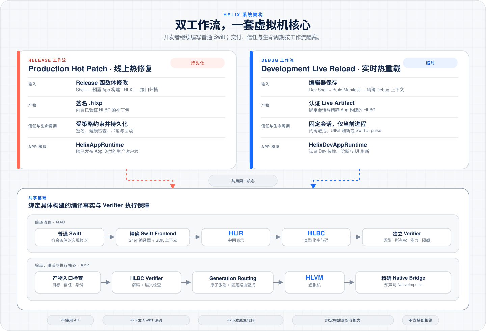

   
  <strong>Swift 线上热修复与实时热重载系统 —— 这就是黑魔法</strong>

<a href="README.md">English</a> | <strong>简体中文</strong>

Helix 让 Swift 真正拥有线上热修复与实时热重载能力。开发阶段改完代码按下保存 —— 变化即刻出现在正在运行的 App 中；线上遇到问题 —— 把修复构建成补丁包，直接应用到线上。

真正的黑魔法来自 HLBC 与 HLVM：Swift 代码被编译成经过验证的字节码，再由虚拟机直接执行。一套强大的虚拟机核心，同时驱动实时热重载与线上热修复。

> **现状：** Helix 正在持续开发和测试，并逐步覆盖更多项目与使用场景。

## 实时热重载演示

在 Xcode 中修改 Swift 代码并保存，Helix 无需重新构建或安装 App，即可编译并
激活修改，同时保留运行中的内存状态。

https://github.com/user-attachments/assets/7b3d4124-23a0-44ad-8c27-57a5080d03d6

## 从这里开始

| 目标 | 指南 |
| --- | --- |
| 运行仓库内的 UIKit Demo，完整体验线上热修复与实时热重载 | [UIKit Demo](Demo/README.md) |
| 为现有 App 自动完成 target、Scheme、Package、编译器、Bridge 与 Runtime 接入 | [使用入门](Docs/Getting-Started.zh-CN.md) |
| 确认当前支持哪些 Swift 代码修改，以及哪些修改仍需正常重新构建 | [能力与限制](Docs/Capabilities-and-Limits.zh-CN.md) |
| 理解 Swift 编译、HLBC、HLVM、补丁激活与两条工作流的隔离设计 | [总体架构](Docs/Architecture.zh-CN.md) |
| 准备 Release Shell，构建并签名 `.hlxp` 补丁，然后完成安装、激活与回滚 | [生产热补丁](Docs/Production-Hot-Patching.zh-CN.md) |
| 跟踪一次 Swift 代码保存如何经过编译、认证传输、运行时激活与 UIKit/SwiftUI 刷新 | [开发期热重载](Docs/Development-Live-Reload.zh-CN.md) |
| 使用 Helix Mac 助手发现项目、配置两条工作流并管理开发会话 | [Helix Hub](Hub/README.md) |

## App 接入

Helix Hub 只给 App 链接一个生产安全产品 `HelixAppIntegration`，再由生成的隐藏
bootstrap 自动启动。业务源码无需 import 或初始化 Helix；同一个 App target 可以
通过不同 configuration 同时使用两条工作流。

| 构建角色 | 产品 | 行为 |
| --- | --- | --- |
| 每个已配置 App target | `HelixAppIntegration` | 生产 Verifier、HLVM、补丁安装、恢复与回滚；不含开发传输和加载器 |
| 仅 Live Reload configuration | 动态 `HelixDevSupport` | 认证开发更新、Simulator 原生加载、诊断与 UI 刷新；只由生成的开发 configuration 链接和嵌入 |

Hub 会自动发现或创建 Scheme、复用或添加 Swift package、捕获真实 Xcode 编译、
在 DerivedData 生成 Bridge，并启动所选 Runtime。开发者不维护源码列表、API 白名单，
也不执行额外的构建“冻结”。
接入后的映射仍可随时修改；Hub 能以事务方式重配置或移除 Xcode 接入，同时保留业务源码与工程原始设置。

编译器、Helix Hub 和 CLI 只在 Mac 上运行，不要把这些构建工具链接进 iOS
Release App。

## 环境要求

脚本接入、编译缓存串联、失败恢复与规模边界见[大型工程接入](Docs/Large-Project-Integration.zh-CN.md)。

- 构建侧工具和 Helix 应用要求 macOS 14 或更高版本。
- App Runtime target 要求 iOS 15 或更高版本。
- 编译器集成与 fixture 需要包含 Swift 6 工具链的 Xcode。
- Live Reload 或 Release Shell finalize 前，需要先完成一次正常签名 Xcode 构建。

Package Manifest 使用 Swift tools 6.1。补丁与 Live Reload 产物会绑定目标 Shell
捕获到的编译器、SDK、源码、设置和二进制身份。

## 许可证

Helix 使用 [Apache License 2.0](LICENSE) 授权。
